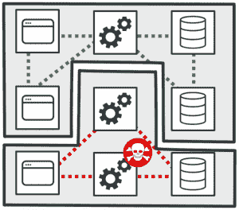
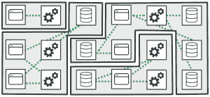

# 利用微分段构建弹性、安全的微服务%

> 原文：<https://thenewstack.io/build-resilient-secure-microservices-with-microsegmentation/>

大约 10 到 12 年前，软件世界经历了企业应用程序架构方面的转变。架构师和软件构建人员开始从部署在私有数据中心的庞大、紧密耦合的单片应用程序转向托管在公共云基础架构中的更加面向微服务的架构。微服务固有的分布式特性是公共云中新的安全挑战。在过去十年中，尽管越来越多地采用面向微服务的架构来构建可扩展、自主和强大的企业应用，但与传统数据中心相比，组织往往难以防范云中这种新的攻击面。它包括对多租户以及缺乏对基础架构和运营环境的可见性和控制的担忧。这种体系结构的转变使得满足安全目标变得更加困难，尤其是在最重视更快的基于容器的部署的情况下。

本文的目的是了解什么是微分段，以及它如何帮助软件架构师、开发运维工程师和 it 安全架构师构建安全且有弹性的微服务。具体来说，我将讨论与流行的容器编排机制 Kubernetes 相关的网络安全挑战，并且我将说明微分段在发生违规时防止横向移动的价值。

## 微服务部署的安全挑战

 [特鲁普蒂·希尔卡尔

Trupti Shiralkar 是 Illumio 的首席应用安全工程师。她对安全性和隐私有着强烈的热情，并相信通过为所有相关方创造双赢来影响安全性。她喜欢深入研究具有挑战性的安全难题，并与开发和安全工程团队合作构建技术解决方案。她拥有约翰霍普金斯大学信息安全学院(JHUISI)的信息安全理学硕士学位和多项安全认证。过去，她曾在亚马逊、惠普、Q2ebanking 和 ATSEC 信息安全公司工作。](https://twitter.com/tshiralkar?lang=en) 

面向微服务的架构需要将应用程序分解成更小的、松散耦合的服务。由于这些服务的分布式性质，它们通常最终拥有自己的数据存储。这些服务中的每一个都是使用容器独立部署的，容器为应用程序提供了一种机制来打包从对象代码、第三方库、操作系统、工具和其他依赖项在内的所有内容。一旦所有的必需品都打包好了，容器就提供了平稳运行它们的执行环境。这些容器是使用像 Kubernetes 这样的编排器来管理的。

根据流行的观点，容器生态系统旨在通过隔离来加强安全性。然而，容器之间的隔离不一定能提供所需的安全边界。Kubernetes 提供了一些安全特性，如认证、授权、网络策略和 pod 安全标准等。但不幸的是，容器和 Kubernetes 都没有默认提供安全性。Kubernetes 部署在其默认配置中优先考虑功能而不是安全。因此，负责创建、移动和销毁这些容器的开发人员或可靠性工程师可能并不总是知道如何确保部署的安全性。让我们从网络和安全的角度来仔细看看 Kubernetes 的一些重要方面:

*   **名称空间:**在 Kubernetes 中，名称空间是在多个用户之间将集群资源划分为虚拟空间的一种逻辑方式。与 Linux 不同，它不强制任何网络分段。请注意，名称空间不是安全边界，因此，一个名称空间中的服务可以访问另一个名称空间中的服务。
*   **网络策略:**Kubernetes 网络策略是一个特定于应用程序的构造，允许在名称空间、pod 和 IP 地址块之间进行第 3 层和第 4 层通信。安装 Kubernetes 后，默认情况下网络策略不可用。在创建 pod 之前，需要安装和配置网络插件来实施网络策略。此外，值得注意的是，网络策略不能在服务级别实施。从安全角度来看，这是一个很大的缺点，因为访问控制不能扩展到服务。
*   **Pod 安全标准:**在集群中，Pod 支持共享相同物理或虚拟机的多个容器。它们支持 pod 内容器之间的数据共享和通信。pod 安全标准允许管理员使用细粒度的授权模型来控制资源及其权限。此安全控制需要一个准入控制器，默认情况下不启用。特权 pod 提供对所有容器的管理访问。因此，获得特权容器访问权限的攻击者可以获得主机资源的管理权限。
*   **Secret storage:**Kubernetes 以 base 64 编码形式存储敏感和机密信息，如密码、OAuth 令牌和 SSH 密钥，这种形式被认为是明文。默认情况下，不配置授权策略，该策略用于限制对机密的访问。这些通过环境变量或清单文件共享，这也被认为是处理机密的不安全做法。在缺少静态秘密的默认加密和健壮的秘密管理的情况下，秘密成为横向移动的有吸引力的目标。

## 横向移动和恶意内部人员

图 1:恶意内部人员导致横向移动。

微服务的分布式特性使得连接性至关重要。具体来说，容器和 pod 必须能够跨名称空间相互通信。但是，集群层的默认网络策略并不一定实现开箱即用的最低权限原则。因此，无论您如何保护代码，对共享资源的未授权隐式访问都是无法禁止的。因此，应用程序可能会受到集群内横向移动的影响。微分段允许实施粒度访问控制，在容器、pod 和集群级别围绕每个微服务创建安全区域，从而显著减小爆炸半径并提高从成功攻击中恢复的弹性。

现有 Kubernetes 框架的安全模型在微服务方面呈现的第二个突出威胁是恶意的内部人员。从攻击者的角度来看，当默认情况下安全性不可用时，可能会出现几种错误配置。在缺乏强有力的访问控制或授权策略的情况下，像服务器端请求伪造( [SSRF](https://owasp.org/www-community/attacks/Server_Side_Request_Forgery) )这样的攻击允许攻击者利用对一个 pod 的认证访问来获得对另一个 pod 内的资源的未授权访问。

如上所述，我们看到默认情况下没有足够的安全控制来保护机密。不加密和轮换机密以及不限制对机密的访问确实是不相关的问题，但是在缺少一种安全控制(在这种情况下，缺少加密)的情况下，第二种安全控制(即，限制对机密存储的访问)对于避免被恶意内部人员(例如，不满的管理员)利用变得至关重要。

## 通过微分段引入弹性

在安全性方面，弹性是指从由攻击或灾难性事件(如违规)导致的简单故障中快速恢复的能力。构建弹性微服务的第一步是了解我们想要保护什么免受攻击者的攻击，以及如果资产或资源受到损害，我们如何限制影响。微分段有助于我们确定保存重要数据或关键容错系统的资源，它还提供了一种基于最低权限锁定访问的机制。这样，即使一个关键资源受到损害，其他资源也不会受到影响。

今天的现代软件开发生命周期特别强调快速交付特性。这些特性通过容器更快地部署到生产中，大部分是由相同的开发人员或开发人员完成的。如果我们考虑微服务、第三方库和其他依赖项、容器或集群的代码容易受到的所有类型的漏洞，我们如何识别和防止所有这些攻击？答案是使用微分段来阻止对关键资源的访问，并且仅在“需要知道的基础上”才允许访问。

## 开始使用微分段

在开始使用微分段时，没有放之四海而皆准的策略，但以下是针对微服务启动微分段项目时的一些最佳实践:

**1。了解微服务设计模式并使用微分段模板**

了解设计模式有助于更深入地理解架构组件、数据流和保存关键数据的资产。基于这些常用的设计模式，可以创建相应的微分段模板。一旦这些模板通过安全和网络团队的审查，它们将易于重用并以更快的速度扩展。

与庞大、紧密耦合的整体应用程序不同，基于面向微服务架构的应用程序遵循一个或多个特定的设计模式。这些设计模式可以是下列之一:

*   *   分解模式包括根据业务能力将应用程序分解成子域或事务。
    *   集成模式涉及 API 网关、聚合器、链式微服务等服务集成设计模式。
    *   数据库模式关注数据库在整个应用程序架构中的位置。示例包括每个服务的数据库、共享数据库、事件源等。
    *   可观察性模式由关注审计、日志记录和监控的设计模式组成，如日志聚合、分布式跟踪、健康检查等。
    *   横切关注点模式有助于在一个集中的位置管理应用程序级别的功能，如安全性、容错、服务到服务的通信和配置管理。示例包括断路器、服务发现等。

(有关各种微服务设计模式的更多信息，请[点击这里](https://medium.com/@madhukaudantha/microservice-architecture-and-design-patterns-for-microservices-e0e5013fd58a)。)

**2。选择正确的微分段方法**

目前，市场上有几家微分段供应商提供各种解决方案。概括地说，微分段技术分为两类:

1.  与技术无关的微分段解决方案要么基于代理，要么基于下一代防火墙。
2.  依赖于技术的微分段解决方案基于虚拟机管理程序或网络结构。

微服务使用不同的技术堆栈，更快的部署需要快速扩展的能力。因此，与技术无关的微分段解决方案——但专门针对能够对集群、pod、容器和服务进行分段的容器生态系统定制的解决方案——将是最佳选择。

**3。网络可见性**

可视化分段应用和流量的能力是微分段解决方案不可或缺的一部分。可见性为管理员、安全架构师和首席安全官(CSO)提供了整个网络的一站式视图。

**4。易于使用的集中控制**

最初，为每个应用程序起草策略可能是一项艰巨的任务。它需要与 It、网络和安全架构师进行一系列对话。通过集中控制来促进策略的创建和实施有助于加快这一过程。利用根据微服务设计模式定制的细分模板也有所帮助。

**5。性能不应成为瓶颈**

应用微分段策略需要实时有效地分析流量和部署策略。攻击者可以利用性能延迟来进一步实施攻击。因此，性能测试极其重要，尤其是对于延迟敏感的微服务。

## 结论

图 2:使用微分段创建的安全区域可防止横向移动。

在这篇博文中，我讨论了微服务使用的基于容器和 Kubernetes 的部署机制所带来的一些安全问题。当我们在整个 CI/CD 生命周期中以更快的速度连续部署生产中的微服务，而没有过多考虑限制对关键资源的访问时，“弹性”一词就开始消失了。微分段提供了强大的访问控制机制，最大限度地降低了违规的影响。它还通过实现安全的微区来增强企业应用程序的弹性。

如果规划和执行正确，微分段肯定会为微服务领域的横向移动创建一个强大的屏障。在快速发展的同时很难保护微服务，但停下来思考一下如何大规模实施安全性和弹性，并主动与所有利益相关方一起进行规划，这一点很重要。

通过 Pixabay 的特征图像。

<svg xmlns:xlink="http://www.w3.org/1999/xlink" viewBox="0 0 68 31" version="1.1"><title>Group</title> <desc>Created with Sketch.</desc></svg>