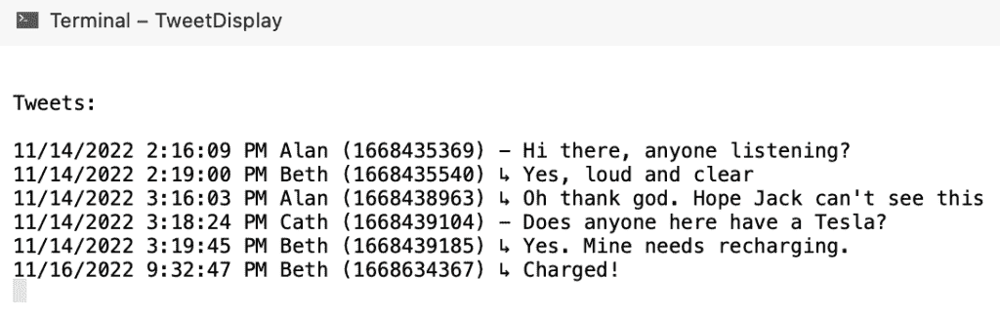

# 构建你自己的去中心化 Twitter，第 2 部分:缓解

> 原文：<https://thenewstack.io/build-your-own-decentralized-twitter-part-2-mitigations/>

在本系列的第 1 部分[中，我们使用 Visual Studio 代码项目和相应的 JSON 文件创建了一个分布式社交媒体系统的架构。这是我们创建的架构:](https://thenewstack.io/how-to-build-your-own-decentralized-twitter/)


我们的分散架构

tweet view 平台必须根据平台身份文件的许可，从 tweeter 的商店获取 tweet。关键是，高音拥有他们的推文完全。

Visual Studio 代码项目和相应的 JSON 文件[在这里](https://github.com/eastmad/TheNewStack)。您可以只跟随 JSON。该项目的目的是调查所有权和控制权牢牢掌握在高音喇叭(或鸟嘴)手中的系统的问题。我们在[的最后一篇文章](https://thenewstack.io/how-to-build-your-own-decentralized-twitter/)中设置了所有的东西，所以现在读读它，然后回来，这样我们就可以把它全部写下来。

简单提醒一下:

*   我们使用 Unix 时间作为惟一的 id 和发布 tweet 的时间。
*   我的回复只锁定最后一条推文——这种简化节省了大量代码。
*   在处理代码时，不要忘记更改 **JsonServices.cs** 中的 BASEDIRECTORY 以匹配您的目录结构。

## 名称变更

就像在 Twitter 上一样，您可以轻松地更改我们的 tweet view 平台将显示的名称，而不会影响其他任何内容。Alan 厌倦了按字母顺序排列的用户名，并决定将其改为“ZoZo”——至少允许我们的输出格式保持一致。

他在我们的示例 tweet 视图平台中改变了他的身份:

```
..
{
    "Id"  :  1,
    "Name"  :  "Zozo",
    "StoreFile"  :  "AlansTweets.json",
    "Permission"  :  true
}
..

```

运行 TweetDisplay 为我们提供了:


因为身份控制显示的名称，而不是 tweet，所以一切都很好。在另一个类似的平台上，艾伦可以被称为不同的东西。在这种架构下，高音喇叭没有唯一的识别名称——唯一性意味着有一个中央控制器。在每个 tweet 视图平台中，他们至少有一个本地 id。他是‘1’——我们假设艾伦不控制那个内部标识符。

现在，我们已经明确地没有给平台它自己的身份(因为这不是一个联盟)，所以用我们的架构，没有办法确保 Alan 是唯一标识的。对匿名有好处，但对巨魔也有用。

## **不再有艾伦**

现在让我们开始更具破坏性的变化。如果艾伦不再允许显示他的推文，会发生什么？

```
{
    "Id"  :  1,
    "Name"  :  "Alan",
    "StoreFile"  :  "AlansTweets.json",
    "Permission"  :  false
},

```

TweetDisplay 现在显示:


虽然合法，但没有艾伦的推文，第一个线程就被破坏了。这与多次删除 Twitter 中的单个推文没有太大区别。他们至少知道没有简单的方法可以一次删除你所有的推文——如果他们愿意，他们可以在这个过程中增加摩擦。

什么额外的脚手架可以建立至少维持结构？tweet 平台可以用内容为“[被用户删除]”的相同 id 的副本来替换删除的 tweet 这样，平台就可以维护自己的权利，维护用户已经破坏的结构。但这也证明了一个删除的行为是从高音喇叭发生的，那么这在一些极端的情况下会不会背叛高音喇叭呢？

进一步检查，确实只有线程需要这个警告——这就是结构的问题所在。作为一个缓解的例子，我们可以做的是在对现有推文进行回复时添加一个影子推文记录。

## 编辑

与 Twitter 不同，在我们的项目中，不仅编辑是微不足道的，而且你可以像在文档上“搜索和替换”一样快速地更改你发布的每条推文。当然，这带来了相当多的法律问题。至少在 Twitter 里，因为你要先删除一条推文，然后才能修改，所以线程马上就断了。但是通过直接在他的推特商店编辑，艾伦意识到他可以迅速安抚埃隆·马斯克:

```
[
    {
        "Text":  "Hi there, anyone listening?",
        "Replyto":  0,
        "Time":  1668435369
    },
    {
        "Text":  "Oh thank god. Hope Jack canu0027t see this",
        "Replyto":  1668435540,
        "Time":  1668438963
    }
]

```

*(注意:如果你没有发现它，你不能在 JSON 中使用撇号，因此它在上面的例子中被转义)*

这会立即改变显示，因为内容的改变不会触发任何事情:



伊隆换成了杰克

所以在没有任何预兆的情况下，‘埃隆’已经被‘杰克’取代了。这将使我们的模型忠实于用户的意图，但作为记录日志是绝对无用的。同样，我们可以通过“[已编辑]”警告来缓解这种情况。

## 更多的破坏行为

如前一篇文章所述，我们使用 tweeter 的平台身份将一个名字链接到他们的 tweet。这是来自类的**tweet 的主要工作。**

我们可以看到，它还实现了 **IComparable** ，以便允许我们使用 tweet 时间来比较一条 tweet 是更年轻还是更老。正如在第一篇文章中提到的，Time 变量既可以作为 tweet 的惟一 id，也可以定义时间轴。

```
class TweetFrom  :  IComparable<TweetFrom>
    {
        public string from;
        public Tweet tweet;

        public TweetFrom(string from,  Tweet tweet)
        {
            this.from  =  from;
            this.tweet  =  tweet;
        }

        public int CompareTo(TweetFrom?  other)
        {
            if  (tweet.Time  ==  other?.tweet.Time)
            {
                return  0;
            }

            // CompareTo() method
            return tweet.Time.CompareTo(other?.tweet.Time);
        }
    }

```

为了按顺序列出 tweets，我们只需对所有 TweetFrom 对象调用 Sort 方法:

```
...
List<Identity>  idents  =  JsonServices.ReadIdentitesFromFile();
List<TweetFrom>  totalTweets  =  new List<TweetFrom>();
foreach  (var ident in idents)
    if  (ident.Permission)
    {
        List<Tweet>  tweets  =  JsonServices.ReadTweetsFromFile(ident);
        tweets.ForEach(tweet  =>  totalTweets.Add(new TweetFrom(ident.Name,  tweet)));
    }
totalTweets.Sort();
...

```

通过这个简单的模型，恶意的推特用户可以很容易地在他们自己的商店里调整推文 id，从而调整推文在时间轴中的显示方式。因此，我们不得不再次问，我们能轻松地缓解这种情况吗？我们可以使用内部支架来记录平台首次看到推文的时间，但这是任意的，因为推文者可以在任何时候透露他们的推文。

## 缓解措施

减轻:减轻某事的严重性、严肃性或痛苦的行为。

这正是我们想要做的。我们已经强调了这个模型的弱点，但是让我们看看解决这个删除问题有多简单。我们能做的是存储有回复的推文，从而维护一些结构。我们不必担心每条推文，也不必担心内容(事实上，我们删除了这一点)，只需要元数据。如果你想在代码中看到这一点，我使用了[项目的 Github 条目](https://github.com/eastmad/TheNewStack/tree/mitigation)中的分支`mitigation`。

代码中的主要变化是添加了一个新的身份，我们用它来存储缓解推文。我们还利用了**分类字典**，这样如果它们从图表中消失了，我们就可以混合我们的缓解推文。

这是我们熟悉的推文展示:


不同的是，我们在我们新的缓解内部身份中保存了一组有回复的推文。你可以在上面看到有四条推文有回复，它们被存储:

```
[
  {
    "Text":  "Tweet not available",
    "Replyto":  0,
    "Time":  1668435369
  },
  {
    "Text":  "Tweet not available",
    "Replyto":  1668435369,
    "Time":  1668435540
  },
  {
    "Text":  "Tweet not available",
    "Replyto":  0,
    "Time":  1668439104
  },
  {
    "Text":  "Tweet not available",
    "Replyto":  1668439104,
    "Time":  1668439185
  }
]

```

所以让我们关闭对 Alan 推文的访问(要么从他的商店中删除它们，要么关闭他的身份许可)。

```
[
    ..
    {
        "Id"  :  1,
        "Name"  :  "Alan",
        "StoreFile"  :  "AlansTweets.json",
        "Permission"  :  false
    },
    ..
]

```

且看效果:


它很小，但至少你现在可以看到贝丝不是在自言自语。除了发布时间之外，我们不会透露任何关于这条丢失的推文的更多信息。此外，艾伦在帖子末尾的推文没有被替换，因为它没有任何回复。

我希望我已经说服你，虽然“完全用户控制”是完全可能的，但由此造成的混乱可能不是社交图所能接受的。你可能会回答说，如果平台处于控制之下，它也可能会破坏东西——但有很多人在关注这一点。

在最后一篇文章中，我们将更深入地研究联邦，以及它如何再次改变事物。

<svg xmlns:xlink="http://www.w3.org/1999/xlink" viewBox="0 0 68 31" version="1.1"><title>Group</title> <desc>Created with Sketch.</desc></svg>