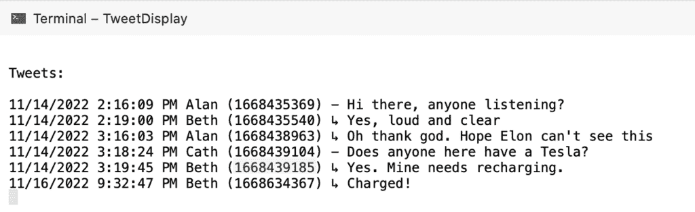
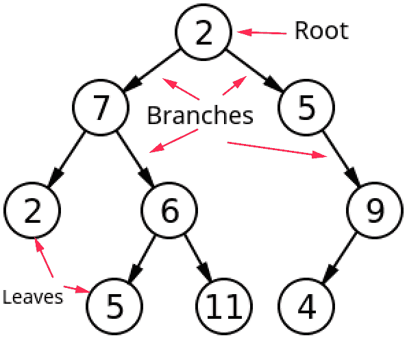

# 构建你自己的去中心化 Twitter，第 3 部分:你好乳齿象

> 原文：<https://thenewstack.io/build-your-own-decentralized-twitter-part-3-hello-mastodon/>

在本系列第 1 部分中，我们使用 Visual Studio [代码项目](https://github.com/eastmad/TheNewStack)和相应的 JSON 文件创建了一个分布式社交媒体系统的架构。在[第二部](https://thenewstack.io/build-your-own-decentralized-twitter-part-2-mitigations/)中，我们想出了如何缓解——解决类似删除推文的问题。

我们在上一篇文章中看到，我们的分布式项目系统是以用户为中心的，但非常难以控制。在第 3 部分中，我们现在需要做的是用一点控制换取更多的确定性。这意味着研究乳齿象的联合社交媒体方法。

在一个联合模型中，服务器互相交谈以建立社交图。因此,[乳齿象服务器](https://thenewstack.io/devs-are-excited-by-activitypub-open-protocol-for-mastodon/)只是一个遵守适当协议的服务器，并参与联盟。用户加入服务器，并依次加入该联盟。这些服务器有其存在的理由，但通常是为了代表特定社区的关注。

我们可以看到，联合模型有点像我们的项目模型，但是 tweet 商店位于其中一个 tweet 视图服务器上。从服务器的角度来看，现在有本地推文和外部推文。让我们看看联邦服务器如何改进我们项目的完全“以用户为中心”模型的弱点。

## 身份

在我们的项目中，没有任何有用的方法来唯一地识别任何东西(推特或推特浏览者)，但这是“以推特为中心”的系统的一部分。虽然身份不像在 Twitter 上那样绝对，但是联邦服务器确实有身份。虽然乳齿象声称没有中央权威，但从互联网领域的独特性来看，服务器是独特的。这意味着 Mastodon 上的用户有一个身份，因为一个用户与一个服务器相关联。我的地址很可能是**@ east mad @ mastodon . social**(我不记得它实际上是什么)，这很有可能既独特又安全。我注意到有一个“[乳齿象服务器契约](https://joinmastodon.org/covenant)”，这是在可能的混乱之上有一些中心指导的不可避免的尝试。底线是，通过给服务器一些信任，我们获得了一些优势。

## 结构

在我们的模型中，对一个 tweeter 的 tweets 的访问是由 tweeter 控制的，所以对话可以随时消失。有了联邦，服务器之间相互通信来构建图，所以图不是以完全相同的方式由个人心血来潮决定的。乳齿象服务器通常映射到现实世界的社区，比如针对加泰罗尼亚语使用者的[乳齿象. cat](http://Mastadon.cat) ，所以用户可能有预先存在的共性。虽然遍历图的代价有点高，但我们将在后面看到，服务器控制着真实的有效来源。所以与我们的项目不同，乳齿象模型不需要考虑缓解措施来保持稳定性。

## 内容

我们在我们的项目模型中看到，因为 tweeter 控制了他们的内容(因此是真相的来源)，你不仅可以在 tweet 上发布任何东西，还可以在任何时候编辑任何东西。对于联合模型，内容归服务器所有。服务器独立决定它们的策略。不出所料，例如，大多数人尽他们所能禁止仇恨言论。

言论自由确实在联邦中幸存了下来，但是这种自由在**被分割了。**因此，你确实可以加入一个允许你表达自己非常不受欢迎的想法的服务器，但你可能会发现，你的肮脏对话只存在于社交图的一个非常小的分支上，因为其他服务器不会与你的服务器对话。这强调了“社会泡沫”或“安全空间”，这在不同时期可能被视为一种好处或一种弊端。

## 乳齿象来了

如果您遵循了项目代码，您将会看到乳齿象背后更全面的代码是如何处理对话的。我们如何改变我们的模型来使用乳齿象 API？

我们的项目只是以一种简单的方式传递信息，因为它不知道**的祖先和后代**。它只是在显示 tweet 之前快速检查排序列表，如果最后一条消息 id 与当前消息中的回复字段 id 相同:

```
long prevtweetid  =  -1;
char sepchar  =  ':';
foreach  (var tweetfrom in totalTweets)
{
    if  (prevtweetid  ==  tweetfrom.tweet.Replyto)
        sepchar  =  '↳';
    else sepchar  =  '-';

    Console.WriteLine($".. {sepchar} {tweetfrom.tweet.Text} ");

    prevtweetid  =  tweetfrom.tweet.Time;
}

```

显然，一个帖子可以是对之前任何帖子的回复。

对于完整的功能，我们必须知道——对于每个帖子——哪个是父帖子(可以只有一个，也可以没有),以及它有多少个子帖子(没有或有很多)。

在乳齿象中，一个职位被称为**地位**。请记住，当 Twitter 在 2006 年成立时，它邀请无畏的先驱来回应“你在做什么？”，因为在那个时候，它不是被设计用来交谈的:它更像是一种日记状态。

每个状态都有一个 id。在我们的项目中，id 可能基于 Unix 时间戳。就像在我们的项目中一样，有一个 in_reply_to_id 来存储它正在回复的状态的 id。要简单地用 API 获取状态，可以使用状态 id:

我们可以很容易地在我们的项目中复制这一点，但是我们需要一个用户。与真正的分布式系统不同，在联邦系统中，tweet(或状态)是中心——而不是用户。

乳齿象的 API 称对话为**情境**。(这就是你让开发者给东西命名的后果！)让我们以现有的与艾伦、贝丝和凯斯的对话为例，在乳齿象模型中考虑一下:



Alan 的第一个状态的 id 是 1668435369。为了进行对话，API 调用应该是:

```
/api/v1/statuses/1668435369/context

```

艾伦开始对话，所以地位没有祖先，只有一个后代。如果我们在一个后代(1668435540)上调用 API，我们将发现单个后代(1668438963)，等等。

乳齿象上下文调用仅返回这两个列表，祖先 id 和后代 id，但是在几次调用之后，我们的整个对话将被“解析”——并且它将做比我们的项目更全面的对话建模工作。

你应该已经看到，如果你想调查一个复杂的对话，你会立即成为一名树木外科医生，不得不上下树枝数所有的叶子。最终，您来到主干，找到所有主要分支，并且至少可以确保您有完整的范围。

正如您从该图中看到的，无论您从哪里开始，您都需要大量的 Mastodon 上下文 API 调用(大约 9 个)来为只有 11 个节点的整个树建模:



## Twitter 王国对联邦

最终，争夺“[公众对话](https://thenewstack.io/twitter-turmoil-we-need-an-open-protocol-for-public-discourse/)”社交媒体桂冠的两个竞争者将会是独一无二的 Twitter 和分散的乳齿象。希望我已经展示了它们是完全不同的，Twitter 王国在一个盒子里呈现了一个完整的帝国，而联盟可以根据想要参与的真实世界社区来增长或收缩。

正如我们最近所看到的，一个王国依赖于一个明智的统治者——如果没有一个，它将遭受痛苦。一个联盟比单独的个体更能培育健康的社区。这两种观点都是正确的，在我看来，更恰当的做法是赞美两者的优点，而不是只希望其中一个占主导地位。

<svg xmlns:xlink="http://www.w3.org/1999/xlink" viewBox="0 0 68 31" version="1.1"><title>Group</title> <desc>Created with Sketch.</desc></svg>