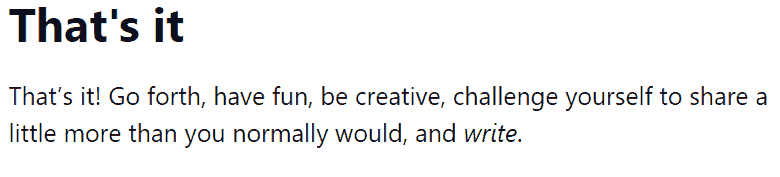
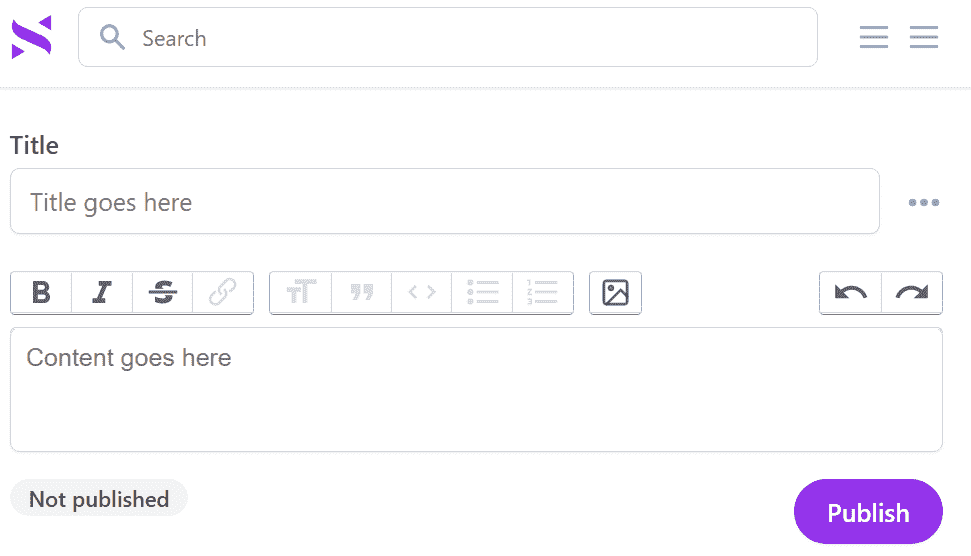

# 建立更好的社交网络，没有盈利压力

> 原文：<https://thenewstack.io/building-a-better-social-network-without-profit-pressures/>

 [大卫·卡塞尔

大卫·卡塞尔是旧金山湾区的骄傲居民，他已经在那里报道科技新闻超过二十年了。多年来，他的文章出现在各处，从 CNN、MSNBC、华尔街日报互动版到《沙龙》、《连线新闻》、《Suck.com 》,甚至最初的《连线》,以及 Gawker、Gizmodo、McSweeneys 和 Wonkette。他现在正在拓宽自己的职业技能，成为一名兼职电脑程序员，开发两个 Android 应用程序，为亚马逊 Kindle 合作制作两个文字游戏，并涉足互动小说。](https://twitter.com/DavidCasselTNS) 

2019 年末，维基百科联合创始人[吉米·多纳尔·威尔士](https://www.linkedin.com/in/jimmy-wales-919a8b) [推出了新的社交网络](https://thenewstack.io/jimmy-wales-new-social-network-tests-whether-moderation-can-scale/)—[WT。社交网站的用户数量已经增长到 491，326 人。“我们看到 Twitter 用户的涌入，”吉米·多纳尔·威尔士周二发帖称，将这一激增归因于不满的 Twitter 用户逃离 Twitter 未来的新主人埃隆马斯克。](https://wt.social/)

根据 vice 的报道，乳齿象还报告周二有 28391 名新用户加入他们的服务，这是马斯克宣布收购的日子。据《华尔街日报》报道，这使得它的用户数上升到了 440 万(T21)。

然而，也有一些小规模的反叛行为，由敢于梦想自己梦想的开发商发起。一些人已经建立了自己的本土替代品，在较小的规模上精心制作——自豪地在网络上逗留，作为他们自己的个人创作行为，以及一些非常个人的项目。

“我，像许多其他人一样，倾向于在喜欢和讨厌社交媒体之间徘徊，”黑客新闻上最近的一个公告这样写道。“所以这是我对我认为更好的解决方案的看法。”

## 减缓社交

这份声明来自于[慢速社交](https://slowsocial.us/)，一个体现了自己发人深省的变化的网站。它的主页承诺“以一种更有意图、更可持续的方式”建立联系，并将自己描述为“为朋友而不是影响者建立的社交网络。”

它的低压前提？

*   一周最多贴一次
*   每周阅读一次你朋友的帖子
*   寒冷

帖子没有字符限制。“让迷因、热门话题和短暂更新生活在别处吧，”它的主页上写道。“这是一个朋友们可以分享他们生活中发生的事情的空间，而不必提炼出微不足道的信息。”

Slow Social 注册过程结束时的消息。

慢社交的使命激起了很多好奇。一些用户甚至建议也限制*阅读网站*的频率——也许用类似每周文摘的东西——但是“知道我只被‘期望’一周最多写一次，这是一种安慰，”社交网络的创始人安德鲁·杜恩辛在《黑客新闻》上评论道。

他似乎很享受其他黑客新闻评论者的反馈浪潮。(有人甚至建议将网站作为合作经营，这样“每个用户在成本和利润上都有平等的利益，在决策上也有平等的发言权。”)

杜恩辛在接受新书库的电子邮件采访时说:“《华盛顿邮报》和网站获得了比我想象的更多的关注，”这使他的网站的注册人数达到了约 1500 人。杜恩辛指出，虽然只有 160 人真正发表了一篇帖子，但对于一个两周前推出的网站来说，这已经不错了。

他指出，他的目标增长率当然是“有意放缓的”

> 通过推出 Slow Slow，它的创造者希望启发一个基本问题:为什么我们的社交网络*变成了*利润驱动的企业？

“我希望产品对人们有用，可靠、可预测、可持续。”

他遵循着最人性的冲动:为他人服务。“我希望它是我可以不断构建的东西，而不必对客户和用户本身以外的利益相关者负责。”

通过树立这个榜样，他希望启发一个基本问题:为什么我们的社交网络*变成了*利润驱动的企业？

“我们真的不能容忍几乎任何其他社区中心(如读书俱乐部、教堂/清真寺/寺庙、跑步团体、学校)，”杜恩辛在《新书库》中写道。“但出于某种原因，它一变成 1 和 0，我们就容忍了。

“我想表明，不一定是经济原因导致了这种情况。”

## 社交网络支持的成本

虽然非营利的美国退休人员协会已经资助了自己的社交网络，名为[老年星球社区](https://community.seniorplanet.org/)，但是很难找到其他更小的例子——这到底是为什么？，Duensing 奇迹。

“利用今天的工具和技术，运营一个社交网络的运营成本实际上相当低，”他指出。

Duensing 估计，他可以以每月不到 500 美元的价格支持 10 万名用户。“最昂贵的事情是我的时间…如果你保持功能集有限，没有投资者最大化投资回报的期望，你实际上可以建立一些可持续的东西，不出售广告，信息，或用黑暗的模式胁迫用户。”

慢速社交的发布窗口。用户被要求每周发布不超过一次。

在四月中旬[开发者网站 Dev.to 上的一篇博客文章](https://dev.to/duensing/introducing-slow-social-4a90)中，杜恩辛指出[其他主要平台都是上市公司](https://dev.to/duensing/introducing-slow-social-4a90)“有法律约束力的责任最大化财务回报”——包括脸书、YouTube、Instagram、Snapchat 和抖音。

他写道:“我为它给我们的社会带来的损失感到痛心，也为我们失去了利用我们拥有的难以置信的技术和资源来创造更好的东西的机会感到痛心。”。

杜恩辛认为，最终，这种商业模式未能提供有意义的互动，产品反而专注于应用上花费的时间和互动次数(以及广告收入和其他收入来源)等指标。

> “如果你保持有限的功能集，并且没有投资者最大化投资回报的期望，你实际上可以建立一些可持续的东西，不出售广告，信息，或用黑暗的模式胁迫用户。”

——安德鲁·杜恩辛，慢社交的创始人

现在有很多关于慢社交的东西可以看。(在阅读任何内容之前，你的朋友必须加入服务，创建帖子，然后批准你的朋友请求*阅读*他们的帖子。)但是这个网站的存在提供了一个鼓舞人心的证据，证明一个梦想正在实现。

“慢社交是我的想法，我希望社交网络是什么样的，我认为它们可以是什么样的，”杜恩辛的博客帖子说，将他的创作比作个人邮件列表或小受众博客。根据其主页，这个新兴的社交网络是为寻求“更多联系，而不是关注”的人准备的。"让人们了解最新情况，而不需要每天提供详细的操作说明."

Duensing 的崇高目标包括:永远保持无广告——同时仍然提供对其所有当前功能的免费访问。

## 我们建造它是因为我们希望它存在

在 Duensing 帖子的评论中，后端开发人员 Edgar Verona 表示他一直在“沿着相同的路线”思考，甚至建立了一个类似的原型。黑客新闻开发者 [Alex Ghiculescu](https://www.linkedin.com/in/ghiculescu) 发帖称，他也建立了一个具有相同前提的网站——一个社交网络“设计为每周只在周日查看一次”，根据【2021 年 1 月他的联合创始人/妻子 [Jillian Schuller](https://www.linkedin.com/in/jillian-schuller) 的帖子。

舒勒写道，这一周在这个名为 Sundayy 的网站上发布的帖子在周日大揭露之前保持隐藏。“你可以回顾你朋友和家人度过的一周；日复一日，用他们自己的话说。”她将周日描述为“以正念反思为中心”

“目前只有我和我丈夫，”舒勒在 2021 年 1 月写道，“我们建造它只是因为我们希望它存在。”

[Sundayy 的主页](https://www.sundayy.app/)将其描述为“唯一一个设计用来少用*少用*的社交网络”，或者，正如 Schuller 在 Hacker News 上发布的那样，“都是信号，没有噪音”，将其描述为她现在使用的唯一一个社交网络。

16 个月后，“它仍然有活跃的用户，”舒勒在接受新堆栈的电子邮件采访时说。还有一个桌面版,“最初的增长来自黑客新闻和我做的一些播客。一千多名用户注册了(通常是出于好奇)，但随着几个月的过去，越来越少的人成为了“核心”用户。

"事实证明，一旦人们开始反思并从中获得一些真实的东西，他们就会一直反思下去."

当然，也有一批不发帖的“潜伏者”，他们阅读别人的反映，却不分享自己。但话说回来，“许多社交媒体是消费而不是创造，”舒勒说，“所以我认为这是一种相当固有的状态，需要很大努力才能改变。”

> “建造它的经历是非常宣泄的，也是我有生以来感到最满足的，建造我知道是值得的东西。”

—吉利安·舒勒，Sundayy 的联合创始人

舒勒形容她和吉库勒斯库最初的愿景——与一小群信任的人分享日常反思——是“我们仍然非常亲近的一个愿景……它让我看到了更好的自己，也让其他人看到了同样的愿景。”

罗伯特·路易斯·史蒂文森(Robert Louis Stevenson)曾经说过，知道你喜欢什么，“与其谦恭地对世界告诉你你应该喜欢的东西说‘阿门’，不如让你的灵魂活着。”在打造了自己的社交媒体平台后，舒勒承认，“建立这个平台的经历非常宣泄，也是我有生以来感觉最满足的一次，建立了一些我知道是值得的东西。”

因此，和 Duensing 一样，Schuller 并没有跟随投资者的步伐去追逐庞大的用户群。“当这种社交媒体和互动方式的时机成熟时，”她说，“它就会发生。”

* * *

# WebReduce

<svg xmlns:xlink="http://www.w3.org/1999/xlink" viewBox="0 0 68 31" version="1.1"><title>Group</title> <desc>Created with Sketch.</desc></svg>