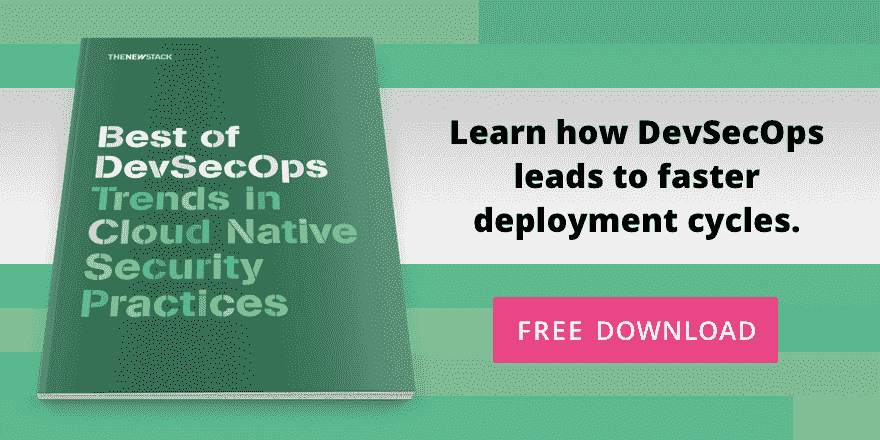

# 建立有效的合作开发团队文化

> 原文：<https://thenewstack.io/building-a-collaborative-devsecops-culture-that-works/>

开发公司的文化和技术变化可能很难把握。但是[安全培训师 Tanya Janca](https://shehackspurple.ca/) 为新的 Stack readers 提供了一个简洁的定义:“DevSecOps 是安全人员所做的事情，使开发人员和操作人员能够制造出令人敬畏的、坚固的、安全可靠的系统。”

[DevSecOps](https://thenewstack.io/how-devops-can-save-security/) 将安全放在 DevOps 管道的中心。这是另一个技术和文化的转变，在软件开发的整个生命周期中，从构思到[日落](https://thenewstack.io/day-software-dies/)，安全工程师都嵌入了 DevOps 团队。

在这种模式下，安全性不再是生产前的最后一道障碍。DevSecOps 意味着网络安全团队了解如何编纂他们的策略，开发人员和系统管理员直接了解如何使用安全性来加速发布周期。

DevSecOps 文化和流程不容易培养，但这是唯一的前进之路，因为[高调的网络攻击](https://thenewstack.io/solarwinds-hack-reveals-3-overlooked-steps-to-securing-a-software-supply-chain/)已经成为常态。随着网络安全经历可怕的人才缺口，每个人都必须投入进来以保证系统的安全。下面是你需要让团队进入正确的统一心态的东西，这是 DevSecOps 成功所必需的。

## 建立开发运维/安全思维融合

“对我来说，整个 DevOps 运动都与安全有关，因为我认为安全是运营的一部分。但后来我意识到，我们确实想提出来，因为安全是一个平等的合作伙伴，”[Palo Alto Networks](https://www.linkedin.com/in/ashley-ward-jp/)企业网络安全平台的 Prisma Cloud 高级产品营销经理 Ashley Ward 告诉 New Stack。

沃德指出，安全性一直是运营方面的考虑因素，但只是在代码进入生产阶段时。[Palo Alto Networks 的 Unit 42 威胁研究人员的一份报告](https://www.paloaltonetworks.com/prisma/unit42-cloud-threat-research-1h21)发现，从 2019 年到 2021 年，云的采用量激增，而安全却被抛在脑后。此外，[Linux 基金会 2020 年的一项调查](https://www.linuxfoundation.org/wp-content/uploads/2020FOSSContributorSurveyReport_121020.pdf)发现，只有 3%的开发人员对负责安全性感兴趣。

这对 DevSecOps 的采用来说并不乐观。但是根据像沃德这样的专家的说法，这仍然是迫切需要的。

沃德告诉我们，在编写一行代码之前，已经有太多的开发人员需要了解他们的技术栈和云。DevOps 团队被更快的交付淹没了。然后不得不学习漏洞和合规管理的复杂性只会增加他们的[永久倦怠](https://thenewstack.io/this-cant-be-normal-the-tech-industry-after-a-year-of-burnout/)。

“如果我们把所有的时间都集中在生产环境上，如果安全已经阻止了这一点，那么这个团队已经在做另一件事情了，”Ward 说。这就是团队需要“左移”并学习开发和操作安全性的原因。虽然他们通常没有意识到它是可用的，但是安全团队需要将安全或[策略编码为代码](https://thenewstack.io/getting-open-policy-agent-up-and-running/)来翻译他们的文档，以便开发运维团队和管道可以使用它们。

这不仅仅是技术的问题。它是关于安全理解如何使用应用程序以及 DevOps 团队正在做什么。如果开发人员使用特定的工具集，安全性需要在这些工具集中运行。

“没有人知道一切。沃德说:“重要的是保持谦逊，并就此进行沟通，这样我们才能弄清楚如何在这个组织内运作。

例如:像[欧盟的通用数据保护条例(GDPR](https://gdpr-info.eu/) )规定了数据如何移动和存储，影响了代码的创建和部署。询问 GDPR 如何工作取决于开发人员和系统管理员，学习 DevOps 管道自动化取决于安全人员。

> “安全性就是让企业能够以安全的方式做一些特别的事情。”

— Ashley Ward，帕洛阿尔托网络公司 Prisma Cloud 高级产品营销经理

问题是 DevOps 团队经常像创新沙坑一样进行实验，创造力经常孤立地流动。

“在 DevOps 的很多时候，我们会尝试一些东西，看看它们是否可行，然后你会得到相应的预算。然后人们就走上了这条路——我们需要消耗更多的云资源，但安全性却落后于此，”沃德说。“当我们甚至不知道是否要做时，谁会让安全部门参与我们正在做的事情？”

不仅仅是 DevOps 团队变得越来越有创造力。威胁者一直在调整。沃德指出，密码挖掘账户的数量已经下降，但每个账户的活动都在增加，因为他们比以往任何时候都更难攻击，包括利用 Kubernetes 的 API 将攻击容器部署到集群中。

他说，面对这种复杂程度，“唯一的办法就是尽可能多地尝试自动化”。"有了云原生工具，我们实际上可以用不同的方式做事."

沃德反思道，直到最近，安全检查仍然是非常手动的，人们实际上是在数据中心走动来检查服务器。现在，云原生工具支持一切自动化。手动流程太慢了，尤其是考虑到目前的规模，团队需要管理数千个临时容器和无服务器，部署到 5，000 台虚拟机，每天数次。相反，您可以通过 API 在现有流程中实现安全性。

这也是为了增加开发人员[的心理安全](https://hbr.org/2017/08/high-performing-teams-need-psychological-safety-heres-how-to-create-it)，而不是在团队成员中鼓励一种“如果我不提，那是别人的问题”的心态。安全性应该是整个团队待办事项的一部分。

当然，一如既往，你必须衡量重要的事情。对于安全性，这意味着一个风险降低仪表板，显示关键漏洞的数量下降。对于 DevOps 团队来说，它展示了安全性是如何提高交付速度的，同时减少了他们实际投入到安全性上的时间。

## 开发速度和学习的并行管道

[实用 DevSecOps](https://www.linkedin.com/in/secfigo/) 认证项目的首席执行官 Mohammed Imran 表示，DevSecOps 是关于将 [CALMS DevOps 模型](https://itrevolution.com/devops-culture-part-1/)应用于安全:文化、自动化、精益、管理和共享。

但他说，前两次的安全措施并不太好。如果安全性不包括通信和自动化，它们只会减慢管道的速度。

对于安全培训师 Janca 来说， [We Hack Purple](https://wehackpurple.com/) 的首席执行官和创始人，DevSecOps 是关于将信息安全部门纳入 DevOps 的三个公理，正如在“[凤凰计划](https://thenewstack.io/the-unicorn-project-author-gene-kim-on-why-management-still-doesnt-get-it/)和“[devo PS 手册](https://thenewstack.io/review-understanding-devops-putting-place-even-scale/)中所讨论的那样:

*   速度效率最大化
*   快速反馈
*   持续学习

为了实现这一点，安全团队成员必须自动快速扫描管道，如扫描机密或运行连续的 SCA 来评估开源安全性和许可证合规性。然后，他们必须运行必要的繁琐测试，如静态应用程序安全测试(SAST)，在 Janca 所谓的生产之外的并行管道中。

> “我认为 DevSecOps 的使命是说:我喜欢你写的代码，我认为你是摇滚明星，我认为我们需要为此提供安全保障。”

—阿曼达·诺克，NU Borders 开发部门工程师

安全团队成员必须对进入管道的内容进行选择，以免系统负担过重。例如，他们可以针对最重要的漏洞连续运行有限范围的动态应用程序安全测试工具(DAST ),这些漏洞因团队而异。他们还可以以 HTTP 存档格式记录测试，然后只测试那些指定的东西，比如检查应用程序是否包含 XSS 或注入漏洞。Janca 说，这可以减少 70%的测试时间，同时大大提高准确性。

“我可以针对这样的事情，比如没有人使用[安全头](https://wehackpurple.com/pushing-left-like-a-boss%E2%80%8A-%E2%80%8Apart-5-3%E2%80%8A-%E2%80%8Abrowser-and-client-side-hardening/)，或者人们有跨站点脚本问题——顺便说一下，大多数团队都有。你可以让你的扫描仪在发布管道中扫描，因为你知道这是一个问题，你想消灭它，”她说。然后，在并行流水线中运行没有范围和模糊完整 DAST。

“如果你要把一些东西放到管道中，我相信它需要给你快速、准确的反馈，”Janca 说，这包括通过数据驱动的方法将反馈提供给正确的人。所有扫描工具都应该创建报告，并将其放入同一个文件夹中，以便漏洞管理工具(如 [DefectDojo](https://github.com/DefectDojo) 、 [ThreadFix](https://threadfix.it/) 或 [ZeroNorth](https://www.zeronorth.io/) )可以接收并创建指标和趋势。

然后，在将问题添加到 bug 追踪器之前，安全倡导者可以检查和验证结果以消除误报。这一步是必要的，因为根据 Janca 的说法，一些 SAST 工具获得了高达 90%的误报，然而，如果你调整到“只有在确定的情况下才报告”，你就会错过 80%的真正错误。

确保让开发团队参与到对安全缺陷的理解中，这样他们就可以在将来帮助预防这些缺陷。“这让他们感到参与和投入，实际上给了废话，所以他们去修复这些错误，”扬卡说。“这有助于让他们关心，也有助于让他们知道我们有问题。”

为了让开发人员参与到安全性中来，Janca 更喜欢胡萝卜而不是大棒。在新冠肺炎·疫情之前，那里有饼干、比萨饼和油炸圈饼。现在，它需要令人垂涎的贴纸、安全书籍，甚至“安全冠军”虚拟背景。并且，总是，额外的帮助和建议。

## DevSecOps 工程师到底是做什么的？

在阿曼达·诺克工作的最后三家初创公司，“有人扎克伯格了它”，她将它定义为两个开发人员构建一个应用程序并发布它，而没有真正考虑对安全或其他任何事情的后果。这包括她目前在 [NU Borders](https://www.nuborders.com/) 担任高级 DevSecOps 工程师，NU Borders 是一家贸易和边境数据分析公司，用户从 5 人增加到 50 人到 500 人。(这时，公司意识到需要考虑系统和安全性，所以雇佣了她。)

对于每个角色，她都被雇来领导 DevOps，然后接受 Sec 的角色，因为没有其他人这样做。“我在 [AWS](https://aws.amazon.com/?utm_content=logo-sponsorpage&utm_source=thenewstack&utm_medium=website&utm_campaign=platform) 中全神贯注，我能看到所有那些 [EC2 实例](https://docs.aws.amazon.com/AWSEC2/latest/UserGuide/ec2-security.html)，我能运行[亚马逊检查员](https://aws.amazon.com/inspector/)，”她说。"我们在亚马逊云中托管我们的应用程序，所以它每周都会按计划启动."

Nock 认为她作为一名 DevSecOps 工程师的角色是“发现需求并采纳它”，推动安全文化的改变并去需要的地方。对于 NU Borders，她获得了[认证信息安全经理认证](https://www.isaca.org/credentialing/cism)，能够以信息安全经理的身份与政府对话，并“说我们的职责和我们的安全是一个整体团队。不把安全放在首位，什么都做不了。”

她可以轻松地运行自动扫描来查找漏洞并进行较小的更新，但当有更大的安全问题需要重新构建时，她需要创建一个问题单——“我知道这不是一项功能，但这是我们需要做的事情，并且需要优先考虑。”

在担任该团队的 DevSecOps 参考点一年后，她反思道，这“真的必须涉及到人对人的层面，尤其是在这么小的公司里。”(NU Borders 员工约 50 人。)

“你几乎是在为安全做公关工作。不要认为安全部门有这么大的一个不知名的部门，而应该是‘我应该让阿曼达来负责这件事。’"

Nock 说，当嵌入到开发团队和 Scrum 过程中时，安全性成为一种文化力量。最近，她与开发人员密切合作，创建了最初的架构图。“我在 AWS 云中做基础设施，他们在做数据流动的图表。”

> 网络安全专家很难找到，这个领域发展如此之快，以至于很多学习都是在工作中进行的。许多从事这项工作的人没有计算机科学学位。

诺克认为，开发部门并不归结为正式的头衔或部门。它提醒人们一些他们可能不会想太多的事情，并让开发者参与黑客活动，包括使用 [HackTheBox](https://www.hackthebox.eu/) 游乐场。

“特别是在这些较小的初创公司，技术工作当然很难，但真正的挑战是进行文化变革，建立开发和安全文化，”她说。“我们需要让这一切自动化、可重复、安全。”

## DevSecOps:在工作中学习

网络安全专家很难找到，这个领域发展如此之快，以至于很多学习都是在工作中进行的。许多从事这项工作的人——包括沃德、诺克和 T2——都没有计算机科学学位。

一年前，当麦克达德加入 [IHS Markit](https://ihsmarkit.com/index.html) 的云安全团队时，正值这家信息提供商与 [S & P Global](https://www.spglobal.com/en/) 合并之际，他是与三名经验丰富得多的初级工程师一起工作的五名初级工程师之一。

麦克达德说:“我的老板想创建一个团队，团队成员都希望在云计算领域有所作为，但与业内许多人不同的是，他想押注于那些没有经验的人，”包括没有学位要求也没有独角兽公司的工作经验。(他的学位是市场营销。)

这是一次激动人心的洗礼，从一个 sprint 到另一个 sprint，自动化 pen 测试，运行云安全审计，支撑充足的数据集，身份验证，联网，红队，实施 SOCKS 协议，协助组织的云迁移和 AWS 许可，同时将编程和记录所有内容结合在一起。

“作为一名安全人员，你必须知道你在保护什么，”麦克达德说。他警告说，入职是必要的，特别是当数据科学团队和广泛的客户数据首次迁移到云时。

IHS Markit 是那种不断进行收购的公司，他说这“伴随着收购而来的是绒毛”。我的任务是删除过时的 DNS 查询，”这包括与团队交谈，了解他们是否仍在使用网站，并解释应该保留或不保留网站的安全原因。

为了使 DevSecOps 取得成功，必须有一个跨组织的认同，即安全很重要，这是每个人的责任。正如麦克达德所说，“没有人能成为专家，因为安全在不断变化。”

想了解更多关于 DevSecOps 的信息吗？下载新堆栈的免费电子书:

<svg xmlns:xlink="http://www.w3.org/1999/xlink" viewBox="0 0 68 31" version="1.1"><title>Group</title> <desc>Created with Sketch.</desc></svg>