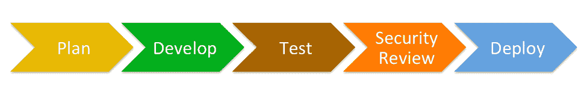

# 建立“发展警察”权力三连胜

> 原文：<https://thenewstack.io/building-a-devsecops-power-trifecta/>

Saltstack 赞助了这个故事。

 [梅胡尔·雷万卡

Mehul 是 SaltStack 的高级安全产品经理，他负责构建解决方案，帮助 Salt 用户保护其跨云、本地、混合和现在的物联网平台的基础设施。在加入 SaltStack 之前，Mehul 在 Tenable 领导了多个漏洞管理和政策合规性研究团队。他和妻子及两个孩子住在佐治亚州的亚特兰大。](https://www.saltstack.com/) 

不久前，软件由开发人员在孤岛中开发和测试，交给运营团队进行部署，并在上线前交给安全团队进行快速评估。

对安全团队的请求是这样的:

*“嘿，安全团队，在我们部署到生产之前，你能对此进行一个快速测试吗？哦，对了，我们下周就要上线了——别有压力！”*

我说的太简单了，但是希望你明白我的意思。不用说，这种瀑布式的开发过程效果并不好；应用程序经常以意想不到的方式崩溃。而且，当它们崩溃时，原因并不总是很清楚，因为开发和生产环境并不总是相同的。更糟糕的是，由于安全性是事后才想到的，安全漏洞、错误配置和违规行为在生产中暴露无遗。

## 为了安全起见，向左而不是向右移动

正在分阶段开发的图片软件从左至右:



很容易看出为什么安全考虑转移到了过程的右边:安全考虑通常会减缓功能软件到达付费用户手中的过程，所以从商业角度来看，它增加的商业价值有限——当然，除非有一天安全问题最终降低了商业价值和可信度。就问 [Equifax](https://www.equifaxsecurity2017.com/consumer-notice/) ！

幸运的是，由于敏捷开发实践的广泛采用，旧的软件开发方式正在迅速改变。这些新流程有助于弥合以前各自为政的组织中开发(Dev)和运营(Ops)团队之间的差距。但是，在这个等式中还有另一个经常被忽略的信息安全(Sec)关键筒仓。例如，根据[Gartner research](https://blogs.gartner.com/neil_macdonald/2012/01/17/devops-needs-to-become-devopssec/):“75%的成功攻击是针对先前已知的漏洞，这些漏洞已经有了补丁或安全配置标准。”

因此，组织现在已经开始打破“开发”和“运营”孤岛，组建开发运维团队，安全部门也加入了组建开发运维团队的竞争。这在一定程度上是可能的，因为现代基础设施通过使用 API 的可编程性质，以及将基础设施表达为代码的能力。

作为 DevSecOps trifecta 的最新成员，安全性也是 DevOps 团队中所有利益相关者的责任。但是，要确保每个人都认识到自己的安全责任，我们还有很长的路要走。这一责任还必须从一开始就涵盖整个开发周期。简而言之，在发展中，安全考虑需要向左转，而不是向右转。

## 到达那里

在开发过程的早期注入安全性可以通过多种方式实现，从培训工程师到遵循安全编码原则，再到添加静态应用安全测试(SAST)和动态应用安全测试(DAST)工具作为 CI/CD 管道的一部分。最终的结果是，产品的每一次迭代都要进行漏洞、错误配置和违规检查。但是使安全性成为 DevOps 过程的一部分的最简单的方法可能是在过程中建立透明度。

## 基础设施作为代码

增加开发过程透明度的一种方法是表达需要作为代码部署的基础设施，理想情况下由[G](https://git-scm.com/)it 或其他版本控制系统进行版本控制。在部署到产品中之前，对代码的任何更改都需要经过审查和批准。

将基础设施表示为代码有很多好处:首先，从开发到运营再到安全，每个人都可以查看部署了哪些应用程序，部署在哪里以及如何部署。这为运营团队提供了使用正确版本的脚本或应用程序的保证。安全团队将确保应用程序采用安全配置部署，不会泄露凭据或密钥等机密。如果出于某种原因，他们不符合要求，安全团队可以快速提出更改建议(最好通过拉式请求)，该建议可以被审查、批准并合并到生产基础架构代码库中。

为了解释这一切是如何工作的，让我们来看一个关于 [Salt](https://saltstack.com/salt-open-source/) 的例子。

对于这个例子，我们假设需要部署一个定制应用程序，为此开发团队需要创建一个 Redis 内存数据库、一个 web 服务器和一个用户组。他们可以用两个关键文件的代码来表达这个需求:一个描述 web 基础设施的编排文件和一个描述[R](https://redis.io)edis 部署的文件。

### Salt 编排文件

下面是一个简单的 Salt 编排文件示例，用于部署安装 redis、httpd 和 web team 用户组的 web 基础设施。

```
# File :  /srv/salt/orch/web-infrastructure.sls

deploy_redis_servers:
salt.state:
-  tgt:  '*redis*'
-  sls:
-  redis

```

```
deploy_web_infra_servers:

salt.state:
-  tgt:  '*web*'
-  sls:
-  httpd
-  python
-  python.python-lxml

-  require:
-  salt:  deploy_redis_servers

deploy_project_group:
salt.function:
-  name:  group.add
-  tgt:  '*'
-  arg:
-  web-team
-  require:
-  salt:  deploy_web_infra_servers

```

可按如下方式部署:

```
mehul@saltmaster:~$  sudo salt-run state.orch orch.web-infrastructure

```

### Redis 安装盐状态文件

下面是开发团队提供的 Redis 安装状态文件，用于安装 Redis 版本(假设安装了 Redis 依赖项)4.0.10:

```
# File : /srv/salt/redis/redis.sls

get-redis:
file.managed:
-  name:  /usr/local/redis-4.0.10.tar.gz
-  source:  http://download.redis.io/releases/redis-4.0.10.tar.gz
-  source_hash:  d2738d9b93a3220eecc83e89a7c28593b58e4909

cmd.wait:
-  cwd:  /usr/local
-  names:
-  tar  -zxvf  /usr/local/redis-4.0.10.tar.gz  -C  /usr/local   &gt;/dev/null
-  watch:
-  file:  get-redis

make-and-install-redis:
cmd.wait:
-  cwd:  /usr/local/redis-4.0.10
-  names:
-  make  &gt;/dev/null  2&gt;&amp;1
-  make install  &gt;/dev/null  2&gt;&amp;1
-  watch:
-  cmd:  get-redis

install-redis-service:
cmd.wait:
-  cwd:  /usr/local/redis-4.0.10
-  names:
-  echo  -n  |  utils/install_server.sh
-  watch:
-  cmd:  get-redis
-  cmd:  make-and-install-redis
-  require:

-  cmd:  make-and-install-redis

```

## 作为代码的安全性

在我们继续这个例子之前，这里有一些来自 [Redis.io](https://redis.io/topics/security) 的关于 Redis 安全模型的上下文:

Redis 被设计为由可信环境中的可信客户端访问。这意味着，通常情况下，将 Redis 实例直接暴露给 internet 或一般情况下不可信的客户端可以直接访问 Redis TCP 端口或 UNIX 套接字的环境并不是一个好主意。

当一名安全人员阅读上述文本时，他们很自然地会对这一部署提出警告。然后他们可以以两种方式做出反应:第一，向领导层提出担忧，要求不使用 Redis；第二，根据[公开发布的指导方针](https://www.digitalocean.com/community/tutorials/how-to-secure-your-redis-installation-on-ubuntu-14-04)对基础设施代码提出务实的修复建议，以降低风险，从而确保 Redis 安装的安全。

务实的解决办法可能是:

1.  保护 redis 数据目录和配置文件的文件权限，以便未经授权的用户不能更改配置或读取 Redis 数据。
2.  需要密码来验证 redis 数据库。
3.  实现 iptables 规则，以便只有受信任的客户端可以连接到它。

这可以通过添加上述 redis Salt 状态文件来实现，如下所示:

### Redis 安装 Salt 状态文件的补充

```
secure_redis_conf_permissions:
file.managed:
-  name:  /etc/redis/6379.conf
-  mode:  644
-  require:
-  cmd:  install-redis-service

secure_redis_data_permissions:

file.managed:
-  name:  /var/lib/redis
-  mode:  700
-  require:
-  secure_redis_conf_permissions

require_redis_password:
file.append:
-  name:  /etc/redis/6379.conf
-  text:

# This could be further encrypted with Salt Pillars
-  requirepass supersecret
-  require:
-  secure_redis_data_permissions

```

### IPTABLES 盐状态文件

最后，提出一个 iptables 规则(这也是最好的防御之一)，只允许来自授权客户端的连接:

```
# File: /srv/salt/iptables/iptables.sls
# Allow connections from trusted ips

iptables_allow_trusted_ips:
iptables.append:
-  table:  filter
-  chain:  INPUT
-  jump:  ACCEPT
-  dports:
-  80
-  6379
-  source:  10.20.0.0/24
-  save:  True

# Deny everything unless defined
enable_reject_policy:
iptables.set_policy:
-  table:  filter
-  chain:  INPUT
-  policy:  DROP
-  require:
-  iptables:  iptables_allow_trusted_ips

```

要应用这些规则，需要更新编排文件以执行 IPTABLES 状态文件，如下所示:

```
# File :  /srv/salt/orch/web-infrastructure.sls
apply_iptables_rules:
salt.state:
-  tgt:  '*'
-  sls:
-  iptables
-  require:
-  deploy_web_infra_servers

```

如您所见，通过将基础设施表达为代码，安全团队能够快速检查正在部署的内容，对其提出一些快速更改，并最终将具有安全配置的应用程序部署到生产环境中。

## 副产品是满足合规性要求

在开发过程中将安全性转移到左边的另一个好处是，作为副产品，合规性需求在前面得到了满足。

以下是 PCI DSS、互联网安全中心(CIS)关键控制和 800-53 合规性要求的一些示例:

[PCI DSS 要求 2](https://www.pcisecuritystandards.org/pdfs/pci_ssc_quick_guide.pdf):“2.2 为所有系统组件制定配置标准，解决所有已知的安全漏洞，并符合行业公认的定义。”

[CIS 关键控制 5](https://www.cisecurity.org/controls/secure-configuration-for-hardware-and-software-on-mobile-devices-laptops-workstations-and-servers/) :“移动设备、笔记本电脑、工作站和服务器上硬件和软件的安全配置”

[800-53 IA-5](https://nvd.nist.gov/800-53/Rev4/control/IA-5#Rev4Statements) :“基于密码的信息系统认证”

如您所见，仅通过部署安全配置的基础架构，甚至在产品部署到生产环境之前，就可以满足这些法规遵从性要求的很大一部分。

## 作为代码的操作

一旦安全地配置和部署了应用程序，下一步就是确保它启动并运行。在某些情况下，流程的操作方面——例如管理和监控应用程序——也可以用代码来表达。

## 监测(盐信标)

Salt 信标为运营团队提供了监控文件、流程、服务和大量其他内容的能力，并且可以在满足特定标准时触发事件(例如登录失败、对关键文件或流程的未授权更改或服务终止)。

在上面的例子中，如果“redis-server”服务的状态发生了变化，操作团队可以配置一个信标来发出警报。

这里有一个例子:

```
# File : /etc/salt/minion
beacons:
service:
-  services:
redis-server:
onchangeonly:  True

```

## 响应(盐反应堆)

最后，警报只有在能够采取行动的情况下才有用。 [Salt reactors](https://docs.saltstack.com/en/latest/topics/reactor/) 可以配置为对上述警报做出反应并重启服务。这里有一个例子:

```
# File : /etc/salt/master.d/reactor.conf
reactor:
-  'salt/beacon/redis*/service/redis-server':
-  salt://reactor/restart-redis.sls
# File: /srv/salt/reactor/restart-redis.sls

restart_service:
local.service.restart:
-  tgt:  'redis*'
-  arg:
-  redis-server

```

## 结论

向 DevOps 工作流注入安全性不再像以前那样困难。如上所述，“开发”、“安全”和“运营”团队可以组成一个强大的 DevSecOps 组合，并交付一个平衡三种不同需求的产品，同时服务于部署安全配置的生产应用程序的单一目标。因此，当涉及到安全问题时，是向左而不是向右转变的时候了。

通过 Pixabay 的特征图像。

<svg xmlns:xlink="http://www.w3.org/1999/xlink" viewBox="0 0 68 31" version="1.1"><title>Group</title> <desc>Created with Sketch.</desc></svg>