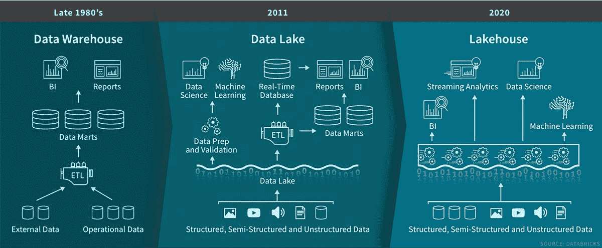

# 用数据砖块和机器学习建造湖边小屋

> 原文：<https://thenewstack.io/building-a-lakehouse-with-databricks-and-machine-learning/>

当涉及到机器学习(ML)应用程序的数据时，数据库系统往往不能满足它。你需要更大的东西，比如数据仓库或数据湖。还有一类新兴的专业人工智能和大数据平台，它们在开发平台和数据仓库之间进行推介。

一家这样的公司是 [Databricks](https://databricks.com/) ，它自称是“数据和人工智能的统一平台”。它提供大规模数据处理、分析、数据科学和其他服务。

 [理查德·麦克马努斯

Richard 是 New Stack 的高级编辑，每周撰写一篇专栏文章，探讨云计算原生互联网的未来。此前，他在 2003 年创立了读写网，并将其打造为全球最具影响力的科技新闻和分析网站之一。](https://twitter.com/ricmac) 

为了了解更多关于 Databricks 在人工智能时代的战略，我采访了该公司产品管理、数据科学和机器学习总监 [Clemens Mewald](https://www.linkedin.com/in/clemensmewald/) 。谈到人工智能数据，Mewald 有一个特别有趣的背景，他在谷歌大脑团队工作了四年，为谷歌建立 ML 基础设施。

我首先问 Mewald data bricks 与现代数据库系统(如 Apache Cassandra 和 MongoDB)有什么关系？

他回答说 Databricks 是“数据库不可知的”他说，该公司专门从事大规模数据处理，但其方法的真正关键是数据湖理论。

数据湖是以各种格式存储的原始数据的存储库—从电子邮件和 pdf 等非结构化数据到关系数据库中的结构化数据。该术语诞生于 2011 年，是 20 世纪 80 年代末数据仓库概念的现代变体。一个关键区别是:数据湖是为处理互联网及其大量非结构化数据而设计的。

在[一月份的一篇博客文章](https://databricks.com/blog/2020/01/30/what-is-a-data-lakehouse.html)中，Databricks 通过创造一个新的术语扩展了数据湖的概念:lakehouse。它被描述为“结合了数据湖和数据仓库的最佳元素的新范例”

图像通过数据块(点击查看大图)

应该注意的是，与数据仓库不同，数据湖的概念还没有被业界普遍接受。商业智能分析师 [Barry Devlin](https://www.linkedin.com/in/barrydevlin/) 在回复 data bricks 帖子时写道[“虽然经常声称是一种架构，但数据湖从未真正成熟到超出营销概念。”他想知道，“湖边小屋能做得更好吗？”](https://www.linkedin.com/pulse/now-lakehouse-barry-devlin/)

虽然“湖边小屋”可能会有争议，但 Databricks 至少有一款产品真正实现了这一理论: [Delta Lake](https://databricks.com/product/delta-lake-on-databricks) 。它[的目标是](https://thenewstack.io/delta-lake-a-layer-to-ensure-data-quality/)确保大规模数据湖中数据的可靠性；这项技术于去年四月开源。

“几年前，我们开发了一款名为 Delta Lake 的产品，”Mewald 告诉我，并将其描述为“存储格式和事务层”

“在数据湖之上，它基本上为您提供了类似于数据仓库的功能，”他继续说道，“这就是为什么考虑数据块的方式是，我们是数据库不可知的；您可以从任何数据源将数据摄取到数据块和三角洲湖中。所以，让我们说从卡珊德拉或 MongoDB。然后，我们为您提供这种优化的格式、优化的查询引擎，以及针对各种使用情形和应用程序查询该数据的事务性保证。”

[机器学习](https://thenewstack.io/category/machine-learning/)是 Databricks 提供的另一个关键部分。该公司声称，它“大规模地简化了 ML 开发，从数据准备到模型训练和部署。”MLflow 是 Databricks 发布的一个开源框架来帮助解决这个问题。Databricks 在其平台中提供了 MLflow 的托管版本(贾纳基拉姆·MSV[去年为新的堆栈编写了 MLflow](https://thenewstack.io/databricks-mlflow-aims-to-simplify-management-of-machine-learning-pipelines/) ，还为其编写了教程[)。](https://thenewstack.io/tutorial-manage-machine-learning-lifecycle-with-databricks-mlflow/)

我很好奇 Mewald 在谷歌的背景，谷歌被认为是将 ML 应用于消费者应用程序的先驱，如 Gmail、广告个性化、谷歌助手和 YouTube 视频推荐。他在那里了解到 ML 在现代应用中是如何使用的？

Mewald 回答说，在谷歌工作期间，他“看到了所有机器学习的应用”。然而，他认为其他公司在应用 ML 方面已经赶上了谷歌——不出所料，包括他现在的雇主。

“我发现 Databricks 真正令人兴奋的是，我现在实际上看到了 Databricks 客户的完全相同的使用案例多样性。谷歌这样的公司在人工智能应用方面遥遥领先，这实际上是一个神话。”

然而，由于分布式计算、Kubernetes、DevOps 和其他当前流行的云原生技术，开发人员的体验只会变得更加复杂。将机器学习添加到开发人员的工作中只会增加他们必须处理的复杂性。所以我问 Mewald，当谈到将 ML 集成到他们的应用程序中时，他对开发者的建议是什么？

他首先指出，“机器学习确实是我们思考开发方式的一种范式转变。”

“在软件中，”他继续说道，“你写代码，你写单元测试，它每次运行时的行为都是一样的。在机器学习中，你写代码，有这种数据依赖性；每次你训练你的机器学习模型，它都会有不同的表现，因为它本身是随机的，数据会发生变化。[所以]它不是决定性的。”

Mewald 说，问题是许多开发者正在使用老的软件工程工具——其中一些是“几十年前”为 ML 开发的。因此，他建议今天处理 ML 的开发者选择“现代开发者工具”，如 [MLflow](https://mlflow.org/) 。

我问梅瓦尔德的最后一个问题是一个推测性的问题。机器学习似乎还为时过早，特别是从应用的角度来看，那么他认为随着 ML 的成熟，未来几年的主要挑战是什么？

“机器学习是 10 年前数据工程所在的地方，”他回答道。“就像十年前，如果你让某人编写一个程序来处理万亿字节的数据，这是一件大事——世界上只有少数人能做到这一点。”

然而今天，同样的任务可以使用像 Databricks 这样的工具来完成。或者如 Mewald 所说，你输入“一个 Spark SQL 查询，它就神奇地工作了。”

但是 ML 仍然处于那个尴尬的阶段，那里有大量的手工工作，并且需要专业知识。

“在大多数情况下，当我们今天建立机器学习模型时，这是一次性的，”他解释道。“这就像缝合在一起的东西，也许它可以工作，他们可以让它上线，然后你就完成了-但它不可维护，不可重复。”

因此，就像数据工程所经历的转变一样，ML 必须变得更容易被更多的人使用。为了实现这一点，工具需要变得更容易使用。Mewald 补充说，也许是为了“任何能编写 SQL 查询的人都可以进行机器学习。”

或许到那时，湖边小屋的概念也将被证实——但是时间会告诉我们这个行业是否会接受它。

通过 Pixabay 的特征图像。

目前，新堆栈不允许直接在该网站上发表评论。我们邀请所有希望讨论一个故事的读者通过 [Twitter](https://twitter.com/thenewstack) 或[脸书](https://www.facebook.com/thenewstack/)访问我们。我们也欢迎您通过电子邮件发送新闻提示和反馈: [feedback@thenewstack.io](mailto:feedback@thenewstack.io) 。

<svg xmlns:xlink="http://www.w3.org/1999/xlink" viewBox="0 0 68 31" version="1.1"><title>Group</title> <desc>Created with Sketch.</desc></svg>