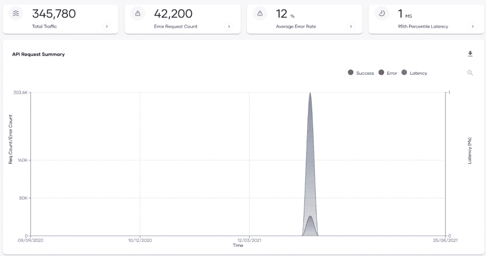
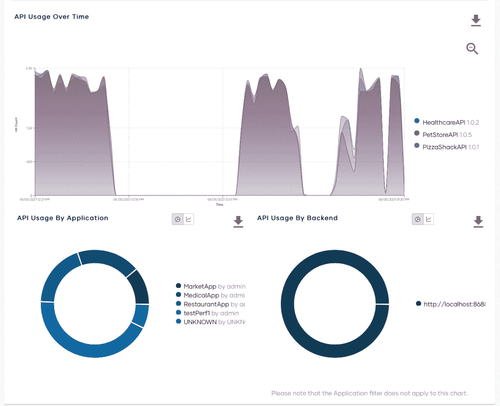
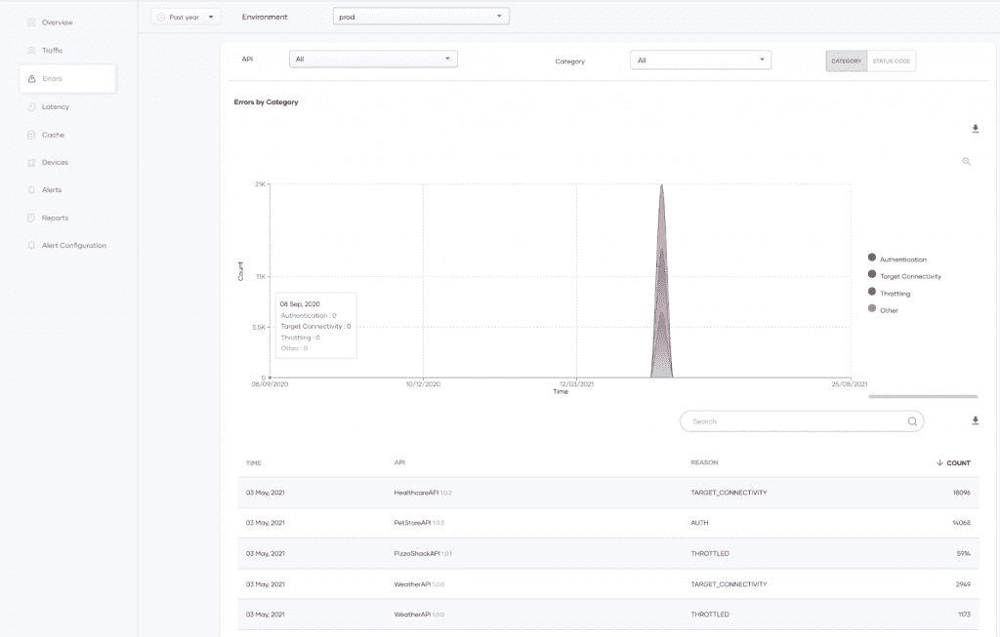
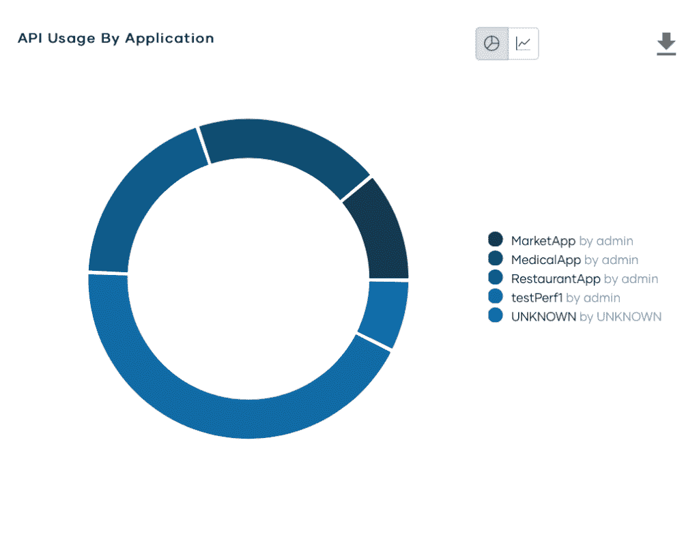

# 为你的 API 建立定价策略

> 原文：<https://thenewstack.io/building-a-pricing-strategy-for-your-apis/>

[Himasha Guruge](https://www.linkedin.com/in/himashag/?originalSubdomain=lk)

[Himasha 是 WSO2 解决方案架构团队的首席解决方案工程师，专门负责构建 API 主导的集成。她与 EU-的客户密切合作，在设计和构建企业解决方案方面充当值得信赖的顾问。Himasha 在工程团队工作的几年中，凭借自己在 WSO2 产品方面的实践经验，为许多公司提供了技术和架构咨询。](https://www.linkedin.com/in/himashag/?originalSubdomain=lk)

API 是一种独特的产品。没有一个像样的用户界面或结果，开发者可以展示和营销类似于市场上的常规产品。感知其有用性的唯一方法是花时间测试和理解它带来的价值。

鉴于这些独特的条件，与货币化其他产品相比，货币化一个公开的 API 需要不同的方法。

这篇文章讨论了如何为你的 API 建立一个定价策略，以及你应该考虑哪些方面。

必须考虑三个方面:能力、成本和竞争。API 开发者和供应商必须分析并确定这三者中哪一个是最重要的。为了解释和提供示例，我们将使用 [WSO2 API 管理器](https://wso2.com/api-manager/)及其分析仪表板。

让我们开始吧。

## **该 API 满足了独特的需求吗？**

确定最有吸引力的 API。

和任何产品或服务一样，API 一定有市场或独特的需求。因此，如果您的 API 可以完成一项有价值的任务，您可以根据 API 的功能或通过确定现有供应商如何满足这一独特需求来调整您的定价。如果您拥有并公开了多个 API，请考虑选择最有吸引力的 API，如上面的图 1 所示。

## **确定消费群体及其使用方式**

使用模式

如果您想对使用您的公开 API 的消费者收费，这是至关重要的。用户范围很广，从临时用户到中小型企业，再到需要大量使用 API 的大型组织。如上面的图 2 所示，一旦您确定了您的关键用户组，您必须观察一段时间内进行了多少次 API 调用，如果您有几个 API，哪些 API 经常被使用，哪些组使用特定的 API 最多(见下面的图 3)，以及 API 被调用的次数，等等。，以帮助确定可能的定价等级。

## **确定价格点并相应地包装您的层级**

原料药的限速趋势

一旦确定了你的消费群体并了解了他们的使用模式，你就可以利用成本因素来帮助决定你的价格范围。例如，如果您的 API 管理(APIM)解决方案包含与 API 和速率限制相关的统计信息，那么这是确定每层中可以包含的请求数量的良好起点。

应用程序的 API 使用情况

如上面的图 4 所示，您可以观察相关的市场参与者/消费应用程序，并了解您的 API 提供了什么。例如，如果市场高度饱和，你的价格必须处于适当的市场价格。但是，您可以通过提供额外服务来使您的价格层与竞争对手的价格层相区别。例如，一些层可以包括调用固定数量的客户/应用程序的 API、SSL 支持等。

## **免费和免费增值是可能的收入来源**

当寻求将你的 API 货币化时，添加一个免费或免费增值层是很有用的。在一个 API 生态系统中，你的消费者是开发者，他们在决定 API 的一般用途之前测试它。让用户有机会自由地使用和集成你的 API 会让它在开发者社区中更容易被接受。随着时间的推移，你可以利用这种粘性，让开发者升级到付费层。如果您为较低级别的升级提供折扣，关注与升级相关的成本也很重要。

在基于 API 的产品中，收入并不是一切。因此，不要让你的主要用户灰心丧气，他们会培养你的 API，并通过使用它构建应用程序来提高它的可见性，从而给新消费者更多的可见性。

## **继续测试您的价位**

实际上，你的定价选项不太可能保持不变。这涉及到大量的试验和错误，你需要观察你的结果，获取反馈并监控使用模式，以更好地了解你的消费者如何看待你的定价计划。这是一个长期的过程，在这个过程中，您可以根据经验观察和更新您的产品。

对 API 的洞察可以帮助您确定定价策略，并提高其市场适应性。作为一种可能的收购策略，考虑在几个 API 市场中列出你的 API。一旦你的 API 为人所知，并且有大量的消费者在使用它，你就可以通过利用你的分析来提升定价层。使用 APIM 解决方案更好地了解您的消费者至关重要。其他功能，如 API 评级、评论区和论坛，将有助于建立一个强大的反馈循环，并帮助您的 API 随着时间的推移而变得流行。

## **结论**

API 使用的加速增长使其成为一个巨大的收入来源。然而，创造货币价值是一个集体的过程，它确定哪些 API 可以产生利润，并迭代地构建一个策略来充分利用它们。分析在这一过程中提供了很好的见解，以确定哪些 API 可以货币化，确定潜在的消费者，了解定价层，并帮助在动态环境中培育战略。

要了解更多信息，我们鼓励您访问我们的[产品页面](https://wso2.com/api-manager/)。

<svg xmlns:xlink="http://www.w3.org/1999/xlink" viewBox="0 0 68 31" version="1.1"><title>Group</title> <desc>Created with Sketch.</desc></svg>