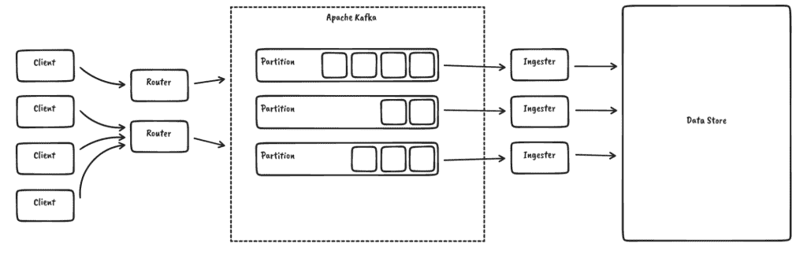
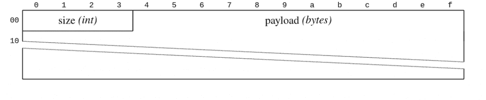
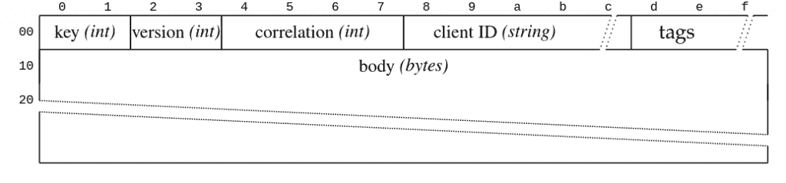
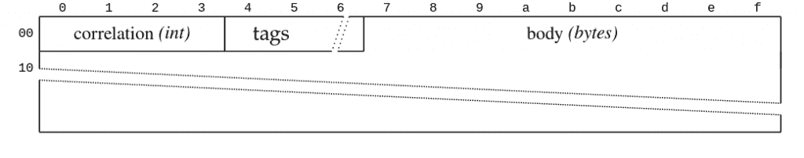
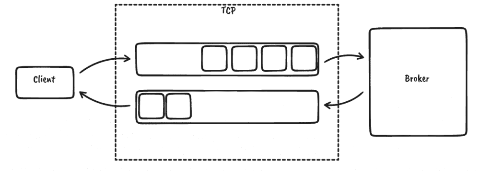
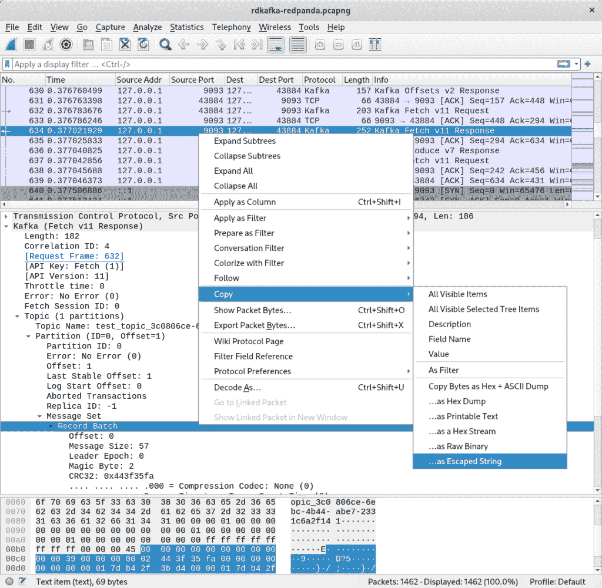
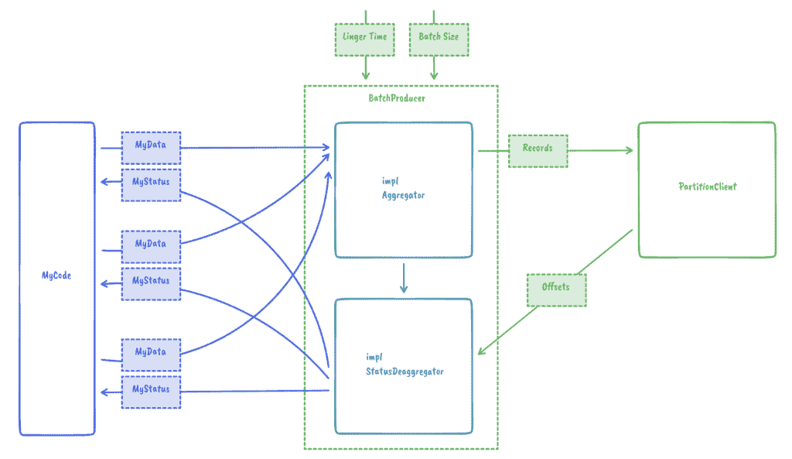

# 构建一个简单、纯信任、异步的 Apache Kafka 客户端

> 原文：<https://thenewstack.io/building-a-simple-pure-rust-async-apache-kafka-client/>

对于 [InfluxDB](https://www.influxdata.com/) 的未来核心 [InfluxDB IOx](https://github.com/influxdata/influxdb_iox) ，我们使用[阿帕奇卡夫卡](https://kafka.apache.org/)对数据进行排序:



到目前为止，我们一直依赖于 [rust-rdkafka](https://github.com/fede1024/rust-rdkafka) ，它为 [librdkafka](https://github.com/edenhill/librdkafka) 提供异步绑定，而后者又是用 c 编写的，那么我们为什么要替换它呢？以下是一些原因:

 [马尔科·诺伊曼

Marco 专攻高性能系统和数据仓库，在 Blue Yonder 担任数据工程师。现在，他在 InfluxDB IOx 上的 InfluxData 工作，这是一个新的快速时序数据库引擎。](https://de.linkedin.com/in/marco-neumann-a3833621) 

*   **复杂性** : librdkafka 是一个复杂的库，有很多我们不需要或不想要的特性，它支持各种 kafka 版本，而我们基本上运行的是“最新的”。由于 rust-rdkafka 也只公开了 librdkafka 功能的一小部分，我们认为这可能也适用于其他用户。
*   **绑定:** rust-rdkafka 试图将 librdkafka 硬塞进 rust 异步生态系统。这在某种程度上是可行的，但也导致了一些问题，比如当回调从不同的线程执行时，tokio 会变得混乱。绑定本身也有一些限制。
*   **缓冲/模块化:**我们对 librdkafka 中缓冲和批处理的工作方式控制有限。这是跨语言库的固有问题。
*   **专业知识和见解:**bug 和意外行为很难调试。我们对在生产中使用当前状态感到不舒服。
*   **可行性:**我们只使用 Kafka 功能的非常有限的子集(例如，没有事务)，对于这些功能，Kafka 协议相当简单。对于这个子集，编写一个新的客户端实际上是可行的。

这就是为什么我们决定在 Rust 中启动一个简单、新鲜、完全异步的 Kafka 客户端: [RSKafka](https://github.com/influxdata/rskafka/) 。

下面是一个简单的用法示例。首先，我们建立一个客户端:

```
let connection  =  "localhost:9093".to_owned();
let client  =  ClientBuilder::new(vec![connection]).build().await.unwrap();

```

我们来创造一个话题:

```
let topic  =  "my_topic";
let controller_client  =  client.controller_client().await.unwrap();
controller_client.create_topic(
    topic,
    2,      // partitions
    1,      // replication factor
    5_000,  // timeout (ms)
).await.unwrap();

```

然后我们生产和消费一些数据:

```
// get a client for writing to a partition
let partition_client  =  client
    .partition_client(
        topic.to_owned(),
        0,  // partition
    )
    .await
    .unwrap();

// produce some data
let record  =  Record  {
    key:  b"".to_vec(),
    value:  b"hello kafka".to_vec(),
    headers:  BTreeMap::from([
        ("foo".to_owned(),  b"bar".to_vec()),
    ]),
    timestamp:  OffsetDateTime::now_utc(),
};
partition_client.produce(vec![record]).await.unwrap();

// consume data
let  (records,  high_watermark)  =  partition_client
    .fetch_records(
        0, // offset
        1..1_000_000,  // min..max bytes
        1_000, // max wait time
    )
    .await
    .unwrap();

```

你可能会直接跳到[源代码](https://github.com/influxdata/rskafka/)，但是我也邀请你一起阅读，了解我们是如何构建它的，以及一般来说哪些实践可以为客户端库工作。

## 卡夫卡协议

为协议编写新客户机时的第一个问题是:它有多复杂？这个问题有望在协议规范中得到解答。在 Kafka 案例中，有一些文件，尽管没有一个完全涵盖整个协议:

*   [Kafka 协议指南](https://kafka.apache.org/protocol):给出了协议如何工作的高级概述和消息布局的详细描述，但不包括消息语义。
*   [Kafka 文档](https://kafka.apache.org/documentation/):提供记录批次(比如实际有效载荷)如何序列化的细节。
*   [卡夫卡改进建议](https://cwiki.apache.org/confluence/display/kafka/kafka+improvement+proposals):这些是对协议为什么以及如何发展的深入解释。它们有 800 多种，浏览它们有点棘手。还要注意，在少数情况下，它们与实际实现稍微有些不同步。
*   [librdkafka](https://github.com/edenhill/librdkafka) :查看其他实现的源代码会有所帮助。
*   Wireshark :尤其是在查找 bug 或试图理解其他实现是做什么的时候，只需查看发送和接收的包就能有所帮助。幸运的是，Wireshark 自带原生 Kafka 协议支持。

Kafka 对每个 client⇔broker 连接使用一个 TCP 连接。这很好，因为我们可以依靠操作系统为我们提供消息排序、背压、连接级重试和某种形式的错误处理。然后，数据以 32 位有符号整数大小成帧，后跟有效载荷:



网络工程师可能会问，“哪种类型的 32 位整数？”事实上，Kafka 在协议文档的一个[专用部分为这种特殊类型声明了它的协议原语:](https://kafka.apache.org/protocol#protocol_types)

"代表一个介于-231 和 231-1 之间的整数。这些值以网络字节顺序(大端)使用四个字节进行编码。(隐式假设有符号整数被编码为二进制补码。 *)*

有效负载本身是一个简单的请求-响应模型，带有头部和主体。请求如下:



以下是回应:



请求从客户端发送到代理，代理将只发送它收到的请求的响应。没有服务器启动的传输。关联 ID 将响应映射到请求。数据可以被流水线化；例如，即使我们在等待响应，我们也可以发送更多的请求，但是服务器不会进行消息重新排序，即使相关 id 允许这样做:



上面显示的请求头中的其他重要字段是 API 密钥和版本。(客户机 ID 只是一个字符串，标记是一种扩展机制。)版本是特定于 API 键的，并使用一个称为 [ApiVersion](https://kafka.apache.org/protocol#The_Messages_ApiVersions) 的特殊消息进行协商，该消息表示代理支持的版本范围(每个 API 键一个)。然后，客户端从这些范围中选择它支持的最高版本。对于新版本，添加和删除了字段，更改了数据类型，但是某些字段的语义也会发生变化。这与其他协议有点不同，比如[协议缓冲区](https://developers.google.com/protocol-buffers)。RSKafka 试图成为一个好公民，并支持这种形式的协商，即使它没有实现所有已知的版本。相反，我们只为我们需要的功能实现了一组足够的版本。

虽然实现一个新的协议看起来工作量很大，但一般来说，您几乎总是可以使用一些工具来实现一个协议客户端——支持以大和小端编码读写整数的标准库、用于特定任务(如 [CRC](https://en.wikipedia.org/wiki/Cyclic_redundancy_check) 计算)的助手库、解析器框架(如 [nom](https://github.com/Geal/nom) )(未被 RSKafka 使用)、与传输相关的机箱(如 [rustls](https://github.com/rustls/rustls) 等等。

## 测试

测试协议实现可以而且应该在多个层次上进行。让我带你浏览一下。

### 序列化往返

当序列化和反序列化一个数据类型时，就像前面提到的基本类型一样，检查是否可以成功地存储和读取许多不同的值会很有帮助。一个快速便捷的方法是 [proptest](https://crates.io/crates/proptest) :

```
proptest!  {
    #[test]
    fn roundtrip_in16(orig:  Int16)  {
        let mut data  =  vec[]!;
        orig.write(&mut data).unwrap();
        let restored  =  Int16::read(&mut Cursor::new(data)).unwrap();
        assert_eq!(orig,  restored);
    }
}

```

### 序列化快照

虽然往返测试确保我们可以读取我们写的数据，但它不能确保任何规范的符合性。例如，我们可能误读了协议定义，使用了完全错误的序列化格式。二进制快照是一个字节序列，我们知道它是某种数据结构的编码。这些信息可以从协议规范(如果列出)中获得，也可以通过观察其他客户端的行为获得，例如使用 Wireshark:



当规范不清楚或令人困惑时，快照还可以帮助您理解协议。(或者根本没有可用的规范，在这种情况下，我们谈论的是[逆向工程](https://en.wikipedia.org/wiki/Reverse_engineering)。)我们在几个地方使用这些快照并反序列化数据，根据基本事实检查结果结构，然后进行额外的往返测试，以确保我们也写入了正确的字节序列。

### 集成测试

在开发一个新的协议客户端时，尽早进行某种形式的集成测试以再次检查协议文档是否被正确理解是有意义的。我们针对 [Apache Kafka](https://kafka.apache.org/) 和 [Redpanda](https://vectorized.io/redpanda) 执行一系列操作，比如创建分区、生成和消费数据；两者都很容易整合到我们的 CircleCI 管道中。我们还使用 rdkafka 生成和消费消息，以交叉检查其他客户端是否会使用 RSKafka 生成的有效负载。幸运的是，这两种服务器实现都相当挑剔，拒绝任何胡言乱语。Apache Kafka 甚至在服务器控制台上打印出有用的回溯。请注意，并非每个协议都是如此。

### 单元测试

集成测试很少会触发客户需要处理的所有边缘情况。为此，为了加快测试速度，在没有任何外部依赖的情况下测试客户机的各个部分是很重要的。我们正在通过抽象客户端的一些内部部分来提高我们在该领域的测试覆盖率，以便它们可以针对模拟或者甚至作为独立的功能进行测试。

### 起毛

对于每个新的协议解析器，强烈建议实现某种形式的模糊化。即使您可能没有想到您的 Kafka 集群正在攻击您，来自您的网络的乱码字节或对协议的误解仍然可能导致不必要的混乱。令人惊叹的[货物起毛](https://github.com/rust-fuzz/cargo-fuzz)让起毛变得非常简单:

```
fuzz_target!(|data:  &[u8]| {
    RecordBatchBody::read(&mut Cursor::new(data)).ok();
});

```

关注没有很多长度标记或 CRC(循环冗余校验)字段的数据结构是有帮助的，因为 fuzzer 将很难通过这些检查。您可能想知道一个没有任何不安全代码的解析器怎么会死机？我们发现并解决了两件事:

*   **内存不足(OOM):** 一些数据类型被序列化为长度标记，后跟实际的有效负载。当读取长度，然后不考虑分配了多少数据或者还有多少数据要读取就预分配缓冲区时，很容易就会耗尽内存。对于 Rust 来说，这将中止进程，结果是杀死整个服务器。
*   **溢出:**某些整数类型在反序列化时需要移位。不小心这样做会导致溢出。请注意，在发布模式下编译时，通常不会检查这些内容。

## 模块性

我们的目标之一是让用户选择在消费期间如何管理预取，或者在写入 Kafka 时如何管理批处理。要使用最大大小和逗留时间(如下所示)批量累积记录，只需要:

```
// construct batch producer
let producer  =  BatchProducerBuilder::new(partition_client)
    .with_linger(Duration::from_secs(2))
    .build(RecordAggregator::new(
        1024,  // maximum bytes
    ));

// produce data (from multiple threads / places)
let offset:  i64  =  producer.produce(record).await.unwrap();

```

在设计批处理机制时，我们想到的另一个用例是自定义聚合算法。例如，如果用户可以提供他们自己的聚合器，而不是 RSKafka 将多个记录合并成一个批处理，会怎么样？这在 IOx 中很有用。在那里，我们可以重用字符串字典，而不是在每个记录中对它们进行编码，从而提高性能和减少大小消耗。我们通过 traits 提供了一个很好的扩展点来实现这一点:



这导致了下面的简单用户代码:

```
// construct batch producer
let producer  =  BatchProducerBuilder::new(partition_client)
  .with_linger(Duration::from_secs(2))
  .build(MyAggrgator::new(...));

// produce data (from multiple threads / places)
let status:  MyStatus  =  producer.produce(my_data).await.unwrap();

```

## 贡献

目前，RSKafka 是故意最小化的——它不支持任何形式的事务处理。虽然我们自己没有任何大规模扩展功能的计划，但我们愿意接受社区贡献，并期待有趣的用例。https://github.com/influxdata/rskafka[见](https://github.com/influxdata/rskafka)。

<svg xmlns:xlink="http://www.w3.org/1999/xlink" viewBox="0 0 68 31" version="1.1"><title>Group</title> <desc>Created with Sketch.</desc></svg>