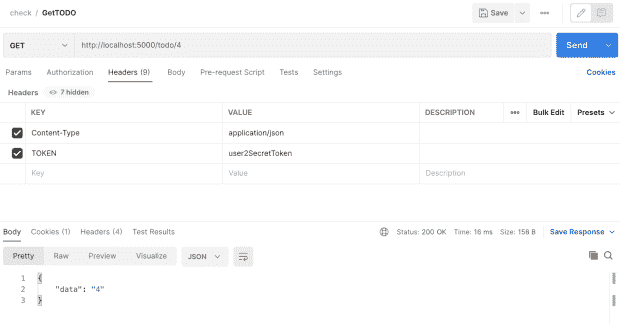
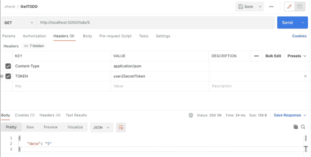
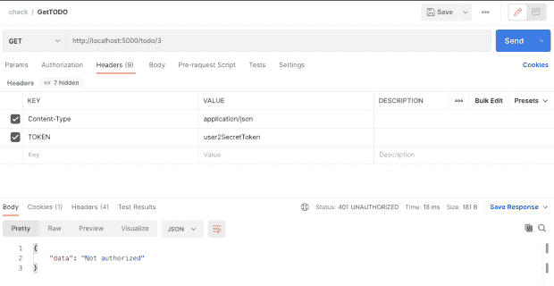

# 在您的 API 中构建访问权限

> 原文：<https://thenewstack.io/building-access-permissions-into-your-api/>

面向微服务的架构已经从一个时髦的词发展成为构建大规模应用程序的标准架构实践。应用程序被设计成可独立部署的服务块，并通过轻量级机制相互通信。

微服务提供了很多优势，包括灵活的语言选择、基于功能的可伸缩性、独立的部署以及独立的产品开发团队。然而，它们也会带来挑战。其中一个挑战是资源的认证和授权。

在单一应用程序中，可以使用单个用户会话对用户进行身份验证和授权。对于独立的微服务，它们之间不共享用户上下文。这意味着认证和授权需要在每个微服务中处理，导致认证逻辑的重复。重复的代码会分散开发人员的注意力，并且难以维护和监控。

如果授权机制被实现为全局共享的提供者，它将有助于消除重复，使开发团队能够专注于业务逻辑。

在本教程中，您将使用 Python 构建 REST API 端点，并使用 [Cerbos](https://cerbos.dev/) 向这些端点添加资源访问权限。

## 构建 RESTful API

您将在 Python 上构建带有权限管理的 RESTful APIs。要开始学习本教程，请确保您具备以下先决条件:

在本教程中，您将为 TODO 服务创建 REST APIs。API 将使用 [Flask web 框架](https://flask.palletsprojects.com/en/2.0.x/)构建。

通过将 Flask 模块导入到您的应用程序来初始化 API:

```
```python
from flask import Flask
from flask_restful import Resource,  Api,  reqparse

app  =  Flask(__name__)
api  =  Api(app)
```

```

您正在构建的 API 将创建、更新、读取和删除 REST API 端点。

现在为 TODO 资源添加 API 端点:

```
```python
from flask import Flask
from flask_restful import Resource,  Api,  reqparse

app  =  Flask(__name__)
api  =  Api(app)

class TODO(Resource):
  pass

api.add_resource(TODO,  '/todo')
```

```

这里您已经添加了一个 TODO 类，它将包含所有必要的方法来处理对所提供的路由的请求。行`api.add_resource(TODO, '/todo')`用于定义访问 API 的路径。

有了资源之后，添加处理 GET、POST、PUT、EDIT 请求的方法:

```
```python
class TODO(Resource):
    def get(self):
        return  {'data':  'data'},  200

api.add_resource(TODO,  '/todo')
```

```

在运行 Python 文件之前，确保安装了`Flask`和`flask_restful`依赖项:

```
```
>  pip3 install Flask
>  pip3 install flask_restful
```

```

现在你可以通过运行`main.py`文件:
来启动 Flask 服务器

这将在默认端口`5000`启动`Flask`应用。要检查`GET /todo` API，使用 curl 命令:

```
```
>  curl http://127.0.0.1:5000/todo
#=> {"data": "data"}
```

```

现在您已经启动并运行了服务器，添加剩余的端点`create, update, delete`，包括`authentication`。

## 证明

```
```python
class TODO(Resource):
    @app.route("/todo/<string:id>")
    def get(id):
        if not TODO.__authenticate(request.headers["token"]):
            return  {'message':  'API key invalid'},  401

        return  {'data':  id},  200

    def post(self):
        if not TODO.__authenticate(request.headers['TOKEN']):
            return  {'message':  'API key invalid'},  401

        return  {'message':  'success'},  201

    @app.route("/todo/<string:id>",  methods  =  ['PUT'])
    def put(id):
        if not TODO.__authenticate(request.headers['TOKEN']):
            return  {'message':  'API key invalid'},  401

        return  {'data':  id},  200

    @app.route("/todo/<string:id>",  methods  =  ['DELETE'])
    def delete(self):
        if not TODO.__authenticate(request.headers['TOKEN']):
            return  {'message':  'API key invalid'},  401

        return  {'message':  id},  200

    def __authenticate(token):
        if token in Tokens:
            return True
        else:
            return False

api.add_resource(TODO,  '/todo')

```

```

用户的 API 密钥在`dict`中管理。用 API 令牌创建一个新文件`resources.py`。该文件由主文件导入，以检查令牌是否有效。

```
```python
# format => { "token": "userid" }
Tokens  =  {
  "user1SecretToken":  "1",
  "user2SecretToken":  "2",
  "user3SecretToken":  "3"
}
```

```

在这里，您可以看到添加了一个身份验证机制来检查用户提供的 API 密钥是否有效。如果令牌无效，用户将收到消息“API 密钥无效”

下一步是在 API 中添加授权机制。您需要设置以下授权策略。

## 批准

**获取**

*   拥有`admin`角色的用户可以获得自己的待办事宜或任何其他用户的待办事宜。
*   角色为`user`的用户只能得到自己的待办事宜，不能得到其他用户的待办事宜。

**创造**

*   角色为`user`或`admin`的用户可以为自己创建待办事宜。

**更新**

*   具有`admin`角色的用户可以更新他们的待办事项或任何其他用户的待办事项。
*   角色为`user`的用户只能更新自己的待办事宜，不能更新其他用户的待办事宜。

**删除**

*   角色为`admin`的用户可以删除任何待办事宜。
*   角色为`user`的用户不能删除任何待办事项。

我将使用 Cerbos 对用户请求进行授权。Cerbos 通过为应用程序资源定义上下文感知的访问控制策略来帮助您进行授权。

使用 Cerbos 添加管理您的权限有三个步骤:

1.  部署和运行 Cerbos
2.  定义您的策略
3.  检查权限

### 运行 Cerbos

创建一个存储所有策略的策略目录:

```
```
mkdir  -p  cerbos-bin/policies
```

```

使用容器映像启动 Cerbos 服务器。

```
```
docker run  --rm  --name cerbos  -d  -v  $(pwd)/cerbos-bin/policies:/policies  -p  3592:3592  ghcr.io/cerbos/cerbos:0.4.0
```

```

这将启动端口`3592`中的 Cerbos 服务器。导航到端口(http://localhost:3592/)，在这里可以看到关于 Cerbos API 的文档。您也可以从网页上试用 API。

### 定义您的策略

这些政策将以方便用户的 YAML 格式制定。不仅是开发人员，任何非技术人员都可以浏览 YAML 文件并理解定义的策略，这些策略位于一个中心位置，易于管理。

在`cerbos-bin/policies`目录下创建一个文件`derived_roles.yml`:

```
```yml
---
apiVersion:  "api.cerbos.dev/v1"
derived_roles:
  name:  todo_derived_roles
  definitions:
    -  name:  admin
      parentRoles:  ["admin"]

    -  name:  user_that_owns_the_record
      parentRoles:  ["user"]
      condition:
        match:
          expr:  request.resource.attr.user  ==  request.principal.id

    -  name:  any_user
      parentRoles:  ["user"]
```

```

创建了三个[派生角色](https://docs.cerbos.dev/cerbos/policies/derived_roles.html)，策略将附加到这些角色。创建一个文件`resource_policy.yml`来存储资源策略:

```
```yml
---
apiVersion:  api.cerbos.dev/v1
resourcePolicy:
  version:  "default"

  importDerivedRoles:
  -  todo_derived_roles

  resource:  todo
  rules:
  -  actions:  ["*"]
    effect:  EFFECT_ALLOW
    roles:
    -  admin

  -  actions:  ["create",  "view",  "update"]
    derivedRoles:
    -  user_that_owns_the_record
    effect:  EFFECT_ALLOW

  -  actions:  ["view"]
    derivedRoles:
    -  any_user
    effect:  EFFECT_ALLOW
    condition:
      match:
        expr:  request.resource.attr.public  ==  "true"
```

```

### 检查权限

最后一步是检查 API 端点中的权限，以验证用户是否有权访问 TODO 资源。

创建一个通用 Python 文件来处理权限检查。要检查权限，使用 JSON 格式的用户数据、用户属性和用户角色对 Cerbos 服务器进行 API 调用。修改`get`方法以包括使用 Cerbos:
的权限检查

```
```python
  from flask import Flask,  request
  from flask_restful import Resource,  Api,  reqparse
  from resources import Tokens,  TodoItems,  Users

  import cerbos
  import uuid

  def get(id):
    if not TODO.__authenticate(request.headers["token"]):
      return  {'message':  'API key invalid'},  401
    # Initialize cerbos client
    client  =  cerbos.Client(host=CERBOS_URL)
    # initialize the resource instance which is being accessed
    todo_request  =  cerbos.ResourceInstance(
        attr=TodoItems[id]
    )
    # Initialize the principal
    userId  =  Tokens[request.headers["token"]]
    user  =  Users[userId]
    principal  =  cerbos.Principal(
        id=userId,
        roles=[user["role"]],
        attr=user,
    )
    # Check the user is permitted to access the resource
    if not TODO.check(client,  principal,  "view",  todo_request):
      return  {  'data':  'Not authorized'  },  401

    return  {'data':  id},  200

  def check(
        client:  cerbos.Client,
        principal:  cerbos.Principal,
        action:  str,
        resource:  cerbos.ResourceInstance,
    ):
        # Build the Cerbos request
        request  =  cerbos.CheckResourceSetRequest(
            request_id=str(uuid.uuid4()),
            actions=[action],
            principal=principal,
            resource=cerbos.ResourceSet(
                kind="todo",  instances={resource.attr["id"]:  resource}
            ),
        )
        try:
            # Make a Cerbos request
            response  =  client.check_resource_set(request)

            # Check whether the Cerbos response indicates that this action is allowed
            return response.is_allowed(resource.attr["id"],  action)
        except cerbos.ClientException as  e:
            print(f"Request failed: {e.msg}")
```

```

> **注**:Cerbos 检查和调用的通用实现可以在 [GitHub](https://github.com/milap-neupane/cerbos-todo) repo 中找到。

在`resource.py`文件中，添加`Users`资源和`TodoItems`资源。

```
```python
TodoItems  =  {
  "1":  {
 "id":  "1",
 "user":  "1",
 "title":  "learn python",
 "status":  "completed",
 "public":  "false"
  },
  "2":  {
 "id":  "2",
 "user":  "1",
 "title":  "learn flask",
 "status":  "in_progress",
 "public":  "false"
  },
  "3":  {
 "id":  "3",
 "user":  "1",
 "title":  "learn cerbos",
 "status":  "in_progress",
 "public":  "false"
  },
  "4":  {
 "id":  "4",
 "user":  "2",
 "title":  "learn cerbos",
 "status":  "in_progress",
 "public":  "false"
  },
  "5":  {
 "id":  "5",
 "user":  "1",
 "title":  "learn cerbos",
 "status":  "in_progress",
 "public":  "true"
  }
}

Users  =  {
  "1":  {
 'role':  'user',
  },
  "2":  {
 'role':  'user',
  },
  "3":  {
 'role':  'admin',
  }
}
```

```

理想情况下，这些资源应该在数据库中，但是为了简单起见，我将它们添加到一个文件中。

现在尝试使用用户的令牌访问 TODO 资源。我用邮递员来发出请求。

**当用户 2 试图访问资源 4 时**

资源 4 属于用户 2，因此用户应该能够访问该资源:

[](https://imgur.com/RCsAj5I.png)

***注**:点击图片打开一个新的链接，放大尺寸。*

**当用户 2 试图访问资源 5 时**

资源 5 属于用户 1，但属于公共资源。在策略文件中，我将策略定义为向每个人“查看”公共资源，因此用户将能够访问它:

[](https://i.imgur.com/Tjp8IHr.png)

**当用户 2 试图访问资源 3 时**

资源 3 属于用户 1，并且不是公共资源，因此用户将无法访问它:

[](https://i.imgur.com/GpideAt.png)

类似地，您可以将检查添加到所有剩余的端点，并验证资源的授权。完整的代码可以在 [GitHub repo](https://github.com/milap-neupane/cerbos-todo) 中找到。您可以通过更改策略来试验一下，看看它是如何更改资源访问权限的。

## 结论

在设计 API 时，权限管理是确保资源安全的一个关键功能。如果缺少任何权限检查，您将会危及平台的数据。对每个资源进行适当的权限检查很重要，但是您也不希望在开发每个 API 时花费大量时间考虑权限。权限检查应该易于实现和测试。

使用 Cerbos 这样的外部提供者有助于以一种易于理解的格式集中权限管理。这解决了开发人员和非技术用户的访问权限问题。

<svg xmlns:xlink="http://www.w3.org/1999/xlink" viewBox="0 0 68 31" version="1.1"><title>Group</title> <desc>Created with Sketch.</desc></svg>