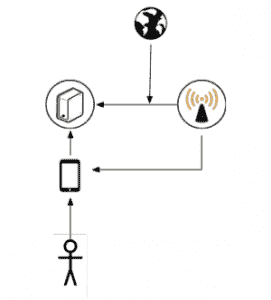
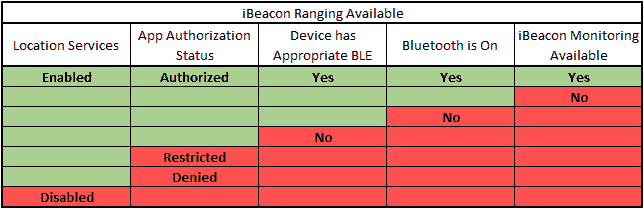
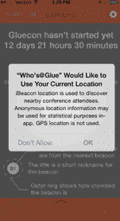
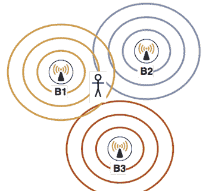
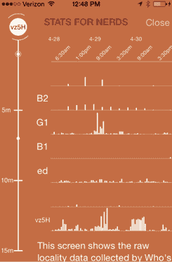

# 构建 iBeacon 应用程序

> 原文：<https://thenewstack.io/building-an-ibeacon-app/>

编者按:关于 iBeacon 的详细叙述和关于该技术的良好入门。啊

因此，你决定通过在你的应用程序中添加 [iBeacons](https://en.wikipedia.org/wiki/IBeacon) 来投入到超本地化的行列中。你需要知道的是:

*   并非所有的信标都是 iBeacons。iBeacons 更好。信标广播(通常是蓝牙)唯一的标识符号码。Apple 通过识别 iBeacons 并了解它们的范围来提供对 iBeacons 的支持。如果应用程序没有运行，苹果将继续监控信标。
*   让你的功能足够吸引人，让用户打开他们的蓝牙和定位。你只有一次请求许可的机会，明智地选择吧。
*   iBeacon 监听实际上非常省电，但科技媒体一直在告诉人们并非如此。确保你的应用程序清楚地显示了电池效率，并鼓励他们打开蓝牙。
*   保护用户的个人信息。即使是纬度和经度，信标区域也算作位置。
*   蓝牙信标是无线电。收音机很乱。测试和校准信号，以确保最佳的信号可靠性。信号条件会随着时间、部署位置和制造商的不同而变化。

这些只是实现应用程序导航的一些挑战，但我们会在这里指导您完成这些挑战。在 [Kinvey](http://www.kinvey.com "Kinvey") ，我们最近为 [Gluecon](http://gluecon.com) 开发了一个应用程序，这是一个面向云、移动和大数据开发者的会议，旨在促进与会者之间基于共同兴趣和接近度(通过信标确定)的会面。尽管我是一名经验丰富的 iOS 开发人员，但由于 beacons 的一些独特特征，我遇到了一些以前没有遇到的挑战。以下是我们如何遇到和解决这些挑战的更详细的描述。我们希望你能够从我们的经验中学习，开发出优秀的基于 iBeacon 的应用。

## 挑战 1:选择功能

信标技术允许您的应用程序估计其与广播信标的物理距离。如果信标本身在一个已知的位置，那么你就可以知道用户在测量半径内的位置。也可以将信标系在另一个设备或可移动的固定装置上，例如气球、火车车厢、体育场座位部分等。如果应用程序已经知道了用户的身份，现在你就有了用户和信标之间的映射。有了后端来协调这种映射，您可以链接关于信标、其真实环境和用户的信息，从而允许您聚合一个非常具体的用户环境:一个非常精确的位置、时间和应用程序环境。例如，您会发现用户访问了哪些信标、访问了多长时间以及访问顺序。您还可以基于时间(例如，限时优惠券)、用户偏好(博物馆中的现代主义与印象派绘画)或基于当前条件(向用户展示不太拥挤的结账队伍，通知附近的朋友)向用户推送关于信标的信息。  *图 1。服务器可以充当信标、关于信标的知识(例如它的位置)和用户之间的中介*

鉴于所有这些背景，你必须选择改善应用程序用户体验的功能，同时仍然是现实的，保护用户信任，如果可能的话，在没有信标的情况下仍然可以工作。通过我们的 Gluecon 应用程序，我们获得了想要的功能列表:

*   将具有相似兴趣的用户联系起来，让他们见面、交流并相互学习
*   当用户走向展台时，提供关于供应商的信息
*   通过与展台相关的信息与用户和供应商互动

从这个列表中，我们不得不缩小基于展位的使用案例，因为我们无法获得足够的信标设备来为每个展位配备一个。在选择功能时，重要的是要记住，当应用程序在后台时，即使它被关闭，设备仍会监控信标的存在(这被称为区域监控)。只有 iBeacons 可以用这种方式监控；如果您使用另一种类型的蓝牙信标，应用程序需要激活以搜索它们。此外，开源社区仍在支持 Android 和其他移动平台，因此很难规划任何特定的跨平台功能集。

## 挑战 2:许可矩阵

使用 iBeacons 的另一个挑战是，用户需要授予位置权限才能使用这个特性。除了需要许可，应用程序还必须知道只有某些设备支持信标，并且设备的蓝牙必须打开。这意味着在信标可以成功使用之前，应用程序需要检查几个状态。

*图二。iBeacon 权限矩阵*

*   “定位服务”是“隐私”设置中的整体复选框。
*   “应用授权状态”是用户在位置权限弹出窗口中按下允许/拒绝的结果。首次请求位置时，会自动显示此信息。
*   测距取决于具有蓝牙低功耗(BLE)功能的设备以及在设置中启用的功能
*   信标区域监控依赖于打开 BLE、蓝牙和启用后台功能。

假设设备是支持 iBeacon 的 iPad(第三代)、iPad(第四代)、iPad Air、iPad mini、带 retina 的 iPad mini、iPhone 4s、5、5c、5s——第一个挑战是说服用户启用蓝牙和定位服务，特别是让你的应用程序获得访问设备位置的权限。即使设备不使用 GPS 或基于 WiFi 的定位，这也是正确的(因为信标可以与现实世界的位置联系在一起)。为了提供最好的体验，你应该等到最后一刻去请求许可，而不是在用户试用你的应用之前就让他们去做。例如，我们的应用程序直到登录和设置完成后才请求位置，这时主屏幕会显示信标信息。我们可以做的一件事是在会议即将开始时(而不是在应用程序首次启动时)才开始检测信标，因为应用程序只在实际会议期间有用。有好的解释文本也很重要。这可以在 Xcode 目标编辑器的应用程序信息中设置为隐私字符串。这些文本帮助用户相信应用程序出于良好的目的需要它，并且您没有滥用这些信息。这段文字应该描述他们将从信息中得到什么，以及你将如何使用它。  *图三。位置许可对话框中的说明文字*

对于我们的应用程序，我们从 Cluster 获得了一个提示，并预先征求用户的许可。如果用户拒绝，我们会在应用程序的用户首选项中保存响应和时间，并在稍后的时间间隔再试一次，等待大约六个小时，看看使用该应用程序是否改变了他们的想法。请记住，一旦用户从系统对话框中按下“不允许”，就没有办法重新询问。用户必须删除并重新安装应用程序，或者在设置应用程序中重置权限。另一个需要解决的问题是，用户一直认为蓝牙和定位服务会耗尽电池。事实上，信标监控非常节能……明显比使用 GPS 更节能(这就是为什么它被称为低能耗)。iOS 将通过聚合扫描来管理其监控，并根据上下文和剩余电池动态更改其轮询间隔。我们都需要教育用户保持这些设置。在 Kinvey，我们已经将检查和管理所有这些权限的代码提取到一个通用的 iOS 库中:[https://github.com/KinveyLabs/KCSIBeacon](https://github.com/KinveyLabs/KCSIBeacon)最后，即使信标信息不可用，也要确保你的应用程序保持可用。根据应用程序的不同，这里有一些策略:

*   退回到使用 GPS 的粗略定位(如果信标具有已知的位置)
*   如果应用程序在用户接近一个信标(如博物馆展览、销售点系统或会议室)时自动采取行动，您可以让用户从列表中手动选择他们的位置。
*   如果一个应用程序是基于共享位置的，允许用户控制信息共享的时间。例如，我们的会议应用程序有一个定时的“匿名”模式，用户可以选择暂时停止共享位置。这样，他们就不必离开应用程序来禁用权限，也许永远不会恢复共享。

## 挑战#3:硬件

许多应用程序被开发成封闭且行为良好的系统；按钮是否被按下、在数据库中是否找到项目等等。但是当使用信标时，你必须意识到你是在和外部无线电打交道。幸运的是，iOS SDK 处理所有复杂的信号检测、解码、纠错等工作，并且只在 CLLocationManager 回调中提供信标标识符。这个过程中隐含的是，设备基于测量的和广播的功率之间的差异以及信号随时间的变化，对其感知的信标距离做出最佳猜测。测量值受无线电波在房间内反射的影响，更重要的是，受被称为“用户”的大水袋的影响很大。蓝牙 LE 频谱也和 WiFi 等无线设备在同一个频谱带，会对信号产生干扰。最不幸的是，信号质量取决于广播设备(我们发现不同制造商的质量差异很大)。信标信号受温度、设备功率、描述的功率和实际功率之间的差异以及轮询间隔的影响，这些因素可能因广播而异。所有这些归结起来就是信号精度是高度可变的。这就是为什么 SDK 用总的类别来描述距离:即时、近、远(和未知)。精度和功率测量值将与该值一起提供给应用程序，以便它在确定何时根据该信息采取行动时做出最佳选择。幸运的是，当使用信标区域来监控入口事件时，这相当容易——一旦设备检测到信标，就认为它在该区域内(有些信标可以广播几十甚至几百米)。退出一个地区有点复杂，因为设备不能只依赖于丢失的接收信号，因为在良好的条件下广播可能会丢失。因此，在设备离开广播区域后，可能需要几分钟才能被认为是在该区域之外。对于我们的用例来说，仅仅知道应用程序在哪个区域是不够的，因为这些区域是重叠的(广播区域中有多个信标)。我们想知道多个信标中哪一个是“最近的”。“最近的”用引号括起来，因为这是基于 SDK 提供的位置信息的最佳猜测。这包括比较一段时间内的所有信标距离测量值，以找到具有最佳精度和最近测量距离的一个。

### 挑战#4:三角测量和跟踪

一旦应用程序计算出最近的信标，我们就可以将信标与用户相关联，并说“这个用户在这个信标处。”例如，在下面的场景中，即使用户在三个信标(B1、B2 和 B3)的区域内，我们也希望应用程序认为他在 B1，这是他在现实世界中最接近的一个。  *图 4。用户在三个信标的范围内；我们想根据最强的信号确定哪一个是最近的*

一旦确定了最近的信标，应用程序就可以呈现其重要的上下文信息。在我们的应用程序中，它是其他用户的列表。为此，我们必须依靠后端来协调用户到特定信标的链接，然后向彼此显示这些用户。这种双向通信是信标的一个问题。信标是单向设备，因此它们不知道接收其广播的设备。有两种方法可以解决这个问题。信标设备本身可以打开第二信道来与电话通信，然后使用持续的网络连接将该数据传输回服务器。然而，这一功能并不是 iBeacon 规范的一部分，只有少数制造商生产具备这一功能的设备。这些额外的通信通道也消耗了大量电池，限制了它们在现场的时间，或者它们可以被放置在哪里(如果需要网络和插头的话)。更简单的方法是通过让应用程序完成工作来伪装它。据推测，该应用程序已经连接到您的后端，以获取有关信标的信息，因此该应用程序可以只更新一条记录，并说“我在这里”。现在你知道用户在哪里，什么时候。这些信息可用于个性化应用或现实世界的体验，优化房间布局，或实时调整资源。对于我们的应用程序，我们聚合数据来计算 30 分钟内某个信标的独特访问次数，并通过条形图在应用程序中共享这些数据。  *图 5。条形图显示了一段时间内附近用户的聚集情况。字母/数字标题是信标的内部名称(UUIDs 很难记住)*

## 挑战#5:服务器部分

我们使用 Kinvey(显然)作为粘合剂，将信标链接到它们的真实位置，将用户链接到信标，将用户链接到用户。我们的应用程序有一个数据集合，列出了每个信标及其短名称、UUID、主要和次要编号，以及一些元数据，如它在平面图上的位置。这些是应用程序启动时拉的。当应用程序遇到信标时，它从这个表中查找信标的文档，并向用户显示适当的上下文。此外，我们还用“最后一个信标列”中的信标标识符和时间戳更新用户对象然后，我们有一个业务逻辑脚本，应用程序可以查询该脚本，以获得信标处所有用户的列表。这个脚本过滤隐私数据，并试图解释“在灯塔”的意思。在现实世界中，确定信标的存在是很棘手的，因为更新事件可能无法到达服务器，而且信标测距可能会被 iOS 设备丢弃。我们的业务逻辑使用基于时间的启发式方法来猜测用户是否还在那里。也就是说，如果用户在短(5 分钟)窗口内在指定的信标处被最后记录，并且没有移动到不同的信标，则该用户在该信标处被计为活跃的。该应用程序显示附近用户的列表。该列表允许用户查看附近的用户以及他们的兴趣。如果有匹配的，他们可以互相发消息见面讨论很酷的技术。这种消息传递是通过另一个数据收集完成的，Kinvey 代理每个客户端的更新，并向设备发送推送通知。除了实时数据之外，单独的访问者还被分入一组单独的业务逻辑脚本，以便为条形图视图提供数据。这使我们能够观察趋势、进行统计分析并得出结论。在我们最初的设计中，我们希望能够确定会议上“最受欢迎”的展位。但有了缩小版的应用程序，我们将能够在分组讨论室中观察最受欢迎的演示。

## 挑战 6:通过应用商店

对我们来说，最后一个挑战是浏览应用商店的审核流程。我们不得不多次重新提交描述和元数据。以下是我们了解到的情况:

*   无论是在公开描述中，还是在评论笔记中，都要解释清楚这个应用程序在做什么，这一点很重要。
*   我们被要求在应用程序中演示信标的使用视频，因为他们无法设置我们的模拟会议大厅。我们使用 Reflector 应用程序来捕捉屏幕视频，并使用 Camtasia studio 来注释视频。我们在复习笔记中加入了该视频的链接。
*   我们在评论笔记中提供了一个演示帐户和一些 beacon UUIDs 来帮助评论者。
*   由于该应用程序使用后台位置监控，我们不得不在描述中包含电池使用免责声明。“继续使用后台运行的 GPS 会大大缩短电池寿命。

### 包扎

在应用程序中使用信标需要管理用户期望和权限，针对不可预测的硬件条件进行防御性编码，并提供一种方法将信标标识符与应用程序中有用的东西联系起来。使用 iBeacons 引入了一堆杂乱的活动部件，遵循最佳实践很重要。我们希望你能从我们的旅程中学到东西。你可以在 https://github.com/KinveyApps/Who-s-At-Glue,[和 https://github.com/KinveyLabs/KCSIBeacon](https://github.com/KinveyApps)的[查看我们应用的源代码和我们的 iBeacon 管理库。编码快乐！](https://github.com/KinveyLabs/KCSIBeacon)

<svg xmlns:xlink="http://www.w3.org/1999/xlink" viewBox="0 0 68 31" version="1.1"><title>Group</title> <desc>Created with Sketch.</desc></svg>