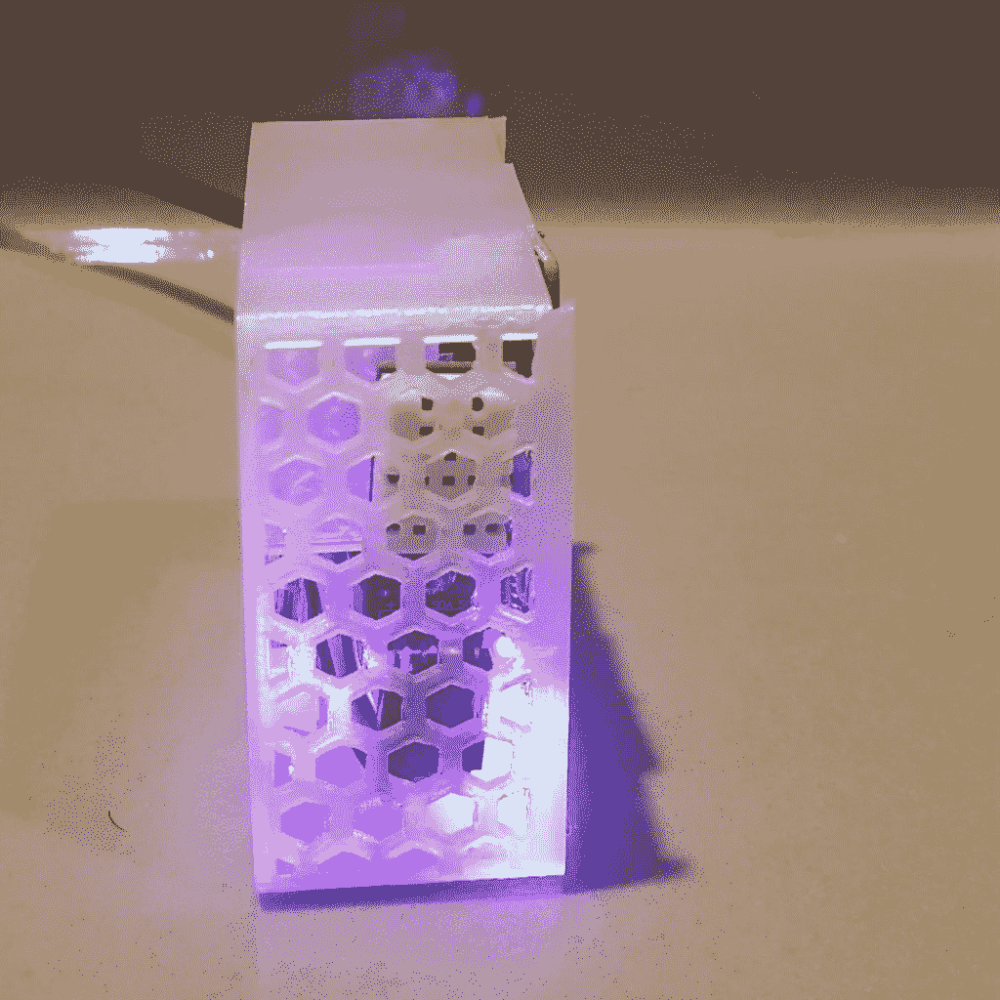
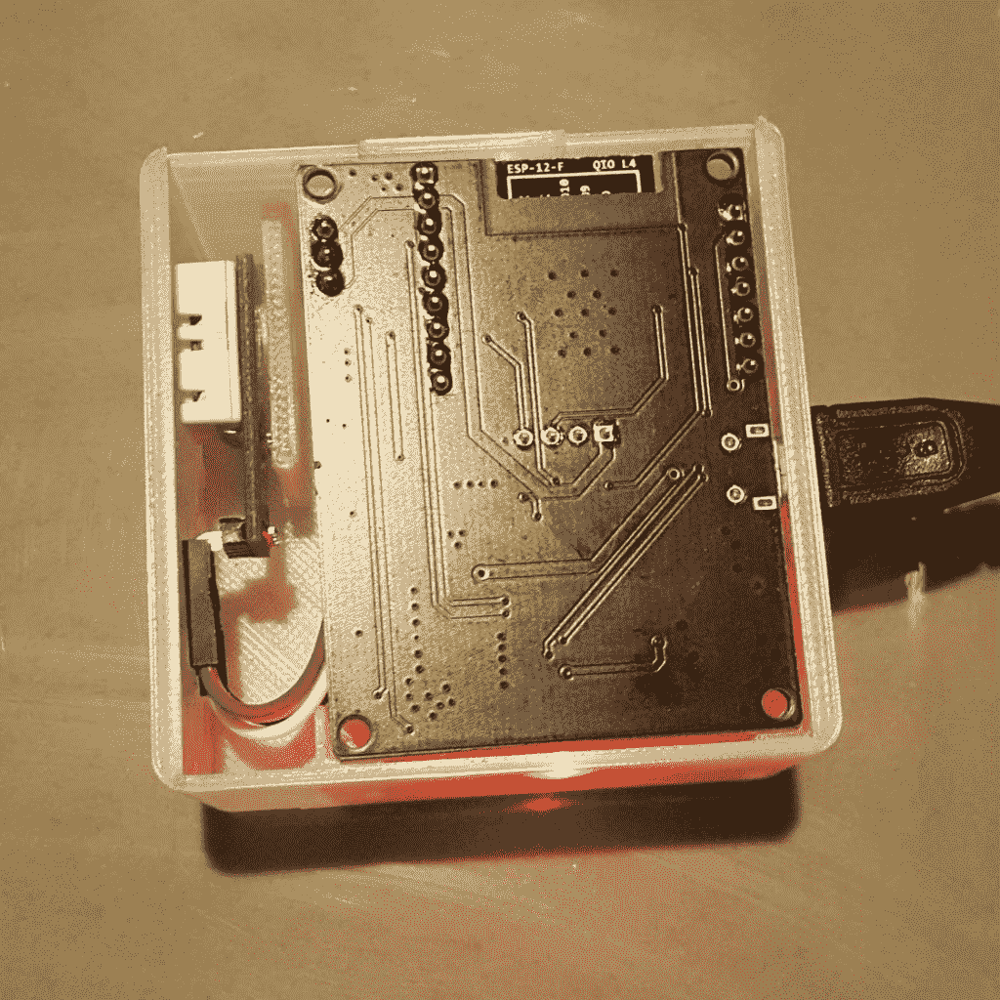
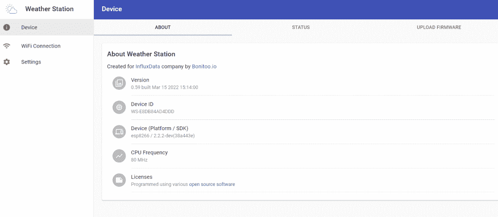
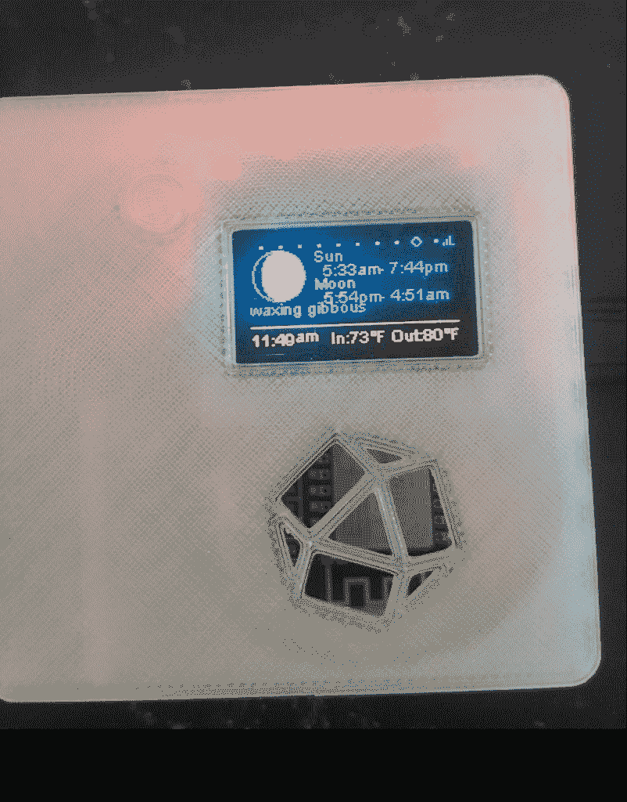
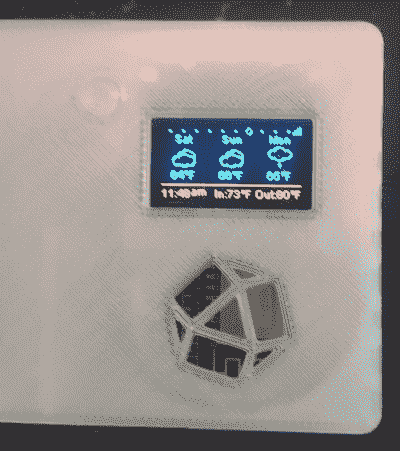
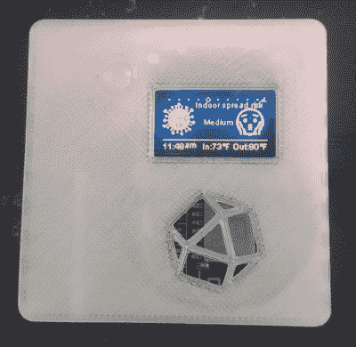
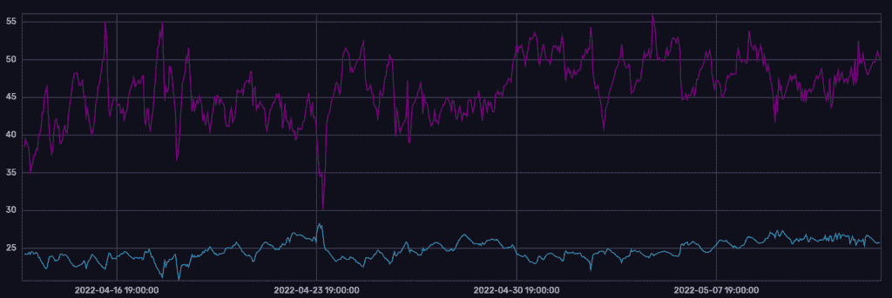
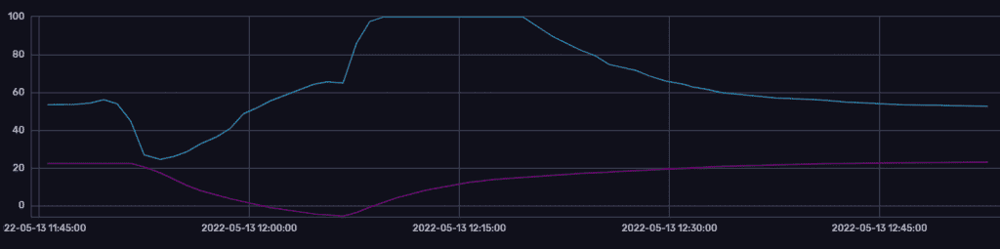

# 使用 MicroPython 或 Arduino 构建物联网气象站

> 原文：<https://thenewstack.io/building-an-iot-weather-station-with-micropython-or-arduino/>

开始[物联网开发](https://thenewstack.io/azure-iot-edge-a-technology-primer/)可能会令人生畏，即使是简单的业余项目。当涉及到硬件和软件以及集成它们以实现项目目标的方法时，有许多选择。

 [查尔斯·马勒

查尔斯是 InfluxData 的技术营销作家。Charles 的背景包括从事数字营销和全栈软件开发。](https://www.influxdata.com/) 

为了帮助您开始，本文将介绍我们在 InfluxData 创建物联网气象站时所做的一些决定，该气象站将作为潜在客户的原型和开发人员的奖品，以及那些建立自己的[物联网设置](https://thenewstack.io/category/edge-iot/)的参考架构。

气象站将传感器数据备份到 InfluxDB 的一个实例中，并可以从中提取历史数据以显示在其有机发光二极管显示器上。从外部 API 提取的数据可以通过单击外部按钮在不同的仪表板之间切换来显示。它是[开源的](https://github.com/bonitoo-io/weather-station)，使用 Arduino 和 MicroPython 实现。

## **influx data 气象站的目的**

时间序列数据库解决的一些问题以及它们为什么有用可能是抽象的，即使向有技术背景的人解释它们。因此，我们希望想出一些东西，让事情在概念上更具体一些，同时也让它更容易启动和运行。

以下是我们在设计气象站时考虑的一些要求:

*   造价低廉，我们可以将它们送给潜在客户进行测试或作为活动礼品。
*   易于设置和开始生成[时序数据](https://www.influxdata.com/what-is-time-series-data/?utm_source=vendor&utm_medium=referral&utm_campaign=2022-05_spnsr-ctn_iot-weather-station_tns)。
*   对于希望将 InfluxDB 与他们的物联网应用程序集成的开发人员来说，源代码是非常有用的参考资料。
*   与通常的笔记本电脑仪表盘演示相比，在活动中脱颖而出。

根据这些要求，结果如下:

基于开发人员的积极响应，我们继续开发并添加了更多我们认为对用户学习有帮助的功能。新版本的气象站还具有改进的案例和仪表板，以显示更多信息。

## **硬件故障**

气象站有三个主要部件:微控制器、显示器和传感器。对于微控制器，由于内置 Wi-Fi 支持，我们选择了 ESP8266，它允许用户通过 Wi-Fi 接入点连接到设备，并通过 web 界面进行配置，从而简化了设置过程。ESP8266 还提供了许多 SDK，这使得开发过程更加容易。

第二个组件是有机发光二极管显示器，用于显示来自传感器和外部数据源的不同数据的动态仪表板。为此，我们选择了 SSD1306。对于传感器，我们使用了 DHT11 传感器，它能够收集温度和湿度数据。

容纳组件的外壳是 3D 打印的。该设计在 [GitHub repo](https://github.com/bonitoo-io/weather-station/tree/main/case) 中也有提供。对于最新版本的气象站，侧面有通风口，这减少了打印时使用的材料量，也使温度传感器更加准确。我们现在使用生物可降解材料进行打印，而不是第一次迭代中使用的标准塑料。我们还改进了外壳内固定组件的紧固件，使设备在移动时更加稳定。

改进外壳设计，改善气流，减少材料使用。

拆除侧面板后的气象站内部组件。

## **软件故障**

对于软件来说，全功能的实现是用 [Arduino](https://thenewstack.io/influxdb-and-iot-arduino-microcontroller-best-practices/) 编写的，它本质上是 C/C++的扩展，具有一些使硬件工作更容易的功能。还有一个不太复杂的 [MicroPython](https://micropython.org/) 实现。两者的[源代码](https://github.com/bonitoo-io/weather-station)都可以在 GitHub 上获得，如果您有兼容的硬件，还可以获得安装说明。

气象站利用许多其他开源库来增加功能。为了更容易上手，我们使用了 [ESP 异步 web 服务器](https://github.com/me-no-dev/ESPAsyncWebServer)来提供一个 Web 界面，这样用户就不必使用命令行来与设备进行交互。

用于配置气象站的 Web 用户界面

如果你有兴趣，你可以找到在 [GitHub repo](https://github.com/bonitoo-io/weather-station/tree/main/arduino/WeatherStation) 中使用的其他库的列表。

### 气象站仪表板

气象站通过其有机发光二极管显示器提供以下仪表板:

*   显示传感器收集的最近 90 分钟数据的折线图
*   三天天气预报
*   基于地理定位的当地天气数据
*   日落和日出仪表板
*   COVID 传播风险仪表板基于湿度和温度生成，基于此[调查研究](https://www.ncbi.nlm.nih.gov/pmc/articles/PMC7229913/)

不使用直接传感器数据的仪表板从开放的天气图 API 获取信息。以下是一些运行中的仪表盘图片:

日出和日落仪表板

三天预测仪表板

### InfluxDB 集成

默认情况下，气象站将在其图表上保存并显示最近 90 分钟的数据。如果您想要一种更持久的方式来存储历史数据，您将需要集成某种存储。

因为它是为 InfluxDB 设计的演示应用程序，这是目前唯一通过 [InfluxDB Arduino 客户端库](https://github.com/tobiasschuerg/InfluxDB-Client-for-Arduino)内置的集成。使用 web 接口，您可以为任何可通过网络访问的 [InfluxDB 实例](https://www.influxdata.com/products/influxdb-cloud/?utm_source=vendor&utm_medium=referral&utm_campaign=2022-05_spnsr-ctn_iot-weather-station_tns)提供 URL 和 API 键。任何其他支持 Arduino 的数据存储也可以通过派生和扩展项目来添加。

以下是使用 InfluxDB 内置可视化工具显示历史数据的几个示例:

我家气象站最近 30 天的湿度和温度数据——湿度为紫色，温度为蓝色

气象站被放入冰箱，然后在一个小时内移走后的湿度和温度数据-湿度为蓝色，温度为紫色。

## 你能用气象站做什么？

就处理能力而言，气象站无论如何都不是一个主力，但它确实能够将数据输入 InfluxDB。一旦发生这种情况，你可以做很多事情。让我们来看看几个潜在的想法。

### 创建自动化和警报

一旦您的数据在 InfluxDB 中，您就可以轻松地创建[警报](https://docs.influxdata.com/influxdb/cloud/monitor-alert/?utm_source=vendor&utm_medium=referral&utm_campaign=2022-05_spnsr-ctn_iot-weather-station_tns)和自动化来处理您的数据。例如，您可以安排一个查询以定义的时间间隔运行，以检查湿度和温度值。如果它们高于或低于某个阈值，您可以创建一个[任务](https://docs.influxdata.com/influxdb/cloud/process-data/get-started/?utm_source=vendor&utm_medium=referral&utm_campaign=2022-05_spnsr-ctn_iot-weather-station_tns)来相应地采取行动。

InfluxDB 提供了许多与 Slack 或 Twilio(总共超过 20 个)的集成来生成警报。你也可以使用像 [Node-RED](https://www.influxdata.com/blog/iot-easy-node-red-influxdb/?utm_source=vendor&utm_medium=referral&utm_campaign=2022-05_spnsr-ctn_iot-weather-station_tns) 这样的物联网平台，它提供与许多不同设备和服务的集成，并允许你使用 JavaScript 创建定制功能。一个例子是使用 InfluxDB 将数据发送到 Node-RED 端点，然后将 Node-RED 连接到您的智能恒温器，以自动调节您房间的温度。

### 时间序列预测和分析

创建基本的警报和任务肯定是有用的，但是当你能够开始对你的数据进行更详细的[分析](https://www.influxdata.com/time-series-analysis-methods/?utm_source=vendor&utm_medium=referral&utm_campaign=2022-05_spnsr-ctn_iot-weather-station_tns)和[预测](https://www.influxdata.com/time-series-forecasting-methods/?utm_source=vendor&utm_medium=referral&utm_campaign=2022-05_spnsr-ctn_iot-weather-station_tns)时，时间序列的真正价值就被释放出来了。这可以使用 Flux 提供的许多[内置方法来完成，或者使用 InfluxDB 的](https://docs.influxdata.com/flux/v0.x/stdlib/?utm_source=vendor&utm_medium=referral&utm_campaign=2022-05_spnsr-ctn_iot-weather-station_tns)[客户端库](https://docs.influxdata.com/influxdb/cloud/api-guide/client-libraries/?utm_source=vendor&utm_medium=referral&utm_campaign=2022-05_spnsr-ctn_iot-weather-station_tns)在您选择的编程语言中完成。对于这种类型的工作，Python 是一个非常常见的选择，它使用像 [Pandas](https://www.influxdata.com/blog/getting-started-with-influxdb-and-pandas/) 这样的库来操作数据[并使数据](https://www.influxdata.com/how-to-visualize-time-series-data/)可视化。

## 结论

希望这篇文章为您的物联网项目提供了一些潜在的想法，以及您如何从使用 InfluxDB 这样的时间序列数据库中受益。如果你想了解比气象站更具处理能力和多功能性的物联网设置，你也应该查看我们用于生成演示数据和运行基本基准的 [Raspberry Pi 集群](https://thenewstack.io/creating-a-demo-environment-with-a-raspberry-pi-cluster/)的分类。

<svg xmlns:xlink="http://www.w3.org/1999/xlink" viewBox="0 0 68 31" version="1.1"><title>Group</title> <desc>Created with Sketch.</desc></svg>