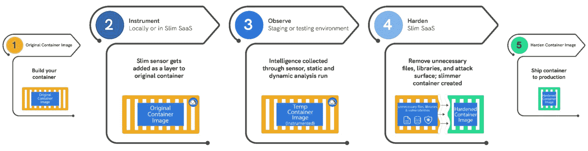

# 使用 Slim.ai 构建和保护容器

> 原文：<https://thenewstack.io/building-and-securing-containers-with-slim-ai/>

构建和保护容器的方法有很多，但 Slim.ai 有自己独特的方法。 [Slim.ai 首席执行官 John Amaral 将该公司的方法](https://www.slim.ai/blog/the-4-s-s-of-software-supply-chain-security/)描述为“[瘦身](https://www.slim.ai/docs/slimming.html)”通过删除不必要的代码，这可以最大限度地减少生产代码的占用。它还从本质上降低了软件供应链的复杂性、软件攻击面和总体风险。

你一直都可以用手来做。但如果你曾经尝试过，你就会知道这是一个乏味、痛苦的过程。Slim.ai 通过其[容器优化软件即服务(SaaS)工作流](https://www.slim.ai/docs/container-optimization/)，轻松快速地创建一个生产就绪的容器。它允许用户在一个易于使用和一致的网络环境中精简容器。用这种方法减肥只需要几分钟。更好的是，一旦完成，它就创建了一个可重复的、可跟踪的过程，可以在每次进行代码更改时使用。

如果这听起来很熟悉，那应该是。它本质上就像一个托管的 DockerSlim，现在是该公司的旗舰开源项目。有了它，您可以通过一个方便的 UI 而不是一系列 CLI 标志来最小化您的容器，并且它运行在 Slim.ai 的构建服务器上，集成到几个容器注册中心和 CI 平台中。

无论如何，这个流行的开发者程序通过分析你的代码和丢弃不必要的代码来优化和保护你的容器，从而“瘦身”你的容器的攻击面。它还可以将容器的尺寸缩小 30 倍。

大多数容器 Linux 发行版，如[微软的公共基础 Linux (CBL)-Mariner](https://github.com/microsoft/CBL-Mariner) 、 [Flatcar 容器 Linux](https://flatcar-linux.org/) 、[Red Hat Enterprise Linux CoreOS(RHCOS)](https://docs.openshift.com/container-platform/4.8/architecture/architecture-rhcos.html)和 [RancherOS](https://rancher.com/docs/os/v1.x/en/) ，尺寸都很小，但它们并不专注于使您能够修整攻击面。

其他的，比如 [Alpine Linux](https://www.alpinelinux.org/) 和 [Chainguard Wolfi](https://www.chainguard.dev/unchained/introducing-wolfi-the-first-linux-un-distro) ，通过将基础镜像削减到最低限度来最小化攻击面。Wolfi 还包括软件物料清单(SBOMs)和签名。

Slim.ai 采取了不同的方法。您开始使用您选择的 Linux 发行版、软件链、库和语言来构建您的容器。然后，它通过分析您的应用程序并丢弃所有不需要的东西来优化和保护您的容器。结果呢？您可以使用熟悉的工具快速构建容器，但最终仍然会发送带有微小攻击面的图像。

哪种方法最好？这些都是新的方法。愿最适合你的方法为你的工作赢得胜利。

正如 Amaral 所说，“目前，成千上万的开发人员和团队使用 Slim 的开源和免费 SaaS 软件来了解他们的容器中有什么，减少容器的攻击面，消除漏洞，只运送他们需要的代码。"

但是开源项目没有规模。因此，通过 beta Slim.ai 服务，Amaral 继续说道，“我们正在从帮助个人开发人员和小型团队转向一种解决方案，使组织能够持续、自动地实现这些大规模成果。”

## Slim.ai 基础

这是通过将 Slim.ai 服务与您的容器注册表、[持续集成/持续部署(CI/CD)](https://practical-tech.com/2018/07/10/continuous-integration-and-delivery-tool-basics/) 管道和工具集成来实现的，因此您可以将其自动化并集成到现有工作流中，以快速将安全软件交付到生产中。

当前和计划中的集成包括 Docker、AWS 弹性集装箱注册中心(ECR)、谷歌集装箱注册中心(GCR)、GitHub、DigitalOcean 和 Quay 注册中心，以及 Jenkins、GitLab 和 GitHub CI/CD 平台。您可以在您的容器上使用您选择的多种开源漏洞扫描器，以便在它们攻击您之前发现安全问题。

Slim.ai 可以支持多种语言和 Linux 发行版。其中包括 Node.js、Python、Ruby、Java、Go、Rust、Elixir、运行在 Ubuntu 上的 PHP、Debian、CentOS、Alpine 甚至[发行版](https://github.com/GoogleContainerTools/distroless)。

除了通过精简不需要的和潜在易受攻击的代码来保护应用程序之外，您还节省了容器空间。例如，在 Debian 11 Bullseye 上运行的 Node.js 应用程序映像从默认的 371 兆字节映像缩小到只有 42MB，而在 CentOS 7 上运行的 Python 映像从 647 兆字节减少到 23MB。虽然存储空间的成本几乎为零，但花费在处理和网络上的资源却越少。此外，开发人员的时间总是花费大量金钱。大型集装箱需要更长的时间来推、拉、扫描、验证和检查。当您的程序员同时处理几十个容器时，这些低效会迅速增加。

## Slim.ai 在行动

过程看起来是这样的。首先，您创建您的容器，并将它们放入 Slim 平台，以利用 Slim 的开发工具。在这里，为原始映像生成并存储漏洞报告。

接下来，Slim 的优化引擎会自动将容器减少到只需要的数量。您可以使用自己的细粒度配置或使用 Slim 的建议。

这个瘦身过程不仅去除了你不使用的部分，还去除了你不知道的漏洞。容器瘦身的最终目标是创建最小可行足迹(理解为:攻击面)来完成工作。换句话说:风险更小，软件更好。

著名的 Kubernetes 专家 Kelsey Hightower 开玩笑地写道，发布代码最安全的方式是“什么都不写；无处部署。”而瘦身并没有走那么远——很明显！—正如 Amaral 所写的，“瘦身是唯一符合凯尔西半开玩笑地告诫最安全的软件是你永远不会发货的软件的技术。”

一旦完成，您就可以运行优化后分析。这详细说明了哪些文件、软件包和漏洞已被删除，哪些仍保留在最终的精简映像中。

这种方法还有其他优点。你不需要你的程序员是容器专家。Slim.ai 平台提供了开发者容器的前后视图，因此他们可以看到哪些被删除了。这是一个强大的优化和调试工具。

您的开发人员也不需要成为安全专家。当 Slim.ai“瘦身”容器时，它不仅仅是摆脱了 cruft。它还可以帮助您轻松锁定不需要的端口或那些总是令人担忧的具有特殊权限的文件。

Slim.ai 软件即服务(SaaS)还向您展示了您的容器中存在哪些端口、用户信息和环境变量。这些通常会导致漏洞，从而变成安全漏洞。你的团队只需要知道这些应该被锁定或最小化，而不是，例如，如何使用 [SELinux](https://www.redhat.com/en/topics/linux/what-is-selinux) 的细节来锁定你的整个容器。

Slim.ai 的另一个优势是，在我们新兴的多云世界中，工作负载被移动以进行优化，从而利用最佳的价格和部署速度。小的 Slim.ai 容器可以更容易地从一个云转移到另一个云。该服务还在一个地方提供了最流行的容器注册的元存储库。这为您的开发人员和客户经理提供了商业容器前景的单一视图。最终结果是您的开发人员通过使用他们现有的知识和工具节省了时间、金钱和精力。所以对于斯利姆。AI，大家都赢了。

<svg xmlns:xlink="http://www.w3.org/1999/xlink" viewBox="0 0 68 31" version="1.1"><title>Group</title> <desc>Created with Sketch.</desc></svg>