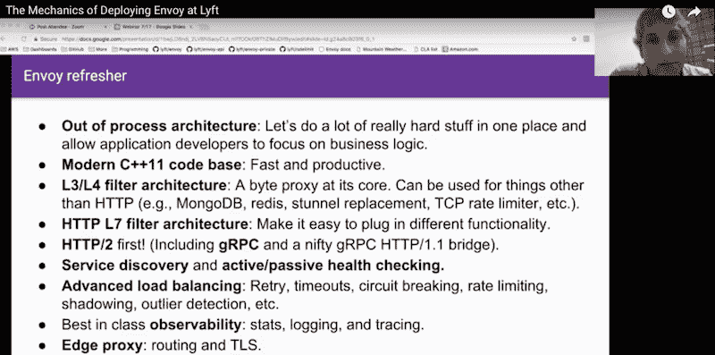
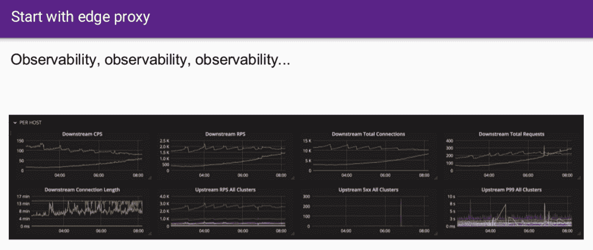
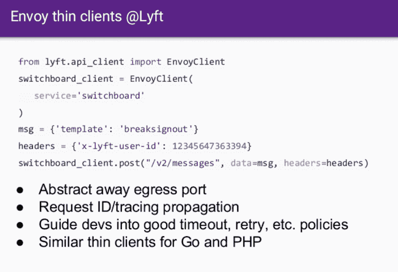

# Lyft 新应用服务 Mesh 的幕后，Envoy

> 原文：<https://thenewstack.io/building-lyfts-new-application-service-mesh-envoy/>

去年一月， [Lyft 的工程师分享了](https://thenewstack.io/lyfts-envoy-provides-move-monolith-soa/)汽车共享服务如何通过 Envoy(一种自主开发的独立代理服务器和通信总线)将其单片应用程序转移到[面向服务的架构](http://www.service-architecture.com/articles/web-services/service-oriented_architecture_soa_definition.html) (SOA)。特使是去年 9 月开源的。在最近的[微服务虚拟峰会](https://www.microservices.com/virtual-summit-2017/)，[Lyft](https://www.linkedin.com/in/mattklein123/)的软件工程师 Matt Klein 讲述了更多关于分享[他们如何部署特使](https://www.microservices.com/talks/mechanics-deploying-envoy-lyft-matt-klein/)的机制。

Klein 解释说，Envoy 是一个带有进程外代理的服务网格，它接受所有的应用程序流量。“它基本上使网络对应用程序透明，”他说。

最初，Lyft 有一个相当简单的面向服务的架构，尽管它是一个基于 MongoDB、PHP/Apache 应用程序和 Amazon Web Services 的弹性负载平衡器构建的整体架构。这是一个分布式系统，但是无法观察到这些组件是如何相互交流的。

他解释说，Envoy 从 edge 代理开始，因为大多数[微服务](/category/microservices/)系统在扩展时将需要某种类型的 L7 edge 代理。“你接收流量，然后你必须解析这些流量，并将其发送到各种后端系统，”他说。由于对现有 edge 代理的功能集不满，他们决定推出自己的功能集，主要是因为他们希望比商业 edge 代理提供更多的可观察性。

Lyft 的软件工程师 Matt Klein 简要介绍了 Envoy

“我们决定在每个单片服务器上运行 Envoy，就像 TCP 代理一样，”Klein 解释道。通过这样做，他们能够压缩进入每个本地代理的连接，并限制进入其 Mongo 数据库的连接数量，该数据库因不能很好地处理大型连接而臭名昭著。

Klein 警告说，部署如此庞大的架构是一项艰巨的工作，它不会在一夜之间发生。他们逐步推出 Envoy，让每一步都显示出它的价值。就调试生产事件而言，推出这一边缘层提供了巨大的好处。

特使仪表板

Klein 说，Envoy 仪表板不仅显示了大多数操作仪表板显示的基本边缘负载平衡器数据，还显示了更深层次的数据。“我们对每个上游集群或服务都有每秒请求数。我们在每个服务的基础上都有失败。”

这种可观察性让他们意识到他们可以做得更多。克莱恩说，他们分析了 L7 MongoDB 流量，这给了他们难以置信的统计数据。这导致将调用点放入实际的查询中，然后在特使层解析出来。

下一步是在 Envoy 中添加一个速率限制过滤器。所有这些都给他们带来了巨大的运营优势，因为他们能够看到和了解他们的堆栈中正在发生的事情。克莱恩说，他们能够防止一些非常糟糕的失败场景。

## 改变服务发现范式

在这一点上，他们几乎有一个网格，但仍然使用内部负载平衡器来实际进行服务发现。

Klein 说，经过大量评估，该团队意识到，从微服务的角度来看，服务发现最终是一致的。他说，一旦他们意识到主机不需要有一致的视图，他们只需要有覆盖面，工程师们发现建立一个“死简单的 API”会很容易。

> 大多数使用完全一致的系统的公司最终都会有各种各样的停机…

所以数据是完全一致的。可能需要 5 到 10 分钟，事情才会趋于一致，但一致性将会达到。克莱恩说，在两年半的时间里，他们没有发生一起基于该系统的事故。他说，大多数使用完全一致的系统的公司最终都会出现各种各样的停机。“所以这对我们来说非常好。”

## 让网格变得神奇

接下来:传播。Lyft 已经使用 IDs 来跟踪和记录交互，但是 Envoy 仍然需要传播报头。

他说，他们追求简单，要求任何包含 Envoy 客户端的元素都使用瘦库。这使他们能够在超时、重试和各种其他策略方面指导开发人员。

下一步是通过 Envoy 运行 100%的流量。大约一年后，Envoy 覆盖了大约 90%的流量，但要获得真正的好处，它必须无处不在。因此，他们开始了长达数月的烧毁过程，克莱恩称之为“一场苦战”

Lyft 工程师需要与其他团队合作，全面部署 Envoy。因为 Envoy 已经运行了一年多，开发人员已经看到了来自 Envoy 的统计数据，所以他们理解其价值，从而使买入变得容易。“一旦人们看到这种服务网络的魔力，它就像一种药物，”克莱恩说。“这是一个非常强大的范例。所以一旦人们看到它，他们不会真的想要没有它。”

## 下一步是什么:API 版本化

他说，一旦这个过程完成，真正的好处就开始产生了。现在，部署新功能变得轻而易举，统计数据也非常惊人。

Envoy 目前的 API 都是用 REST/JSON 写的。对于版本 2，他们将迁移到 gRPC，同时仍然支持 JSON。Klein 说，通过转向 gRPC APIs，他们将获得双向流。他们正在使他们的 API 更加健壮。

现在称为“端点发现服务”(EDS)，特使 API 将能够报告主机信息，如 CPU 负载，内存使用和其他主机数据。这将潜在地允许非常复杂的管理服务器实际上动态地使用负载信息来确定分配。

Klein 说，如果他今天从头开始，他就不会有基于 Jinja 的静态配置 JSON 系统。但这就是当时技术发展的情况。他对 **Istio** 的出现非常兴奋。它“提供了连接、管理和保护微服务的统一方式。根据 [Istio.io 网页](https://istio.io/about/)，Istio 支持管理微服务之间的流量。

“Istio 实际上是控制平面与数据平面的解耦,”Klein 解释道，他认为这非常令人兴奋。他说:“要让控制飞机变得坚固，有适当的安全性，并能来回滚动，还有很多工作要做。”“将控制平面层与数据平面层分离很重要。”因此，Istio 控制平面将基本上实现所有的 Envoy APIs。

克莱恩设想 Istio 作为一种工具，让特使接触到更广泛的人群。他对他们的现状和系统的改进感到非常兴奋。

他还对行业转向微服务充满热情。他说，他们将需要弄清楚如何管理 Envoy 的新功能。他认为一些微服务仍将是专有的。“随着您在堆栈中的位置越来越高，这些系统往往会变得越来越特定于领域。他说，它们往往内置于 Lyft 的基础设施中。正确的抽象越来越难实现。但是，他说，“我对此感到非常兴奋。"

如需详细的深入分析，[点击此处观看演讲](https://www.microservices.com/talks/mechanics-deploying-envoy-lyft-matt-klein/):

[https://www.youtube.com/embed/zMDrOHJmO9w?feature=oembed](https://www.youtube.com/embed/zMDrOHJmO9w?feature=oembed)

视频

由 [Raphael Schaller](https://unsplash.com/photos/D6uxeDSylxo?utm_source=unsplash&utm_medium=referral&utm_content=creditCopyText) 在 [Unsplash](https://unsplash.com/?utm_source=unsplash&utm_medium=referral&utm_content=creditCopyText) 上拍摄的特写图片。

<svg xmlns:xlink="http://www.w3.org/1999/xlink" viewBox="0 0 68 31" version="1.1"><title>Group</title> <desc>Created with Sketch.</desc></svg>