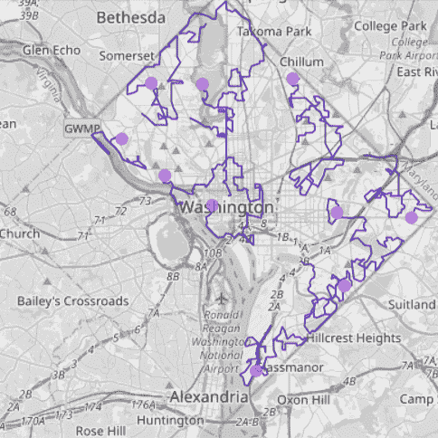
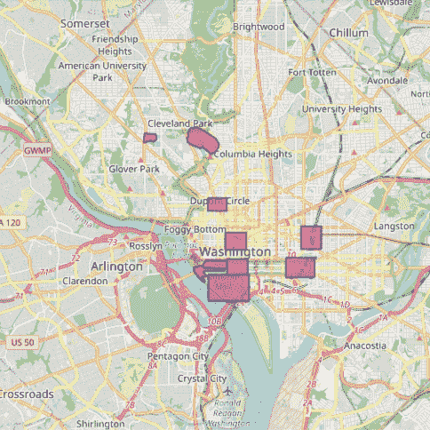
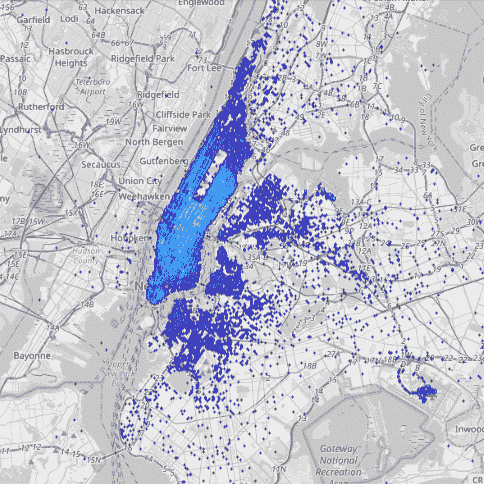
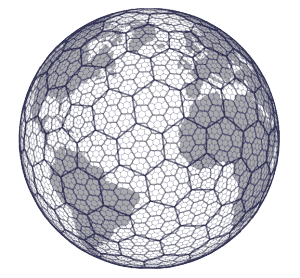
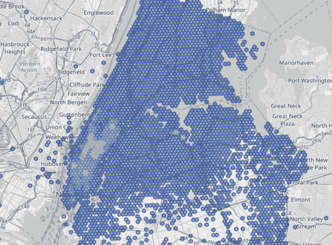

# 构建实时位置智能应用

> 原文：<https://thenewstack.io/building-real-time-location-intelligence-apps/>

实时位置智能是指实时收集、分析和处理基于位置的数据的能力。实时位置智能用于一系列应用，如车队管理、智能城市、探测空域威胁、智能农业、近距离营销、电信网络优化、供应链管理等。

在过去几年中，由于引入了旨在处理基于位置的数据的处理、分析和可视化的新专业技术，构建实时位置智能解决方案变得更加容易。

在本文中，我将演示如何建立一个基于 Apache Kafka 实时数据源的位置智能管道。该工作簿包含一个端到端的管道，通过 Kafka 连接到流数据源，执行空间计算以检测不同的事件和模式，然后将这些传输到外部应用程序。所有这些都是使用简单的 SQL 代码完成的，不需要任何复杂的数据工程。你可以通过这个[链接](https://github.com/kineticadb/examples/tree/master/spatial)访问我使用的工作簿，自己尝试一下。

## **设置**

我使用 Kinetica 的免费[开发者版](https://www.kinetica.com/developer-edition/)来运行本文中的查询。选择用于实时空间分析的数据库时，需要考虑一些事项。

1.  **与 Kafka 等流数据源的本地连接器**
2.  **功能覆盖:【PostGIS 的 ST_Geometry 库是地理空间功能的黄金标准。大多数空间数据库模拟这个库。**
3.  **空间连接:**基于空间关系组合多个表的能力。这对于任何类型的复杂空间数据分析都很重要。
4.  **性能:**实时应用要求对大量数据高速执行空间功能。
5.  **反应性:**系统需要自动检测并响应新数据，而无需我们进行任何精心设计。
6.  **集成功能:**位置智能工作负载通常具有特定的分析需求，例如使用图形网络进行路由和优化，以及可视化大量数据的能力。
7.  **输出数据流:**管道的最后一部分是将数据从分析数据库输出到外部系统的能力。

参见本文的最后一节，了解更多关于如何自己尝试这里的查询的信息。

## **数据**

我们将在本次演示中使用以下数据。

1.  记录华盛顿特区七辆卡车移动的 GPS 坐标流。数据通过 Kafka 主题流入。
2.  勾勒出华盛顿不同地标的一组多边形
3.  纽约市的一系列出租车行程(每秒几百次)

所有的数据馈送都是预先配置好的，因此您不需要做任何设置就可以自己在这里复制查询。下面的地图是数据的可视化表示。



图 A:华盛顿特区的卡车



图 B:华盛顿特区地标周围的围栏



图 C:纽约市出租车上客点

让我们深入了解一些支持位置智能的常见分析任务。

## **空间滤波**

空间过滤器用于根据特定的空间查询从表中识别满足某些条件的记录子集。

让我们从一个非常简单的查询开始。下面的查询确定了所有的“栅栏”，即面积大于 0.5 km ² (500，000 m ² )的地标周围的轮廓。

```
CREATE OR REPLACE TABLE fence_filter AS 
SELECT wkt
FROM dc_fences 
WHERE ST_AREA(wkt,  1)  >  500000

```

这是一个非常容易在任何支持空间操作的数据库中实现的查询，因为它是从一个小表中过滤的。现在，让我们探索几个更难实时实现的用例。

## **分流位置与围栏表的空间连接**

空间连接使用空间关系组合两个不同的表。它们用于回答诸如“哪些区域重叠”、“边界出现在哪里”以及“某个要素覆盖的区域是什么”等问题执行空间连接通常计算量很大，尤其是对较大的数据。

下面的查询基于以下条件在概述华盛顿地标的`recent_locations`表和`dc_fences`表之间执行内部连接:查找卡车进入华盛顿地标 200 米以内的所有记录

```
CREATE OR REPLACE MATERIALIZED VIEW vehicle_fence_join 
REFRESH ON CHANGE AS
SELECT 
    TRACKID,  
    x,
    y,
    DECIMAL(STXY_DISTANCE(x,  y,  wkt,  1))  AS distance,
    fence_label,
    wkt
FROM recent_locations
INNER JOIN dc_fences 
    ON 
    STXY_DWITHIN(x,  y,  wkt,  200,  1)  =  1;

```

***一切看起来都与 PostGIS 相似，但……***

该查询与您在 PostGIS 或任何其他使用 ST_Geometry 的空间数据库中看到的任何查询非常相似。然而，关键的区别在于使用了设置为在变化时刷新的物化视图。这意味着，随着带有卡车位置的新记录触及 Kafka 主题，查询将实时更新。

随着这一变化，数据库将不断监控和维护连接视图(`vehicle_fence_join`)，以反映最新版本的卡车位置。换句话说，如果有一个靠近地标的新卡车位置，它将自动反映在连接视图中。

## **用时间过滤器把它提升一个档次**

在前面的查询中，我们确定了所有符合空间条件的记录。现在，让我们添加基于时间的标准。

以下查询确定了过去 5 分钟内卡车位置位于华盛顿特区
地标周围的“围栏”内的所有实例

```
CREATE OR REPLACE MATERIALIZED VIEW fence_events 
REFRESH ON CHANGE AS 
SELECT 
    TRACKID,  
    wkt,  
    x,  
    y,  
    TIMESTAMP,  
    CONCAT(TRACKID,  CONCAT(' is at ',  fence_label))  AS event_text 
FROM recent_locations,  dc_fences
WHERE 
    STXY_CONTAINS(wkt,  x,  y)  =  1  AND 
    TIMEBOUNDARYDIFF('MINUTE',  TIMESTAMP,  NOW())  <  5

```

上面的查询执行了一个非常常见的位置情报任务:地理围栏。地理围栏是一种基于位置的服务，其中当对象进入或退出地理位置周围设置的虚拟边界时，软件应用程序使用 GPS、RFID、Wi-Fi 或蜂窝数据来触发预编程的操作。地理围栏可用于各种目的，例如当客户进入或离开某个区域时向他们发送通知，根据位置提供有针对性的广告，以及跟踪员工的时间和出勤情况。

现在，有一个特殊的场景，我们上面使用的查询会失败。考虑一个非常小的栅栏；一个物体可能进入这个栅栏，然后在它发出定位信号之前离开。或者换句话说，如果我们没有地理围栏事件的数据，我们将无法检测到它。

但是有一个解决方法。我们可以在两个连续点之间插入“轨迹”,然后推断轨迹是否与栅栏相交。接下来让我们来看看。

## **添加轨道插值，实现更精确的检测**

下面的动画展示了我们刚刚描述的场景。如果没有插值，看起来好像特定对象没有进入围栏。但是通过插值，我们可以正确地推断出轨迹确实与栅栏相交。

Kinetica 提供了一个本地轨迹对象，它在幕后完成所有的插值。轨迹需要以下信息:时间戳(这样我们就知道点的顺序)、对象的 X 和 Y(经度/纬度)坐标以及标识每个轨迹的 ID 变量。

我们可以使用这个函数和`ST_TRACKINTERSECTS`函数来推断地理围栏事件，如下所示。

```
CREATE OR REPLACE MATERIALIZED VIEW fence_trucks
REFRESH EVERY  5  SECONDS AS
SELECT *
FROM TABLE
(
    ST_TRACKINTERSECTS
    (
        TRACK_TABLE  =>  INPUT_TABLE(recent_locations),
        TRACK_ID_COLUMN  =>  'TRACKID',
        TRACK_X_COLUMN  =>  'x',
        TRACK_Y_COLUMN  =>  'y',
        TRACK_ORDER_COLUMN  =>  'TIMESTAMP',
        GEOFENCE_TABLE  =>  INPUT_TABLE(dc_fences),
        GEOFENCE_ID_COLUMN  =>  'fence_id',
        GEOFENCE_WKT_COLUMN  =>  'wkt'
    )
);

```

【Kinetica 还提供了其他几项跟踪功能，但您可以使用工作簿自行尝试。

## **宁滨和聚合**

我想介绍的最后一个空间操作是宁滨和聚合。在本节中，我们将使用来自纽约市的出租车旅行流。该数据包含有关纽约市每次出租车旅行的上下车地点、费用和距离的信息。我们对查找城市中出租车位置的热点感兴趣。

空间宁滨是数据分析中使用的一种技术，用于将地理参考数据分组到用户定义的条柱或区域中。该技术用于降低数据集的分辨率，从而更容易可视化和分析大型数据集。这可以通过将该区域分成相等大小的矩形网格、圆形、多边形或六边形来实现。然后，生成的条块用于统计分析，例如计算事件的频率或测量平均值。



图片 1

Kinetica 提供了多种方法为宁滨数据生成网格:`ST_HEXGRID`或使用 H3 地理哈希函数。我们用后者吧。

优步开发了 H3(六边形层次空间索引),用于有效优化乘车价格以及可视化和探索空间数据。系统中的每个网格都有相关的索引和分辨率。

我们可以使用`STXY_H3`函数为出租车数据流的每个出租车上下车位置确定相应的网格索引值——特定点属于哪个六边形。

请注意，实体化视图被设置为在更改时刷新，因此当新数据到达系统时(每秒几百次)，下面的视图将通过计算所有新记录的 H3 索引值来自动维护。

```
CREATE OR REPLACE MATERIALIZED VIEW nytaxi_h3_index
REFRESH ON CHANGE AS 
SELECT 
    pickup_latitude,
    pickup_longitude,
    STXY_H3(pickup_longitude,  pickup_latitude,  9)  AS h3_index_pickup,
    STXY_H3(dropoff_longitude,  dropoff_latitude,  9)  AS h3_index_dropff
FROM taxi_data_streaming;

```

一旦我们有了索引值，我们就可以使用这些值通过`ST_GEOMFROMH3`函数生成相应的库。然后，根据索引对数据进行分组，以计算每个箱中的拾取总数。这是另一个物化视图，它正在监听我们在上面的查询中设置的物化视图的变化。同样，聚合会自动更新，当新记录到达时，视图将始终反映最新的聚合，而无需我们做任何额外的工作。

```
CREATE OR REPLACE MATERIALIZED VIEW nytaxi_binned
REFRESH ON CHANGE AS 
SELECT 
    h3_index_pickup,
    ST_GEOMFROMH3(h3_index_pickup)  AS h3_cell,
    COUNT(*)  AS total_pickups
FROM nytaxi_h3_index 
GROUP BY h3_index_pickup

```

下图显示了结果。我们可以看到搭讪的热点大多在曼哈顿下城。



## **自己尝试一下**

你可以使用 [Kinetica Cloud](https://cloud.kinetica.com/trynow/) 上的[空间分析工作簿](https://github.com/kineticadb/examples/tree/master/spatial)免费尝试所有这些，或者从我们的 GitHub repo [这里](https://github.com/kineticadb/examples/tree/master/spatial)下载工作簿，并将其导入 Kinetica 的[开发者版](https://www.kinetica.com/developer-edition/)。我已经预先配置了所有数据流，因此您不必为运行此工作簿做任何额外的设置。

Kinetica Cloud 和开发者版都是免费使用的。云版本只需几分钟即可完成设置，是快速浏览 Kinetica 功能的绝佳选择。然而，它是 Kinetica 的共享多租户实例，因此您可能会体验到稍慢的性能。

开发者版也很容易设置，大约需要 10 到 15 分钟，安装一个 [Docker](https://docs.docker.com/get-docker/) 。developer edition 是一个免费的个人版本，可以在你的电脑上运行，可以处理大容量数据的实时计算。

<svg xmlns:xlink="http://www.w3.org/1999/xlink" viewBox="0 0 68 31" version="1.1"><title>Group</title> <desc>Created with Sketch.</desc></svg>