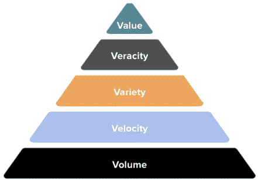

# 构建可靠的数据管道:LogDNA 和 McAfee 问答

> 原文：<https://thenewstack.io/building-reliable-data-pipelines-qa-with-logdna-and-mcafee/>

 [塔克·卡拉威

塔克是 LogDNA 的 CEO。他在企业软件方面有 20 多年的经验，重点是开发人员和 DevOps 工具。](https://www.linkedin.com/in/tucker-callaway-9310171/) 

最近，LogDNA 的首席执行官 Tucker Callaway 和 McAfee 的数据工程、分析和数据科学副总裁 Anastasia Zamyshlyaeva 聚在一起，讨论了公司面临的数据挑战以及如何克服这些挑战，并重点讨论了安全问题。

下面的对话简要介绍了数据的历史，并讨论了他们今天看到的一些趋势、如何构建可靠的数据产品以及领导者在构建这些可靠的数据产品中的角色。

**塔克:你如何看待公司在过去五年中应对变化的数据量和复杂性？**

**Anastasia:** 数据量呈指数级增长有三个原因。首先，由于云存储和计算成本的民主化，组织已经开始收集更多可能在未来使用的数据源。

 [阿纳斯塔西娅·扎米什利亚耶娃

Anastasia 是 McAfee 的数据工程、分析和数据科学副总裁。](https://www.linkedin.com/in/azamyshlyaeva/) 

第二个驱动因素是对可用性、性能和速度版本的系统需求增加。这需要更高级别的监控和日志记录，使组织能够发现系统的问题，预测一些故障，并在最短的时间内解决它们。

最后一个原因是，当企业更看重数据时，它们正在寻找创新或颠覆的新途径。例如，他们发现了以前没有接触到的新客户群，因为他们对这些客户没有很好的了解。或者他们发现了未被满足的需求，可以借此推出新产品。在推出新产品时，他们对客户采用“构建、衡量、学习”的方法，以确保他们构建的是客户正在寻找的东西，并满足他们的需求。

**Tucker:我们在 LogDNA 的业务中看到了这一点。我们经常从客户那里听到的一个关键主题是，过去五年中发生了太多变化，系统无法同时扩展到您提到的容量和应用价值。你认为今天的数据有什么趋势？**

**Anastasia:** 我喜欢从量、速度、多样性、准确性和价值的角度来讨论数据。成交量肯定在增长，但变得更加关键的是速度。实时是大数据的新标准。公司现在将速度作为一种竞争优势来快速决策。他们有额外的数据源和更多种类的数据湖结构来获得洞察力。有真实性，就等同于质量。公司浪费金钱试图从低质量的数据中获得相关的见解。在数据中寻找价值是这个金字塔的顶端。

组织需要关注数量、速度、多样性、准确性和价值如何推动业务成果。这需要新的流程以及技术和工具的变化。他们需要将庞大的数据湖分解成多个数据域，并将这些业务数据域视为产品。数据所有者需要了解如何推动这些数据域的采用，从而为客户带来价值。

这种方法使组织能够根据数据而不是直觉做出决策。它需要非常不同的速度，不仅对管道，而且对结果。组织正在通过 CI/CD 测试和生产向应用程序开发添加大量自动化，以及在出现问题时回滚的能力。数据观察工具的一个新领域正在数据世界中出现。我对关注价值和业务领域所创造的大数据机遇感到兴奋。

塔克:我认为这很令人兴奋。对于组织来说，数据将会带来许多机会，但是在将这些单一的数据结构分解成更特定于领域的结构时，也会面临一些技术挑战。当你思考这个问题时，你对组织有什么建议？构建可靠的数据产品的关键考虑因素是什么？

**Anastasia:** 当我们谈论可靠性时，公司和数据产品在商业和技术方面都可能失败。为了补救业务方面，这是我建议首先解决的问题，公司需要一个强大的结构和思维过程。他们需要从他们的首要计划开始。他们试图解决的 KPI 是什么？是什么因素在推动这些计划，数据能有什么帮助？之后，他们需要构建一个数据路线图，重点关注如何帮助用户和客户。他们需要定义成功是什么样的，以及他们需要衡量什么。这可能是活跃用户的数量、业务影响、收入、成本降低、客户满意度和任何其他相关衡量指标。他们需要指定产品负责人，并确保他们使用数据管理平台来加速这一旅程，并使用治理模型来确保所有数据产品能够协同工作，而不是各自为政。

当我们谈论技术的可靠性时，我会使用与 SLA 模型的应用程序相同的方法。通过为发布管理和轻松回滚提供测试自动化，专注于减少平均检测时间、平均解决时间和平均故障间隔时间。

那么 Tucker，作为一个组织的领导者，你认为领导者在构建这些可靠的数据产品中的作用是什么？

**塔克:我们接受并相信它是至关重要的。我明白了我需要在决策中平衡情感和数据。如果数据证实了我的直觉，我可以确信我们正在做出正确的决定。当数据没有告诉你你的直觉告诉你什么的时候，你必须有勇气不做决定。依赖数据非常重要，但这需要查看我们都相信和信任的公共数据源。归根结底是信任，比什么都重要。**

**Anastasia:** 信任对数据至关重要。组织可以从拥有跨不同部门的通用、单一的事实来源开始。这将导致基于数据的公司级决策。此外，他们需要确保所有敏感数据从一开始就受到保护。如果不展示价值，就不可能获得信任并成为数据驱动型组织。通过不断交付某些里程碑和庆祝胜利，人们将获得对数据的信任。随着他们开始更频繁地使用数据，可靠性变得越来越重要。组织需要确保为产品定义服务级别协议，因为它们受关键程度和业务价值的驱动。他们需要确保他们定义了数据可用性、新鲜度和质量水平，然后测量以确保他们实现了这些目标。

**塔克:** **总之，创建可靠的数据管道有几个要点。一个是你必须把数据当成一个产品。对于那些专注于产品的人来说，将这种思维应用于数据，而不是将数据视为产品的输出，而是一个实际的产品本身，是至关重要的。此外，使用数据推动业务成果也很重要。不要只凭情绪做决定；根据数据告诉你的去做。最后，关注信任。将它专门应用于数据是创建可靠数据管道的基础。**

<svg viewBox="0 0 68 31" version="1.1" xmlns:xlink="http://www.w3.org/1999/xlink"><title>Group</title> <desc>Created with Sketch.</desc></svg>