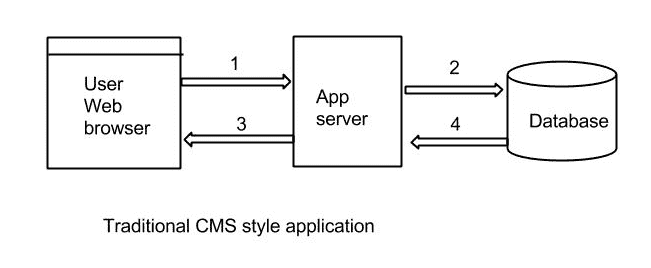
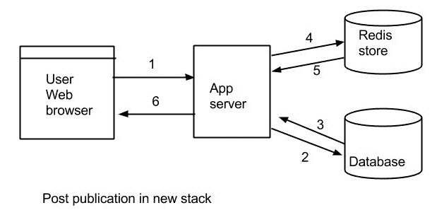
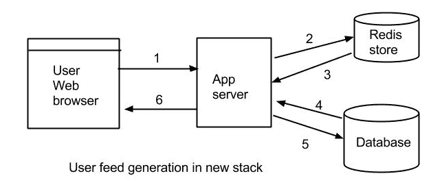

# 使用 Redis 和 Cassandra 构建可伸缩的新闻提要应用程序

> 原文：<https://thenewstack.io/building-scalable-news-feed-applications-using-redis-and-cassandra/>

今天的互联网充满了允许用户从用户生成的内容创建提要的网络。Twitter、Instagram、脸书和其他网站都允许用户从各种来源创建自定义订阅源。这些社交图的性质提出了在互联网规模上映射这些关系的独特问题。

对于下面的例子，我们将概述如何使用键值存储库 Redis T1 和容错的可复制数据库 T2 Cassandra T3 来构建新闻提要应用程序。我们的目标是展示开发人员如何构建自己的新闻提要，作为开发人员应用程序中的一项功能。Amazon Web Services 等云服务将轻松提供基础设施，但使用数据库集群的管理开销仍然存在。即使使用传统的内容管理系统(CMS)方法，开发人员也必须创建多个虚拟机来运行数据库集群。

本文中详细介绍的方法将减少构建这种服务所需的基础设施。我们描述的内容可以部署在任何基于云的基础设施提供商上。简而言之，这篇文章应该被视为一个蓝图，来提供类似 Twitter 或脸书所提供的服务。

## **手头的任务**

在开始之前，让我们记下一个基于提要的应用程序的所有特性。假设这是一个应用程序，用户可以发布更新，感兴趣的人可以订阅提要。每个用户都有一个专用的 feed，显示用户个人订阅的最新内容，按时间顺序排序。以下是我们计划构建的功能列表:

*   出版能力
*   基于用户的提要创建

## **传统方法**

传统上，此类应用程序将像内容管理系统一样构建。一个用户创建一个帖子，这个帖子进入数据库。通过提要更新，数据库查询将获取所有订阅的列表，并显示按发布日期排序的最新内容。

这种方法有两个问题:

*   随着用户数量的增长，提供商将不得不加强基础设施，以确保数据库查询的快速执行。它还可能需要采用数据库集群来确保更低的吞吐时间。
*   如果您必须使用数据库不支持的算法对提要进行排序，那么您将不得不在数据库之上编写另一层逻辑来执行您的定制搜索。这将进一步增加吞吐时间。

 简而言之，这种方法将导致大量硬件和定期维护工作，如数据库调优。这种方法可行，但能否发展到互联网规模值得怀疑。

### **消息框**

让我们尝试摆脱为每个内容提要请求从数据库获取结果的传统方法，尝试寻找替代方法。仔细观察，人们会注意到这种应用非常接近于消息广播。当用户发布内容时，应该将内容广播给所有订阅的用户。一个简单的解决方案是为所有用户维护一个消息框。当订阅的发布者创建一个帖子时，它会出现在用户消息框中。对于用户内容提要的生成，我们只需从消息框中获取文章，并显示给用户。这减少了生成内容提要所需的数据库查询。它还减少了数据库服务器上的负载，增加了吞吐时间，因为我们现在只需要一两个数据库查询来获取用户内容提要的所有帖子。这种方法需要较少的硬件，因为可以使用键值存储轻松实现消息框。

### **Redis**

Redis 是一个高级的键值存储，它提供内存中的数据集。Redis 支持包括列表在内的数据结构，这是我们的应用程序所关心的。我们将改变我们的传统模型，将 Redis 添加到堆栈中，这样每个用户都有一个专用的单独的消息框。当一个新的帖子被创建时，我们检查订阅者并将 post_id 发送到每个订阅者的消息框中。用户的消息框是一个简单的 Redis 列表，唯一的 user_id 是标识键。对于每个新订阅的帖子，我们只需将 post_id 插入到代表用户消息框的列表中。

我们更新后的堆栈现在看起来像这样:

我们还可以为每个用户维护多个消息框。例如，脸书允许您查看“最近”或“头条新闻”这可以通过为每个用户创建两个不同的消息框并基于自定义算法更新突出的消息框来实现。

为了生成用户的 feed，我们获取他们的消息框，并查询数据库中的完整帖子、评论和所有其他属性。

新的内容生成周期将如下所示:

我们将通过给消息框添加一个限制来防止用户消息框增长超过一定的大小。例如，Twitter 只显示过去七天的推文。

### **用卡珊德拉**进一步扩展

虽然 Redis 是一个不错的选择，但它有自己的局限性。Redis 的优势是它的内存数据集，这也是它的劣势。对于内存中的数据集，当所有数据都适合单台机器的内存时，Redis 工作得最好。有了廉价的 RAM，内存可以增长到几兆字节，但你永远不知道什么时候会耗尽内存。这就是卡珊德拉可以介入的地方。Cassandra 可以处理跨机器的数据和不适合内存的数据。Cassandra 支持集群，可以处理机器故障，轻松地重建机器。

但是 Redis 仍然非常适用，因为它确实满足了大多数用户的需求。当 Redis 失去动力时，像 Cassandra 这样的替代者可以简单地支持这项服务。

### **更多键值**

虽然我们在本文中看到了两个关键的价值商店——Redis 和 Cassandra——但也不排除其他商店。这是消息框的两个广泛使用的键值存储，所以我们只关注这两个。但是，您可以试验、混合和匹配关键值存储，以形成适合您需求的堆栈。如果您使用这里描述的蓝图构建应用程序，请给我们写信:)

<svg xmlns:xlink="http://www.w3.org/1999/xlink" viewBox="0 0 68 31" version="1.1"><title>Group</title> <desc>Created with Sketch.</desc></svg>