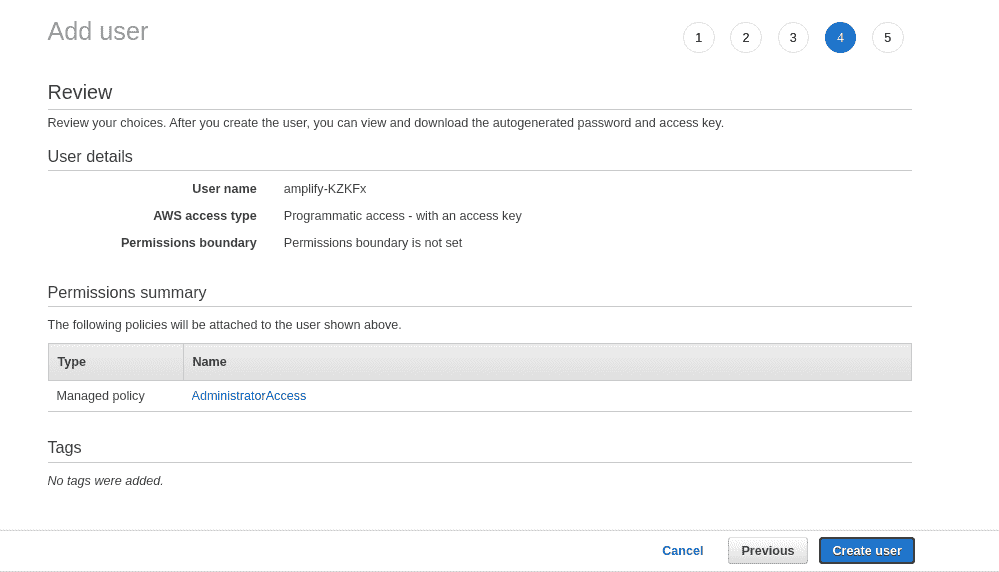

# 用 AWS Amplify 构建无服务器应用程序

> 原文：<https://thenewstack.io/building-serverless-applications-with-aws-amplify/>

[](https://www.linkedin.com/in/serkanozal/)

 [塞尔坎·奥扎尔

塞尔坎是桑德拉的联合创始人兼首席技术官。他在软件开发方面有 10 多年的专业经验，是 AWS 认证专家，拥有分布式环境专利。他主要从事无服务器架构、分布式系统和监控工具方面的工作。](https://www.linkedin.com/in/serkanozal/) [](https://www.linkedin.com/in/serkanozal/)

在无服务器之前，需要管理服务器。即使在今天，一个典型的全栈应用程序也需要您具备前端、后端和操作知识，除非出现无服务器的情况。

当人们第一次听说无服务器时，他们会想到一个没有服务器的神奇真空。这与事实相去甚远。顾名思义，无服务器并不表示“没有服务器”。您仍然有服务器，但是您不再需要担心它们。

像 AWS 这样的无服务器提供商提供了大量的服务，这些服务完全抽象了管理服务器的繁重工作，同时仍然可以大规模运行。如果你想知道如何在云中构建一个全栈的应用程序，而不需要费力去做一些小事情，这篇文章将会帮助你。我们将了解如何构建一个全栈应用程序，并使用 AWS Amplify 将其部署到云中。

## AWS 放大器

AWS 围绕其云服务构建了出色的工具，让开发人员的生活变得更加轻松。其中一个非常有用的工具是 AWS Amplify，这是一个 JavaScript 库，可以让你在云中构建和部署无服务器应用。

全栈应用程序是客户端和服务器端代码的组合。这可能包括 UI 组件、服务器处理逻辑、数据库、推送通知等等。没有 AWS Amplify 提供的抽象，这些组件需要专业知识来构建可扩展的应用程序。

除了抽象，AWS Amplify 还为大多数流行的 JavaScript 框架提供了预构建的 UI 组件——包括 React、React Native、Vue 和 AngularJS。

## AWS 放大器组件

你可以把 [AWS Amplify](https://aws.amazon.com/amplify/) 看作是三个组件的组合:库、UI 和 CLI 工具链。这些组件协同工作，有效地管理您的应用程序开发生命周期。

### 库组件

库组件允许您添加、集成 AWS 云服务，或者与 AWS 云服务进行交互。借助该库，您可以向您的应用添加安全认证、数据存储、文件存储、无服务器 API、分析、推送通知、AR/VR 和其他功能。

### UI 组件

AWS Amplify 为您提供了围绕应用程序中的云工作流建模的预构建 UI 组件，例如身份验证高阶组件，我们将在本文稍后讨论。

### CLI 工具链

随着应用程序的增长，您可能需要添加更多的云服务。AWS Amplify 的 CLI 组件提供了易于使用的 CLI 命令来对 AWS 管理的后端进行更改。

## AWS 放大功能

在我们接触代码之前，了解 AWS Amplify 在日常用例中的用途是非常重要的。

### 引导无服务器应用程序

Amplify CLI 允许您使用完全连接的无服务器后端基础设施引导客户端代码。UI 组件是可定制的和可选的。

### 部署和托管应用程序

一个应用程序要提供价值，它必须对用户可用。一个漂亮的应用程序放在 GitHub 存储库中没有任何好处，除非您部署它。AWS Amplify 控制台让您托管您的静态 web 应用程序。一旦连接了存储库，它会在几秒钟内自动在存储库中部署新的更改。部署方法取决于您为应用程序配置的构建设置。

## 使用 AWS Amplify 构建完整的堆栈待办事项应用程序

一个真正有用的管理你一天的应用程序是[谷歌任务](https://play.google.com/store/apps/details?id=com.google.android.apps.tasks&hl=en)。在本教程中，我们将构建一个更简单的谷歌任务的 web 应用版本，一个*待办事项*应用，它将允许您添加任务，查看您添加的任务，当然，还可以使用 AWS Amplify 添加认证。

以下是展示最终产品外观的高级架构:


图 1:高层架构

### 设置项目

要用 AWS Amplify 建立一个项目，[你需要有一个 AWS 账户](https://portal.aws.amazon.com/billing/signup#/start)。现在让我们开始吧。

**步骤 1:安装 [Amplify CLI](https://www.npmjs.com/package/@aws-amplify/cli) 。**

该库将用于与云服务(CLI 工具链)进行交互。

```
npm  i  -g  @aws-amplify/cli

```

**步骤二:配置 AWS Amplify。**

这需要您登录，然后带您回答一些问题，为您的项目设置 Amplify。

登录后，您将被要求创建一个 IAM 用户[作为有权访问您的 AWS 帐户的用户。](https://docs.aws.amazon.com/IAM/latest/UserGuide/introduction.html)

要创建 IAM 用户，请回答有关 AWS 区域和 IAM 用户的问题。

接下来，您将被带到 IAM 管理控制台来设置用户访问。下面是用户创建流程:


图 2:用户创建流程

点击“下一步”,选择“管理员访问”(如果默认情况下未选择),然后继续操作，直到看到“创建用户”按钮。



图 3:用户创建预览页面

点击“创建用户”按钮创建一个放大用户。

IAM 用户已创建。

不要关闭页面。回到您的终端，单击“Enter”，并在终端中提供新创建用户的`accessKeyId`和`secretAccessKey`。

**步骤 3:引导 React 应用程序。**

对于 react 项目，使用 [create-react-app](https://www.npmjs.com/package/create-react-app) ，这是一个众所周知的用于启动 React 应用程序的库。

要引导 React 应用程序，运行命令:

```
npx create-react-app todo-amplify

```

生成客户端代码后，我们的下一步是初始化后端。

### 正在初始化后端

待办事项应用需要后端组件，如存储任务的数据库、验证用户身份的 AWS Cognito 和 GraphQL 端点。现在，我们将使用 AWS Amplify CLI 来初始化这些组件，以支持我们的应用程序:

```
cd todo-amplify
amplify init

```

您将会看到以下问题(括号中显示的是本练习选择的答案):

```
Enter  a  name for the project  (todo-amplify)
Enter  a  name for the environment  (dev)
Choose your default editor  (VS Code)
Choose the type of app that you're building  (javascript)
What JavaScript framework are you using  (react)
Source directory path  (src)
Distribution directory path  (build)
Build command  (npm build)
Start command  (npm start)
Do you want to use an AWS profile  (Y)

```

此时，您应该在根文件夹中创建了一个名为“amplify”的目录。这个目录保存了关于所创建的后端服务的所有信息。还会创建一个名为 aws-exports.js 的文件。这包含了使您能够从客户端连接到后端的信息。

此外，该项目现已连接到`Amplify Console`。您可以从终端运行命令 amplify console 来访问控制台。

### 设置前端应用程序

既然后端服务已经创建(并将被更新)，那么就必须连接前端应用程序。AWS Amplify 为不同的框架提供了多种 UI 组件。您可以使用下面的命令为 React 安装一个 AWS Amplify UI 组件，React 是我们在本教程中选择的框架:

```
npm install aws-amplify  @aws-amplify/ui-react  --save

```

应用中与 AWS 服务交互的核心库是 aws-amplify。CLI 仅创建后端服务。这个库控制应用程序如何连接到后端并触发动作。

此外，`@aws-amplify/ui-react`提供了 React 组件，可以很容易地连接到后端。

### 在前端应用程序中连接放大器

在 src/index . js(React 项目的根)中，导入“aws-exports”和“Amplify”库:

```
import React from  'react';
import logo from  './logo.svg';
import  './App.css';

import Amplify from  "aws-amplify";
import awsExports from  "./aws-exports";
Amplify.configure(awsExports);

function App()  {
  return  (
    <div className="App">
      <header className="App-header">
        
        <p>
          Edit  <code>src/App.js</code>  and save to reload.
        </p>
        <a
          className="App-link"
          href="https://reactjs.org"
          target="_blank"
          rel="noopener noreferrer"
        >
          Learn React
        </a>
      </header>
    </div>
  );
}
export default App;

```

AWS-exports . js 保存了与后端服务连接和交互所需的信息。

### 创建 GraphQL API

API 是前端和后端进行通信的接口。如今两种主要的 API 类型是 REST 和 GraphQL。后者是这个项目的最佳选择，因为它具有很强的声明性，只允许您获取相关的数据。

要添加一个 API，使用以下命令:

选择 GraphQL 作为您的 API 服务。

对于 api 名称和描述，使用 todo-api 并选择 API 管理内容的描述。

你可以选择回答其他问题。如果您不确定该做什么，默认设置就可以了。

回答完所有问题后，在 amplify/back end/API/todo-API/schema . GraphQL:
中会创建一个 graph QL 模式

```
type  Todo  @model  {
  id:  ID!
  name:  String!
  description:  String
}

```

如果你想知道它是如何知道我们在创建一个待办事项应用的，答案是它不知道。这是 Amplify 提供的默认模式。默认情况下，这个 API 已经被配置为创建、读取、更新和删除(CRUD)待办事项。

对于你的待办事项列表，你不需要描述。相反，我们需要一个“done”属性来表示待办事项的状态。下面是更新后的模式:

```
type  Todo  @model  {
  id:  ID!
  name:  String!
  done:  Boolean!
}

```

既然 API 已经创建好了，我们可以将它部署到云中了。

从您的终端运行以下命令:

### 将前端连接到 API

为此，我们将使用 GraphQL 公开的方法。在 src 目录中，有一个自动生成的 GraphQL 目录，其中包含保存不同方法的文件。

要查看所有待办事项并添加待办事项，请在 src/App.js 中执行以下操作:

```
import React,  {  useState,  useEffect  }  from  "react";
import  "./App.css";
import  {  withAuthenticator,  AmplifySignOut  }  from  "@aws-amplify/ui-react";
import  {  createTodo,  updateTodo  }  from  "./graphql/mutations";
import  {  listTodos  }  from  "./graphql/queries";
import Amplify,  {  API,  graphqlOperation  }  from  "aws-amplify";
import awsExports from  "./aws-exports";

Amplify.configure(awsExports);

function App()  {
  const  [allTodos,  setAlltodos]  =  useState(null);

  useEffect(()  =>  {
 (async  ()  =>  {
 const todos  =  await API.graphql(graphqlOperation(listTodos));
 setAlltodos(todos.data.listTodos.items);
 })();
  },  []);

  const  [name,  setTodoName]  =  useState("");

  const changeTodoName  =  (e)  =>  {
 setTodoName(e.target.value);
  };

  const submitAddTodo  =  async  (e)  =>  {
 e.preventDefault();
 if  (name  ===  "")  return alert("Input field cannot be empty");
 const todo  =  {  name,  done:  false  };
 await API.graphql(graphqlOperation(createTodo,  {  input:  todo  }));
 allTodos  ===  null  ?  setAlltodos([todo])  :  setAlltodos([todo,  ...allTodos]);
  };

  const toggleTodo  =  async  (id)  =>  {
 const todo  =  allTodos.find(({  id:  _id  })  =>  _id  ===  id);
 let newTodo  =  {  id,  name:  todo.name  };
 newTodo.done  =  todo.done  ?  false  :  true;
 await API.graphql(graphqlOperation(updateTodo,  {  input:  newTodo  }));
  };

  return  (
 <div className="App">
 <div className="heading">
 <h1>Amplify Todo</h1>
 <div className="sign-out">
 <AmplifySignOut  />
 </div>
 </div>
 <form className="add-todo-form"  onSubmit={submitAddTodo}>
 <input
 placeholder="Add Todo"
 onChange={changeTodoName}
 />
 <button type="submit">+</button>
 </form>
 {allTodos  ===  null  ?  (
 <p>Loading Todos...</p>
 )  :  allTodos.length  ===  0  ?  (
 <p>No Todo available</p>
 )  :  (
 <div className="todos">
 {allTodos.reverse().map(({  id,  name,  done  },i)  =>  (
 <div className="todo-block"  key={i}>
 <input
 onClick={()  =>  toggleTodo(id)}
 type="checkbox"
 id={id}
 value={id}
 key={i}
 defaultChecked={done}
 />
 <label htmlFor={id}>{name}</label>
 </div>
 ))}
 </div>
 )}
 </div>
  );
}

export default withAuthenticator(App);

```

在 useEffect 钩子中，调用获取所有待办事项的 API，起初它是空的。

然后处理名称状态，并在提交时调用 createTodo API。它接收一个具有 name 和 done(值为 false)属性的对象的输入。记住模式要求 id(自动生成)、name 和 done，所以这些是在单击“Submit”按钮时必须提交的内容。

当 createTodo 方法成功响应时，您只需更新 todos 数组的本地状态，而不是刷新页面。

当一个待办事项被选中时，它在后台被更新为“真”的“完成”属性如果未选中，则为“假”

AmplifySignOut 组件从 Amplify 中公开，用于在登录后触发注销。下一节(身份验证)将介绍登录设置。

当 npm start 运行时，我们的应用程序在 localhost:3000 上运行:


图 4:待办事项应用程序

接下来是认证。

### 认证用户

要创建认证服务，请运行以下命令:

回答完问题后，运行以下命令:

您会注意到，`amplify push`将本地更新同步到云服务。

现在，认证服务已经准备好了。您可以使用 Amplify UI 组件，而不是通过 AWS Amplify 提供的身份验证 API 手动连接到后端。对于我们的用例，您将使用 withAuthenticator 高阶组件。

在 src/App.js 中，添加以下内容:

```
import  {  withAuthenticator  }  from  '@aws-amplify/ui-react'
.....
export default withAuthenticator(App)

```

当您转到 localhost:3000 时，您将得到类似于下面的内容:


图 5:认证页面

Amplify 将帮助您管理每次操作的注册、登录和用户验证。在本教程中，你可以找到完整的源代码。

### 部署应用程序

Amplify Console 允许您轻松部署和托管应用程序。要托管应用程序，请运行以下命令:

接下来，运行这个:

你的应用程序现已上线，你将在终端上获得一个公共 URL。

请记住，您也可以通过运行命令`amplify console`直接查看您的应用程序。

如果你想删除所有的资源或者清理你的云资源，运行下面的命令:

## 放大:工作量更少的全栈应用

在本文中，我们看到了如何使用 AWS Amplify 以最少的工作量构建一个全栈应用程序。如果没有像 Amplify 这样的工具，创建全栈应用会困难得多，你需要后端和前端的专业人员来完成这项工作。有了 Amplify，您只需要担心最终产品，而不是内部发生的一切。

<svg xmlns:xlink="http://www.w3.org/1999/xlink" viewBox="0 0 68 31" version="1.1"><title>Group</title> <desc>Created with Sketch.</desc></svg>