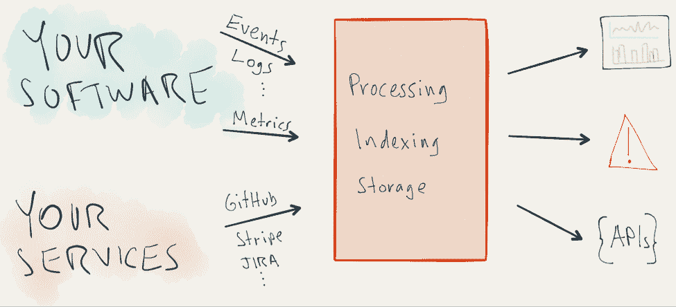
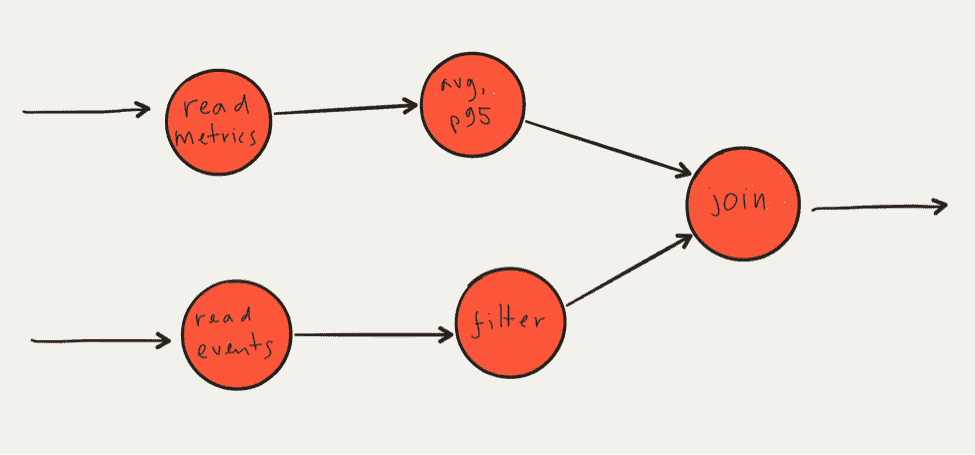
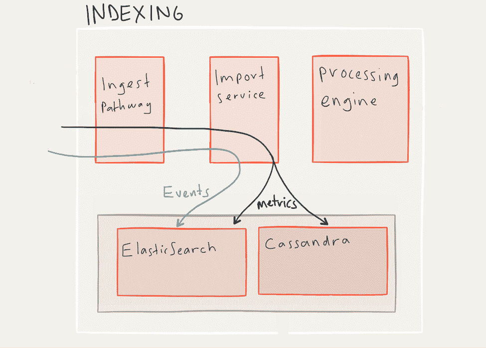
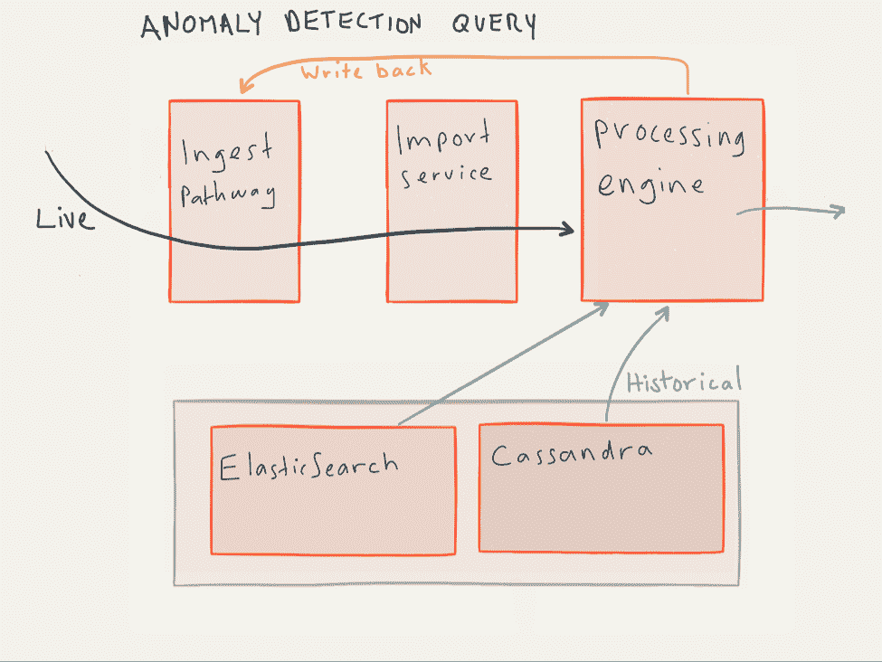

# 用 Elasticsearch、Kafka 和 Cassandra 构建流数据中心

> 原文：<https://thenewstack.io/building-streaming-data-hub-elasticsearch-kafka-cassandra/>

在过去一年左右的时间里，我遇到了一些软件公司，讨论如何处理从他们的软件中流出的数据(通常以日志和指标的形式)。在这些讨论中，我经常听到不得不使用一套随着时间的推移拼凑起来的零散工具的沮丧。通常有许多独立的工具，例如:

*   运营监控和警报工具。
*   开发人员用来跟踪性能和排除故障的东西。
*   一个完全独立的系统，用于商业智能(BI)和业务，以查看用户在系统中做什么。

虽然这些工具使用不同的视角，来自不同的角度，但它们看的是相同的来源和类型的数据。因此，许多软件团队说，“给我们一些时间，我们可以构建更好的东西。”坦率地说，考虑到令人惊叹的开源构建模块，问一个问题是有意义的，你是否可以自己开发？我们就是这样做的。我们在开源大数据组件的基础上建立了一个流分析系统，这篇文章展示了我们使用的组件的蓝图以及我们如何将它们组合在一起。我们将涵盖:

*   **摄取**:如何引入多种不同类型的数据流。
*   **索引和查询**:高效存储和统一查询。
*   **连接起来**:数据如何在系统中流动。
*   **优化**:让整个东西变快，这样人们才会真正使用它。

我希望阅读这篇文章能帮助你以一种理智的、可伸缩的方式构建你的系统，并避免我们遇到的一些陷阱。 [](https://thenewstack.io/wp-content/uploads/2015/10/Jut-pci-1.png)

## 摄取数据

当谈到运营分析和监控时，相关的数据类型、格式和传输协议并不缺乏。你需要能够在你正在构建的系统中指出各种不同的来源和发送者。例如，您的数据可能包括以下任何内容:

*   自定义应用程序事件。
*   容器级指标和日志。
*   [Statsd](https://github.com/etsy/statsd) 或[收集](https://github.com/collectd/collectd)指标。
*   来自第三方的 Webhook 事件，如 [GitHub](https://developer.github.com/webhooks/) 或 [Stripe](https://stripe.com/docs/webhooks) 。
*   应用程序或服务器日志。
*   用户活动。

虽然这些都有不同的格式和表示，但它们在系统内部需要统一的表示。无论您选择哪种表示，都需要将传入的数据流转换成它。

我们最终得到的表示简单而灵活:每个记录(“point”)都是一组键/值对，可以方便地表示为一个 JSON 对象。所有点都有一个“时间”字段，公制点也有一个数字“值”字段；其他点可以具有任何“形状”一个前端 HTTPS 服务器(运行 NGINX)接收传入的数据，这些数据被解复用并发送到本地的每个数据类型的“连接器”进程(运行 Node.js)。这些过程将传入的数据翻译成系统的内部表示，然后将它们发布到 Kafka 主题中(为了可靠性)，以后可以从该主题中提取这些数据进行索引和/或处理。

除了上面的数据类型之外，考虑任何可以使您自己的团队最容易集成到您的数据中心的连接器。您可能不需要我在这里描述的那么多的通用性或灵活性，但是在您的接收中设计一些灵活性——您接受的数据类型越多，当新数据出现时，您就越不需要购买或构建其他孤岛。

## 索引和存储数据

所有这些数据都需要放在某个地方。最好是放在能够随着数据需求的增长而轻松扩展的数据库中。数据库支持的类似分析的查询越多越好。如果这个数据中心只是为了记录日志和事件，那么你只需选择 ElasticSearch 就可以了。如果这只是关于度量，你可以选择一个时间序列数据库(TSDB)。但是我们需要把它们都处理好。我们最终构建了一个具有多个本地数据存储的系统，这样我们就可以最有效地处理不同类型的数据。

### 日志和事件放入 ElasticSearch

我们使用 ElasticSearch 作为我们的事件数据库。这些事件可以有不同的“形状”，这取决于它们来自哪个源。我们使用了许多 ElasticSearch APIs，效果很好，特别是[查询](https://www.elastic.co/guide/en/elasticsearch/reference/current/query-dsl.html)和[聚合](https://www.elastic.co/guide/en/elasticsearch/reference/current/search-aggregations.html)API。

### 指标进入 Cassandra 和 ElasticSearch

虽然原则上指标可以完全存储在 ElasticSearch(或任何其他数据库)中，但使用一个专门的数据库，其数据模型与指标数据的固有结构和冗余相匹配，效率要高得多。

显而易见的方法是利用现有的开源时间序列数据库(TSDB)。这就是我们最初所做的——我们使用开源的 TSDB，它使用 Cassandra 作为后端。这种方法的挑战在于 TSDB 有自己的查询 API，这与 ElasticSearch 的不同。由于这种潜在的差异，跨事件和指标呈现统一的搜索和查询界面是很困难的。

这就是为什么我们最终决定编写自己的 TSDB 来存储 Cassandra 和 ElasticSearch 的指标。具体来说，我们将时间/值对存储在 Cassandra 中，将元数据存储在 ElasticSearch 中，并且我们在上面有一个查询和管理层。这样，对事件和指标的搜索和查询可以在 ElasticSearch 中统一进行。

## 流处理引擎

所以现在我们有了摄取途径和一些数据库。我们准备好安装一个前端应用程序来处理我们的数据了吗？还没有！即使 ElasticSearch 可以本地进行一些日志和事件分析，我们仍然需要一个处理引擎。因为:

*   我们需要一种统一的方式来访问实时或历史数据的事件和指标。
*   对于某些用例(监控、警报)，我们需要能够实时处理实时数据。
*   度量！我们想做更多的事情，而不仅仅是搜索指标并读出它们——指标就在那里，这样我们就可以处理它们。
*   即使对于事件，我们也需要比 ElasticSearch APIs 提供的更通用的处理能力。例如，连接来自不同来源的数据、进行字符串解析或自定义聚合。

这是事情开始变得真正有趣的地方。你可以花几天(或更长时间)研究其他人是如何构建数据管道的，了解 Lambda、Kappa 和其他听起来很奇怪的数据架构。实际上有很多非常好的材料。我们将开门见山，全力以赴:我们认为要走的路是一个统一的处理引擎，它既可用于直播，也可用于批量计算。在这方面，我们一直完全支持这里的和这里的所阐述的观点。

[](https://thenewstack.io/wp-content/uploads/2015/10/Jut-pic-2.png)

流向图

这里，与存储和接收不同，我们从头开始构建处理引擎——不是因为没有其他流处理引擎，而是因为我们关注查询和性能，这将在下面的单独部分中讨论。更具体地说，我们构建了一个流处理引擎，它实现了一个[数据流处理模型](https://medium.com/@jut_inc/why-devops-needs-dataflow-analytics-cd0cacaeeedd)，其中计算被表示为一个运算符的有向图，这些运算符通过应用诸如转换、聚合、窗口、过滤或连接等运算符将输入转换为输出。这是一种自然的方式，以一种可组合的方式对查询和计算进行建模，适合实时和批处理，并直接映射到分布式运行时。

当然，除非你真的在寻找一个新的大项目，否则你可能会想使用开源的流媒体引擎。我们建议看一看[里曼](http://riemann.io/)、[火花流](http://spark.apache.org/streaming/)或[阿帕奇弗林克](https://flink.apache.org/)。

## 表达查询和计算

我们使用基于数据流计算模型的流处理引擎。但是用户如何表达查询并创建这样的数据流图呢？一种方法是提供 API 或嵌入式 DSL。该 API 需要提供查询和过滤数据的方法，定义转换和其他处理操作，最重要的是，提供将各个处理阶段组装成流程图的方法。上面提到的每个项目都有自己的 API，虽然个人偏好可能会有所不同，但 API 的一个常见挑战是，非开发人员(如 SQL 分析师或 Excel 用户)无法访问 API。

此时，一个可能的做法是声明这些用户将通过编写到这些 API 的工具(例如，一个简单的 web 应用程序)与系统进行交互。

另一种方法是提供一种简单的查询语言。这就是我们在 [Jut](http://www.jut.io/) 所做的。因为数据流没有现成的查询语言(就像关系查询有 SQL 一样)，我们创建了一个名为 Juttle 的数据流查询语言。在其核心，Juttle 由流图语言和简单的语法组成，以声明如上所示的处理管道。它有诸如搜索、窗口、连接、聚合和分组等原语，以及使用它们的简单语法。当然，在处理流程图中的数据之前，您需要获取数据——Juttle 允许您定义查询，从事件和/或指标的任意组合中获取数据，无论是实时的还是历史的，都使用相同的语法和结构。这里有一个简单的例子，它遵循……
的模式

(注意使用管道操作符进行链接的类似 shell 的语法)。

```
read  -from  :1  day ago:  data_type  =  'web_log'

|  reduce  -every  :minute:  count()  by status_code

|  @timechart

```

## 将碎片放在一起:异常检测的一个例子

到目前为止，我们采用了以组件为中心的视角——我们已经讨论了构建模块及其角色，但没有说太多关于它们如何组合在一起的内容。现在，我们将切换到以数据为中心的视角，看看需要设置哪些途径来支持实时和历史查询。让我们以运行异常检测算法为例。这是一个很好的例子，因为我们需要查询历史数据来训练底层统计模型，实时流数据来测试异常，然后我们需要在发出异常警报时将结果写回系统。

但是在我们进行任何类型的查询之前，我们需要连接接收路径，以便将传入的数据写入索引存储。这是由导入服务**、**完成的，它实现了时间序列数据库的写入路径，在 ElasticSearch 和 Cassandra 之间分割度量数据和元数据。

[](https://thenewstack.io/wp-content/uploads/2015/10/Jut-pic-3.png)

正在索引传入的数据。

现在，一名用户开始启动异常检测作业。这需要读取历史数据，处理引擎通过直接查询底层数据库来做到这一点。根据查询和数据，这可能包括优化(下面讨论)，和/或实现指标数据库的读取路径(向 ElasticSearch 发出元数据查询，从 Cassandra 中提取指标值，并组合结果以产生实际的指标点)。

[](https://thenewstack.io/wp-content/uploads/2015/10/Jut-pic-4.png)

带有异常检测查询的历史、实时和回写流。

历史数据涵盖了从过去到“现在”的范围数据流入流程图后，处理引擎会将此流程图切换为实时状态，即在数据到达系统时读取数据，并将其流入流程图。为此，处理引擎直接利用来自导入服务的点的传入流。请注意，这种切换必须小心进行，以避免丢失或重复点。

在这一点上，我们有一个经过训练的异常检测流程图运行在实时数据上。当检测到异常时，我们希望它向某个外部系统发送警报，这是通过让处理引擎向某个外部 HTTP 服务发送消息来实现的。除了发出这个警报，我们还希望在系统内部跟踪它。换句话说，我们希望能够将数据流写回到系统中。从概念上讲，这是通过让处理引擎将数据传输回摄取路径来实现的。

## 让它更快

因此，我们有一个包含摄取路径、一些数据库和处理引擎的工作系统。我们准备好安装一个前端应用程序来处理我们的数据了吗？还是不行！

实际上，我们现在就可以这样做，但问题是对于历史查询，我们的查询性能会非常慢。缓慢的查询意味着…没有人会使用它。

因此，让我们暂时重温一下“统一处理引擎”的概念。我们解释说，这是用相同的结构、抽象和查询进行历史和实时处理的同一个系统。

性能挑战来自于这样一个事实，即历史数据远远多于实时数据。例如，假设我们每秒有一百万个点进入系统，并且处理路径足够快，可以在这些点进入时对其进行实时查询。现在，采用相同的查询并在过去一天的数据上运行它——它将需要一次处理数百亿个点(或者，至少，以从存储中读取它们的速度)。假设计算是分布式的，我们可以通过添加计算节点来解决这个问题，但在最好的情况下，这将是低效和昂贵的。

这就是优化的用武之地。有许多方法可以优化数据流查询。其中一些包括转换查询本身——例如，在不改变查询语义的情况下，尽可能将过滤器或聚合移到上游。我们在这里要讨论的是一种下推优化的形式，它将过滤和处理尽可能下推到数据库中。这需要执行以下操作:

*   自动识别查询的哪些部分可以下推到数据库中。
*   将这些部分翻译成目标数据库的查询语言。
*   运行后端查询并在数据流图中的正确点注入结果。

## 包裹

我们完了！好了，如果我们愿意不使用可视化层，只通过 API 查询系统，我们就完成了。但是构建一个客户端应用程序来创建查询、流式处理和可视化数据，以及组成仪表板是另一件棘手的事情，所以我们将把它留待以后解决。

现在，让我们总结一下我们在构建这个数据中心的过程中所看到的情况:

*   一个**接收路径**，它接受来自不同来源的输入数据，将其转换为统一的表示，并存储起来供以后使用。(以 Jut 为例，这是建立在卡夫卡之上的)。
*   **事件和指标的数据库**。对于 Jut，我们使用 ElasticSearch 搜索事件，并在 Cassandra 的基础上建立了一个定制的指标数据库。
*   一个**处理引擎**(或者两个，如果你使用 lambda 架构的话)。
*   一个 **API** 或**查询语言**在系统上运行查询。

唷。如果你已经走了这么远，恭喜你。这是一个漫长但有趣的旅程。不管怎样，即使你正在构建你自己的，看看 [Jut](http://www.jut.io/) 。你可能会受到启发。

<svg xmlns:xlink="http://www.w3.org/1999/xlink" viewBox="0 0 68 31" version="1.1"><title>Group</title> <desc>Created with Sketch.</desc></svg>