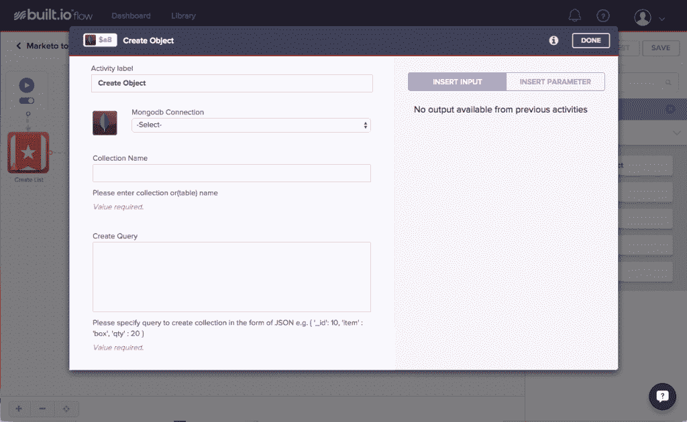
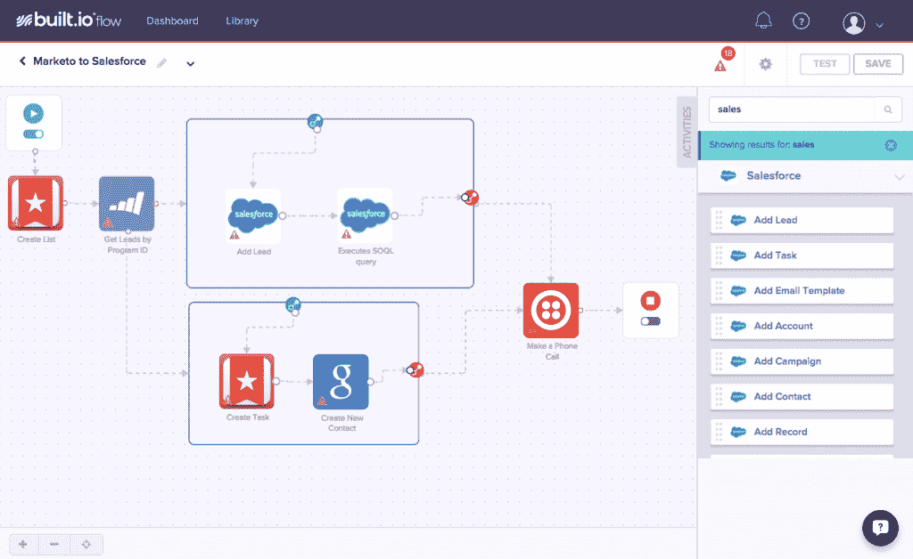

# Built.io 及其自动化管道，用于连接应用程序和定制逻辑

> 原文：<https://thenewstack.io/built-io-and-its-automated-pipeline-for-connecting-apps-with-custom-logic/>

集成服务以形成更一致的开发工作流不仅有助于开发人员，也有助于编程领域之外的人员，因为更多解决复杂工作流需求的解决方案已经出现。[build . io Flow](https://www.built.io/)是后端即服务(BaaS)提供商新发布的服务，它汇集了来自营销、通信、web 开发和 DevOps 等日常使用的各种项目的 API。在一个人可能不得不登录多个服务来完成一项任务的情况下，Built.io Flow 在日常工作流程任务中创建了一个自动化管道，例如使用 Wunderlist 捕获数据以通过 Outlook 发送自动电子邮件，或者在 MailChimp 中聚合客户电子邮件以通过 [Marketo](http://www.marketo.com/) 发送简讯。

整合应用程序已经成为商业的一个重要部分，随之而来的是公司和那些依赖其服务的人的需求也发生了变化。要求多个跨平台登录或使用多个服务来完成一项任务不再被认为是可靠或高效的。以前，集成是线性的，现在需要的是能够根据各种业务需求进行调整和扩展的灵活性。虽然 Built.io 流中的工具可能是相同的，但它们在日常生活中的使用方式却有很大的不同，这取决于应用程序开发团队的哪个部门在使用它们。Built.io Flow 实现了拖放集成，将服务链接在一起以完成从小到大的任务。

## 构建集成平台架构的未来

Built.io Flow 不需要客户端或下载，因为它是一个完全基于云的平台。人们可以登录他们的帐户，立即开始拖放应用程序来定制他们的工作流程。目前在 Built.io Flow 中启用了 30 个 app，包括 Marketo、Zendesk、Office 和 Evernote。在接下来的几个月里，还会有更多的应用程序被添加进来。

Build.io Flow 采用了 [Zapier](https://zapier.com/) 和 [IFTTT](https://ifttt.com/) 的结构，并对其进行了简化，以适应企业级 app 开发的需求。通过使用自定义逻辑，Built.io Flow 引入了一个简化的工作流，将各个组件拖放到管道中，以触发所需的操作。这些机制可以设置为在单个基础上大规模运行，从而减少高峰工作负载期间的拥塞。由于 Built.io 流可以跨多种平台和服务工作，这为连接到数据中心的人提供了更多的安全性，在防火墙后建立连接以保护记录系统中的信息。

图为:使用 MongoDB 的 Built.io 流设置

build . io 流的架构解决了内容即服务的需求，build . io 流构建在 Node.js 的原始 C+抽象结构之上。引入工作室结构的概念，在初始 Docker 容器结构之上添加一层工作流管理层，确保项目可以随着业务需求的增长而扩大或缩小。这使得应用程序可以在 BaaS 之上运行，确保业务用户可以可靠地扩展其内容，并获得一致的结果。

## 简化沟通，缩小差距

与 AWS Lambda 等服务相比，Built.io Flow 的服务器架构的背景是显而易见的。要将函数集成到 Lambda 中，必须编写一个支持 Node.js、Ruby 或 Java 的函数。在 Lambda 中工作的开发人员还必须编写 URL 可引用的函数。如果一个团队希望在 Lambda 中集成 Salesforce 和 Marketo，他们将需要确定集成，在函数中编写函数/映射逻辑，然后执行它。在 Built.io 流的情况下，要实现这一点就要创建一个新的流，拖放，并为下一个任务做好准备。Built.io 的团队预先构建了对 [Salesforce](http://www.salesforce.com/) 和 Marketo 的授权，此外还预先构建了 API 数据结构的包装器。这将在 Salesforce 中创建销售线索，映射数据并执行所需的任务。这比试图在 Lambda 中完成相同的任务要简单得多，只需要较少的函数/映射逻辑编码，或者在工作流出现问题时重新编译。

Built.io Flow Salesforce 工作流

Built.io Flow 在防火墙内开发了一个企业网关，创建了一个到工作流服务器和流引擎的安全隧道，可以将命令传递到企业网关。这允许在现有的基础上增加更多的功能层，增加了 Built.io 流中的定制。工作流在编写时也可以使用复杂的映射或逻辑。为团队提供了一个 Node.js 容器，它取代了项目工作流构建中的 AWS Lambda 函数。

Built.io Flow 为开发人员关系和开发运维团队提供了简化、设计和部署从简单到复杂的工作流管道的能力。借助适用于许多生产力工具的拖放技术，Built.io Flow 为 PaaS 产品提供了一个独特的补充。Built.io Flow 的 CTO Nishant Patel 强调了公司对集成 PaaS 理念的关注，解决了客户的问题，这些客户正在寻求一种解决方案，以更加简化和高效的方式整合他们的营销和通信工具:

> “集成是我们今天与客户对话的一部分。Built.io Flow 是一个集成平台，它改变了集成的含义以及谁可以参与其中。”

随着跨服务集成需求的不断增长，更多集成的 PaaS 解决方案将会发挥作用。Built.io 流是新工作流管道的一个例子。它允许公司构建一个应用程序网络来完成任务，而无需花费数小时编写胶水代码来将所有东西粘在一起。Built.io 流允许灵活的项目构建——适应应用程序开发团队不断变化的需求——同时也继续创造价值。IPaaS(如 Built.io Flow)可确保通过正确的工作流构建，留住用户、收集数据、分析结果并抓住发展机会。

Built.io 反映了 BaaS 和集成市场的变化。它与 IFTTT 和 Zapier 等服务竞争。为新堆栈撰写文章的独立分析师贾纳基兰·MSV 在 Quora 上写道,“BaaS 通过让开发者按照他们选择的顺序将这些点连接起来，将他们变成了组装者。Android 开发人员可以创建一个很酷的用户界面，并调用 BaaS 服务来存储和检索用户配置文件。”

在考虑 MSV 如何看待 BaaS 市场时，Built.io 在市场中的地位有一定的背景。在过去两年里，BaaS 市场的规模已经发生了变化。考虑到 Built.io 面临的竞争，这一点显而易见。根据 MSV 的说法，BaaS 和 MBaaS 产品的一些例子是 AnyPresence，Apigee Usergrid，App42，Appcelerator，FatFractal，FeedHenry，Google Mobile Backend Starter Kit，Kii，Kinvey，Parse，Salesforce Mobile Packs，StackMob 和 Windows Azure Mobile Services。

特征图片: [ralphbijker](https://www.flickr.com/photos/17258892@N05/) 的 [Motion Gears Team Force](https://www.flickr.com/photos/17258892@N05/2588347668) 获得了 [CC BY-SA 2.0](https://creativecommons.org/licenses/by-sa/2.0/) 的授权。

<svg xmlns:xlink="http://www.w3.org/1999/xlink" viewBox="0 0 68 31" version="1.1"><title>Group</title> <desc>Created with Sketch.</desc></svg>