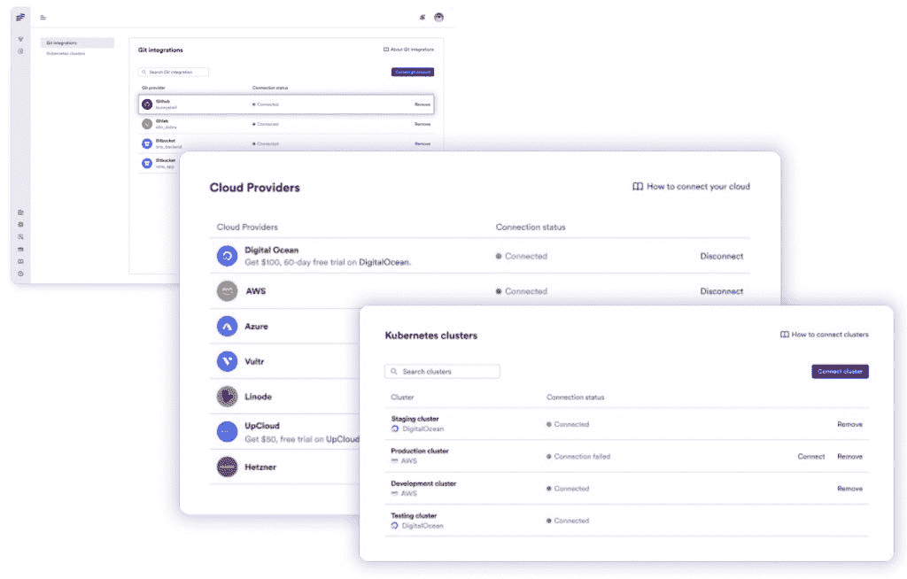

# Bunnyshell 自动保持生产前环境同步

> 原文：<https://thenewstack.io/bunnyshell-keeps-pre-production-environments-in-sync-automatically/>

你会在网上找到一系列对开发人员管理生产前环境所花费时间的猜测。不管有多少，有一点是清楚的:这是花在执行常规任务上的时间，而不是专注于创新。

[Bunnyshell](https://www.bunnyshell.com/) 创建于罗马尼亚，但现在总部位于美国，它正通过一个独立于供应商的自动化环境即服务平台来解决这个问题。

通过连接 git 存储库和云提供者，Bunnyshell 自动发现创建与生产环境相同的开发和试运行环境所需的内部和外部服务。

它被同步以跟踪源代码的变化，并近乎实时地更新环境，因此如果多人正在处理代码，他们的环境将基于最新的代码。

邦尼谢尔首席收入官[妮莎·肖汉姆](https://www.linkedin.com/in/shanishoham/)说:“我们给他们适当的环境来开发代码，这样一旦他们将代码推向开发管道，他们就知道它会工作，因为开发、测试和生产环境都是一样的。

“我们在云中这样做，所以他们不需要在本地机器上做任何事情。这意味着开发人员的入职速度要快得多，”他说。“他们不必花一两周时间在本地设置环境。所有的环境都有指针，所以他们可以与 QA、产品、团队中的任何人分享。

这也意味着反馈回路要快得多。例如，QA 可以测试隔离的环境…如果有任何错误，他们可以立即修复，并且当他们开始构建他们的应用程序时，它会在运行中自动更新。"

## 相同的最新版本

当配置更新没有被应用时，开发人员在从生产环境漂移出来的副本上工作时，通常会在旧版本上工作，导致合并代码和重构的瓶颈。

Roost.ai 的联合创始人 [Rishi Yadav](https://www.linkedin.com/in/rishiy/) 在一篇关于[“在我的机器上工作”问题](https://thenewstack.io/why-are-we-still-having-works-on-my-machine-problems/)的帖子中写道:“然而，真正的解决方案必须涉及缩短开发环境和生产环境之间的距离，以便开发人员能够自动在与生产相同的环境中开发，包括访问最新版本的上游和下游依赖项，并以相同的配置运行。”

在尽可能接近生产的环境中工作可以减少回滚的次数，并支持更频繁的发布。Bunnyshell 自动无缝地将更改应用到现有环境中，因此整个工程团队总是使用最新版本。

## 独立于供应商

Bunnyshell 支持按需或自动创建生产、开发和登台环境。

它通过来自 GitHub、 [GitLab](https://about.gitlab.com/?utm_content=inline-mention) 或 Bitbucket 的每一个 pull 请求构建新的环境，并与亚马逊网络服务[、DigitalOcean、谷歌云和 Azure 上的 Kubernetes 集群集成。](https://aws.amazon.com/?utm_content=inline-mention)

“无论你使用什么样的 git 存储库，无论你使用什么样的云，我们都是不可知的。我们实际上可以支持多次回购。…有时，每个团队在自己单独的回购协议中都有自己的账户，我们可以采用不同回购协议上的多项服务，并可以在任何云实例上再次部署它们。因此，如果你的 QA 运行在 GCP 上，而你的开发运行在 AWS 上，这对我们来说并不重要。我们可以混合搭配任何服务，并在任何云环境中运行。

Bunnyshell 需要在一个`docker-compose.yml`文件中定义您的应用程序。在幕后，它执行从`docker-compose.yml`到 Kubernetes manifest 的翻译。对于基于 OAuth 的版本控制系统集成，对存储库具有管理员权限的用户需要安装 webhooks 并部署密钥。

实际上，这个项目只是需要容器化。一些客户还没有使用 Kubernetes。

“我们的许多客户，我们帮助他们踏上了去 Kubernetes 的旅程。我们为他们建立了 Kubernetes 集群，然后他们获得了 Kubernetes 的所有好处，而无需实际管理 Kubernetes。所以我们取消了所有的准入政策、安全政策、谁有权访问什么等等，”亚达夫说。

它最近增加了对地形模块和舵图的支持。Terraform 模块可以在项目级别定义，以后可以在该项目的任何环境中使用。

Bunnyshell 包含一个针对现有 CI/CD 和 DevOps 工具的 REST API，使您能够直接从自己的发布管道轻松部署环境。

## 其他开发者优势

Shoham 认为 Bunnyshell 的第一个好处是提高了开发人员的工作效率。其次是更快的反馈循环，使用户能够更快地迭代。第三个好处是管理云成本。对于短暂的环境，它只在需要的时候增加需要的东西，然后自动将其拆除。

通过在项目级别设置可用性规则，用户可以管理资源的成本。他解释说，大多数环境一旦建成，就一直开着，因为没有人会花时间去拆除它们，然后在早上重新启动。借助可用性规则，您可以在晚上 8 点将其拆除，并在第二天早上 8 点之前重建，从而在不需要的时候节省运行基础架构的云成本。

“在幕后，我们做了大量的缓存和对数据库状态、应用程序状态等的大量管理。所以把它们转回来不需要几个小时，”他说。

如果 QA 想要进行夜间回归，它可以被保留，而如果开发人员在晚上 8 点离开，这些环境可以被关闭。

## 解决常见的挫折

该公司由罗克珊娜·乔巴努和 T2·阿林·多布拉于 2018 年在布加勒斯特成立，最近宣布注入 400 万美元现金，投资额达 640 万美元。它聘请肖汉姆领导其在美国的扩张。

它面临着来自 [Okteto](https://www.okteto.com/) 、 [Quali](https://thenewstack.io/quali-from-infrastructure-as-code-to-environments-as-a-service/) 、 [Release](https://releasehub.com/) 、 [Roost.ai](https://roost.ai/) 、 [Qovery](https://thenewstack.io/how-we-built-preview-environments-on-kubernetes-and-aws/) 、 [Kenv.io](https://www.kenv.io/) 等公司的激烈竞争，尽管肖汉姆表示，大多数潜在客户都在试图弄清楚这是否是他们可以自己打造的东西，或者是他们想要的东西。

不过，这是一个公认的问题。Quali 的 Ronak Rahman 在一篇关于解决[开发者倦怠](https://thenewstack.io/dont-drive-away-your-developers-it-processes-to-defeat-burnout/)的帖子中引用了这一挫折。

<svg xmlns:xlink="http://www.w3.org/1999/xlink" viewBox="0 0 68 31" version="1.1"><title>Group</title> <desc>Created with Sketch.</desc></svg>