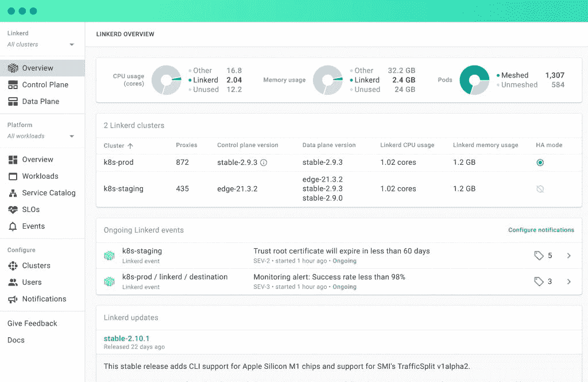

# 浮动云测试版带来简化的链接器

> 原文：<https://thenewstack.io/buoyant-cloud-beta-brings-simplified-linkerd/>

网络软件提供商[浮力](https://buoyant.io/)，最初开发 [Linkerd](https://linkerd.io/) 服务网格的公司，已经推出了[浮力云](https://buoyant.io/cloud/)的公共测试版，这是一套 SaaS 的诊断、性能管理和服务网格的按需支持功能。

虽然浮力首席执行官兼 Linkerd 创建者[威廉·摩根](https://www.linkedin.com/in/wmorgan)强调操作简单性一直是一个焦点，但他说他们希望浮力云能更进一步。

“无论是谁将 Linkerd 引入他们的组织，我们都希望减轻他们的运营负担。我们想为你解决这个问题，”他说。“我们想为您提供寻呼机，我们想让在生产中运行 Linkerd 成为一项简单的任务。这与我们从一开始就在 Linkerd 上所做的一切是一致的——我们的重点是非常注重操作的简单性，这样当你操作 Linkerd 时，你就不会处于这种可怕的境地，你需要雇用一个专家团队来维护你的服务网络。借助浮力云，我们有机会为您承担大量运营任务，让您获得 Linkerd 的所有优势，而无需支付运营成本。”

浮力云可以在任何 Linkerd 安装上运行，并向所有用户免费提供一组核心功能。虽然浮力云本身是 SaaS，但 Linkerd 仍然在用户的集群上本地运行，浮力云可以通过添加代理或使用浮力云扩展来安装，浮力云扩展是去年 3 月随着浮力云的悄然引入而添加的功能。与其他托管服务网格不同，比如谷歌 Kubernetes 引擎上的 Istio，Morgan 指出漂浮云可以在任何基础设施上运行。

浮力云处理的一些核心运营负担包括跟踪 Linkerd 数据平面和控制平面运行状况、服务网格生命周期和版本管理，以及添加一套以 SRE 为中心的工具，这些工具提供服务级别目标(SLO)、工作负载黄金指标跟踪和变更跟踪。因此，例如，浮力云将识别数据平面和版本不兼容性，并对网格安装和升级进行健全检查。在这些核心特性中，Morgan 说 Linkerd 的可见性是首要的。

“我们真正关注的第一件事是，我们能否让你对自己的部署充满信心，”他说。“无论您有多少个 Linkerd 集群，在某些情况下，我们指的是数百个生产集群，我们都希望您拥有针对每个 Linkerd 组件(包括代理)的一套非常基本的警报和监控设置，如果您需要解决任何问题，我们希望您能够主动收到通知。”

在过去的几个月里，浮力云一直处于私人测试阶段，在此期间，摩根说，该公司发现，对许多用户来说，Linkerd 本身的操作可见性是一个非常重要的功能。虽然像服务目录这样的功能——他们认为会很受欢迎——很好，但看看 Linkerd 是如何运行的更有意义。

“当你引入服务网格时，无论什么时候出了问题，你都会立即成为受责备的人。比如，'哦，这是服务网做'因此，让他们处于这样一个位置，因为他们实际上知道 CPU 消耗保持稳定和较低，并且实际上知道应用程序的这一部分的问题已经结束，这是采用服务网格的一个重要部分，”Morgan 解释说。

在过去的一年中，Linkerd 的安装量增长了 300%,但 Morgan 表示，尽管每个人都接受了服务网格的价值主张，但他们仍被复杂性的想法所困扰，而浮力云提供的可见性和管理有助于解决这一问题。

“人们不希望处于不得不雇用 Istio 专家团队或其他什么人的境地，”摩根说。“成为服务专家是我工作的一部分，但这并不是大多数人的工作。不应该是这样。你想让服务网运转起来，然后你想继续你工作的其他部分。”

展望未来，Morgan 说，浮力云将在它已经开始的基础上提供更多，例如，处理证书管理，超越检查版本不兼容，实际上完全处理安装和升级。

“我们今天所做的只是第一步。我们已经为您提供了一套基本的可观察性、警报和监控功能，让您对 Linkerd 部署充满信心，”他说。“但我们的下一步是加倍努力，让自己能够承担起这一运营负担。我们真的可以给你一个交钥匙服务网。我们现在还不能完全做到这一点，但这是未来浮力云的发展方向。我想让它成为你的堆栈中完全无关紧要的一部分，你不需要在它上面花费任何脑力。就是管用。”

<svg xmlns:xlink="http://www.w3.org/1999/xlink" viewBox="0 0 68 31" version="1.1"><title>Group</title> <desc>Created with Sketch.</desc></svg>