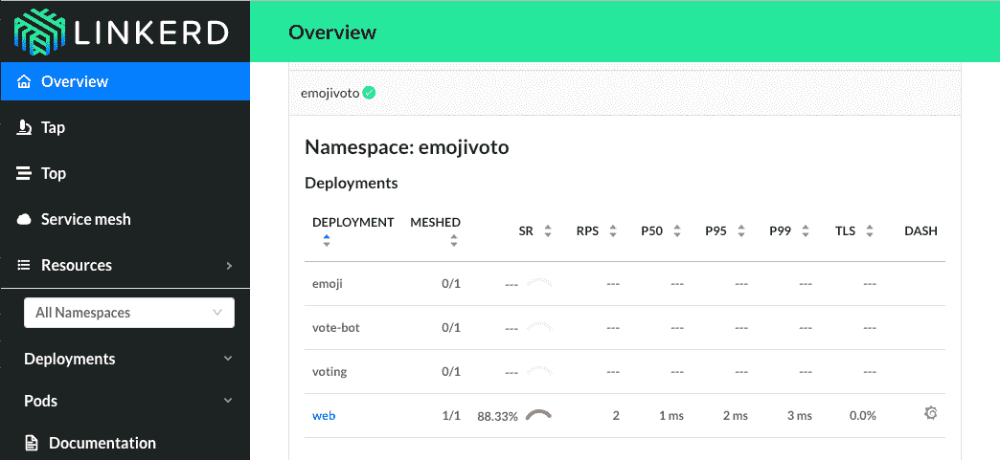

# 浮力大修 Linkerd，移动到一个更简单的服务网格模型

> 原文：<https://thenewstack.io/buoyant-overhauls-linkerd-moves-to-a-simpler-service-mesh-model/>

浮力已经完成了对其 [Linkerd](https://linkerd.io/) 服务网格的全面检查，用其先前的下一代服务网格项目[导管](https://thenewstack.io/conduit-lightweight-service-mesh-kubernetes/)替换了大部分代码基础。

管道代码库比基于 Java 的 Linkerd 更轻更快，并且与 Kubernetes 容器编排管理器集成得更紧密，首席执行官威廉·摩根指出。Morgan 指出，新的 Linkerd 还代表了服务网格架构方式的根本转变，它更加面向开发人员或“服务所有者”。

作为一个开源项目，自 2017 年初以来，Linkerd 一直由[云本地计算基金会](https://www.cncf.io/) (CNCF)管理。

性能改进的很大一部分来自于抛弃驱动 Linkerd Mark 1 的 Java 虚拟机(JVM)。Linkerd 的新控制平面是用 Go 语言编写的，这使得它很容易适应 Kubernetes 开发，而数据平面代理是用 Rust 编写的，Rust 是一种以速度和内存安全著称的语言。早期的管道使用发现，代理[将延迟](https://www.youtube.com/watch?v=RC_9ywj0yz8)最小化到了一毫秒。

“服务网状模型至少在两个方面被打破了，”摩根解释道。首先，像 Linkerd 这样的服务网格，以及像 [Istio](https://istio.io/) 这样的其他产品，往往是大型软件包。“它们都是复杂的技术，呈现为要么全有要么全无的命题，你要么安装这一大块技术，要么不安装，”摩根说。

以前版本的 Linkerd 是为在整个架构上工作而构建的，尽管新版本可以安装为在单个应用程序或服务上工作，作为单个“服务侧柜”，甚至不访问整个集群。Linkerd 的 sidecar-first 方法有可能为组织提供一个更容易的入口，以逐步迁移到面向微服务的架构。

Morgan 继续解释说，传统服务技术的第二个问题是，它将可用性集中在平台所有者身上，而不是开发者。“它为服务所有者提供的服务不足，而服务所有者才是真正需要使用这项技术来完成工作的人，”摩根说。

摩根说，新的 Linkerd 的 sidecar 方法首先迎合服务所有者或开发者，为他们提供自动可观察性、可靠性、遥测和运行时诊断，所有这些都不需要对应用程序代码本身进行任何更改。“我们让你能够看到你的服务，准确地看到流量来自哪里，以及它将流量发送到哪里，”摩根说。

Linkerd 还为平台经理带来了好处。它可以加密所有服务到服务的流量，例如通过 TLS。它可以生成证书并将它们分发给代理。

除了浮力之外， [Linkerd 项目](https://github.com/linkerd/linkerd2)已经获得了使用，并吸引了来自 Salesforce、沃尔玛、康卡斯特、CreditKarma、PayPal 和 WePay 等公司的投入。Conduit 项目始于去年，旨在解决该公司在 Linkerd 用于生产的 18 个月中注意到的一些问题和用户偏好。

摩根[在去年 12 月 8 月的 Kubecon 上告诉观众](https://www.youtube.com/watch?v=2trOvMUuLkk)，一些用户对 Linkerd 非常满意，而另一些用户对它有问题，还有一些用户因为各种原因根本不能使用它。

[https://www.youtube.com/embed/2trOvMUuLkk?feature=oembed](https://www.youtube.com/embed/2trOvMUuLkk?feature=oembed)

视频

早期的 Linkerd 工作也阐明了云原生环境中的角色。

“我们已经看到了这种角色的兴起，我们一直称之为‘服务所有者’，即负责构建服务，但也负责部署和维护服务的开发人员，”摩根告诉 New Stack。

在内部，bubbly 将这项工作称为“ServiceOps”，Morgan 将其描述为 DevOps 的云原生扩展。“你不拥有平台层，但你拥有服务的运行时和开发时间，这是更大的业务逻辑的一部分，”摩根说。

摩根说，Linkerd 不能向后兼容该软件的 1.x 版本，在许多情况下仍必须开发一个清晰的迁移路径。还必须做额外的工作来使 2.0 版与 1.0 版具有同等的功能。

虽然从 1.x 到 2.x 的升级路径将是用户的一次重大升级，但鉴于其新的代码库，CNCF [预计到了这一转变](https://blog.linkerd.io/2018/07/06/conduit-0-5-and-the-future/)。然而，围绕 Linkerd 的开源社区已经承诺在可预见的将来支持这两个版本的软件。

CNCF 将向后兼容性留给项目自己决定，但我们通常建议他们遵循 semver，”或[语义版本化，](https://semver.org/)CNCF 首席技术官[克里斯·阿尼斯奇克](https://www.linkedin.com/in/caniszczyk/)写道。Linkerd 在 CNCF 仍处于“酝酿阶段”,因此变化是意料之中的。

浮力和云计算原生计算基金会是新堆栈的赞助商。

通过 Pixabay 的特征图像。

<svg xmlns:xlink="http://www.w3.org/1999/xlink" viewBox="0 0 68 31" version="1.1"><title>Group</title> <desc>Created with Sketch.</desc></svg>