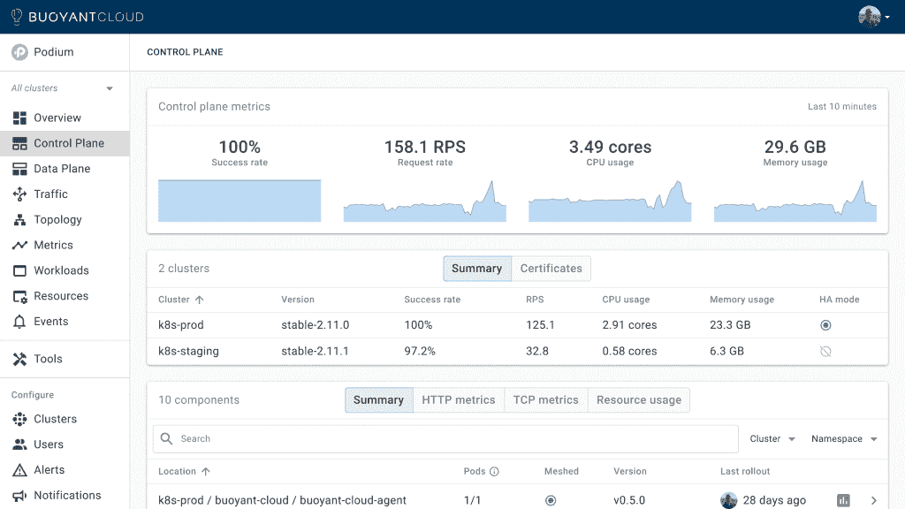
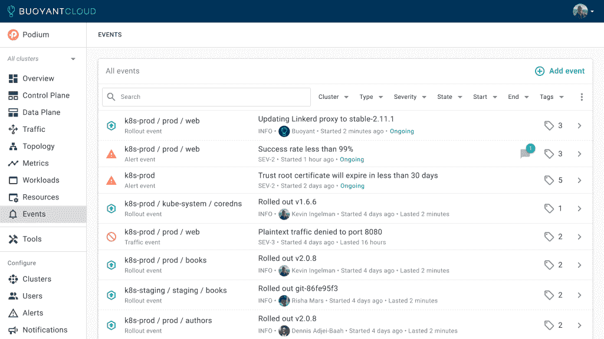
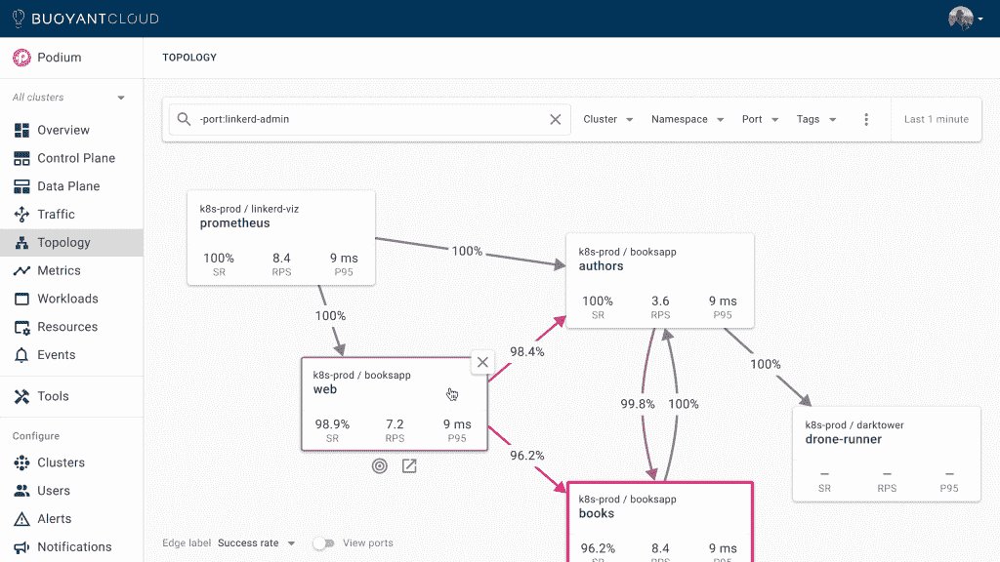

# 浮力希望使 Linkerd 更容易使用和管理

> 原文：<https://thenewstack.io/buoyant-wants-to-make-linkerd-easier-to-use-and-manage/>

根据定义，服务网格应该有助于降低与 Kubernetes 相关的复杂性。Linkerd 通常由较小的组织支持，作为比其他开源替代方案更容易部署和管理的服务网格，它可能会变得更容易使用，因为 fully 将其吹捧为“完全托管”的 Linkerd 到 bubbly Cloud。

## 自动化链接器

Linkerd 的创建者、浮力公司的首席执行官威廉·摩根告诉新的堆栈，浮力云现在将能够自动化 Linkerd 的升级、安装、回滚、数据平面版本同步等。摩根对 Linkerd 的创意哲学似乎也延续了 Twitter 的早期[，当时摩根的 Twitter 工程师同事寻求一种方法来简化平台的扩展，以适应数亿用户，这导致了 Linkerd 的创建。](https://thenewstack.simplecast.com/episodes/buoyant-ceo-on-linkerds-origins-during-twitters-heady-early-days)

“服务网格被广泛认为是任何成功的 Kubernetes 平台的关键组成部分，但该领域仍然因其复杂性而臭名昭著。在这个拥挤的环境中，Linkerd 以其对简单性和最小化运营负担的专注而脱颖而出，”摩根说。“浮力云新的全面管理功能将这种关注提升到了一个新的水平，允许 CNCF 旗舰服务网格的采用者将其视为真正的公用事业。浮力云针对 Linkerd 的完全托管体验消除了升级、监控和警报等维护任务，使组织能够以接近零的维护成本实现 K8s 集群的零信任流量安全等深远目标，并且无需成为服务网格专家。”

在此版本之前，Linkerd 的采用者能够利用 Linkerd 的操作简单性，但他们仍然需要执行升级等维护任务，这“在 Kubernetes 的快节奏生态系统中，是一个不小的负担，”Morgan 说。

摩根说:“虽然浮力云自成立以来就提供了对 Linkerd 集群的主动监控，使采用者晚上可以睡得安稳，但新版本提供了升级、信任锚轮换等任务的自动化，允许 SRE 团队将 Linkerd 的所有权‘移交’给浮力云，并从他们的工作中完全删除服务网格管理和维护。”

## 最终控制

Morgan 说，浮力云还允许对监控 Linkerd 部署进行更简单的控制，从控制平面到数据平面，但事情仍然可能出错。

“Linkerd 位于许多故障源的交叉点，包括网络、集群，当然还有您的应用程序本身。但是我们会以一种可预测的方式来做这件事，并给你最终的控制权。例如，让你的数据平面与你的控制平面保持同步需要——多亏了 Kubernetes 的不可变 pod——重启你的工作负载，” [Morgan 在一篇博文中写道。](https://buoyant.io/2022/05/04/announcing-fully-managed-linkerd-with-buoyant-cloud/)“浮力云将只在您允许的工作负载上，以您指定的确切方式，毫无意外地做到这一点。只有当你准备好了，升级你的控制平面才会发生，如果任何事情不幸出错，现有的控制平面不会被移除。诸如此类。”

对于那些可能刚刚接触 Kubernetes 或者可能只想开始一个沙盒项目的组织来说，目前，浮力云的 Linkerd 可能是合适的，因为它的准入门槛较低。

“想要 Linkerd 的强大功能，但不想投资于自己管理它的维护和运营负担的团队，可以在任何集群和任何云上轻松使用浮力云的新‘完全托管’功能集，”摩根说。

<svg xmlns:xlink="http://www.w3.org/1999/xlink" viewBox="0 0 68 31" version="1.1"><title>Group</title> <desc>Created with Sketch.</desc></svg>