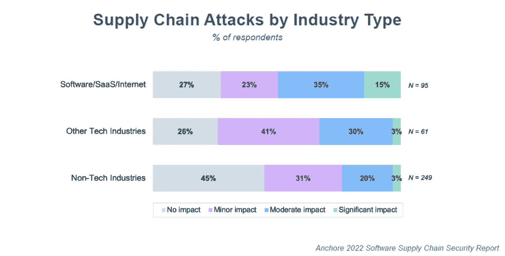
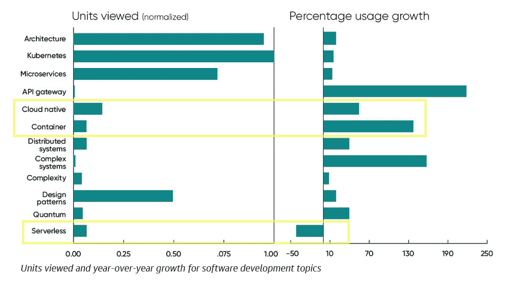
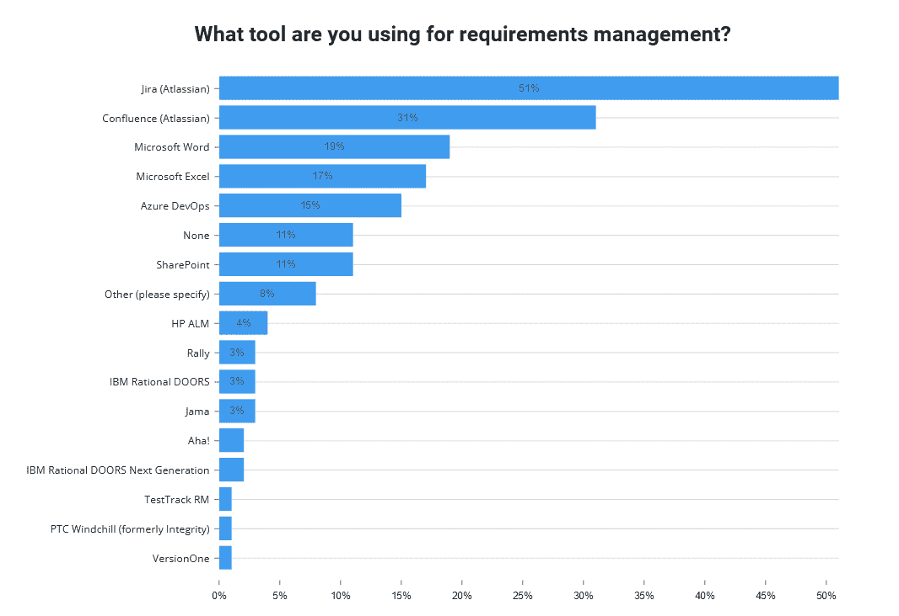

# 烧毁房屋:量化 Log4j 的影响

> 原文：<https://thenewstack.io/burning-down-the-house-quantifying-the-impact-of-log4j/>

12 月 3 日至 22 日对 428 名 IT 和安全负责人进行的调查表明，人们认为 [Log4j](https://thenewstack.io/log4shell-we-are-in-so-much-trouble/) 漏洞(12 月 10 日公开披露)产生了直接影响。

如 [Anchore 的](https://anchore.com/?utm_content=inline-mention) [2022 年软件供应链安全报告](https://anchore.com/blog/2022-security-trends-software-supply-chain-survey/)所述，在 Log4j 事件之前，只有 22%的研究参与者报告在过去 12 个月内受到软件供应链攻击的中度或显著影响。在 Log4j 事件后，回答调查的人中，这一数字跃升至 35%。这证明社区已经注意到了。也许“影响”是指关注度，而不是实际成本。通常，新闻事件的重要性会随着记忆的消逝而下降，所以我们还不知道这是否会对安全产生长期影响。

该报告还再次表明，软件、SaaS 和互联网安全公司处于对抗供应链攻击的前线。在这些类型的公司中，50%的受访者报告在过去 12 个月中遭受了中度或严重的供应链攻击，而在非技术公司中，这一比例仅为 35%。软件材料清单(SBOMs)是这场斗争中的一个工具。到目前为止，整个调查中有 36%的人声称正在为他们构建的软件创建 SBOM，但是在使用 sbom 来跟踪他们自己的应用程序或监控漏洞方面，这个数字要低得多。

## O'Reilly 和 SmartBear 报告摘录

由于奥赖利学习平台的 [2021 年使用趋势的报道，无服务器相关内容的浏览量下降了 41%。相比之下，容器内容浏览量增长了 137%。O'Reilly 的受众倾向于保守，我们注意到其他云的本地趋势似乎得到了准确的体现。他们看到了对 Kubernetes 认证培训的需求激增，2021 年，管理员(](https://www.oreilly.com/radar/technology-trends-for-2022/) [CKA](https://www.cncf.io/certification/cka/) )和开发人员( [CKAD](https://www.cncf.io/certification/ckad/) )的受欢迎程度都大幅上升。

来源:O'Reilly 学习平台的 2021 年使用趋势

2020 年，在疫情期间，用户故事在代码审查期间被降低优先级。根据 SmartBear 的年度软件质量 |代码评审状态[，在 2020 年，不到 34%的测试人员和开发人员在他们的评审中包含了用户故事，但这一比例在 2021 年跳回到近 50%。可能还需要一两年的时间来确定这是否会对软件质量或用户体验产生影响。调查还发现，需求也越来越多地被包含在代码评审中。](https://smartbear.com/state-of-software-quality/code-review/)

接下来的一个问题是关于使用什么工具来跟踪需求。Atlassian 的吉拉和 Confluence 是目前的市场领导者。不是针对特定用例的微软生产力工具是亚军。应用程序生命周期管理和测试供应商的完整阵容没有包括在调查的问题中，但如果他们是，会改变结果吗？需求管理是一项功能，但它本身可能不是一个市场。你怎么想呢?

![Review has expanded beyond code. All artifact review types except Schematics saw a significant increase as a part of teams' review process. [this description comes from SmartBear's website]](img/7d646534012c10950446f7202801c7e4.png)

来源:SmartBear Software 的软件质量状态|代码审查 2021

<svg xmlns:xlink="http://www.w3.org/1999/xlink" viewBox="0 0 68 31" version="1.1"><title>Group</title> <desc>Created with Sketch.</desc></svg>