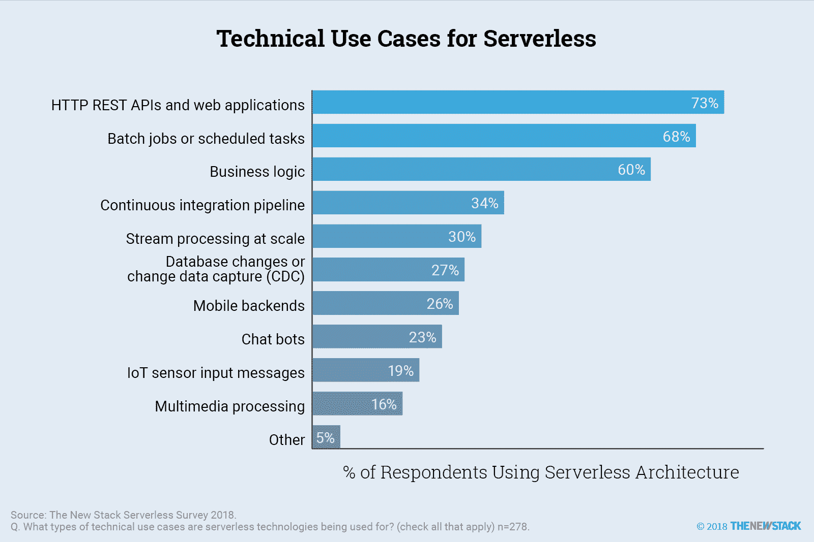

# 业务逻辑是无服务器的主要技术用例

> 原文：<https://thenewstack.io/business-logic-is-a-leading-technical-use-case-for-serverless/>

根据新堆栈调查的 278 名真实无服务器采用者，REST APIs、批处理作业和调度任务以及业务逻辑是无服务器架构最常见的用例。许多这样的 web 应用程序都有执行事件的内置逻辑，比如发送电子邮件或者将记录保存到数据库。一般来说，当对资源的需求不可预测且时断时续时，开发人员可以看到显著的成本节约。因此，尽管处理图像可能在大多数网络应用中并不流行，16%的无服务器用户将多媒体处理作为他们的技术用途之一。同样，尽管大多数应用程序不使用物联网输入传感器，但 19%的受访者表示这是他们的技术用例之一。

60%的人说业务逻辑是他们的技术用例之一，许多开发人员会发现他们越来越多地参与到企业架构中。将业务逻辑作为技术用途的公司更有可能从事商业生产力和面向消费者的应用。事实上，在使用业务逻辑的企业中，43%的企业希望使用无服务器功能(FaaS)来部署 CRM 或电子邮件等业务应用。我们怀疑对业务逻辑的关注实际上会导致低代码平台的使用增加，这些平台对于业务分析师和经理来说很容易使用。

事实上，Evans Data 的研究表明，开发人员倾向于低代码或无代码开发环境并没有明显的原因。相反，至少在短期内，开发人员可能已经找到了一个合适的位置，他们使用命令行编程的能力对于产品、销售和营销团队的新应用程序(越来越多的无服务器架构中的事件驱动应用程序)将是无价的。

我们调查的更多数据和分析可以在我们的“[无服务器技术指南](https://thenewstack.io/ebooks/serverless/guide-to-serverless-technologies/)”中找到

* * *

近二十年来，Lawrence Hecht 一直致力于企业 IT 市场的分析和报告。他使用调查、访谈和非传统的市场研究技术来分析分布式和分散式技术。

通过 Pxhere 的特征图像[。](https://pxhere.com/en/photo/1200497)

<svg xmlns:xlink="http://www.w3.org/1999/xlink" viewBox="0 0 68 31" version="1.1"><title>Group</title> <desc>Created with Sketch.</desc></svg>