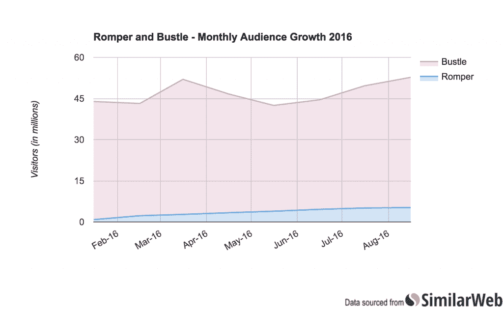
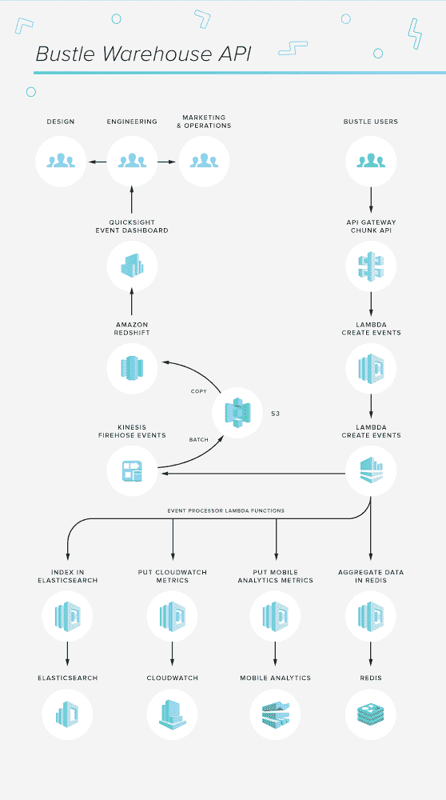

# business 如何使用无服务器架构来管理每月 5200 万的访客

> 原文：<https://thenewstack.io/bustle-migrated-100-million-events-per-day-product-serverless/>

老牌科技公司开始考虑将其生产环境迁移到无服务器架构。

典型的例子:喧嚣。根据网络数据公司 SimilarWeb 的数据，这家媒体公司目前发布了两个网站，分别是[business](http://bustle.com/)(面向千禧一代女性)和新推出的 [Romper](http://romper.com) (面向千禧一代父母，尤其是千禧一代母亲)，每月访客总数超过 5200 万，并且还在不断增加。

拥有如此受众规模的现代媒体网站需要一个数据驱动的架构，能够与社交媒体集成，实时分析趋势和共享内容，并将调查结果报告给编辑、作者和广告商。business CTO Tyler Love 说这意味着有大约 12 个 API 投入生产使用。可能会更多，但是 Bustle 已经转移到了 GraphQL，并在这个过程中废弃了它的许多内部 API。

通过这些 API，该公司可以收集和分析每天发生的超过 1 亿次事件的数据，通常按设备进行拆分分析，因为会话体验会因读者如何消费 business 的内容而有很大差异。

作为首席技术官，Love 的工作重点是确保网站能够继续扩展，同时降低工程师的运营复杂性，帮助团队专注于内容产品，并促进编辑部使用数据来了解读者如何参与。这就是[无服务器](/category/serverless/)带来最大优势的地方:数据洞察速度加快，编辑团队可以更好地实时响应他们在读者参与中看到的趋势。

因为爱，无服务器已经足够成熟，可以在大规模生产环境中被信任。然而，为了利用该架构，他们发现有必要超越默认配置(特别是对于监控任务)，并构建了一些自己的开源工具来补充和增强 AWS 的产品。但回报是，一旦这些配置和工具到位，工程师在运营问题上花费的时间就会减少(如果有的话)。

虽然是 AWS Lambda 的早期采用者，但它结合了 AWS 的两个其他产品——[kine sis](https://aws.amazon.com/kinesis/)和[API Gateway](https://aws.amazon.com/api-gateway/)——共同允许 Bustle 将其完整的生产环境迁移到无服务器环境。

“我们是 Ruby 和 JavaScript 开发人员，所以我们有一个 Java 应用程序，它的复杂性一直在增长，”Love 解释道。“两年前，当我们第一次访问 Lambda 时，我们能够开始处理 Kinesis feed，我们在几天内为 [Re:Invent](https://reinvent.awsevents.com/) (亚马逊的年度用户大会)制作了一些原型。在那个阶段，我们有几个实例在生产中运行，从长远来看，我们不想管理自动扩展这种东西。因此，当 AWS 宣布 API Gateway 时，这确实引起了我们的注意。我们认为我们不必管理我们的 Rails 服务器…由于所有这些自我管理的节点实例，复杂性已经在增加，”Love 说。

“我们管理着许多服务，感觉就像是一个接一个的节点服务器，所以当 API Gateway 和 Lambda 可用时，我们很快开始将服务器转移到 API Gateway 和 Lambda 上。他们一发布，我们就从中获得了价值。”

## 当生产部署到无服务器时

随着核心基础设施现在在 AWS 平台上运行，Love 的团队希望测试他们是否可以更进一步，在无服务器环境中完全管理面向用户的产品。当 business 在 AWS 上运行时，生产中仍然有许多 DevOps 任务。随着 Romper title 计划的即将发布，Tyler 的团队在问，他们能否制作一个具有所需的所有复杂约束的面向用户的网站:他们能否仍然确保搜索引擎优化，确保机器人和爬虫程序可以访问该网站，他们能否设置响应头，处理 301 重定向，并动态设置位置，所有这些都在一个无服务器的环境中？

新网站——一个使用 AWS[elastic cache](https://aws.amazon.com/elasticache/)的 JavaScript 单页——是为了高效扩展而构建的，并在 AWS API Gateway 之上发布。“这是一个很好的试验平台，让我们可以将 business 移植到同样的架构上，”Love 说。

Love 表示，随着 business media 产品的推出，每天有 200 万到 300 万的独立访问者，在实施新计划时几乎没有猜测的空间。

“在任何一天，我们收集 1 亿个事件，这些事件都被发送到 API 网关端点，”Love 说。这些由 Lambda 函数处理，清理成规范化的事件(例如，服务器设置时间戳、用户代理信息和添加设备分段)，然后写入 Kinesis 流。然后，Kinesis 流的消费者可以在 Redis 中看到内容的实时原始计数和聚合。：

“我们正在做大量的增量和减量来渲染 Redis 中的时间序列，”Love 解释道。“现在，你或多或少可以用 Kinesis 做到这一点，它不需要 Redis，这是我们将滚动到的东西。我们用它做了几个实验，它真的简化了我们的工作。”

随着向无服务器迁移，一个关键的体系结构组件发生了变化，即删除了 DevOps 进程，该进程在内容意外传播时对读者数量的突然增加做出响应。

“在无服务器之前，如果达到某个阈值，就会向开发人员发出警报。他们需要知道我们必须监控服务，并提醒编辑——通常通过一个宽松的通知——以便他们可以非常迅速地对突发新闻做出反应，”Love 解释道。“过去，我们有很多监控，但现在有了无服务器环境，我们正在与 CloudWatch 集成，以设置事件和阈值的频率。因为我们处于这种环境中，所以我们不做任何事情来管理警报；我们只需配置一次。”

软件工程师[扎拉·贾比尼](https://github.com/zeejab)一直在领导向无服务器的迁移。这主要包括重写 [Ember.js](http://emberjs.com/) 中的前端应用程序。虽然以前的基础设施也使用 Ember，但 Jabini 表示，更容易进行完全更新，可以与 GraphQL 的新实现进行对话，并允许团队将后端的部分内容逐步转移到 Lambda，“而不必对后端代码进行大规模重写”。

“我想说，我们的客户端架构最酷的一点是，我们在[内容交付网络，或 CDN]部署一次我们的应用程序，用户就可以下载它。我们只需部署一次，亚马逊就会根据需要运行多次。因此，对于像我们这样的网站，我们可以专注于打造真正酷的产品，而不必担心我们的网站崩溃。

《爱》举了一个例子来说明为什么《喧嚣》在读者中如此受欢迎:“一个很好的例子是我们的流程图。他们是一个例子，说明编辑和设计师可以通过合作来做什么。因此，仅仅基于保持一些层命名惯例，它显示了在一个 [SVG](https://developer.mozilla.org/en-US/docs/Web/SVG) 中平移和查看可以做什么。我们如何才能创造出吸引读者、让品牌留下深刻印象的优质产品？通过做一些非常酷的事情，我们可以欺骗浏览器，我们最终设计了一个完整的[内容管理系统]，这样编辑和作者可以在一两天内构思出一个流程图。”

通过移动到无服务器，business 避开了这个庞然大物。不仅仅是大型企业面临遗留系统的技术债务。当一家快速成长的初创公司达到扩大规模的阶段时，通常情况下，工程团队最终实际上不得不拒绝任何功能增强的建议，因为初创公司现在已经在处理一个笨重的大型代码库。解决这个问题的通常途径是，创业公司将他们新创建的 monolith 迁移到微服务架构中。

但是通过在 Lambda 等无服务器架构元素的基础上构建，business 已经能够避免这个常见的陷阱。“我们与我们的设计师密切合作:他们会给我们他们想要我们建造的东西和他们的愿景，我们不必对他们说不，”Jabini 说。“它让我们逐步改进应用程序，而没有人担心会陷入使用 monoliths 获得的巨大源代码中。”Jabini 还指出了组织内部的字符串开源文化，这也意味着工程师要承担个人责任，确保他们构建的任何东西都有良好的文档记录。

## 无服务器的商业优势

乐福说，新的无服务器架构已经对 business 的业务方面产生了巨大的影响。特别是以易于使用的形式提供数据，以便各种业务单位可以进行自己的分析，并建立自己的仪表板和工具，以更好地通过读者参与实时查看正在发生的事情。

这从 [Kinesis Firehose](https://aws.amazon.com/kinesis/firehose/) 开始，它实时处理来自 Kinesis feeds 的事件，并将它们写入 AWS [简单存储服务](https://aws.amazon.com/s3/) (S3)，然后它们能够在 ElastiSearch 或 AWS 的数据仓库服务[红移](https://aws.amazon.com/redshift/)中进行分析。

“消防软管解决了很多问题，”爱说。“现在我们有了一个数据存储，可以轻松扩展并进行大量分析。任何数据库数据分析师都可以访问它。随着网站的发展，我们的内容库存的增长，以及广告收入需求的增长，我们希望使用我们的产品来更好地吸引用户。

使用无服务器，我们将这些事件馈送集成到我们的数据仓库中，无需考虑我们如何扩展，我们就可以分析每天有多少故事被滚动浏览，以及哪些类型的故事得到再循环。做 clickbait 是一回事，但是我们想问在会话持续期间发生了什么？我们营销的内容实际上更吸引人吗？"

Love 说，这里真正有趣的是，没有人在做操作，每个人都了解 Lambda 是如何工作的，以及写入数据库的最佳实践。市场营销现在可以把每个故事的每次印象成本精确到中心，工程师可以用它来对故事进行算法排序，产品工程师现在可以根据事件进行对话。

“任何人都能够快速构建仪表板，通常只需很少的工程工作。我们能够培训技术含量较低的数据分析师和营销人员来理解这些数据，”洛夫说。

洛夫说，因此，当一种新媒体产品或内容类型推出时，产品团队可以看到读者如何参与其中，做出一些改变，“然后就离开它。”产品增强变成了通过数据来识别易得的果实，然后改善整体体验，这通常会在几周内得到显著改善。洛夫指出，改进的幻灯片媒体类型是一个例子，说明数据如何在几周内告知并改善了读者体验，现在几乎不需要任何进一步的修补。

## 激发生态系统

Bustle 工程团队已经在内部创建了几个工具集，以帮助加快他们在新的无服务器环境中的工作流程。一个开源项目 Shep 是一个使用 AWS API Gateway 和 Lambda 构建 API 的框架。该团队还创建了一个 CLI 工具，使用 [Fastboot](https://www.ember-fastboot.com/) 在 Lambda 中运行基于 Ember 的应用程序。

“CLI 允许您在 Gateway 中创建端点，而无需使用控制台，这可能会有点繁琐，特别是当您创建大量 API 时，使用 Shep，您可以用一种方式一致地管理它们，”Love 说。其他的内部工具包括一个原型工具，可以快速地将它放入 API gateway。

“我们希望成为构建工具，以便作家和编辑可以在不知道如何编码的情况下构建引人入胜的内容，”Love 说。

管理喧闹(和嬉戏)的观众规模的能力很好地表明了无服务器架构所展示的坚实基础。事件数据的处理量接近实时，当流量突然增加时，NoOps 需要管理快速扩展，这也预示着无服务器在管理物联网应用程序方面的潜力。

*要了解更多关于无服务器技术的信息，请查看我们最新的" [TNS 无服务器技术指南:FaaS 和 BaaS 的精华](https://thenewstack.io/guide-serverless-technologies-functions-backends-service/)"*

<svg xmlns:xlink="http://www.w3.org/1999/xlink" viewBox="0 0 68 31" version="1.1"><title>Group</title> <desc>Created with Sketch.</desc></svg>