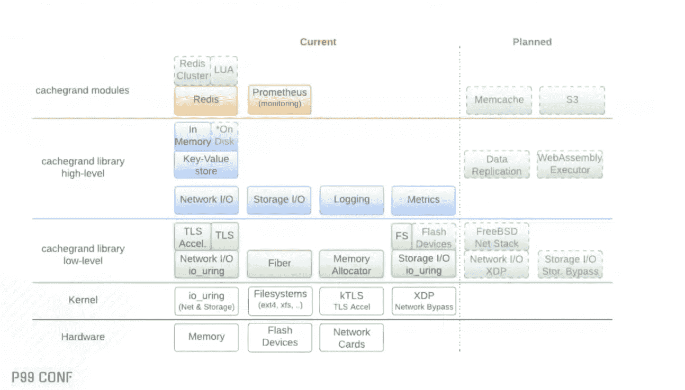
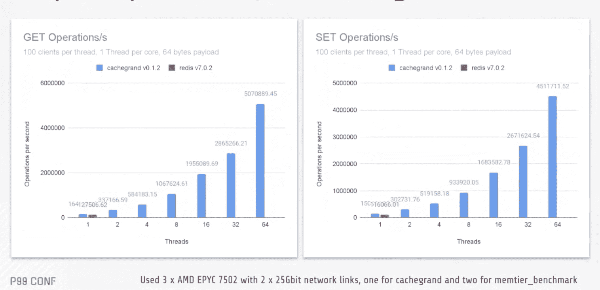
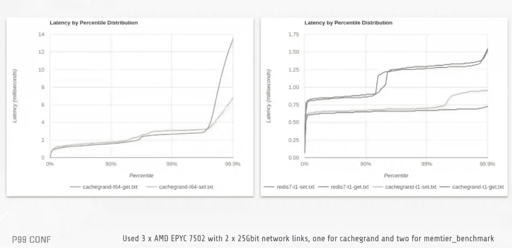
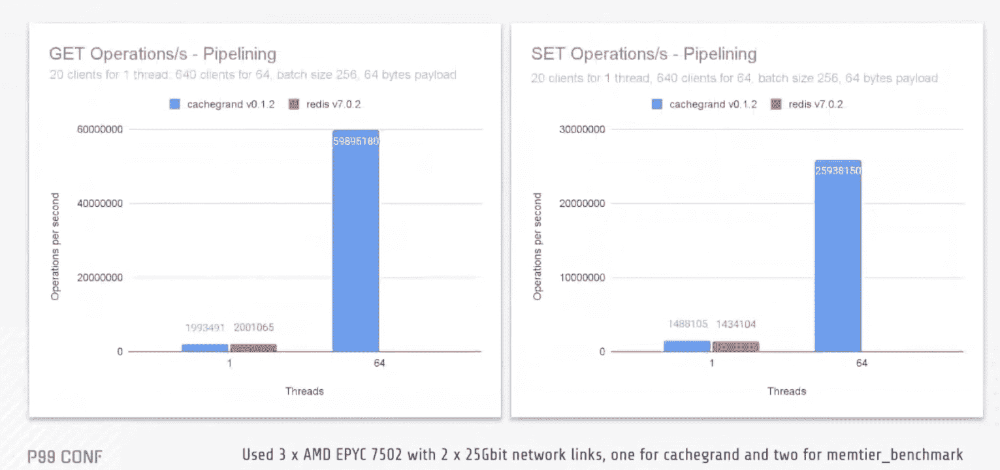
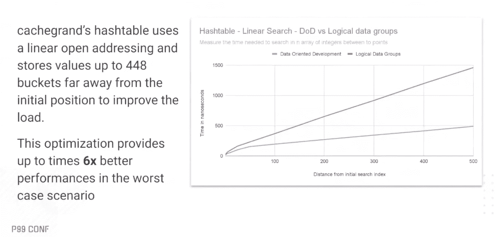
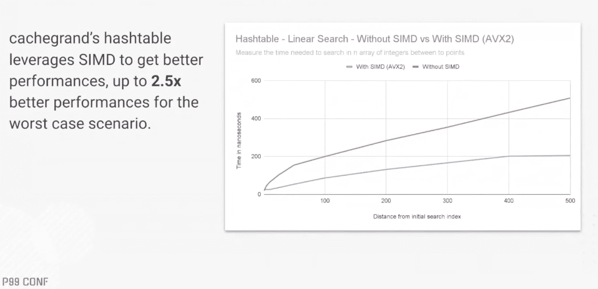
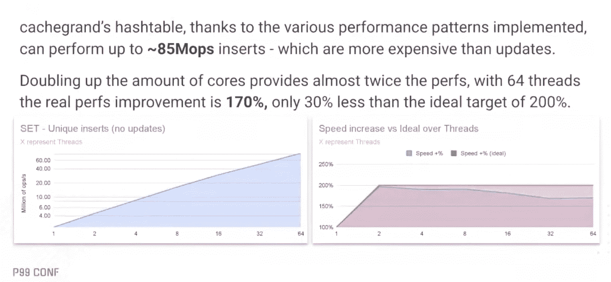
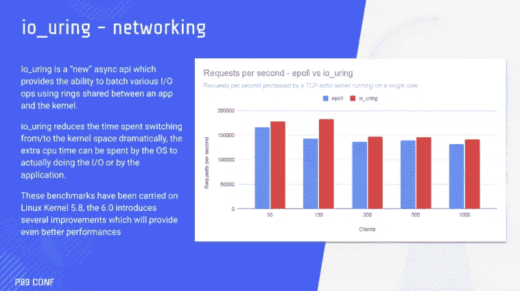
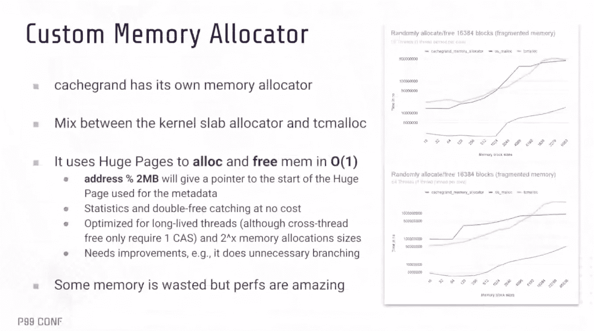
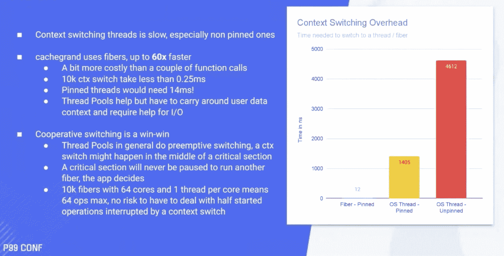

# Cachegrand，用于面向数据开发的快速、可伸缩的密钥库

> 原文：<https://thenewstack.io/cachegrand-a-fast-scalable-keystore-for-data-oriented-development/>

显而易见，微软高级软件工程师[丹尼尔·萨尔瓦托·阿尔巴诺](https://www.linkedin.com/in/danielesalvatorealbano/)创建的[开源项目](https://thenewstack.io/survey-open-source-programs-are-a-best-practice-among-large-companies/)cache grand 是一项充满爱心的工作。

“我喜欢表演。真的，在我看来，没有充分的理由让硬件得不到充分利用，”Albano 说。这不仅是对缓存的赞赏，也是对应用程序的赞赏。“我们花费金钱或资源，所以我们应该使用它们，”阿尔巴诺说，并指出我们应该尽量减少使用性能不佳的工具带来的浪费。

Albano 在 ScyllaDB 的 P99 Conf 2022 上的演讲“Cachegrand:A take on High-Performance Caching”中，将 cache grand 描述为“现代、超快的开源缓存平台，专为性能而设计，为速度而构建”。该软件用 C 语言编写，垂直扩展(几乎是线性的)，旨在与大多数已知的缓存解决方案兼容。

他还坦率地谈到了它的一般用途和特定用例的较慢速度，尽管没有具体列出来。 [Redis](https://redis.com/?utm_content=inline-mention) 是最接近的竞争对手，本文后面会有一些并排比较。我们喜欢这些大型科技公司的开源竞争，让他们保持警觉。

在 1x AMD EPYC 7502 32 内核、64 线程、256GB RAM @3200mhz、Ubuntu 22.04、64 字节有效负载的 memtier 上进行基准测试时，CacheGrand 达到了以下指标:

*   高达 5.1 拖把 GET/ 4.5 拖把 SET，估计比 [Redis](https://redis.com/?utm_content=inline-mention) 快 40 倍，负载多 64 倍

*   最多 60 块拖把 GET/ 26 块拖把套装，带配料功能

## **系统设计**

构建是模块化的，在低级功能的基础上构建一个高级功能层。上层是模块。Albano 正在进行更新，将包括对 [Memcache](https://thenewstack.io/how-pinterest-tuned-memcached-for-big-performance-gains/) 、 [Kafka](https://thenewstack.io/apache-kafka-cornerstone-iot-data-platform/) 、 [GraphQL](https://thenewstack.io/distributed-graph-with-graphql/) 的支持，其他技术也在考虑之中。

## **Cachegrand 在行动**

以下是一些没有批处理的每秒请求数图表:

第一栏是和 Redis 的直接对比。Cachegrand 并行处理的请求比 Redis 多，同时还多处理 6，400 个客户端(所有请求同时运行)。Cachegrand 可以处理几乎翻倍的请求，直到大约 32 时，更多的资源需要分配给操作系统和网络系统。

以下是一些延迟:

在左侧，cachegrand 使用 64 个线程，这意味着该机器已被 6400 个客户端饱和，但仍显示出非常好的 P99 和 P99.7 延迟。

每秒批处理请求数。

上图中的所有请求都是由 memtier 发送的。左边的图表是用 256 GET 生成的，右边的是用 256 SET 生成的。

Cachegrand 针对速度进行了优化。它的基础设施包括一个定制的内存分配器，使用纤程而不是线程池，以及增强性能的数据结构。

## **数据结构**

面向数据的开发，即为 CPU 提供优化和组织数据以更好地利用缓存行的开发过程，是 cachegrand 中使用的开发方法。

这在对哈希表进行线性搜索的能力中显而易见。cachegrand 中的哈希表使用两个独立的数组——一个只有哈希值，包含所有顺序值，另一个包含键和值，这与标准哈希表不同，标准哈希表只使用一个包含键和值的数组。拥有这两个数组的价值在于，CPU 需要读取更少的数据来确定这是否是它想要访问的数据。它有助于加速这一过程。

线性搜索优化。

下一个数据结构，单指令多数据(SIMD)允许程序定义一组指令，一个操作，必须在不同的数据上执行(例如 AVX2 高达 265 位)。SIMD 涵盖了广泛的用例，从复杂的数学计算到简单的东西，如线性搜索。

SIMD 优化。

cachegrand 中的 hashtable 数组本质上是一个巨大的数组，该数组被分解成由 14 个元素组成的桶或块，每个元素都有自己的元素。一个有 10，000 个键的哈希表将有不到 1，000 个自旋锁。

只要不写入同一个键，就不会发生争用。这大大提高了性能，因为它读取整个状态的负载。当存在争用时，自旋锁有助于减少延迟。

局部自旋锁优化

Albano 列出了一些新的更新，随着这个项目的继续发展，虽然没有列出任何具体的内容，也没有列出任何发布日期。这将是一个非常有趣的话题，也是一个非常有趣的话题。

<svg xmlns:xlink="http://www.w3.org/1999/xlink" viewBox="0 0 68 31" version="1.1"><title>Group</title> <desc>Created with Sketch.</desc></svg>