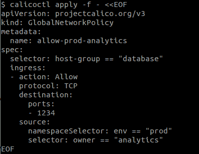
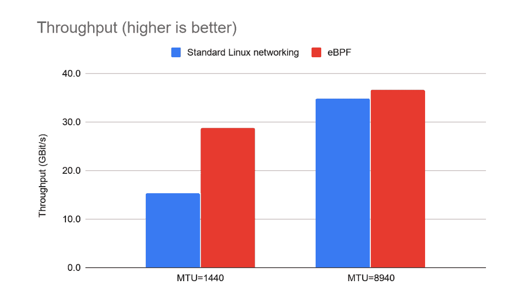
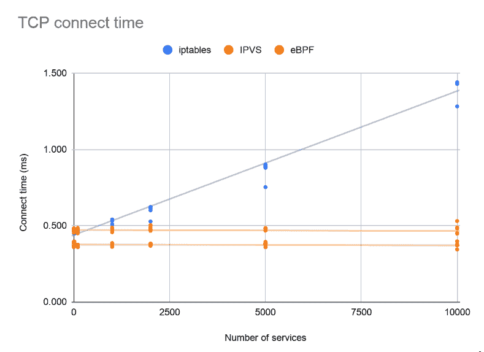
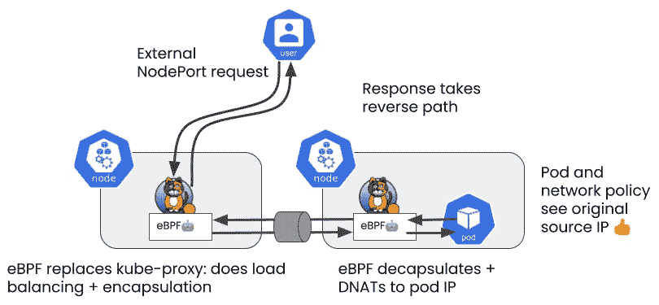

# Calico 扩展 eBPF 数据平面以提供主机保护

> 原文：<https://thenewstack.io/calico-extends-ebpf-data-plane-to-offer-host-protection/>

 [肖恩·克兰普顿

肖恩是 Tigera 的首席软件工程师，是 Calico 项目的核心开发人员。在加入 Tigera 团队之前，Shaun 从事过许多软件定义的网络产品和云级应用。他拥有剑桥大学计算机科学的数学硕士学位。](https://www.linkedin.com/in/shaun-crampton-88633323/) 

[Calico](https://www.projectcalico.org/) 是 Kubernetes 最广泛使用的网络和安全解决方案。在最新的 3.18.0 版本中，Calico 团队扩展了其 [eBPF](https://thenewstack.io/beyond-kube-proxy-tigera-calico-harnesses-ebpf-for-a-faster-data-plane/) 数据平面，以提供对[主机保护](https://docs.projectcalico.org/security/hosts)的支持。这使它符合久经考验的标准 Linux 数据平面。当与 Calico 的[自动主机端点](https://docs.projectcalico.org/security/kubernetes-nodes)功能结合使用时，这提供了一种使用统一策略模型保护 Kubernetes pods 和主机的可靠方法。

在当今瞬息万变的安全环境中，攻击是自动进行的，因此最大限度地降低受损工作负载的爆炸半径非常重要。一个关键的防御措施是采用一个最小特权模型:使用安全策略来限制每个工作负载，以便它可以只访问它需要的东西。但是，如果您的工作负载是还需要访问外部主机的 Kubernetes pods，您如何将对主机的访问限制为仅“分析团队拥有的 prod 命名空间中的 pods？”

使用传统的 IP 和端口防火墙，无法跟上一组不断变化的短暂 Kubernetes pods 现在属于一个 pod 的 IP 可能在几秒钟内属于另一个 pod。只有云本地解决方案能够实时理解不断变化的 pod 身份、标签和选择器。这就是为什么很久以前，Calico 团队将其安全策略扩展到涵盖主机和工作负载。通过部署 Calico 进行主机保护和 pod 安全保护，您的主机保护策略变得与您的工作负载策略一样动态。它匹配的不是静态 IP 地址或 CIDR 地址块，而是工作负载的*身份*(包含在其元数据标签中)。

Calico 的 eBPF 数据平面利用 Linux 内核的嵌入式 eBPF 虚拟机来实现比 iptables 更灵活、更强大的数据路径。扩展带有主机保护的 eBPF 数据层是 Calico 将 eBPF 数据层的灵活性与标准 Linux 数据层的完整功能集相结合的努力的一部分。然而，Calico 对 eBPF 数据平面的目标不仅限于奇偶校验！

eBPF 数据层*已经*在几个方面超过了标准的 Linux 数据层。对于负载平衡流量，它具有出色的性能和更低的延迟(即使在 IPVS 模式下也优于 kube-proxy):

好处不仅限于性能；eBPF 的灵活性带来了一些重要的可用性改进。以前，很难识别从群集外部到达 pod 的流量的源 IP，这导致了可观察性和记帐方面的挑战，而这两个方面在许多使用情形下对许多工作负载都很重要。

使用 Calico 的 eBPF 数据平面替代 kube-proxy，外部连接的源 IP 得以保留:

这使得编写安全策略更加容易，并使访问日志更有意义。

最后(就目前而言)，如果您的网络支持，eBPF 数据层允许“直接服务器返回”，这允许支持节点直接响应外部客户端，从而进一步减少延迟。这种特性在非 eBPF 方法中是不可能实现的，我们很高兴看到 eBPF 数据平面的下一步走向。

你知道你可以成为一名认证印花布操作员吗？在这个[免费的自定进度认证课程](https://academy.tigera.io/course/certified-calico-operator-level-1/)中，使用 Calico 学习 Kubernetes 网络和安全基础知识。

<svg xmlns:xlink="http://www.w3.org/1999/xlink" viewBox="0 0 68 31" version="1.1"><title>Group</title> <desc>Created with Sketch.</desc></svg>