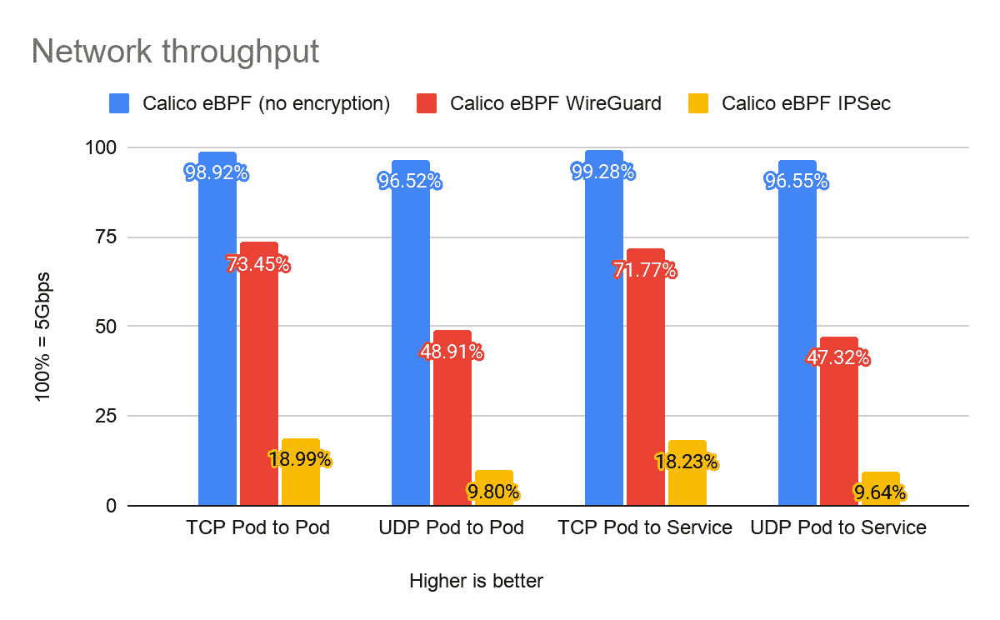
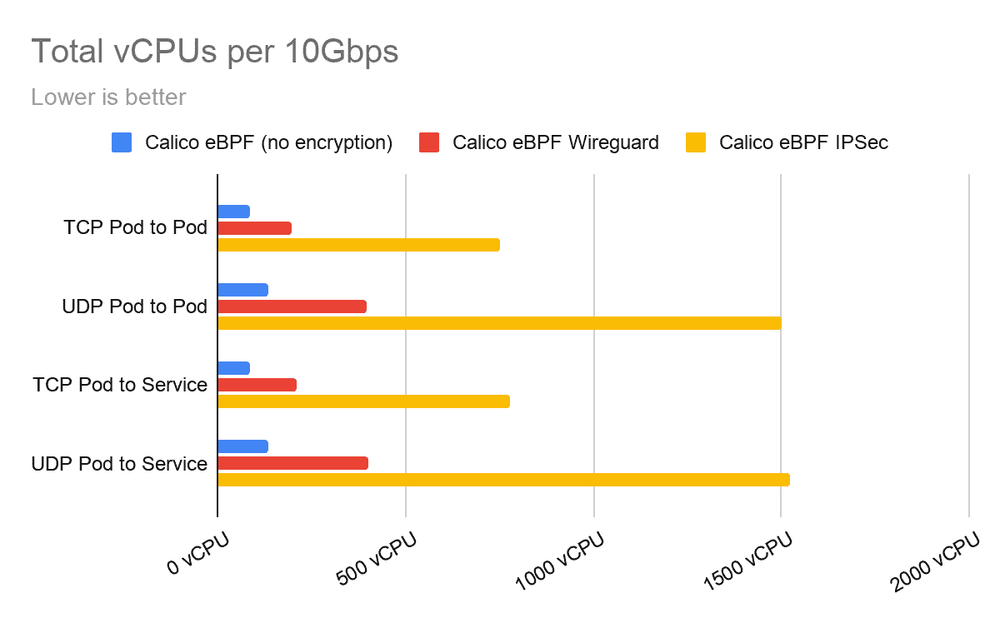

# 使用 kOps 将 Calico 与 WireGuard 集成

> 原文：<https://thenewstack.io/calico-integration-with-wireguard-using-kops/>

[](https://www.linkedin.com/in/rramezanpour/)

[Reza Ramezanpour](https://www.linkedin.com/in/rramezanpour/)

[Reza 是 Tigera 的一名开发人员，致力于促进 Calico 项目的采用。在加入 Tigera 之前，Reza 是一名系统工程师和网络管理员。](https://www.linkedin.com/in/rramezanpour/)

[](https://www.linkedin.com/in/rramezanpour/)[](https://www.linkedin.com/in/rramezanpour/)

我很久没有兴奋地写关于加密隧道的文章了。可能是排除旧技术故障的纯粹痛苦，或者是无数个小时掉进项目源代码的兔子洞，总是激励我追求更好的替代方案——运气不太好。然而，我相信幸运最终会站在我这边。

在这篇博客文章中，我们将探索使用开源的 [WireGuard](https://www.wireguard.com/) ，一种提供具有卓越性能和轻松实现的加密隧道的新技术，在 Kubernetes 集群中的工作负载之间建立安全的加密隧道。

## 简介:铁丝网

随着 2020 年 6 月开源 Calico 3.14 的发布， [Tigera](http://tigera.io) 宣布了其 [WireGuard 集成](https://www.projectcalico.org/introducing-wireguard-encryption-with-calico/)的技术预览，该技术允许使用 WireGuard 加密节点到节点的流量。

TLS 等其他加密方法可用于在更高的 TCP/IP 层(在本例中为应用层)加密工作负载流量。然而，WireGuard 的目标是较低层的流量，即传输层，这使得它可以有效地用于更广泛的应用程序，同时也降低了用户的复杂性。

WireGuard 是一个开源项目，它使用 Linux 内核功能实现虚拟专用网(VPN)技术来建立安全的点对点连接。它的目标是比以前的技术更快、更简单、更精简。由于只有大约 4，000 行代码，WireGuard 源代码也更容易审计。

WireGuard 旨在由第三方程序员和脚本进行扩展，这使得该项目对社区更有价值。就日志记录和动态防火墙更新而言，这可能是采用它的一个重要因素。

然而，我们的重点将放在 kOps 的[新版本](https://kops.sigs.k8s.io/releases/1.19-notes/)上，它可以在自管理的 K8s 集群中轻松实现 Calico 和 WireGuard。

让我们从探索一些性能指标开始。

## 表演

在我们深入研究数字之前，值得一提的是，基准测试结果受测试环境的影响很大。对于这个测试，我们使用了一个带有三个节点的 K8s 集群，使用来自 AWS 的 t3.medium ec2 实例，具有 5Gbps 的突发网络带宽。(您可以在[此链接](https://aws.amazon.com/ec2/instance-types/t3/)查看 T3 层详情。)

与旧技术相比，WireGuard 的卓越性能是其集成到 Calico 中的主要原因之一。结合 Calico 的 eBPF 数据平面，WireGuard 平均能够使用 73%的 5Gbps 带宽链路向另一个节点发送加密流量。

下图显示了不同设置下的 Calico eBPF 数据平面的网络吞吐量。



网络吞吐量(越高越好)

在密码学中，加密和解密是安全通信的基本组成部分。由于这些过程是资源密集型的，因此在繁忙的集群中会对可用资源量造成巨大的损失。WireGuard 采用现代加密方法编写，以提供更好的性能和更软的资源控制，从而以更高的速度获得更多的数据吞吐量。

下图显示了在每种情况下传输 10Gbps 数据所需的 vCPU 的估计值。



每 10Gbps 的总 vCPU(越低越好)

值得注意的是，性能测试是在没有任何调整的情况下进行的，根据环境的不同，有各种方法可以提高这些数字。

## 演示

### 在开始之前

这篇博文假设您有一个正在运行的、自我管理的 Kubernetes 集群，名为“demo.k8s.local ”,部署了 kOps 版本 1.19.1 或更高版本。如果你想了解更多关于如何部署这样一个集群，请看[这篇文章](https://thenewstack.io/kops-adds-support-for-calicos-ebpf-dataplane/)。

### 电线保护装置准备

执行以下命令启动编辑器:

```
kops edit cluster demo.k8s.local

```

在网络部分的 Calico 参数下添加以下行:

配置应该类似于下面的内容:

```
networking:
 calico:
 awsSrcDstCheck:  Disable
 bpfEnabled:  true
 bpfExternalServiceMode:  DSR
 encapsulationMode:  vxlan
 wireguardEnabled:  true

```

保存配置并退出编辑器。

### 更新集群

kOps 使用一种`state store`方法来保存集群配置。从创建自管理集群的那一刻起，所有的配置和清单都存储在一个特定的位置，在本例中是 AWS S3 存储桶。值得注意的是，kOps 要求您应用配置来创建或进行更改。

通过执行以下命令应用配置更改:

```
kops update cluster demo.k8s.local  --yes

```

就这样，节点到节点的流量现在被加密了。

### 核实

为了运行 WireGuard，Calico 将一个`WireguardPublicKey`注入到节点清单中。然后，WireGuard 使用该公钥建立安全隧道。

可以通过查询该值来确定 WireGuard 是否已在您的群集中成功配置。

为此，执行以下命令:

```
kubectl get nodes  -o  yaml  |  grep  -i  WireguardPublicKey

```

您应该会看到类似于
的结果

```
projectcalico.org/WireguardPublicKey:  5p8afGSOO6y3h+ztrmJe2gzyvh414YVL+WwD/JvKi3k=
            f:projectcalico.org/WireguardPublicKey:  {}
      projectcalico.org/WireguardPublicKey:  p3cyWzMurgMB86usdvGh9mVUFMrU+DErt4eYTHoIaz8=
            f:projectcalico.org/WireguardPublicKey:  {}
      projectcalico.org/WireguardPublicKey:  OppRgoRrLo8QJOULrR3gVPGEqFuU7vNPNMKEaxhbS0Q=
            f:projectcalico.org/WireguardPublicKey:  {}

```

## 结论

正如我们在这篇博文中所提到的，Calico 提供了一种使用开源 WireGuard 在 Kubernetes 集群中建立安全通信的简单方法。这个最新的 kOps 版本提供了一个轻松的安装路径，同时为您的 K8s 集群提供了一个令人难以置信的强大和引人注目的功能:轻量级、低维护、高性能和安全的网络。

你知道你可以成为一个认证印花布运营商吗？在这个[免费的自定进度认证课程](https://academy.tigera.io/course/certified-calico-operator-level-1/)中，使用 Calico 学习 Kubernetes 网络和安全基础知识。

如果你喜欢这篇文章，你可能也会喜欢:

<svg xmlns:xlink="http://www.w3.org/1999/xlink" viewBox="0 0 68 31" version="1.1"><title>Group</title> <desc>Created with Sketch.</desc></svg>