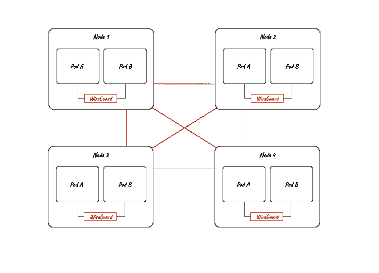
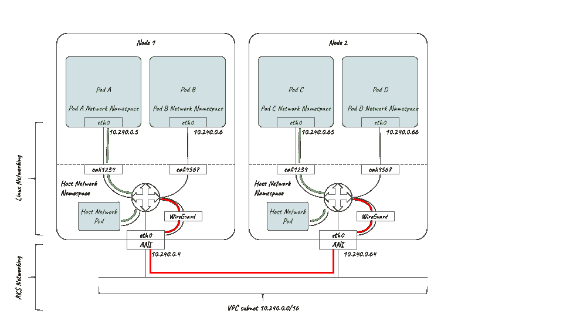

# 印花布铁丝网支持与 Azure CNI

> 原文：<https://thenewstack.io/calico-wireguard-support-with-azure-cni/>

[](https://www.linkedin.com/in/rramezanpour/)

 [彼得·凯利

彼得是 Tigera 的工程总监，也是 Tigera 在爱尔兰科克的 EMEA 办事处的现场负责人，他和他的团队从事加密和应用安全方面的工作。Peter 拥有二十年的软件开发经验，包括最近为开源代理构建控制平面技术。](https://www.linkedin.com/in/rramezanpour/) [](https://www.linkedin.com/in/rramezanpour/)

去年六月， [Tigera](https://tigera.io/?utm_content=inline-mention) 宣布了 Kubernetes 的第一个:支持开源的 [WireGuard](https://www.wireguard.com/) 来加密集群中传输的数据。我们从来不喜欢坐以待毙，所以我们一直在努力开发这项技术的一些令人兴奋的新功能，其中第一个是使用 [Azure 容器网络接口](https://github.com/Azure/azure-container-networking/blob/master/docs/cni.md) (CNI)支持 [Azure Kubernetes 服务](https://azure.microsoft.com/en-us/services/kubernetes-service/) (AKS)上的 WireGuard。

首先，简单回顾一下 WireGuard 是什么，以及我们如何在 Calico 中使用它。

WireGuard 是从版本 5.6 开始在 Linux 内核中可用的 VPN 技术，被定位为 IPsec 和 OpenVPN 的替代技术。它的目标是更快、更简单、更精简、更有用。为此，WireGuard 对所支持的密码和算法的可配置性采取了固执的立场，以减少技术的攻击面和可审计性。使用标准的 Linux 网络命令进行配置很简单，它只有大约 4，000 行代码，易于阅读、理解和审计。

虽然 WireGuard 是一种 VPN 技术，通常被认为是客户端/服务器，但它可以在对等网状架构中同样有效地配置和使用，这就是我们在 Tigera 设计的用于 Kubernetes 的解决方案。使用 Calico，所有启用了 WireGuard 的节点将相互对等，形成一个加密的网状网络。我们甚至支持在某些节点上有 WireGuard 而在其他节点上没有 wire guard 的集群中的流量。

[](https://cdn.thenewstack.io/media/2021/08/06581ad7-image1-10-e1628656758212.png)

点击查看全尺寸图像

我们利用 WireGuard 的目标是不妥协。我们希望提供最简单、最安全和最快的方法来加密 Kubernetes 集群中传输的数据，而不需要 mTLS、IPsec 或复杂的配置要求。事实上，您可以将 WireGuard 看作是另一个具有加密附加好处的覆盖层。

用户只需使用一个命令即可启用 WireGuard，Calico 会负责其他一切，包括:

*   在每个节点上创建 WireGuard 网络接口。
*   最佳 MTU 的计算和编程。
*   为每个节点创建 WireGuard 公钥/私钥对。
*   将公钥添加到每个节点资源，以便在群集间共享。
*   为每个节点编程对等体。
*   对 IP 路由、IP 表和带有防火墙分类标志(fw 标志)的路由表进行编程，以便在每个节点上正确处理路由。

你只需说明意图；集群做所有其他的事情。

## 解释了带有 WireGuard 的数据包流

下图显示了启用 WireGuard 的群集中的各种数据包流场景。

[](https://cdn.thenewstack.io/media/2021/08/eb522dd1-image2-8.png)

点击查看全尺寸图像

同一主机上的 pod:

*   数据包被路由到 WireGuard 表。
*   如果目标 IP 是同一主机上的一个 pod，那么 Calico 将在 WireGuard 路由表中插入一个“throw”条目，将数据包引导回主路由表。在那里，数据包将被定向到目标 pod 的 veth 对主机端的接口，并且它将在未加密的情况下流动(在图中以绿色显示)。

不同节点上的 pod:

*   数据包被定向到 WireGuard 表。
*   为目的地 pod IP 匹配路由条目，并将其发送到 WireGuard 设备 cali.wireguard。
*   WireGuard 设备对数据包进行加密(图中以红色显示)和封装，并设置 fwmark 以防止路由环路。
*   WireGuard 设备使用与目的 podIP(允许的 IP)匹配的对等方的公钥对数据包进行加密，将其封装在 UDP 中，并使用特殊的 fwmark 进行标记，以防止路由环路。
*   数据包通过 eth0 发送到目的节点，在那里发生相反的情况。
*   这也适用于主机流量(例如，主机联网的 pod)。

在下面的动画中，您可以看到 3 个流:

1.  同一主机上的点对点流量不加密地流动*。*
2.  不同主机上的点对点流量被加密*。*
3.  主机到主机的数据流也是加密的*。*

Key:绿色表示未加密流量，红色表示加密流量。

## AKS 支持

Azure CNI 的 AKS 为 WireGuard 支持带来了一些真正有趣的挑战。

首先，使用 Azure CNI 意味着 pod 的 IP 地址不是使用 Calico IP 地址管理(IPAM)和无类域间路由(CIDR)块来分配的。相反，它们是以与节点 IP 相同的方式从底层 VNet 分配的。这对于 WireGuard 路由来说是一个有趣的挑战，之前我们可以在 WireGuard 配置中将 CIDR 块添加到 AllowedIPs 列表中。相比之下，我们现在必须写出该节点的所有 pod IPs 的列表。这要求 Calico 将 routeSource 的配置设置设置为 workloadIPs。如果您使用我们的操作员部署到 AKS，这已经为您处理好了。

使用 wireguard-tools 提供的优秀的 [wg](https://git.zx2c4.com/wireguard-tools/about/src/man/wg.8) 实用程序，您可以看到每个对等体允许的 IP 列表，其中包括每个对等体的 pod IPs 集以及主机 IP(注意端点 IP 也在允许的 IP 列表中)。在 AKS 上，这提供了工作负载加密以及主机到主机的加密。

```
interface:  wireguard.cali
  public key:  bbcKpAY+Q9VpmIRLT+yPaaOALxqnonxBuk5LRlvKClA=
  private key:  (hidden)
  listening port:  51820
  fwmark:  0x100000

peer:  /r0PzTX6F0ZrW9ExPQE8zou2rh1vb20IU6SrXMiKImw=
  endpoint:  10.240.0.64:51820
  allowed ips:  10.240.0.64/32,  10.240.0.65/32,  10.240.0.66/32
  latest handshake:  11  seconds ago
  transfer:  1.17  MiB received,  3.04  MiB sent

peer:  QfUXYghyJWDcy+xLW0o+xJVsQhurVNdqtbstTsdOp20=
  endpoint:  10.240.0.4:51820
  allowed ips:  10.240.0.4/32,  10.240.0.5/32,  10.240.0.6/32
  latest handshake:  46  seconds ago
  transfer:  83.48  KiB received,  365.77  KiB sent

```

第二个挑战是处理正确的最大传输单元(MTU)。 [Azure 设置 MTU 为 1500](https://docs.microsoft.com/en-us/azure/virtual-network/virtual-network-tcpip-performance-tuning#azure-and-vm-mtu) ，WireGuard 在数据包上设置 DF(不分段)标记。如果没有正确调整 WireGuard MTU，我们会在启用 WireGuard 的情况下看到数据包丢失和低带宽。我们可以通过自动检测 Calico 中的 AK 并为 WireGuard 设置正确的开销和 [MTU 来解决这个问题。](https://docs.projectcalico.org/networking/mtu)

我们还可以将节点 IP 本身添加为每个对等体的允许 IP，并通过 AKS 中的 WireGuard 处理主机联网的 pod 和主机到主机的通信。主机到主机的技巧是，当发生 [RPF](https://en.wikipedia.org/wiki/Reverse-path_forwarding) (反向路径转发)时，让响应通过 WireGuard 接口路由回来。我们可以通过在目的地节点上为传入的数据包设置一个标记来解决这个问题，然后在 sysctl 中配置内核来考虑 RPF 的这个标记。

现在，在 AKS 上，您可以完全支持节点之间的工作负载和主机加密。你只需说明意图；集群做所有其他的事情。

如果您喜欢这篇文章，您可能也会喜欢:

<svg xmlns:xlink="http://www.w3.org/1999/xlink" viewBox="0 0 68 31" version="1.1"><title>Group</title> <desc>Created with Sketch.</desc></svg>