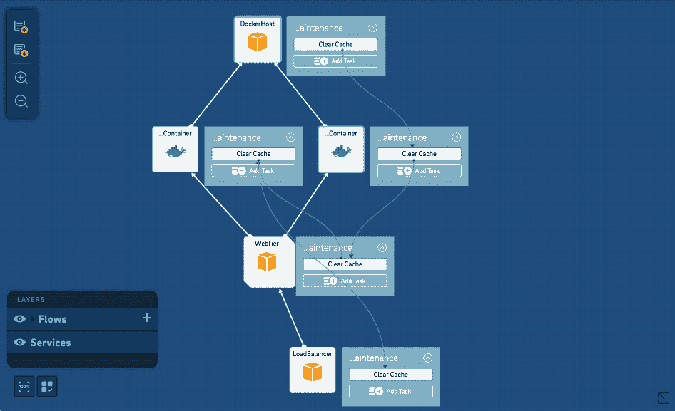

# Calm.io 旨在通过 DevOps 平台安抚野蛮的 IT 商店

> 原文：<https://thenewstack.io/calm-io-aims-soothe-savage-shop/>

Calm.io 旨在通过其所谓的“DevOps 自动化平台”，缓和维护现代应用程序中似乎固有的复杂程度。

该公司认为，自动化不仅要应对开发、供应和部署应用程序的挑战，还必须解决所有必须独立管理的软件组件，以及由不同人管理的不同部分，并解决底层存储和网络问题。

“虽然整个 Docker 运动对开发者来说非常好，但围绕它的操作工具仍在发展。这就是话题从 Docker 转移到 Kubernetes 和所有工具的地方，“我们实际上如何将[容器]投入生产并管理它们？””Calm 的产品总监 Jasnoor Gill 说。

> “这对我们来说是一个非常好的对话开端。”冷静。io 的 Jasnoor Gill，关于集装箱化的趋势。

吉尔说，整个 Docker 运动对像 Calm 这样的公司来说是一个福音，因为它将对话从代码转移到了运行时。

他说，该公司没有与持续集成/持续交付供应商竞争。是的，它成为了管道的一部分，然而“许多 CI/CD 工具和 DevOps 工具的最大问题是它只关心编排本身，”Gill 说。

“虽然这对架构师、开发人员和开发人员有用，但并不总是对 it 有用，对首席财务官肯定也没用。没有办法应用您的企业策略。如果我正在编写一个脚本，我可能会添加一些代码，以便在脚本中的某一点发出一封电子邮件来获得批准，但是您所做的是将您的应用程序策略与您的业务策略混合在一起。但是，对于开发、转移和生产，您可能有一套不同的策略。这意味着您必须为您拥有的每种类型的堆栈维护三种不同类型的脚本，”他说。

Calm.io 提供了一种创建蓝图来声明应用程序拓扑的方法。

他说，当前的 CI/CD 解决方案缺乏应用程序生命周期中的“最后一英里”自动化。

“我们将 CI/CD 和纯环境视为一层，但您还需要一个完整的层来进行成本控制、运行状况检查和审计。没有一个[CI/CD]平台能在一个解决方案中为您提供所有这些。”

Calm 是一个面向混合云基础设施和基于微服务的应用架构的自动化平台。其理念是在公司处理其遗留基础架构的同时，通过解决新兴 IT 环境带来的挑战来安抚 IT 管理层。

## 盒子里有什么？

平静的提议:

*   基于模型的自动化，其中灵活的服务定义与特定环境相分离，就像 IT 策略一样。
*   全堆栈、工作流驱动的流程编排，其中任务跨不同的基础架构、多个容器和各种支持资源进行集中协调。
*   自动化生命周期管理。
*   滚动和金丝雀更新不需要代码或脚本。
*   基于事件策略的自动缩放。
*   不仅监控节点的故障和自我修复，还包括上游和下游的依赖关系。
*   分配资源和执行团队预算。
*   自动化访问和权限策略。
*   高分辨率审计和跟踪。

“我们意识到，自动化、设置和管理云资源并不容易，”吉尔说。“如果我想设置一个 50 节点的群集来进行性能测试，光是设置该群集就需要几个小时，即使他们有脚本或 Chef automation 来在 AWS 上启动它们，也要将它们连接在一起。”

Calm.io 提供了协调多层系统的能力

与此同时，许多组织都有机器在运行，似乎没有人知道它们在做什么，但他们害怕关闭它们，因为害怕其他东西会损坏。

“但有了公共云，每次你运行你没有使用的资源时，你都在浪费别人一大笔钱。所以这就是我们开始的地方，”他说。

“有了 Calm，我们可以让您自动完成所有这一切。我们让您部署代码。我们让你使用你现有的厨师，木偶，盐食谱。我们为此提供了一个接口，”吉尔说。“从 IT 的角度来看，我们在您的混合云之上负责所有对象、合规性和成本控制。您希望让您的开发人员能够访问所有这些资源，但您仍然希望实施某些 IT 策略，即在成本方面的云控制策略。”

Calm 支持裸机、虚拟机和 Docker 编排。它为 AWS 和 Azure 提供公共云支持，并正在考虑支持 SoftLayer、Digital Ocean 和 Google Compute。它还支持 VMware、OpenStack、Xen、KVM 以及 Nutanix Acropolis 虚拟机管理程序的私有云。

Calm.io 可用于自动化剧本。

在开发方面，Calm 通过 API 支持 Chef、Puppet Saltstack、Jenkins 等工具。

“这意味着，如果您有任何现有工具的自动化，我们只需点击该自动化即可。吉尔说:“你不必重新组装你的工装。

“我们在 it 基础上应用 IT 策略，因此我们负责成本控制，我们负责到期的工作负载，如果有人必须签署某些东西，就不再需要这些工作负载了。这是以前做过的事情，但在过去，它是在工具之外完成的。你必须发一封电子邮件或打电话给某人(以获得批准)。将所有这些脚本整合到一个系统中是一个挑战，这也是我们试图解决的问题。”

## **镇静效果** 

Calm 是总部位于印度的自动化公司 Idea Device 的副产品。公司 2 年左右；它大约在一年前发布了它的产品。它在 4 月发布的 1.7.1 版本包括微软 Azure 集成和对 LDAP 管理用户和组的支持。

它在旧金山有两名员工，现在正在美国扩张。

它的客户包括印度国家证券交易所、在线市场 Snapdeal、时尚平台 Voonik、移动支付应用 Chillr、数据保护供应商 Druva 和 Groupon for India Nearbuy。

Druva 的首席技术官 Milind Borate 表示，得益于 KVM 环境，Calm 帮助将部署时间从一天缩短到了 15 分钟。

[码头工人](https://www.mirantis.com/software/docker/kubernetes/)是新栈的赞助商。

专题图片: [Serenity](https://www.flickr.com/photos/atkinson000/5287128946/in/photolist-94cVeC-dT9Yvy-zZ3SQ9-5ShWRe-dcNSSK-g4DcPq-cxBeXA-9kobE-bjmBdz-5kEzjY-cq1VGU-9kPu2b-8FXjAu-yWyna3-gd59pj-aJwejn-7KSkxS-h3uDh3-h3uw9Y-7PRrGF-99XkgC-dkGhbH-2X89RU-fhGzTX-4F5aHV-NJNr9-CghDcY-bnkKnM-onSnYr-bYfWUm-dMP2oA-e7hGDr-ubrqf-DPNA1b-42iqt-4T2T6L-9av58Y-3nv9P-6NLxmN-79zzP3-exqiTN-5EdwS7-aJwerF-3gbhJK-9HbFo3-8Cj6eB-FWCsxJ-8nUtxt-a2tmsy-9AVQNe) 作者 [Brandon Atkinson](https://www.flickr.com/photos/atkinson000/) ，授权 **[CC BY-SA 2.0](https://creativecommons.org/licenses/by/2.0/)** 。

<svg xmlns:xlink="http://www.w3.org/1999/xlink" viewBox="0 0 68 31" version="1.1"><title>Group</title> <desc>Created with Sketch.</desc></svg>