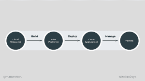

# CALMS 是面向云工程的 DevOps

> 原文：<https://thenewstack.io/calms-is-devops-for-cloud-engineering/>

伦敦——“我喜欢定义。定义帮助我们创造。”这就是马蒂·斯特拉顿 如何开始他的[伦敦](https://devopsdays.org/events/2022-london/welcome/)主题演讲。然而，Aiven 的开发者关系总监指出，科技行业花了几年时间才确定 DevOps 的定义，Donovan Brown 将 devo PS 定义为人、过程和产品的结合。尽管如此，术语 DevOps 并不完全包含它所打破的所有孤岛，这导致了诸如 [DevSecOps](https://thenewstack.io/category/security/) 、AIops 等组合。

Stratton 认为，云工程将标准软件工程实践和工具应用于应用程序开发、基础设施和合规性(通常只是第一步)，以有效利用云。他的演讲提供了如何将 devo PS CALMS 的基础(文化、自动化、精益、测量和共享)与云工程的基础(构建、部署和管理)结合起来，所有这些都具有云原生思维。现在让我们深入了解他的崩溃。

## 保持冷静，继续前进。

这就是 CALMS 的含义，也是首字母缩略词中每个单词都很重要的原因:

*   **文化**:“我们为什么在这里，”Stratton 解释道，[转述 Simon Sinek](https://simonsinek.com/books/start-with-why/) 并强调每个人都需要理解 DevOps 转型的目的。他引用 Ngmoco 的 Lloyd Taylor 的话说，“你不能直接改变文化。但是你可以改变行为，行为变成了文化。”这可以归结为心理安全的重要性，这样就可以实现“傻瓜的 DevOps”作者 Emily Freeman 对 DevOps 的定义:协作、所有权和学习。这一切为持续改进创造了一个安全的空间。
*   **自动化**:大多数人听到 DevOps 会想到什么。“这是有趣的部分，工具，”这就是为什么自动化最不容易获得 DevOps 的认可。毕竟，自动化是摆脱枯燥、重复的工程任务的手段。
*   **精益**:Jez Humble 随后添加了 [价值流图](https://thenewstack.io/the-future-of-devops-is-in-value-stream-management/) ，消除浪费和瓶颈，并评估与业务战略相关的长期进展。
*   测量:敏捷甚至科学方法的真正分支，你不能改进你不能测量的东西。这个 M 由 [Google 的 DORA 指标](https://thenewstack.io/googles-formula-for-elite-devops-performance/) 固化，包括变更的前置时间、部署频率、恢复时间和变更失败率。
*   分享:斯特拉顿称这是最难的事情之一。“人们觉得，尤其是在高管层面，事情是基于需要知道的基础上，”他解释说。“事实是，需要知道的事情比我们想象的要少。”跨职能透明度是精英团队与 DevOps 在名称上的区别。

“DevOps 不仅仅是自动化或 Kubernetes，”Stratton 强调说。DevOps 从一开始就不是很规范，这是人们开始销售神奇解决方案的时候。但是，他警告说，“你买不到 DevOps，但我肯定可以卖给你，”咨询公司到处宣传自己的秘方。

DevOps 的成功都归结于沟通，这就是为什么他主张将 CALMS 与云工程的紧急实践相结合，以将每个人置于同一方向。

## **建立 DevOps 方式**

到目前为止，DevOps 最有可能应用于开发和运营团队——这是它的名字。但如果不考虑 [治理](https://thenewstack.io/can-sre-bring-governance-and-compliance-into-the-future/) 、安全 [财务](https://thenewstack.io/finops-how-kubernetes-teams-can-best-work-with-finance/) 等几个重要因素，一个组织的 DevOps 转型只能到此为止。Stratton 提供云工程，作为在整个软件开发生命周期中应用标准软件工程实践和工具的一种方式，将应用程序开发、基础设施和合规性融入构建、部署和管理。

基本上，在云工程的 DevOps 方式中，Stratton 在后续对话中解释道，“我们使用云资源来**构建**基础设施平台，我们**在其上部署**云应用，我们**用策略管理**。”那么，新的云原生构建阶段是如何工作的呢？

“云工程的构建部分是关于创建服务和基础设施，提供我们客户需要的东西，”Stratton 解释说。Stratton 引用 James Governor 的话指出，每个人都在竞相创造自己的 Heroku，而事实上他们并不是平台即服务公司。

“很多组织，我们想创造东西，因为它很有趣，”斯特拉顿解释说，政府机构和最大的公司“制造工具，不存在保留伟大的工程师。这从来都不是你最重要的事情，”然后，他继续说道，“你的副业没有得到资助和关注。”

现在，如果你在这个构建阶段使用 CALMS，它会超越一切。

你引导文化的重点是建立差异化，创造共同的开发者体验，并推动同理心。斯特拉顿解释说，缺乏同理心源于缺乏理解。构建驱动的自动化聚焦于可重用组件，利用生态系统，创建合理的管道，避免定制实现。使用精益软件开发实践进行构建，关注增加价值、提高效率和审查持续改进。

## **如何冷静部署？**

“耗时太长或需要太多最小步骤的部署过程绝对会阻碍我们向客户提供新功能或解决服务问题，”Stratton 说。这就是为什么他认为每次都以同样的方式部署是至关重要的。并通过将连续交付实践应用于基础设施来执行它——否则，他说，人类会有例外。

“当你有一个异常过程时，一切都变成了异常，”他继续说道。“将 CI/CD 应用于应用程序开发而非基础设施是一种常见的做法。”他继续说道，“当我们在基础设施中选择这些相同的原则时，这意味着我们新更新的基础设施资源符合我们的质量控制，并帮助我们了解我们知道什么发生了变化。”

斯特拉顿进一步解释说，每次都以同样的方式部署，包括质量和安全检查。确保基础设施是应用程序的一部分。他说，你甚至应该自动化清单。

“计算机的奇妙和令人沮丧之处在于它们都是混蛋。因此，当我们有一个必须有人批准的流程时，人们有时会互相帮忙，”这就是为什么 Stratton 一直倡导执行同样的事情。这使得**测量**一切都变得更加容易，而且视野开阔。

他说，在一个部署的文化中，“只有在生产时才算数。”部署文化包含迭代部署，将一个较大的应用程序分解成小得多的部分，并且 e 促成持续改进

请记住，不同的组织会有不同的衡量标准。“这与速度无关，而是以适合您的业务需要的速度推动价值的能力，”Stratton 说。只有这样,**分享**才能植根于每个人都有一个明确的答案:什么变了？

## **以策略为代码管理云工程**

Stratton 用另一个学究式的探索开始了他的 CALMS 云工程的第三个支柱。DevOps 是关于左移的，但这通常没有得到很好的解释。“我们想把注意力转移到左边，而不是工作量，”他提醒 DevOpsDays London。

云工程的**管理**方面可以归结为在开发和部署周期中创建这种级别的可见性，并使用与业务目标相关的通用词汇表。在这个阶段，Stratton 解释说，安全是每个人的工作，而不仅仅是将责任转移到新的肩上。

云工程旨在将控制和流程落实到位，以尽可能地实现、增强和自动化，尤其是在安全性和合规性方面，将责任从个人身上转移出去。“将策略视为代码，无论它们在组织中处于什么位置，它都会提供安全可见性，”Stratton 说。“安全是每个人的责任，”他重申。然而，安全和质量是如此紧密地联系在一起，在早期只考虑了后者。

他解释说，护栏实际上是非常强大的文化影响，让每个人对其部署和管理更有信心，增加跨学科的共识。

那么，你如何以一种云本地的方式管理**自动化**？“计算机不会说谎，”他说。如果没有适当的流程和检查，他们也不会被说服去批准一些事情。通过这种方式，在一个通用的、标准化的、成文的清单中，政策从模糊变得清晰。

精益管理关注于确定持续改进的方法。有了云工程，你能够以一种编码的方式表达精益的价值流变化。

然后，**度量的管理阶段**带来了对当前可执行策略的可见性——以及技术和业务都理解的指标。这包括法规遵从性的当前状态，以及对策略和价值冲突的理解。

斯特拉顿说，然后，通过接受一个共享的词汇，由政策作为代码强制执行，它“帮助我们利用成功模式，帮助我们分享学习成果”。

<svg xmlns:xlink="http://www.w3.org/1999/xlink" viewBox="0 0 68 31" version="1.1"><title>Group</title> <desc>Created with Sketch.</desc></svg>