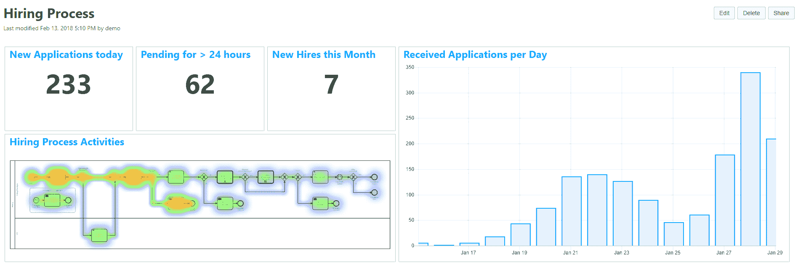
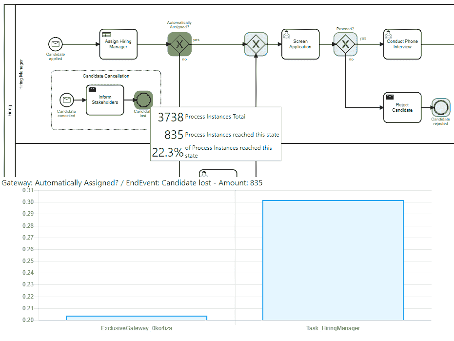
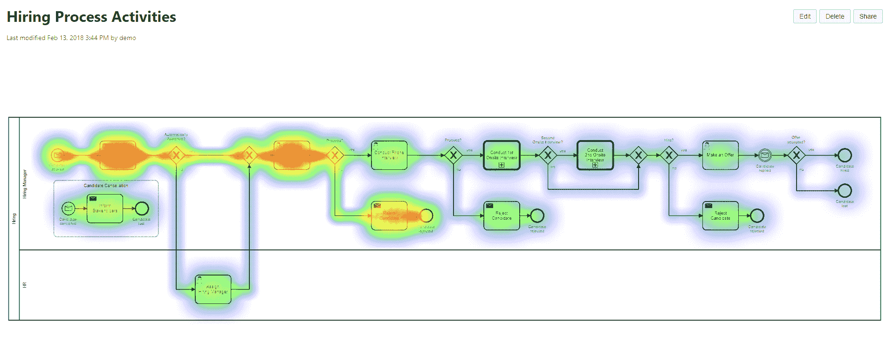

# Camunda 提供基于 BPMN 的微服务工作流引擎

> 原文：<https://thenewstack.io/camunda-offers-a-microservices-workflow-engine-built-on-bpmn/>

Camunda 联合创始人 Bernd Ruecker

微服务面临的挑战是，每个微服务只记录自己的事务(如果它真的做了的话)。如果一个基于微服务链的服务(如网络购物车)无法完成任务，就很难准确定位问题所在。此外，传统的工作流系统不是为微服务所需的交易量而设计的。

因此，将微服务组合成一个连贯的整体可能是一项棘手的任务，柏林 [Camunda](http://camunda.com/) 的联合创始人兼开发者倡导者 Bernd Ruecker 在今年早些时候在纽约举行的 [O'Reilly 软件架构](https://conferences.oreilly.com/software-architecture/sa-ny)会议的一次会议上说道。

开发人员可能希望每个服务独立工作，尽管架构师也希望工作流能够完成任务。将组件绑得太紧就像一场三足赛跑，前进的动力甚至不如跑得最慢的伙伴。

为此，Ruecker 的 [Camunda](https://camunda.com/) ，一家成立 10 年的公司，最初建立了一个开发人员友好的工作流引擎，作为企业服务总线的一个简单替代方案，给了它的引擎一个新的工作负载:为基于微服务的系统处理复杂的工作流。

[Camunda 企业平台](https://camunda.com/download/enterprise/)及其开源代码库 [Cockpit](https://camunda.com/products/cockpit/) 提供工作流自动化，使开发人员能够协调和监督多个组件或微服务的复杂操作。该平台拥有名为 [Optimize](https://camunda.com/products/optimize/) 的分析软件，可提供数据可视化、警报和高级分析。

卡蒙达的优化

Camunda 平台使用[业务流程模型和符号](http://www.bpmn.org/) (BPMN)作为工作流编程语言。该语言最初创建于 Web 服务时代，在这个新兴的微服务时代提供了许多优势，优于该领域其他竞争对手的特定于包的语言，如亚马逊 Web 服务的[简单工作流服务](https://aws.amazon.com/swf/faqs/)。

“在 BPMN 的标准化过程中，有如此多的讨论在进行，这种语言真的进化了，”Rucker 说。

## 三足赛跑

最初，Camunda 的软件为重量级 BPM 驱动的工作引擎(如 IBM 的 WebSphere Process Server 或 Oracle BPM suite)提供了一种更简单的替代品。当时，BPM 非常依赖于 Web 服务和面向服务的架构，这种需求在十年之交逐渐消退。

然而不久之后，像网飞这样的公司开始探索管理大量松散耦合服务的挑战。网飞最终[开发了](https://medium.com/netflix-techblog/netflix-conductor-a-microservices-orchestrator-2e8d4771bf40) Conductor 来解决微服务组合和概述的问题。其他开源项目如优步的 [Cadence](https://github.com/uber/cadence) 和 ING 的 [Baker](https://github.com/ing-bank/baker) 也解决了类似的问题。

Camunda 企业平台的核心包含一个工作流引擎或状态引擎，它处理以基于 XML 的 BPMN 序列化的流程图模型。“你可以在任何符合 BPML 标准的工具中绘制一个流程图，点击保存，状态引擎就会解释这个 XML 文件，”Camunda 的联合创始人兼首席执行官 Jakob Freund 解释道。该软件可以处理复杂的逻辑，如外部警报、条件分支和其他控制流机制。所有事务的记录都保存在数据库中，以便以后可以通过 Optimizer 进行分析。

状态机本身是用 Java 实现的，通过 Java API 和标准的基于 REST 的 API 进行通信。“这意味着我可以将 Camunda 与任何消息队列或服务配对，”Freund 说。

该公司还在构建第二代工作流引擎，现在是一个名为 [ZeeBe](https://zeebe.io/) 的实验性构建，专门用于轻松集成到 Kafka 等流处理软件中。

到目前为止，目前的平台已经部署在至少数百个生产工作负载中，包括由 24 小时健身、美国电话电报公司、汉莎技术公司、慕尼黑大学和 Zalando 运行的平台。欧洲保险提供商 [Talanx](http://www.talanx.com/?sc_lang=en) 使用该软件提供其所有工作流程的端到端视图。美国宇航局喷气推进实验室计划使用该软件处理从火星探测器发回地球的图像。

在接下来的几个月里，该公司将在全球范围内举办一系列的 Camunda 日活动，以进一步让用户熟悉这项技术。此外，该公司将于 4 月 11 日举办一场[网络研讨会](https://register.gotowebinar.com/register/1924243594699537665)，进一步解释其优化性能分析和可视化组件的新功能。

【T2

<svg xmlns:xlink="http://www.w3.org/1999/xlink" viewBox="0 0 68 31" version="1.1"><title>Group</title> <desc>Created with Sketch.</desc></svg>