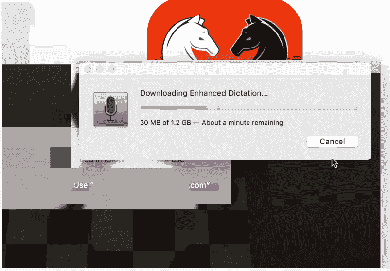
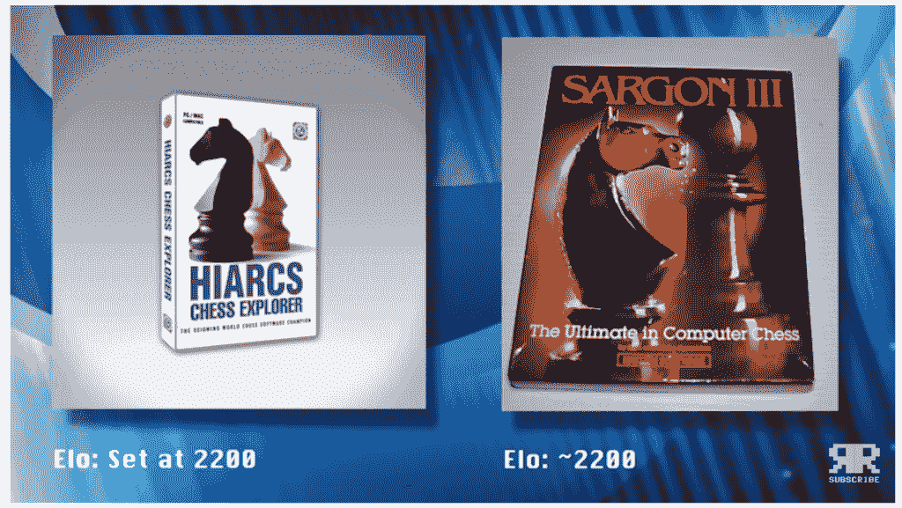
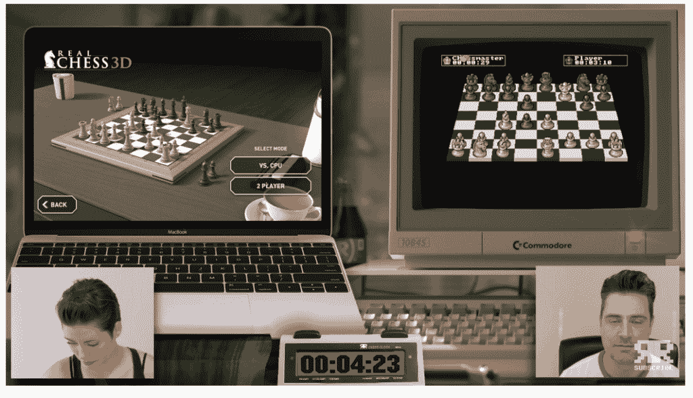
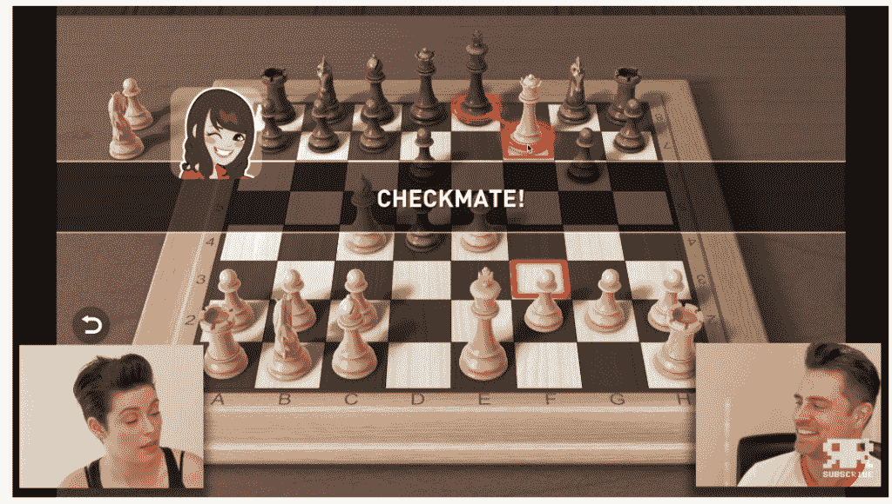
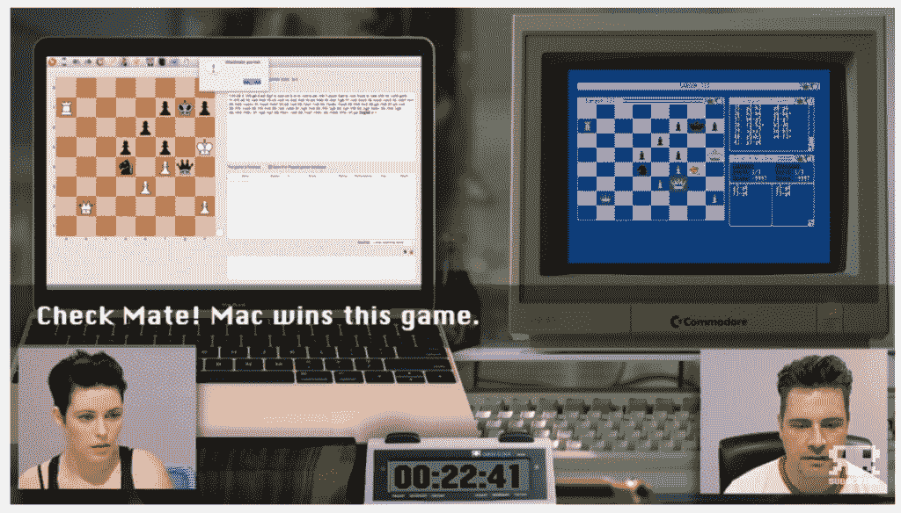

# 30 岁的阿米加能在国际象棋上击败现代的麦克吗？

> 原文：<https://thenewstack.io/can-a-30-year-old-amiga-beat-a-modern-mac-at-chess/>

当一个老式计算爱好者在现代 Mac 和 20 世纪 80 年代的 Amiga Commodore 计算机之间举行象棋比赛时，会发生什么？

大决战[于本月](https://www.youtube.com/watch?v=qN8AbHpCRF0&feature=youtu.be)出现在 YouTube 上，随着我们的技术冲向未来，让我们一瞥什么改变了，什么没有改变。至少有一个大惊喜，因为 YouTuber Christian Simpson 在他的“[复古食谱](https://www.youtube.com/channel/UC6gARF3ICgaLfs3o2znuqXA)”YouTube 频道上为 58，900 名订户上演了四场比赛(使用了六种不同的下棋应用程序)。但是夹杂在竞争和怀旧中的是一个回顾过去三十年差异的机会，考虑我们看待我们的软件和彼此的方式的变化。

## 让游戏开始吧

Simpson 用略带英国口音的悦耳声音告诉他的观众，Amiga 对 Mac 比赛的部分灵感来自 1997 年那个划时代的时刻，当时 IBM 的深蓝超级计算机[击败了世界人类象棋冠军](https://www.youtube.com/watch?v=hbtuHtrViPo)，加里·卡斯帕罗夫。“不幸的是，加里无法参加我的小复赛视频，”辛普森打趣道。但是，如果他能让一台 1987 年的 Amiga 和一台现代电脑，比如说一台 MacBook，进行较量会怎么样呢？

他反复强调现代化的优势，指出今天“当你在等红绿灯的时候，甚至一辆特斯拉都可以和你下棋。”

在视频中，协助辛普森的是坐在 MacBook 前的“Fractic 女士”，他们一起输入一个国际象棋程序的响应，同时将自己的移动到另一个程序中。“理论上，Mac 将屠杀 Amiga，”辛普森解释说，“因为它更快，它的人工智能更聪明。”

为了公平竞争，Simpson 安排了两个程序的技能水平相当的比赛，使用了一种长期存在的国际象棋衡量标准，称为 [ELO 等级](https://en.wikipedia.org/wiki/Elo_rating_system)。首先，Simpson 试图让 Mac 的股票国际象棋应用程序(ELO:超过 1600 英镑)与 Amiga 上华丽的 3D 动画*战斗国际象棋*背后的人工智能(ELO: 1500 英镑；1988 年首次发布)。

辛普森解释了他的期望。“从逻辑上讲，Mac 仍然会赢，因为它可以在相同的时间内完成更多的思考，即使 ELO 评分相同。”

但首先，他们遇到了一个非常 2020 年的问题。Mac chess 应用程序会显示一个弹出警告，提示需要下载 1.2GB 才能启用其语音识别功能。"下载完成后，您可能需要退出并再次打开国际象棋."

辛普森后来在评论中承认，这是一个可选的更新，尽管“仍然，没有提供更新也有好处。”

他还提醒他的 YouTube 观众关于[沃思定律](https://www.techopedia.com/definition/24381/wirths-law):我们膨胀的软件变得越来越慢，比我们的硬件变得更快。

但是比赛很快就开始了，在一段显示双方棋盘的视频中。回到 Mac 象棋应用程序，Lady Fractic 称之为“少得多的暴力”

“太文明了，”辛普森同意道。

回到阿米加，等待下一步行动。正在使用的国际象棋程序“战棋”显示了一个巨大的“思想者”图标，只不过它是在电脑上。看着游戏展开，佩里希奇和拉迪希奇注意到骑士棋子看起来是一个真正的骑士——但没有马。当其他棋子移动让他通过时，他不是跳过棋子，而是用肘挤过其他棋子。但是当那个骑士真的将可怜的主教斩首时，两个观察者都倒吸一口凉气。而一个小卒如何打败一个更强大的骑士？“他打他裤裆！”

复古乐趣还在继续。对于阉割来说，车变成一种石傀儡——在变回车之前撞到新的方格。很快他们就投入到结果中——以及“战斗象棋”女王的胜利动画中。(“你看到她反应有多快了吗？她说，‘我要*谋杀*你。”)但精益复古编程似乎坚持住了自己的立场“我认为 Mac 现在应该已经屠杀了 Amiga，”Simpson 说，“但是他们实际上正在进行一场复杂的、相当好的国际象棋比赛。"

女士 Fractic:“我看到了游戏即将结束…”

“好吧，我明白了。”

在 38 分钟的游戏时间后，Mac 赢了，让辛普森有点失望。“我认为我们所能做的就是进行两场不同的比赛，看看双方是否有更智能的比赛，我们会得到更好的结果。”

是时候提高 ELO 的收视率了，因为 Simpson 上演了另外两场 Mac 对 Amiga 的比赛:
“真正的象棋 3D”(ELO:“高达 1900”)对“象棋大师 2000”(2000)，以及“Hiarcs 象棋探险家”(高达 3200 以上)对“萨尔贡三世”(至少有一个人击败了一位评级为 2200 的象棋大师)。

## 阿米加反击了

在 Real Chess 3D 和 Chess Master 2000 之间的决斗中，Simpson 承认图形“不太有趣”

但是在 3 分 46 秒内，有一个惊喜。

阿米加绝对更有个性。“抓到你了，”当“象棋大师 2000”拿起一枚棋子时，它用机器人的声音脱口而出。然后，片刻之后…“你输了！”

“哦，该死，”弗拉蒂奇女士说。

“阿米加”号在仅仅 3 分 46 秒后取得了意外的胜利。"我们刚刚回答了这个问题，一个阿米加人能在国际象棋中击败一个现代的麦克吗？"辛普森告诉他的观众。“是的。”

“我没想到会这样。哇。”

然后他提高了难度——阿米加又赢了。

每个人都玩得很开心，他们花了一些时间来欣赏将国际象棋变成视频游戏的创意。辛普森演示了“象棋大师”的特别菜单选项“如果老板路过”，它用一个看起来很勤奋的数字电子表格代替了象棋游戏。(它的标题？"房地产投资分析.")

“但是如果你用这个，你必须为一家房地产公司工作，”他开玩笑说。

在视频结束时，MacBook 赢了 Amiga 的其他两个国际象棋程序，但没有赢过与“国际象棋大师”的两场比赛。

“我不能否认我希望阿米加赢，”辛普森不好意思地承认。"但我想，如果阿米加赢得了整场比赛，那就太可笑了."

但他仍然通过查看比赛来挽救结果——计算所有程序玩的所有游戏。“最后的比分是阿米加两局，Mac 两局，这意味着这是一个平局。”

“但我很惊讶……如果 Mac 比 Amiga 快 2000 倍，Amiga 就会少做很多思考。非常令人震惊的是，它设法赢得了四场比赛中的两场，”他说。

辛普森不认为这是摩尔定律或软件膨胀，而是提出了他自己的一条定律，即佩里定律，该定律指出，“仅用现代数据或自我游戏训练的人工智能仍可能被旧数据迷惑。一种人工智能的隧道式视野，”他补充道。

然后，我们到达了最人性化的时刻:为我们刚刚看到的东西精心制作我们自己的深思熟虑的解释。“我想我的意思是，如果阿米加有点像在公园里下棋的聪明老人，使用青少年冠军没有想到的过时技术。当然，这是一种浪漫化的观点。可能根本不是真的。”

## 后果

辛普森的视频在头 10 天就获得了 146278 次观看，并在 YouTube 上吸引了 1068 条评论。"你对最终结果有什么看法？"辛普森问他的 YouTube 用户。“●麦克艾洛？福禄克？佩里定律？；-) "

在评论中，有人提出了一个令人惊讶的合理解释:ELO 分数多年来一直在变化，1987 年的 1600 分相当于今天的 1300-1450 分。

一位名为“TheCaptain”的 YouTube 观众认为:“旧的国际象棋程序运行在有着更严格限制的计算机上，因此程序代码必须非常精简和干净才能运行。”相比之下，今天的代码和编码方法要简单得多。有些人甚至非常邋遢。事实上，我很惊讶 C64 没有赢得这场比赛。

但它引发了对当今计算机进化的更多思考——以及我们与它们的关系。有人甚至分享了[2019 年对加里·卡斯帕罗夫](https://www.youtube.com/watch?v=hbtuHtrViPo)的采访，在采访中，输给 IBM 的深蓝的国际象棋大师认为“我们正在学习，这不再是人类对机器，而是人类与机器一起工作*……许多人对属于我们的领土正在缩小感到不安。我是说，‘那又怎么样？’你知道吗？*

"最终我们将属于最后几个小数点."

[https://www.youtube.com/embed/qN8AbHpCRF0?feature=oembed](https://www.youtube.com/embed/qN8AbHpCRF0?feature=oembed)

视频

* * *

# WebReduce

<svg xmlns:xlink="http://www.w3.org/1999/xlink" viewBox="0 0 68 31" version="1.1"><title>Group</title> <desc>Created with Sketch.</desc></svg>