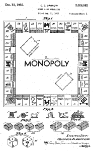
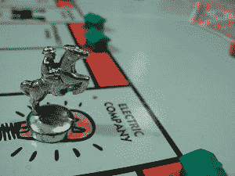
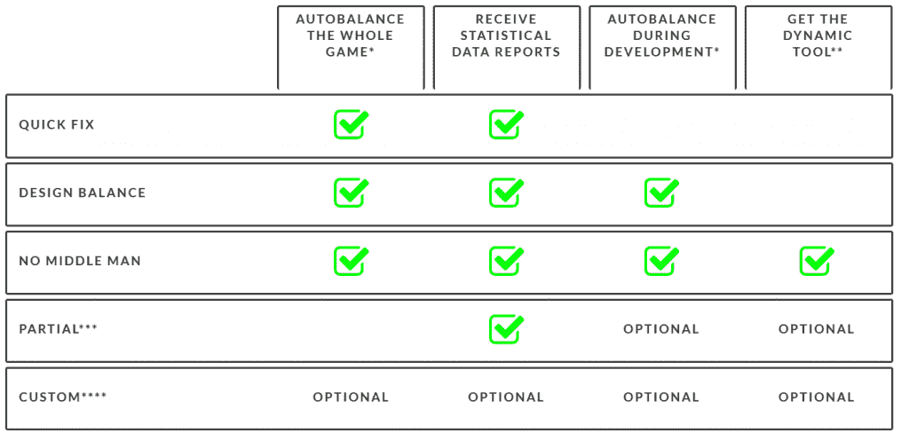

# 人工智能能搞定大富翁桌游吗？

> 原文：<https://thenewstack.io/can-ai-fix-board-game-monopoly/>

原垄断局专利([维基百科](https://en.wikipedia.org/wiki/Monopoly_(game)))。

“垄断是有问题的，”[约翰·范德比克](https://www.linkedin.com/in/johanvanderbeek/)争辩道，提供了他作为游戏平衡者的专业意见。

范德比克的公司名为 [Ludible](http://www.ludible.nl/) ，出售一种工具，用于“平衡”游戏的数字变量，以获得最佳的可玩性，跟踪完美的黄金比例，以便在改变单个变量时可以保留它们。

“我确保游戏按照你想要的方式运行，”他在最近发布的一篇文章中写道[，在这篇文章中，他最近处理了经典的棋盘游戏“大富翁”，以此来展示他的游戏平衡技巧。](http://www.ludible.nl/how-i-fixed-monopoly/)

范德比克对垄断的兴趣可以追溯到很久以前。作为一个孩子，他的家庭有一个传统，每年除夕玩经典的棋盘游戏。“即使在圣诞节前，我也会醒着躺在床上，思考哪种策略是最好的，以及这次我该如何打败我的兄弟们。”

十年前，范德比克获得了人工智能硕士学位，从那以后，他一直致力于人工智能系统、智能解析器和各种项目的算法。

他称这项工作是来自“固有的正义感”的自然冲动，并指出“每个玩游戏的人都应该有平等的获胜机会”。不然感觉不太对。”

公平地说，他承认垄断做对了很多事情；很简单，有一些关键的随机元素。(“当有人不顾一切地在酒店之间找到一个‘便宜’的位置时，每个人都会欣喜若狂。”)

但 Go 广场(Boardwalk and Park Place)旁边那些臭名昭著的深蓝色房产(更不用说棋盘附近的橙色房产了)就有点不对劲了——圣詹姆斯广场(St. James Place)、田纳西大道(Tennessee Avenue)和纽约大道(New York Avenue)。他们“被压倒了”，范德比克写道，并补充说，“许多人认为首发球员有巨大的优势。”

## 租金太高了

有趣的是，他认为仅仅通过改变大富翁房产的租金，游戏就有了很大的改进——再加上对玩家何时开始购买房产的规则做了一点小小的改变。

首先，范德比克计算了当另一个玩家登陆一个地产集团时，该集团的投资回报率。他还运行了 100 万个模拟的 30 回合游戏，只是为了计算玩家在每个地产上着陆的可能性。"在现实生活中，这需要惊人的 7 年时间！"他指出。

事实证明，可怜的地中海大道——正好是“Go”过去的一个方格——是最不可能着陆的方格，因此它的投资回报率下降了不少。将这两个数字相乘得出投资的“实际”回报——即概率调整后的回报——这表明地中海的回报比平均水平低 49%

与此同时，由于 Boardwalk 的租金起价高达其购买价格的 12.5%，其单处房产的支付比平均水平高出 67%*——这是董事会上所有房产中最高的偏离度。*

 *还有几个其他的次要因素需要考虑——很明显，双产权集团(如 Boardwalk 和 Park Place)比三产权集团更容易获得垄断权。当你增加房屋时，四个铁路广场的价值不会增加——每次你购买额外的财产时，它们的价值都会增加——两个公用事业公司，自来水厂和电力公司也是如此。

专业的游戏平衡器考虑了所有这些因素，然后相应地调整每个物业的租金。

这匹马在电气公司着陆。(由[迈克·弗莱明](https://www.flickr.com/photos/flem007_uk/3168011294/)拍摄)

当然，他也调整了更高的租金(在增加绿色房屋和红色酒店之后)——使用相同的概率调整比例。他甚至深情地保留了垄断传统，在每个颜色组的最后财产中有更高的租金。

他做了一个更小的规则改变——一些家庭已经[采用了这个规则。“让我们将所有租金四舍五入到最接近的 5 位数，这样就不会因为整理钱而使每场比赛延长 20 分钟。”](https://www.reddit.com/r/AskReddit/comments/2n31el/what_is_the_best_monopoly_strategy/cma0n44/)

那么会发生什么呢？嗯，首先，自来水厂的租金上涨了。过去，在那里登陆要花费玩家掷骰子的四倍(或者十倍，如果拥有自来水厂的玩家也拥有电力公司。)但是现在它的成本是掷骰子的七倍——或者当两家公司都拥有时是掷骰子的十七倍。

换句话说，现在那些以前租金低廉的房产终于值得拥有了。

铁路没有太大的变化——拥有铁路一直是很有价值的财产，它们仍然很有价值，当玩家拥有全部四条铁路时，可以带来 225 美元的租金，而不是最初的 200 美元。除了第一条铁路——雷丁铁路——根据范德比克的修订，现在收入 220 美元，因为它更容易着陆。最后一条铁路——短线路——带来 325 美元(因为很多时候玩家永远也不会走到棋盘的第四面……)

与此同时，那些标志性的深蓝色房产在 Go now 之前并不那么具有威胁性。Boardwalk 上的酒店现在只需要 1695 美元(而不是 2000 美元)，而 Park Place 上的酒店需要 1315 美元，而不是 1500 美元。orange 房产略有下调——纽约大道的酒店价格现在是 825 美元，而不是 1000 美元。

"这些是垄断应该拥有的数字，以使所有的财产达到同等的平衡."

即使重新调整了租金，仍然还有一个问题:无论谁先出手，总是比其他玩家更有机会购买房产。模拟证实了这一点，但更多的模拟发现了一种非常简单的方法来帮助纠正这一点。“所有玩家只能在任何一个玩家通过 Go 或登陆 Go 时开始购买属性。”

这个网站回答了一些关于这个实验的棘手问题。比如“平衡不会让游戏变得平淡无趣吗？”

“不，它实际上使游戏更有趣……现在，对特定情况做出反应比不管情况如何都是最好的一步棋更重要，同时仍然保持那种经典的随意感，即使在你的游戏技能不如竞争对手的情况下也有机会获胜。”

## 令人不快的艰难跋涉

当然，他不是唯一一个考虑垄断新规则的极客。上个月，范德比克的文章[出现在黑客新闻](https://news.ycombinator.com/item?id=13971253)上——正如经常发生的那样，评论者有他们自己的想法。其中一篇链接到另一篇文章，描述了“一轮一轮地将其他玩家挤出游戏的缓慢、痛苦、破坏友谊的过程”，这一过程将垄断变成了“漫长、无聊、令人不快的艰苦努力”。

另一个评论者想起了一个朋友创造的变种，叫做“[龙与地下城大富翁](https://news.ycombinator.com/item?id=13971697)”

如果一个角色和另一个角色落在同一个地方，他们就可以“战斗”(掷两个骰子并比较数字)，获胜者可以从另一个人那里偷一个财产。事实证明，这是我玩过的最有趣的垄断变种之一，因为它让垄断更容易被创造出来(努力获得别人不会和你交易的第三项财产)，从而让游戏进展得更快。”

也许这一切都显示了对数学和运气这一经典游戏的普遍迷恋。2014 年，当 Reddit 上的一个帖子问“什么是最好的垄断战略”时，这个问题吸引了 4600 多条评论和 11400 张赞成票。答案从[囤积所有一元钞票](https://www.reddit.com/r/AskReddit/comments/2n31el/what_is_the_best_monopoly_strategy/cm9z0ac/)到“[让妻子赢](https://www.reddit.com/r/AskReddit/comments/2n31el/what_is_the_best_monopoly_strategy/cma3k22/)”

其中一条最高评级的评论吸引了令人印象深刻的 90 张赞成票，来自一个明显讨厌垄断的人，他引用了极客电影“[战争游戏](https://www.imdb.com/title/tt0086567/?ref_=tttr_tr_tt)”:“唯一的胜利之举就是不玩。”

* * *

## WebReduce

<svg xmlns:xlink="http://www.w3.org/1999/xlink" viewBox="0 0 68 31" version="1.1"><title>Group</title> <desc>Created with Sketch.</desc></svg>*