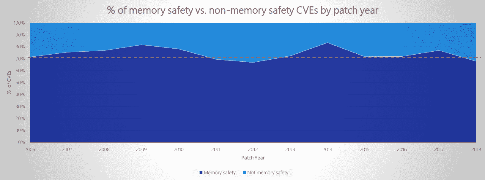

# C++还有救吗？比雅尼·斯特劳斯特鲁普谈确保内存安全

> 原文：<https://thenewstack.io/can-c-be-saved-bjarne-stroustrup-on-ensuring-memory-safety/>

C++社区出现了混乱。一月中旬，官方的 C++“方向小组”——为编程语言的发展提出建议——[发布了一份声明，解决对 C++安全的担忧](https://www.open-std.org/jtc1/sc22/wg21/docs/papers/2023/p2759r0.pdf)。虽然许多语言现在支持“基本类型安全”，即确保变量只访问由它们的数据类型明确定义的内存部分，但 C++一直在努力提供类似的保证。

这份由 C++创始人[比雅尼·斯特劳斯特鲁普](https://www.stroustrup.com/)共同撰写的新声明，现在似乎呼吁改变 C++编程语言本身，以解决安全问题。“我们现在支持这样的想法，即安全性的改变不仅需要在工具中进行，而且需要在语言/编译器和库中可见。”

该集团还支持其长期以来首选的调试工具，以确保安全(并“推动工具，使更多的全球分析能够识别人类难以识别的安全问题”)。但是一月份的声明强调了它对 C++内部变化的建议。

具体来说，它提出了“将几个特性打包到概要文件中”(概要文件随后被定义为“定义了要实施的属性的限制和需求的集合”)，例如，通过触发自动分析。)通过这种方式，新的安全更改“应该是可见的，以便安全代码部分可以被命名(可能使用概要文件)，并且可以与普通代码混合。”

这种新方法最终不仅会带来安全性，还会带来灵活性，其配置文件专门设计用于支持嵌入式计算、性能敏感型应用或高度特定的问题领域，如汽车、航空航天、航空电子、核能或医疗应用。

“例如，我们甚至可能有嵌入式安全、汽车安全、医疗安全、游戏性能、高性能计算和 EU-政府监管的安全配置文件，”该小组建议道。

在文件的其他地方，他们说得更简洁。"为了支持一个以上的‘安全’概念，我们需要能够给它们命名."

但是提议的改变呼应了去年 12 月与联邦政府摊牌时出现的想法。1 月中旬的声明指出了一个特别重要的组织对 C++安全性的担忧:美国商务部有影响力的国家标准与技术研究所。11 月，美国国家安全局(National Security Agency)也在一份关于软件内存安全(T3)的信息表中提到了 C++(这是其任务的一部分，目的是识别各种联邦系统面临的威胁，并“发布网络安全规范和缓解措施”)

也许正是这种高层的关注最终播下了变革的种子…

## 国家安全问题

美国国家安全局引用了来自微软和谷歌的[估计，几年来，大约 70%的漏洞来自内存安全问题。他们随后警告说，这些简单的程序员错误可能会让攻击者访问敏感信息，甚至执行未经授权的代码，从而导致大规模的网络入侵。因此，无论是内存缓冲区溢出还是内存分配漏洞、竞争条件或未初始化的变量——“所有这些内存问题都太常见了。”](https://github.com/Microsoft/MSRC-Security-Research/blob/master/presentations/2019_02_BlueHatIL/2019_01%20-%20BlueHatIL%20-%20Trends%2C%20challenge%2C%20and%20shifts%20in%20software%20vulnerability%20mitigation.pdf)

2019 年微软安全报告发现，2006 年至 2018 年，70%的漏洞涉及内存安全

是的，软件分析工具和“操作环境选项”可以发现许多问题，但 NSA 仍然建议，“在可能的情况下”，只使用内存安全的语言来代替。

为了清楚起见，他们将这定义为一种语言，通过运行时和编译时检查，内存“作为计算机语言的一部分被自动管理；它不依赖程序员添加代码来实现内存保护。”NSA 提供的例子有:C#、Go、Java、Ruby、Rust 和 Swift。

12 月[在开放标准网站](https://www.open-std.org/jtc1/sc22/wg21/docs/papers/2023/p2739r0.pdf)上，Stroustrup 反驳道，他并不认为这些语言优于 C++，“就我所关心的使用范围而言。”

Stroustrup 还反对说，NSA 对安全的讨论“仅限于内存安全，而忽略了一种语言可能(并将)被用来违反某种形式的安全和保障的十几种其他方式……安全的定义不止一个，我们可以通过结合编程风格、支持库和静态分析来实现各种类型的安全。”

与此同时，Stroustrup 还提出了第二个论点:在一些性能至上的现实场景中，“并非所有人都将‘安全’放在首位。”因此，Stroustrup 认为“明智的”做法是列出一个安全问题列表(包括未定义的行为)，然后根据需要使用预执行调试工具(如静态分析器)找到防止这些问题的方法。

按照这种思路，Stroustrup 已经要求 C++的编译器选项和代码注释都需要*请求*类型安全(和资源安全),声称这“允许你只在需要的地方应用安全保证，并在需要的地方使用你喜欢的调优技术…”

新提出的“简介”似乎是实现这一目标的一种语言方式。

## C++中的安全性

Stroustrup 也反对在 NSA 的文件中将 C++与 C 混为一谈。他指出，即使是现在,“C++核心指导原则也特别致力于为需要的人提供静态保证类型安全和资源安全的 C++，而不会破坏代码库，这些代码库可以在没有如此强的保证或引入额外工具链的情况下进行管理。”

微软的 Visual Studio analyzer(及其内存安全配置文件)以及许多静态分析器已经支持这些核心准则。(Stroustrup 还引用了 linter Clang tidy，他说它对 C++核心准则有一些支持。Stroustrup 认为，这种方法允许 C++“以一种新的‘安全’语言的一小部分成本，完全实现这些保证”。

Stroustrup 还引用了他在 2021 年写的另一篇论文，该论文认为“从很早(1979 年)起，完全的类型和资源安全就是 C++的一个理想(目标)，通过由语言规则和静态分析实施的明智的编程技术是可以实现的。”(后来，Stroustrup 写道，解决方案是“一套精心制作的编程规则，由库设施支持，并由静态分析执行。”)

该论文承认，就其本身而言，“默认情况下，核心准则并不提供完全的类型和资源安全”，但认为可以通过实施附加规则来保证这一点(例如，“由 Microsoft Visual Studio 发布的核心准则检查器实现”)。)在对 Rust 基于编译器的类型检查的认可中，Stroustrup 写道“编译器不是我们唯一的工具，从来都不是”，提供了(预编译)静态分析可以执行的强大检查的具体示例。例如，静态分析可以:

*   防止不安全的类型转换
*   防止创建未初始化的对象
*   确保没有内存引用指针“逸出”其狭窄定义的范围，错误地指向其他内容。

在 12 月对 NSA 的回应中，Stroustrup 写道，我们生活在一个“数十亿行 C++代码不会神奇地消失”的世界，并补充说，相反，重要的是逐步采用这些安全规则(并在适当的情况下采用不同的安全规则)。

国家安全局的论文似乎在某种程度上同意这一点。NSA 的论文包括关于“强化”用非内存安全语言编写的代码的提示，推荐静态分析(检查源代码)和动态分析(在代码执行时进行)的工具，以及简化结果的漏洞关联工具。解决工具确定的问题可能需要大量的工作，但会产生更健壮、更安全的代码

美国国家安全局的论文确实提到了“对非内存安全语言使用额外保护”所提供的“相当大的保护”。(它还建议通过控制流保护、地址空间布局随机化和数据执行保护等安全特性来强化编译和执行环境。)

## 一个长期的设计目标

在蜜罐“不为人知的开发者故事”的[新采访](https://www.youtube.com/watch?v=OQZhHHq3p1I)中，72 岁的 Stroustrup 回顾了他的学生时代，当他还是个年轻人的时候，他发现他并不像他认为的那样擅长数学——但是“机器架构真的很有趣”

[https://www.youtube.com/embed/OQZhHHq3p1I?feature=oembed](https://www.youtube.com/embed/OQZhHHq3p1I?feature=oembed)

视频

但在 2020 年，当有人问斯特劳斯特鲁普，如果他能回到过去，他会做出什么改变时，就没什么好说的了。“那是时光机的问题，我们没有时光机，”他[回答](https://thenewstack.io/c-creator-bjarne-stroustrup-weighs-in-on-distributed-systems-type-safety-and-rust/)。

“编程语言设计的一个有趣的方面是，如果你成功了，你会有很多很多年前和几十年前做过的事情，你必须接受它。一旦你有了用户，你就有了责任，其中一个责任就是不要破坏他们的代码……外面有几千亿行 C++代码，我们不能破坏它们。”

Stroustrup 强调了他对 C++的信心。“我认为 C++可以做 Rust 能做的任何事情，我希望它使用起来简单得多。”但他也在 2020 年的采访中表示，基本的类型安全——确保变量只能访问它们明确划分的内存块——是他最早的设计目标之一，也是他花了几十年时间试图实现的目标。“当我听到人们谈论 C++时，好像他们回到了 20 世纪 80 年代、90 年代，很多人都是这样，”Stroustrup 在 2020 年说。

“他们早在黑暗时代就看过了，从那以后就没再看过。”

<svg xmlns:xlink="http://www.w3.org/1999/xlink" viewBox="0 0 68 31" version="1.1"><title>Group</title> <desc>Created with Sketch.</desc></svg>