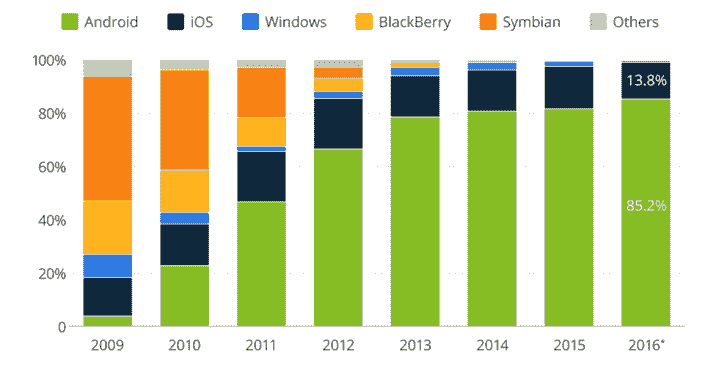

# 谷歌能在亚马逊网络服务上推出“安卓”吗？

> 原文：<https://thenewstack.io/can-google-pull-android-amazon-web-services/>

过去，当 [OpenStack](https://www.openstack.org/) 是人们想听到的一切时，我用一个类比来解释它的流行:“如果 AWS 是 iPhone，OpenStack 就是 Android。”虽然这种比较对于 OpenStack 来说可能有些牵强，但当谈到[谷歌](https://cloud.google.com/kubernetes-engine)在云计算中获胜的计划时，这种类比可能仍然适用。

2007 年苹果发布 iPhone 时，谷歌肯定有人说过“啊哦……三星和摩托罗拉对构建软件一无所知；除非我们干预，否则苹果将拥有移动。”

在某种程度上，Android 是谷歌将其软件实力借给移动操作系统的现任者，以阻止苹果最终垄断移动搜索市场。下面的图表显示了当谷歌 Android 进入移动操作系统市场时发生了什么:

随着其开源发布的 [Kubernetes](/category/kubernetes/) 容器编排引擎，现在由[云本地计算基金会](https://www.cncf.io/)管理，谷歌再次表明了其使用开源作为武器的意图，这一次是在云之战中。但是进攻的计划是什么？一个普遍的观点是，Kubernetes 的广泛使用将推动谷歌容器引擎(GKE)的使用……这就是该计划的结束。

 [米兰蒂斯·鲍里斯·伦斯基

Boris 负责帮助定义 Mirantis 的战略愿景，并在 OpenStack 生态系统及其他领域的市场中执行该愿景。Boris 的影响有助于 Mirantis 当前对 OpenStack 的关注。他还是 OpenStack 基金会的董事会成员。在过去的 15 年中，Boris 在他帮助建立的公司中担任过几个管理职位。他是 Selectosa Systems 的创始人兼首席执行官，该公司是一家 IT 咨询公司，随后于 2006 年被收购，他还是 AGroup 的联合创始人和天使投资人，AGroup 现在是一家总部位于欧洲的风险投资企业软件公司。Boris 拥有圣克拉拉大学的信息系统学士学位。他喜欢潜水、摩托车和遥控直升机](http://www.mirantis.com) 

即使这可能是真的，我也很难看到 GKE 的受欢迎程度有所下降。此外，随着[微软](https://www.infoworld.com/article/3210866/cloud-computing/ease-into-kubernetes-on-microsoft-azure.html)和 [AWS](https://www.infoworld.com/article/3214407/containers/amazon-joins-kubernetes-focused-cncf-industry-group.html) (以及数十家创业公司)都推出托管的 Kubernetes 产品，*“我的 Kubernetes 比你的 Kubernetes 更好”*的宣传一天比一天缺乏说服力。

所以我有一个更令人兴奋的理论。我想假设 K8S 是向 Android AWS 迈出的第一步棋:最终目标是降低在云之间转移工作负载的成本。

谷歌为什么会在意？根据 Gartner 的数据，2016 年谷歌控制了 2.3%的 IaaS 市场。如果你拥有一个商品市场 2.3%的份额，投资摧毁转换成本和投资超越市场领导者一样有意义。相反，对于占有 40%以上市场份额的 AWS 来说，针对锁定和最大转换成本进行优化是有意义的。

在这种情况下，就像 Android 主要不是为了谷歌自己的手机野心一样，Kubernetes 也不是为了让 GKE 受欢迎。Kubernetes 致力于为行业提供开源的应用程序开发和运营标准，旨在将特定 IaaS 提供商的工作负载去中介化。

换句话说，谷歌正在一点一点地负责重新定义平台即服务(PaaS)软件栈的概念，而 Kubernetes 是第一个构建模块。就像 Android 帮助诺基亚和三星与苹果竞争一样，这个 GoogleStack PaaS 旨在[帮助 IBM](https://techcrunch.com/2017/05/24/google-ibm-and-lyft-launch-istio-an-open-source-platform-for-managing-and-securing-microservices/) 、[思科](https://www.theinformation.com/cisco-google-team-up-on-goodzilla-cloud-project)、 [VMWare](https://techcrunch.com/2017/08/29/pivotal-vmware-google-partner-on-container-project/) 和其他公司建立一个开发者真正喜欢的云计算 PaaS。

今年，谷歌宣布支持更多的开源项目: [Istio 和 Envoy](https://istio.io/) 、 [Spinnaker](https://cloudplatform.googleblog.com/2017/06/spinnaker-10-continuous-delivery.html) 和[开放服务代理 API](https://www.openservicebrokerapi.org/) 。所有这些都将成为 Google Stack PaaS 的一部分，解决跨云工作负载可移植性的各个方面。

如果我的思路值得考虑，谷歌投资工作负载可移植性的动机应该与其投资在人工智能和大数据领域获胜的动机相当。未来几年，谷歌的云之战可能会重新定义我们构建和运行应用的方式，让数十亿美元的基础设施 R&D 美元和风险投资变得过时。我们已经看到了它的一个小预览，每个 PaaS 软件供应商都放弃了他们的容器编排投资，转而使用 Kubernetes。

但是当我停下来阅读 [Docker 对谷歌](https://www.theinformation.com/when-docker-said-no-to-google)说不，或者 [Benchmark 支持 Linkerd](https://buoyant.io/press/buoyant-series-a/) 两周后[谷歌支持 Envoy](https://techcrunch.com/2017/05/24/google-ibm-and-lyft-launch-istio-an-open-source-platform-for-managing-and-securing-microservices/) ，我想知道以上是否只是一个疯狂的阴谋论，Kubernetes 仅仅是关于增加 GKE 的思想份额。

[云本地计算基金会](https://www.cncf.io/)、[谷歌](https://cloud.google.com/kubernetes-engine)和 [OpenStack 基金会](https://www.openstack.org/)是新堆栈的赞助商。

<svg xmlns:xlink="http://www.w3.org/1999/xlink" viewBox="0 0 68 31" version="1.1"><title>Group</title> <desc>Created with Sketch.</desc></svg>