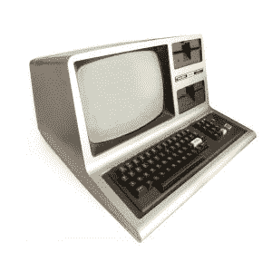

# 制作者能拯救 RadioShack 吗？

> 原文：<https://thenewstack.io/can-makers-save-radioshack/>

RadioShack 曾经是极客文化的标志，但却经历了两次破产——这让每个对自己的电子产品和小玩意仍有美好童年记忆的人感到困惑。但是，随着新的独立拥有的 RadioShacks 开始营业，最终复兴这个品牌的会是制造商运动吗？

Radio Shack 曾经有超过 7000 家店铺，[记得经济学家](https://www.economist.com/science-and-technology/2015/02/17/making-it)，尽管“事后看来，这可能是问题的一部分。在许多地方，会有三到四个无线电棚可供选择，所有这些都在 15 分钟的车程之内。”在高峰期，超过 95%的美国家庭的 3 英里内有一个无线电黑客[，但去年 CNN 财经](https://www.usatoday.com/story/money/business/2017/05/31/radioshack-closes-1000-stores-week-these-72-left/102372912/)[认为](http://money.cnn.com/2017/11/03/news/companies/radioshack-survives-second-bankruptcy/index.html)“随着美国人转向网上购物，商店网络从战略利益变成了昂贵的负担。”

## 历史上的地位

有趣的事实！RadioShack 的 TRS-80 Model 100 的大部分代码是由 28 岁的比尔·盖茨编写的！(是的，我们知道这是 Model 3)。

《经济学人》记得 Radio Shack 于 1977 年推出的 TRS-80 系列个人电脑最初的销量超过了苹果和康茂德的第一批个人电脑。但 TRS-80 也标志着商店的一个转折点。“从那时起，Radio Shack 就迷上了价格更高的预组装产品”——这些价格对小企业比对他们的业余用户群更有吸引力。

此外，随着家用电脑的引入，一代狂热分子自学编程，然后用编写软件来消磨业余时间，而不是把元件焊接到印刷电路板上

《经济学人》2015 年的一篇文章[认为](https://www.economist.com/science-and-technology/2015/02/17/making-it)该公司已经放弃了爱好者的冲动购买，进入了“销售手机的残酷世界”但作者将部分责任归咎于电路板印刷方式的变化，因为新型微小的表面贴装元件功能更强大，但业余爱好者焊接起来极其困难。“像 Raspberry Pi 这样的现代电子产品是预先组装好的，这充分说明了业余爱好者运动是如何发展的。”

《财富》[报道称【that RadioShack 最终在 1996 年达到顶峰，在电子产品销售开始转移到网上之前创造了近 63 亿美元的收入。20 年后的 2015 年，根据德意志银行的数据，亚马逊吸收了美国消费电子产品销售增长的 90%。](http://fortune.com/2017/05/31/radioshack-tweets-retail-demise/)

RadioShack 承认其在 20 世纪 80 年代的繁荣岁月，在 2014 年的一个商业广告中，Radio Shack 的一名员工帮助他最终升级了他的手机。广告以口号结束。“D.I.Y 已经进化了。现在是 D.I.T .的时候了…看看我们一起做事会有什么可能。”

[https://www.youtube.com/embed/MfvhWQUO6po?feature=oembed](https://www.youtube.com/embed/MfvhWQUO6po?feature=oembed)

视频

RadioShack 在 2014 年超级碗期间播出了一则传奇广告。它的前提？20 世纪 80 年代打来电话，想要回它的商店。

[https://www.youtube.com/embed/aUCHy5y23nI?feature=oembed](https://www.youtube.com/embed/aUCHy5y23nI?feature=oembed)

视频

但是一年后，CNN 报道说“这个广告对公司没有任何帮助。相反，这无疑强化了该公司品牌形象陈旧的观念。到 2015 年，RadioShack 仍然有超过 4000 家商店，当时它申请破产并关闭了其中的 2400 家。又过了两年，超过 1518 家商店由 Sprint 与对冲基金 Standard General 的合资公司“通用无线”经营。2017 年春天，RadioShack 在申请第二次破产时仍有 1943 个位置，并开始关闭更多位置。据《今日美国》援引该公司的破产申请称，他们已经一年亏损 2 亿美元(仅移动业务一项)。

对于那些还记得该店很久以前全盛时期那种敢做敢为精神的人来说，这是一个悲伤的时刻。

[https://www.youtube.com/embed/BS1XN7Ka60s?feature=oembed](https://www.youtube.com/embed/BS1XN7Ka60s?feature=oembed)

视频

约翰·奥利弗甚至在 2015 年录制了一个片段，称 RadioShack 是“一个真正的美国偶像”，谴责对“一个垂死的、94 岁的企业”缺乏同情

[https://www.youtube.com/embed/3FCioWz7aps?feature=oembed](https://www.youtube.com/embed/3FCioWz7aps?feature=oembed)

视频

今年 1 月，当 RadioShack [退出其第二次破产](https://www.retaildive.com/news/update-radioshack-exits-bankruptcy-again/508449/)时，它给通用无线留下了一个网站和其剩余经销商的小网络——外加一个仓库。该公司预计 2018 年的总收入仅为 1500 万美元。

所以我们的耳朵竖起来，以一个令人兴奋的标题周一在主板。"[DIY 运动让 RadioShack 起死回生](https://motherboard.vice.com/en_us/article/ywen9x/diy-maker-movement-radioshack-back-backruptcy)"

“独立拥有的专营店是四面楚歌的品牌的第二次到来，”卡雷·罗杰斯报告说

https://Twitter . com/KaleighRogers/status/1003695600230117376

到去年 9 月，RadioShack 已经减少到只有 17 家公司拥有的商店(在 7 个州)，但仍然拥有至少 425 家独立经销商，他们现在代表着这个品牌。神奇的是，这个数字还在增长。今年 3 月，一家新的 RadioShack 在爱达荷州的 Pocatello(人口:54，255)开张，老板是 Vern Murray 和他的妻子 Dalyn。一家当地报纸称，开业“凸显了该公司作为一系列独立拥有的特许经营店的复兴，这些店完全继承了停业的公司拥有的 RadioShack 店。”

默里已经在附近的爱达荷州布莱克富特拥有一个无线电黑客超过 20 年，并告诉爱达荷州杂志，他现在正在考虑扩展到更多的城市。

上周，极客网站 Hackaday [注意到了新开的商店](https://hackaday.com/2018/06/03/hackaday-links-june-3-2018/)，一位评论者称赞了独立商店的勇气。"大多数人似乎都在适应创客运动."

> “我去过爱达荷州波卡特洛的那个，”Hackaday 的另一位读者补充道。"它实际上有相当多的存货，是的，它有零件抽屉."

早在 2015 年，CNN Money 采访了两家 RadioShack 商店的老板，一家在马萨诸塞州，一家在佛蒙特州，他坚持认为“[我们碰巧做得很好](http://money.cnn.com/2015/02/05/news/companies/radioshack-franchises/)，我知道很多其他特许经营者也是如此。”

“我们是幸存者，”他补充道。

在缅因州拥有两家商店的 Russ Bracket 指出，即使 RadioShack 不复存在，他也可以从其他供应商那里订购他的库存。在华盛顿的塞基姆，商店老板芭芭拉·莱尔抱怨说，“从公司外部订货时，要涉及很多步骤。这是一件苦差事。”但是她承认有时候他们的新批发商实际上给了他们更便宜的价格。

【T2

这家 B2B 网站去年 8 月两次报道说，威斯康星州的一家商店已经成为自第二次破产以来第一家新开的 RadioShack 商店，尽管它的老板说他听说更多的商店将很快开业。今年四月，一家新的 RadioShack [在俄克拉荷马](http://www.claremoreprogress.com/news/lifestyles/radio-shack-to-open-in-ne-mar-center-this-weekend/article_dd8a95ac-427e-11e8-a5dc-133145fb3a2a.html)开业。“与我交谈过的公众告诉我们，他们很怀念在克莱尔莫尔拥有一个收音机小屋，”商店老板泰德·提尔说，并补充说，“反馈非常积极，所以我们期待在这里满足社区的需求。”

“自己动手——这是现在 Radio Shack 的一大特色，”他补充道。“电子零件和部件、组件——诸如此类的东西……而我们仍将携带我们过去使用的较小选择——AM/FM 收音机、耳机、电子电缆等。——我们正在成为一家对电子产品有更大吸引力的商店——电阻、电容、你在其他地方找不到的电子产品电池，以及类似的产品。”

## 讲述他们的故事

我打电话到维恩·默里在爱达荷州波卡特洛的店里，他起初解释说他不能说话，因为他正在帮助一位顾客。但是当我在一个更方便的时间联系到他时，默里回忆起过去 20 年作为一个无线电黑客的所有者的起起落落。“蜂窝电话时代对我们来说很重要，在此之前，碟形卫星天线时代很早就开始了。现在，我们又回到了 RadioShack 的起点:更小的交易，回到核心产品，RadioShack 是为了什么而发明的……”

事实上，破产实际上为个体店主创造了新的机会。“公司商店拥有所有的大城市…现在他们鼓励 ma 和 pop 商店接管这些地区。”

他认为，个人风格可以帮助个体实体店在 Amazon.com 时代生存下来。还有一件事他们可以做，而亚马逊做不到:让客户避免商品发货延迟。“他们可以触摸它，感受它，使用它，然后说，‘是的，这比等着它从中国运来要好。’"

年轻的科技爱好者当然有助于他的底线。“这里有一所大学有一些机器人项目，这使它成为一个非常好的商店。”

但是还有另一个显著的变化，幸存的商店聚集成一个社区，互相交流。“有趣的是，在破产之前，我们很少这样做……它把经销商拉到一起，让他们分享经验、产品、快乐时刻和悲伤时刻。现在这种情况比破产前要多得多。”他们聚集在脸书 RadioShack 商店老板的团体中，交流什么有用什么没用的技巧，还有故事，也许还有一两张图片。

“与 20 年前我们开始合作时相比，我觉得我现在是更好的朋友，对 RadioShack 了解更多。当新产品出来时，人们会跳出来说，“嘿，那个很棒”或“不，那个有很多回报，离它远点，”关于客户的有趣故事…

什么能让商店继续存在？很简单。“这个世界永远需要有人来帮助他们解决问题……我认为没有人会再靠这个发财了——我认为那样的日子已经一去不复返了。但我认为，总会有一个地方适合那些会焊接电线或回答问题的人，为老年人的无绳电话安装电池，为汽车的钥匙链安装电池。

"在电子环境中，总是需要良好的客户服务。"

* * *

# WebReduce

<svg xmlns:xlink="http://www.w3.org/1999/xlink" viewBox="0 0 68 31" version="1.1"><title>Group</title> <desc>Created with Sketch.</desc></svg>