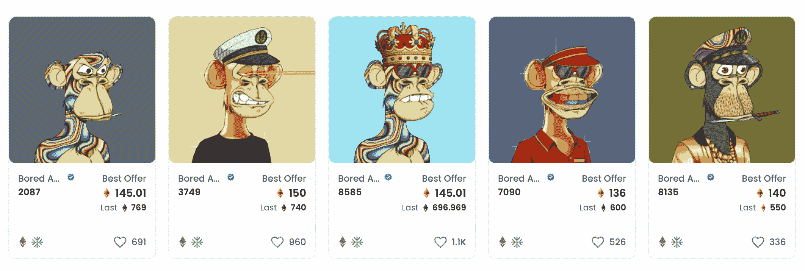
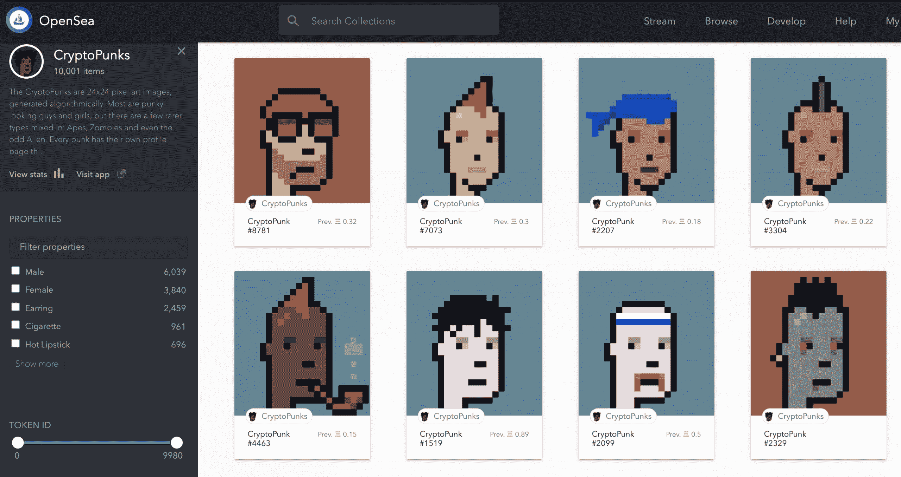
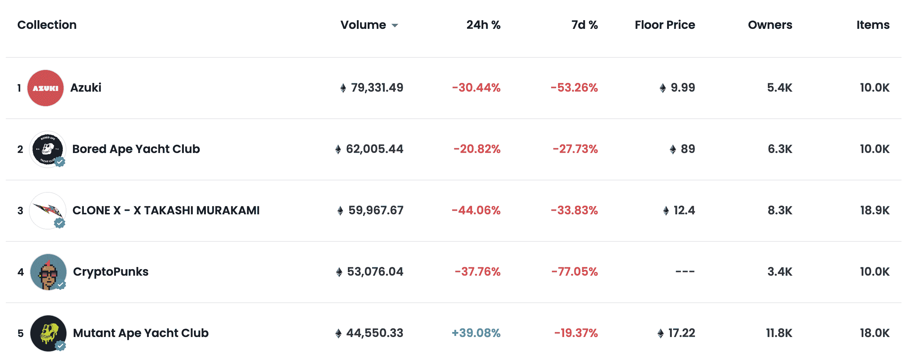
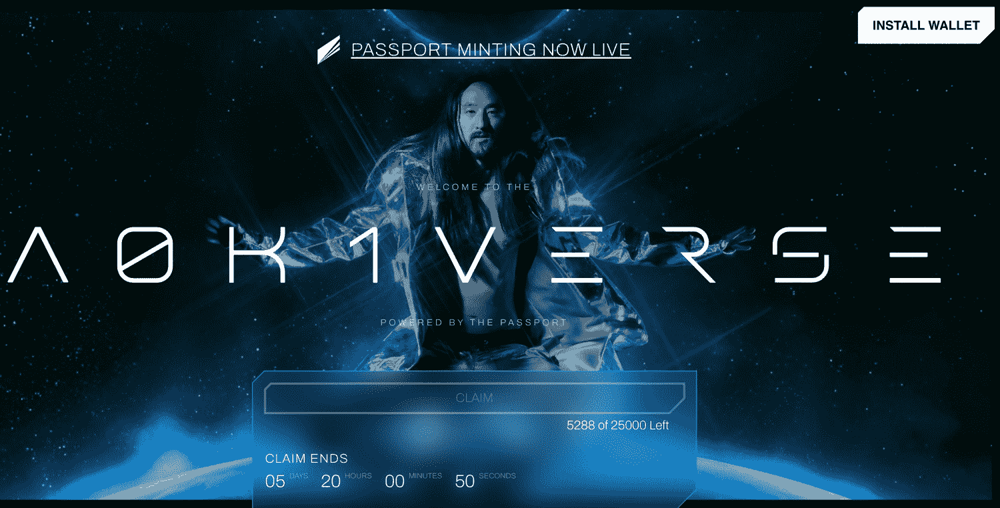

# NFT 科技能超越数码猩猩和朋克吗？

> 原文：<https://thenewstack.io/can-nft-technology-expand-beyond-digital-apes-and-punks/>

在过去的一两年里，NFT(不可替代的令牌)席卷了互联网世界。当我们今天想到 NFT 时，我们大多会想到充斥在我们社交媒体屏幕上的数字卡通——猿、朋克以及介于两者之间的一切。也有大量的 NFT 艺术品拍卖，集中体现在这个时代的达明安·赫斯特:2021 年 3 月，他以 6900 万美元的价格卖出了一件著名的 NFT 艺术品[。](https://www.theverge.com/2021/3/11/22325054/beeple-christies-nft-sale-cost-everydays-69-million)

然而，有一种感觉是，NFT 技术只是触及了其真正潜力的表面。事实上，一些 NFT 显然价值数百万美元，这是我们目前正在经历的围绕加密货币的金融泡沫的一部分。投机和地位正在推动今天的 NFT 市场。然而，泡沫可能会在某个时候破裂，所以问题是:非技术产业还能做什么？除了数字收藏品和艺术品投资，它们还有合法的使用案例吗？

最左边的“无聊的猿”最后一次卖出是在 2021 年 9 月，超过 200 万美元；来源: [OpenSea](https://opensea.io/assets/0xbc4ca0eda7647a8ab7c2061c2e118a18a936f13d/2087) 。

## NFTs 背后的技术

要回答这些问题，我们首先需要了解 NFT 是如何构建的。

非功能性测试主要基于一个协议: [ERC-721](http://erc721.org/) 。这是 2018 年初发布的以太坊标准，基于数字收藏品产品 CryptoKitties 的创始人 [Dieter Shirley](https://twitter.com/dete73?lang=en) 编写的代码。大约从 2017 年 12 月开始，CryptoKitties 为今天的 NFT 热潮设定了模板，不可替代的猫科动物售价高达数十万美元。

NFTs 的“不可替代”部分仅仅意味着每个 NFT 都是唯一的——不像 ETH 这样的加密货币，它是可替代的(一个 ETH 与另一个 ETH 完全相同)。这种“唯一性”只在区块链上有明确说明，但不一定具有法律约束力。ERC-721 是 NFT 通过智能合同在区块链以太坊宣称的所有权。

ERC-721 不是开发人员可以使用的唯一以太坊标准，但它是最适合用来构建 NFT 的标准。其他标准包括 ERC-20(跟踪可替换令牌)、ERC-777(可替换令牌的另一个标准，但这个标准支持更复杂的交互)和 ERC-1155(一个“不可知可替换性”的多令牌标准)。

在 ERC-721 之后，ERC-1155 是下一个最适合 NFTs 的——但它往往更多地用于游戏应用。例如，在一个游戏中，你可能会花钱购买可替代和不可替代的数字资产(一把魔剑、一件衣服等)。

## ERC-721 如何工作以及平台如何扩展它

ERC-721 所做的是为智能合约中的令牌实现一个 API，它为每个唯一的 NFT 指定所有权，并允许它被买卖。ERC-721 是一个相当基本的协议，功能有限。正如 NFT 市场 OpenSea [对它](https://opensea.io/blog/guides/non-fungible-tokens/)的描述，“它[ERC-721]提供了唯一标识符(每个标识符代表一项资产)到代表该标识符所有者的地址的映射”，以及“使用 transferFrom 方法转移这些资产的许可方式。”

ERC-721 的有限功能促使一些密码评论家注意到，该标准有被平台玩家边缘化的风险，如 OpenSea。[莫邪·马林斯派克](https://twitter.com/moxie)，加密即时通讯服务 Signal 的创始人，最近尝试了 NFT 的开发，并指出 OpenSea 已经开始添加扩展 ERC-721 的专有功能。“协议不能像平台一样快速移动，”他在 Twitter 上评论[，“所以 opensea 作为一个平台迭代，实现 erc721 所缺少的所有东西(版税、出价、拍卖、社交功能等)。”](https://twitter.com/moxie/status/1456312547439689740)

当然，这和我们在 Web 2.0 中看到的模式是一样的——在 Web 2.0 中，像 RSS 这样的开放协议最终被专有技术(脸书的新闻订阅、Twitter 的订阅等)推到了一边。

## 收藏品统治了 NFT，但是能持续多久呢？

不管 OpenSea 和其他 NFT 中央平台是否最终控制了 NFT 市场(如果他们还没有控制的话)，NFTs 似乎已经准备好扩张了。四年前, , OpenSea 将自己描述为“稀有数码产品的点对点市场”CryptoKitties 和 CryptoPunks(社交媒体上第一套流行的 NFT 个人资料图片)是当时领先的 NFT 系列。

2018 年 8 月 CryptoPunks，第一波 NFTs 期间；来源:[互联网档案馆](https://web.archive.org/web/20180816162323/https://opensea.io/assets/cryptopunks)。

顺便提一下，最初的密码朋克是在 ERC-721 存在之前创造的，所以他们[是通过“修改 ERC-20 代码以产生不可替代的物品”而被开发出来的](https://academy.binance.com/en/articles/what-are-cryptopunks)此后，它们被“包装”成 ERC-721 代币，允许它们在像 OpenSea 这样的市场上交易。

时间快进到 2022 年 2 月，OpenSea [将自己描述为“NFT 市场，为每个人提供一切。”在一个介绍性视频中，OpenSea 将 NFTs 定义为“任何可以在线购买、出售或交易的数字独一无二的‘东西’。”例子包括“艺术，虚拟体验，你最喜欢的乐队的演示，虚拟财产。”](https://opensea.io/#meetopensea)

尽管随着时间的推移，NFTs 的定义扩大到包括“一切”，但 OpenSea 今天的五大收藏都是收藏品。

过去 30 天的 OpenSea 顶级 NFT

## 超越猿和朋克:NFT =权利

那么，我们什么时候才能看到突破性的非收藏 NFT 呢？一个比大多数人更有资格回答这个问题的人是[威廉·恩特里肯](https://phor.net/)，ERC-721 创建时的项目负责人，现在是区块链项目的独立顾问。在最近的一次采访中，Entriken 说 NFT 的下一波增长将由“非技术事物的影响者——化妆、时尚、艺术、[……]音乐家”驱动他认为这些新的 NFT 不会陷入投机狂潮。

“现在，一切都像在谈论美元、比特币基地、货币和交易，”他说。“交易并不真正适用于我们将看到的一些新的非金融交易，因为没有真正的货币价值。”

他没有提到具体的例子，但我能想到的一个是音乐人的 NFTs。从你喜欢的音乐人那里购买 NFT 可能会给你带来某些只有你和其他超级粉丝感兴趣的好处——他们演唱会的预售票、幕后博客等等。正如 Substack 的作者 Dan Fowler 很好地描述的那样，在这个场景中,“NFT 主要是一个出售版权的工具”

这已经开始发生在早期采用音乐的人身上。流行音乐主持人史蒂夫·青木正在推出一个名为 [A0K1VERSE](https://a0k1verse.xyz/) 的以太坊 NFT 会员俱乐部。据 crypto 新闻网站 [Decrypt](https://decrypt.co/91317/dj-steve-aoki-launches-ethereum-nft-membership-club-i-am-building-my-own-world) 报道，“持有青木 NFT 护照的人将获得各种优惠，包括现场和元宇宙音乐会和活动。”

史蒂夫·青木的 NFT

## 结论

对于 NFTs 来说，这是一个迷人的时代。首先，因为像 OpenSea 这样的 NFT 平台存在集中化的“威胁”(我把这个词放在引号中只是因为 Web3 的支持者声称反对集中化)。其次，在我看来更重要的是，真正的 NFTs 市场似乎更像是一个基于权利的用例，而不是我们现在正在经历的基于投机的用例。对我来说，创作者出售一幅 NFT 作品以获得版权，比购买一幅数字漫画或艺术品，然后希望你可以转售给另一个傻瓜以获得更多钱，更有经济意义。

非物质文化需要物质——通过提供真正的价值——来真正在我们的网络文化中扎根。我们现在在 NFTs 中看到的猜测有希望是一个暂时的插曲。

<svg xmlns:xlink="http://www.w3.org/1999/xlink" viewBox="0 0 68 31" version="1.1"><title>Group</title> <desc>Created with Sketch.</desc></svg>