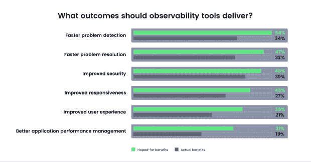

# 可观测性平台能超越传统 APM 吗？

> 原文：<https://thenewstack.io/can-observability-platforms-prevail-over-legacy-apm/>

451 Research 最近的一份市场洞察报告介绍了我们的 [Chronosphere](https://chronosphere.io/) 可观测性平台和功能，并承认在当今日益云化的原生世界中对它们的需求。

但这份名为[“超时空领域旨在驯服失控的可观测性数据和成本](https://go.chronosphere.io/chronosphere-aims-to-tame-runaway-observability-data-and-costs.html)”的报告也提出了一个问题:市场上是否有像我们这样独立、可扩展和可盈利的可观测性参与者的长期空间？或者，传统的应用程序性能监控(APM)供应商最终会介入并夺取控制权吗？

451 项研究调查显示，36%的企业已经在生产中部署了可观察性工具。另有 18%的公司目前正在概念验证计划中对其进行调查。

我们自然认为是前者。毕竟，我们的创始人，首席执行官 Martin Mao 和首席技术官 Rob Skillington，在优步带领 observability 团队创建了 M3，这是一个开源、可扩展的远程存储时间序列数据库。

虽然我们的解决方案是为运行在容器上的大规模、基于微服务的应用程序而从头设计的，但我们也可以[监控运行在非容器化环境中的](https://thenewstack.io/monitoring-microservices-red-method/)monolithis，这意味着许多企业中普遍存在的混合环境只需一个像我们这样的工具就可以监控。考虑到 451 Research 的分析发现，组织正在寻求减少而不是扩大他们的可观察性工具集，这一点尤其重要。

## 为什么是可观察性？

世界正朝着速度、规模和效率的云原生方向发展。云原生架构支持更快的软件开发生命周期。价值可以更快、更增量地实现。但是，一旦组织进行大规模部署，了解更小的、分布式的、相互依赖的部分就变得必不可少。有太多移动的部分，太多可能会出错，没有对这样的环境的透明度和控制。

标准普尔全球市场情报的 451 Research 将可观察性定义为“摄取、存储和分析结构化事件数据，以检测和解决问题。”像我们这样的可观察性平台允许工程师快速关注上下文相关的数据，以诊断云原生环境中的问题。

可以说，[传统的 APM 解决方案](https://thenewstack.io/apm-vendors-are-creating-confusion-about-observability-dont-fall-for-it/)根本无法在云环境中实现可观察性。[这些传统解决方案会遇到三个基本问题](https://chronosphere.io/platform/what-is-cloud-native-monitoring/):

*   可扩展性:云原生环境广播大量数据，比基于虚拟机(VM)的传统环境多 10 到 100 倍。
*   灵活性:云原生应用和它们运行的基于容器的基础设施是短暂的。它们只存在于部署的整个生命周期中。鉴于今天的实践，这些寿命往往很短。
*   可靠性:如果您的测量工具本身在 99.9%以上的时间里不可用，就不可能保证 99.9%的正常运行时间服务水平协议(SLA)。今天的大多数 APM 都无法达到“三个九”的可用性级别。

这些关于可伸缩性、灵活性和可靠性的挑战是我称之为可观察性工具的“期望差距”问题的主要驱动力。公司希望他们的可观察性工具能给他们更快的问题检测(平均检测时间)、更快的问题解决(平均恢复时间)和更好的响应。但对于那些使用 APM 或 IT 基础设施监控解决方案的公司来说，他们的解决方案可能会有所欠缺。

根据 451 研究数据，对可观察性工具的期望差距相当大:更快的问题检测 20 个百分点，更快的问题解决 15 个百分点，提高响应能力 16 个百分点。

资料来源:451 研究

## 为什么是时空球？

在报告中，451 Research 简洁地阐述了 Chronosphere 的价值主张:

“该公司的 SaaS 平台将开源云监控的优势与客户输入相结合，以消除无差别指标和跟踪的噪音。”

451 研究指出，基于 [Prometheus](https://chronosphere.io/learn/four-signs-youre-outgrowing-prometheus/) 或 OpenTelemetry 的自管理 OSS 解决方案在从集装箱化环境中捕获指标和跟踪时可以很好地工作。但是它们有许多局限性。首先，随着应用程序的增长，需要更多的工作人员来支持它们，导致成本上升。

451 Research 表示，随着组织尝试扩展，可用性和弹性也是“重要问题”。大量的相互依赖导致了更高的数据基数，并且更迫切地要求根据业务指标将基础设施连接到应用程序。这就是为什么，即使在与基于虚拟机的部署相同的规模下运行，云原生应用程序的监控费用也会高得多，451 Research 总结道。

在 [Chronosphere](https://chronosphere.io/solutions/) ，我们的目标是使用我们的控制平台来减轻处理加速数据增长的痛苦以及可观察性数据的成本，控制平台依赖于聚合和其他技术来提出保留和解析策略，使我们的客户能够只为他们绝对需要保留的数据付费。

另外，我们对重要的事情有不同的看法。正如 451 Research 所写的，

“该公司[Chronosphere]认为，它的与众不同之处在于解决客户面临的问题的根本原因，而不是过度关注指标、日志和跟踪(这是数据)—主要活动是反思应用程序，以了解正在发生的事情。”

这确实是我们所相信的。我们关注结果，而不是数字本身。

在实践中，这意味着使用我们的超时空工具让工程师专注于解决[的三个关键问题](https://chronosphere.io/learn/are-the-three-pillars-of-observability-still-relevant/):

1.  当出现问题时，在客户或员工有负面体验之前或之后，我能多快得到通知？
2.  我如何方便快捷地对问题进行分类并了解其影响？
3.  我如何找到潜在的原因以便解决问题？

通过关注结果——我们能多快纠正这种有问题的客户或员工体验——而不是输入(指标、日志和跟踪),我们的平台因能够显著缩短解决问题的时间而闻名。这对于越来越依赖云原生应用的企业来说非常重要。

## 我们设计并构建了云固有动量的可观测性平台

云的本地可观测性已经成为传统 APM 领域的一股颠覆性力量。451 指出，“随着企业努力应对复杂的云原生应用带来的挑战，人们也对专门针对云原生技术设计的工具感兴趣。”由于云原生环境的要求，它在架构上有着显著的不同和独特性。传统 APM 供应商无法切实地重新设计他们的解决方案，以使其在这个新世界中发挥作用。

APM 可能是企业基于虚拟机的应用程序所需的工具，但可观察性将为具有云原生环境的企业带来竞争优势。另一种思考方式是，尽管今天的 APM 工具是为云设计的，但可观测性平台是为原生云设计的。这是一个很大的区别。随着组织越来越多地转向云原生架构，像我们的 Chronosphere 平台这样的可观察性平台将不可避免地在交付业务成果的使用和有效性方面超过 APM 解决方案。

<svg xmlns:xlink="http://www.w3.org/1999/xlink" viewBox="0 0 68 31" version="1.1"><title>Group</title> <desc>Created with Sketch.</desc></svg>