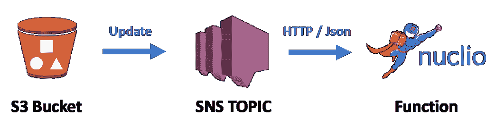

# 开源的 Serverless 能比 AWS Lambda 简单吗？Nuclio 的测试案例

> 原文：<https://thenewstack.io/can-open-source-serverless-be-simpler-than-aws-lambda-a-test-case-with-nucleo/>

[](http://iguaz.io/blog/)

 [亚龙·哈维夫

亚龙·哈维夫，iguazio 的 CTO 兼联合创始人，是一位涉足大数据、云、存储和网络的连续创业者。在加入 iguazio 之前，Yaron 是 Mellanox 的数据中心解决方案副总裁，负责技术创新、软件开发和解决方案集成。亚龙发推文为@亚龙特拉维夫。](http://iguaz.io/blog/) [](http://iguaz.io/blog/)

最近在浏览 CNCF 无服务器 Slack 频道时，我注意到一条消息；有人需要帮助编写一个处理 S3 更新事件的函数。他不想使用 AWS Lambda，而是寻找一个基于 Kubernetes 的开源解决方案。作为回应，我接受了为开源 [nuclio](https://github.com/nuclio/nuclio) 高性能无服务器事件和数据处理平台编写函数的挑战。这比你想象的要简单。

围绕是使用无服务器(托管云)还是 FaaS(开源功能即服务)，一直存在争议。无服务器平台更简单、完全协调且成本更低(仅针对每次调用)。为什么会有人想要使用开源的无服务器/FaaS 呢？大概是现实重创的时候…

我参加了最近在巴黎举行的无服务器会议，会上无服务器担忧者展示了真实世界的使用案例。其中一个描述了一个场景，这个函数需要比 Amazon Lambda 允许的更多的执行时间，并且由于缺乏并发性而太慢。她必须将代码分解成更小的任务，用 S3 存储中间状态，用 SQS 存储中间消息，并设法让它工作。

正如您可能已经猜到的那样，它花费的时间和金钱比他们预期的要多得多，她最终调用了 65，000 次，而不是一次函数调用！在某一点上，工作流意外地关闭了整个公司的服务。

开源无服务器并不总是像云提供商服务那样集成，但它在设置自己的参数、选择要使用的数据或 API 网关、本地调试、避免冷启动(如果需要)以及更快的速度方面给了你更多的选择。

如果你对微服务感兴趣，你可能已经有了一个运行中的 Kubernetes 集群——要么是你已经安装的，要么是 Google/ Azure/ AWS 管理的 Kubernetes 服务。部署像 nuclio、OpenFaaS 或 Kubeless 这样的开源无服务器平台需要一些额外的命令，但它只需要做一次，使用所有底层的 Kubernetes 服务，并且是可移植的。这个过程并不像一些云提供商想的那么难。几个托管的 Kubernetes 服务提供按功能容器执行时间计费的服务，因此，即使声称“托管的”无服务器(不像 FaaS)是“按使用付费”的论点也可能很快消失。

## 测试用例:编写和部署一个真实的函数

我将用一个常见的功能用例来证明我的观点:观察一个本地云提供商服务(AWS S3)并在每次有更新时采取行动。这个函数是用 Go 编写的，使用 [nuclio](https://github.com/nuclio/nuclio) 无服务器平台，而不是 [Kubernetes](https://kubernetes.io/) 。

如果你还没有听说过[纽克利奥](https://github.com/nuclio/nuclio)，你可以在[之前的帖子](https://thenewstack.io/whats-next-serverless/)中读到更多。简而言之，nuclio 是一个速度极快的无服务器平台，具有实时处理引擎(比 AWS Lambda 快 100 倍)，支持各种各样的原生事件源，如 HTTP、Cron 和主流消息或流选项(Kafka、AWS Kinesis、Azure Event-hub、RabbitMQ、NATS、MQTT、Google Pub/Sub、iguazio v3io)。nuclio 有许多独特的功能，如版本控制、项目层次结构、集成的结构化日志/调试、流处理、UI 等等。

nuclio 进展很快，现在支持所有主要语言(Py、Go、Java、Node.js、C#/。Net、Shell、二进制)。要在 Docker(独立版)、Kubernetes 或受管理的 Kubernetes 上本地设置 nuclio，请查看 nuclio Github 上的说明[。](https://github.com/nuclio/nuclio#further-reading)

## 我的函数是如何工作的？

使用 AWS，当你在 S3 放置一个对象时，你可以通过亚马逊 SQS(简单队列服务)、SNS(简单通知服务)或直接触发 Lambda 功能来请求通知。我选择了 SNS，因为它可以简单地向预先注册的 HTTP 端点触发 HTTP 请求。

[](https://storage.googleapis.com/cdn.thenewstack.io/media/2018/04/1ff1235a-serverless-01.png)

当浏览互联网时，我很快找到了一个 SNS 和 S3 更新消息的例子和一个带有所有亚马逊事件结构标题的 [Go 库](https://github.com/eawsy/aws-lambda-go-event)。你可以阅读 [AWS 文档](https://docs.aws.amazon.com/AmazonS3/latest/dev/NotificationHowTo.html)或者关注这篇[更简单的博客文章](http://www.tothenew.com/blog/configuring-sns-notifications-for-s3-put-object-event-operation/)，它解释了如何设置 S3 桶来生成通知，以及如何设置 SNS 服务来将它们转发到电子邮件/HTTP(只需用你的 HTTP 端点切换示例中的电子邮件目的地)。这些步骤在任何情况下都必须完成，即使使用 Amazon 原生 Lambda 服务。

在查看函数调试日志时，我很快发现它生成的第一条消息是订阅确认消息，并在函数中添加了一种处理方法(用 HTTP GET 请求响应它)。请参见下面的示例函数和完整的源代码，以及链接中的文档[。](https://github.com/nuclio/demos)

该函数从解封 SNS JSON 消息(事件体)开始。如果它是一个“SubscriptionConfirmation”消息，它用一个确认来响应，然后它解组 S3 更新消息(发现编码在 SNS 消息中),并打印所有 S3 对象细节，如桶名、对象键、对象大小等。

您可能会问自己，我是如何创建包含所有外部包和依赖项的部署包/zip 的(就像在 Lambda 中一样)。nuclio 足够智能，能够注意到您的依赖项，并在函数构建过程中自动为您下载这些依赖项。如果您想要特殊的打包指令(比如添加定制文件)，请使用标准的 dockerfile/linux 命令在函数规范中指定它。

```
<strong>func  </strong>Handler(context *nuclio.Context,  event nuclio.Event)  (<strong>interface</strong>{},  error)  {

<em>// non intrusive structured Debug log (runs only if level is set to debug)
  </em>context.Logger.DebugWith(<strong>"Process document"</strong>,  <strong>"body"</strong>,  string(event.GetBody()))

<em>// Get body, assume it is the right HTTP Post event, can add error checking
  </em>body  :=  event.GetBody()

snsEvent  :=  snsevt.Record{}
  err  :=  json.Unmarshal([]byte(body),&amp;snsEvent)
  <strong>if  </strong>err  !=  nil  {
  <strong>return  ""</strong>,  err
  }

context.Logger.InfoWith(<strong>"Got SNS Event"</strong>,  <strong>"type"</strong>,  snsEvent.Type)

<strong>if  </strong>snsEvent.Type  ==  <strong>"SubscriptionConfirmation"  </strong>{

<em>// need to confirm registration on first time
  </em>context.Logger.DebugWith(<strong>"Handle Subscription Confirmation"</strong>,
  <strong>"TopicArn"</strong>,  snsEvent.TopicARN,
  <strong>"Message"</strong>,  snsEvent.Message)

resp,  err  :=  http.Get(snsEvent.SubscribeURL)
  <strong>if  </strong>err  !=  nil  {
  context.Logger.ErrorWith(<strong>"Failed to confirm SNS Subscription"</strong>,  <strong>"resp"</strong>,  resp,  <strong>"err"</strong>,  err)
  }

<strong>return  ""</strong>,  nil
  }

<em>// Unmarshal S3 event, can add validations e.g. check if snsEvent.TopicArn has the right topic
  </em>myEvent  :=  s3evt.Event{}
  err  =  json.Unmarshal([]byte(snsEvent.Message),&amp;myEvent)
  <strong>if  </strong>err  !=  nil  {
  <strong>return  ""</strong>,  err
  }

<em>// Log the details of the S3 Update
  </em>record  :=  myEvent.Records[0].S3
  context.Logger.InfoWith(<strong>"S3 Details"</strong>,  <strong>"bucket"</strong>,  record.Bucket.Name,
  <strong>"key"</strong>,  record.Object.Key,  <strong>"size"</strong>,  record.Object.Size)

<em>// handle your S3 event here
  // ...</em>

<strong>return  ""</strong>,  nil
  }

```

请注意 nuclio (context)中内置的结构化多级日志记录的使用。Logger…)。这使得调试我的函数或者在生产中以非侵入的方式观察它变得很简单(日志详细级别可以在运行时确定)。

由于我很懒，喜欢在打字和内置调试器时自动完成，我在 JetBrain 的 [Goland](https://www.jetbrains.com/go/) IDE 中编写了我的函数，并在本地(在我的笔记本电脑上)用 [nuclio 测试包](https://github.com/nuclio/nuclio-test-go)对一个样本 S3/SNS 消息进行了测试。

下面是 nuclio 功能单元测试代码:

```
<strong>func  </strong>TestS3Watch(t  *testing.T)  {
      <em>// Initialize a test context (verbose = true)
      </em>tc,  err  :=  nutest.NewTestContext(Handler,  <strong><em>true</em></strong>,  nil  )
      <strong>if  </strong>err  !=  nil  {
         t.Fatal(err)
      }

      <em>// Create a test event (eventString is a simulated event Json)
      </em>testEvent  :=  nutest.TestEvent{  Path:  <strong>""</strong>,  Body:  []byte(eventString)  }

      <em>// Invoke the tested function 
      </em>resp,  err  :=  tc.Invoke(&amp;testEvent)
      tc.Logger.InfoWith(<strong>"Run complete"</strong>,  <strong>"resp"</strong>,  resp,  <strong>"err"</strong>,  err)
  }

```

为了让函数监听公共 URL 并拦截 AWS 消息，我必须配置一个 API 网关，它根据路径前缀将 HTTP 请求转发给我的函数。有了 nuclio 的用户界面，这个过程就简单了(我的意思是，你有没有尝试过设置一个 AWS API 网关？).转到 triggers 选项卡，添加一个带有所需路径和首选项的 HTTP 触发器，它会自动为您提供一个 Kubernetes Ingress (API 网关)服务。

我想发送一个完整的工作代码示例，所以我使用 nuclio 配置装饰。它允许你设置任何[功能规范属性](https://github.com/nuclio/nuclio/blob/master/docs/reference/function-configuration/function-configuration-reference.md)(环境变量、构建依赖、触发配置等)。)通过内联代码注释(见下文)。我用它来指定 API 网关配置(path = /mys3hook ),现在您可以原样使用这段代码，并在任何地方运行它，而无需任何手动配置。只需通过 UI、CLI 或 Web API 进行部署。

```
<em>// @nuclio.configure
  //
  // function.yaml:
  //   spec:
  //     triggers:
  //       myHttpTrigger:
  //         maxWorkers: 4
  //         kind: "http"
  //         attributes:
  //           ingresses:
  //             http:
  //               paths:
  //               - "/mys3hook"

</em>

```

这个函数现在是一个内置的 nuclio playground (UI)例子。它可以与操场上其他很酷的对象处理功能示例结合使用，如文本文件模式搜索、图像缩略图生成、人脸识别或情感分析。

“无服务器”的最大优势是自动化您的开发工作流程，同时忽略了底线(服务器)基础设施，并且它不仅限于云提供商的产品！

在许多情况下，开源的无服务器替代方案提供了更多的价值:

*   提供更好的控制和定制选项，
*   可以部署在本地、笔记本电脑或您选择的云中，
*   不限于特定云提供商的 API 和触发选项，
*   提供更快的性能，
*   更加简单。

<svg xmlns:xlink="http://www.w3.org/1999/xlink" viewBox="0 0 68 31" version="1.1"><title>Group</title> <desc>Created with Sketch.</desc></svg>