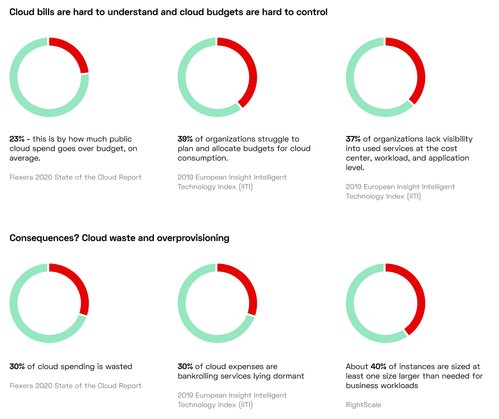

# 减少云浪费有助于拯救地球吗？

> 原文：<https://thenewstack.io/can-reducing-cloud-waste-help-save-the-planet/>

[Annie Talvasto](https://www.linkedin.com/in/talvasto/)

[Annie 是一名国际技术演讲人、CNCF 大使、Azure MVP 以及 Kubernetes 和云原生生态系统专家。安妮主持并制作了云八卦播客，自 2017 年以来一直是库伯内特和 CNCF 芬兰 meetup 的联合组织者。她在 Kubernetes 成本优化初创公司 CAST AI 工作。](https://www.linkedin.com/in/talvasto/)

企业在云基础设施上的支出正以前所未有的速度增长。2020 年，它几乎达到了 1300 亿美元，比上一年增长了 35%。

从可持续发展的角度来看，向云迁移似乎是一个好主意。毕竟，云服务通常比传统数据中心更高效。英国政府正式建议企业迁移到云上以减少碳排放，这是该国到 2030 年将碳足迹减半的更广泛运动的一部分。

然而，很少有公司在选择云提供商时考虑其云设置的可持续性影响。结果，他们错过了一个巨大的商机。通过在“绿色云优化”工作中消除过度供应和云浪费，企业可以同时降低碳足迹和云账单。

## 第一步是理解上下文

为什么我们需要让云计算更环保？让我们来看看信息和通信(ICT)技术行业的能源需求和碳足迹。

数据中心的能源需求每四年翻一番。AWS、Azure 或谷歌云平台开辟的每一个新区域都为此做出了贡献。根据《自然》杂志，在一个充满希望的场景中，到 2030 年，ICT 行业将占总电力需求的 8%，比 2010 年增长 15 倍。

信息和通信技术产生的全球温室气体排放情况如何？自 2007 年以来，我们一直在关注每年增加 2%到 6%的排放量。令人惊讶的是，航空业产生了同样多的二氧化碳。

像人工智能和机器学习这样的现代技术需要大量的计算能力来实现它们的承诺。一项对自然语言处理模型的研究表明，训练一个自然语言处理模型产生的碳排放量类似于[从纽约到北京](https://medium.com/@AINowInstitute/ai-and-climate-change-how-theyre-connected-and-what-we-can-do-about-it-6aa8d0f5b32c)的 125 次往返航班。

但这里有一些好消息:云服务提供商关心能源使用，他们的超大规模数据中心有助于提高云的能效。然而，为了实现巴黎气候协议的目标，信息通信技术部门必须在未来十年内[减少 45%的碳排放](https://www.itu.int/en/mediacentre/Pages/PR04-2020-ICT-industry-to-reduce-greenhouse-gas-emissions-by-45-percent-by-2030.aspx)。如您所见，在这方面还有很多工作要做。关注云的可持续性应该是企业议程的重中之重。

## 减少云浪费是一个商机

云帮助团队根据波动的需求扩大和缩小容量，通过无服务器计算等方法减少空闲时间。通过迁移到云，电子商务巨头 Etsy 估计减少了 13%的能源消耗，从 2018 年的 [7330 兆瓦时](http://d18rn0p25nwr6d.cloudfront.net/CIK-0001370637/b623b087-72ec-433b-85e6-0c82301d1f80.pdf)减少到 2019 年的 [6376 兆瓦时](https://d18rn0p25nwr6d.cloudfront.net/CIK-0001370637/d63aa848-ac0c-474c-9350-5b18888e84bf.pdf)——与此同时，公司继续增长！

云优化具有多种优势，可影响您的碳足迹和运营成本:

### 1.消除云浪费=降低云成本

云浪费是真实存在的，各种规模的公司都在努力遏制它。影子 IT 项目、资源闲置或过度供应的趋势是罪魁祸首。

适当调整虚拟机或实例的规模、自动扩展以满足工作负载需求以及使用备用计算能力(现场实例)只是实现基础架构成本和能源节约的几个优化示例。

### 2.减少不必要的依赖，加快上市时间

通过移除团队不需要但仍然消耗资源的所有东西来提高构建管道的效率是明智之举。删除测试后团队运行的多余代码或实例，以削减成本、降低能耗并让开发人员更开心。

这是自动化的一个完美用例。定期手动应用所有这些修复会转化为大量的时间，进而转化为新的开支。团队需要自动化来解决这个难题，因为[报告本身不足以减少他们的云账单](https://cast.ai/blog/cloud-cost-reporting-alone-isnt-going-to-cut-your-aws-bill/)。

### 3.实现公司可持续发展目标

淘汰不必要的服务器并选择使用可再生能源的云提供商的公司减少了碳足迹，并发现更容易实现其可持续发展目标。

Spotify(看看它的[可持续发展&社会影响报告](http://q4live.s22.clientfiles.s3-website-us-east-1.amazonaws.com/540910603/files/doc_downloads/govDocs/2019/03/2018-Spotify-Sustainability-Report-FINAL.pdf))和 [SiteGround](https://www.siteground.com/blog/moving-to-google-cloud/) 就是很好的例子。出于这个原因，两家公司都转向了碳中和的谷歌云平台(GCP)。其他企业转向容器和虚拟化来削减整体功耗([永远新](https://www.forevernew.com.au/fn-environment)做到了)。

还有一种方法是只选择那些被可再生能源覆盖的云区。为了实现碳中和，MapBox 做到了这一点。

公司出于多种原因投资可持续发展。其中之一是吸引和留住人才，这在饱受技能短缺困扰的 ICT 行业尤为重要。即使是 70%的员工也更愿意在一家重视环保的公司工作，并愿意长期呆在那里。

## 立即开始您的绿色云优化项目

云优化计划不仅降低了成本，还减少了服务器的使用，从而减少了能源使用和碳排放。以下是让你步入正轨的几个起点:

*   **以可见性开始你的道路**:你需要清楚地了解你正在使用的资源。市场上充斥着云成本监控、分配和管理工具，可帮助您更细致地了解您的云基础架构支出。这也有助于让团队意识到他们产生的成本和能源消耗，并创造一种拥有感。
*   **优化您的设置:**使用[自动化云优化解决方案](https://cast.ai/blog/cloud-automation-in-2021-the-new-normal-in-the-tech-industry/)，这些解决方案不断分析您的基础设施，并根据您的政策自动优化基础设施以削减成本。它们移动工作负载以实现最大利用率，淘汰未使用的实例，并选择正确的虚拟机类型和大小来帮助您避免过度配置。
*   **实施持续治理**:你需要有适当的流程，以确保你的团队致力于与云资源使用相关的可持续发展目标。

为了获得最佳结果，请将您的云优化计划与持续的软件交付流程结合起来。这为您所有团队在实施绿色云优化方面取得真正进展打开了大门。

## 采取行动减少云对环境的影响

您可以通过多种方式采取行动来应对气候变化，从选择碳中和云提供商和在使用可再生能源的地区选择数据中心，到减少正在使用的服务器数量和消除闲置资源。

为此，您可以使用开源云本地计算基金会(CNCF)项目。KEDA 是一个很好的例子，因为它可以有效地扩展事件驱动的应用程序。或者，您可以在自主 Kubernetes 优化平台(如 CAST AI)的帮助下优化您的计算使用，这些平台可以搜索最具成本效益和可持续的云服务。

为了了解更多信息，我邀请您参加我在 kube con+CloudNativeCon North America 2021 上的会议:“[Kubernetes 中事件驱动的自动缩放如何应对气候变化](https://sched.co/lV4B)”

*要了解更多关于 Kubernetes 和其他云原生技术的信息，请考虑参加 10 月 11 日至 15 日举行的 [KubeCon+CloudNativeCon 北美 2021](https://events.linuxfoundation.org/kubecon-cloudnativecon-north-america/) 。*

<svg xmlns:xlink="http://www.w3.org/1999/xlink" viewBox="0 0 68 31" version="1.1"><title>Group</title> <desc>Created with Sketch.</desc></svg>