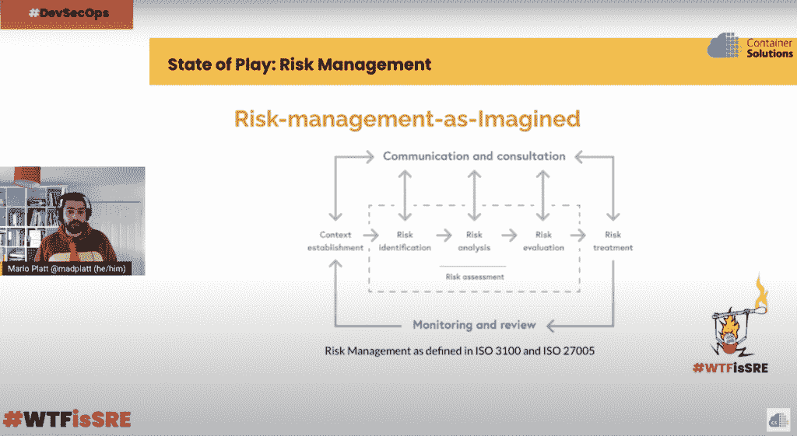
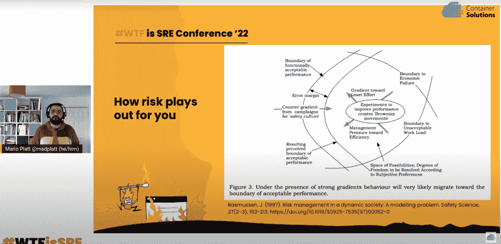

# SRE 能否将治理和合规带入未来？

> 原文：<https://thenewstack.io/can-sre-bring-governance-and-compliance-into-the-future/>

这场变革已经进行了大约 15 年。然而筒仓仍然屹立不倒。尤其是在保护您的组织免于陷入真正麻烦的重要部门周围。

[Mario Platt](https://twitter.com/madplatt) ，作为 Broadlight Global 的首席信息安全官和安全顾问，想要打破这些障碍中的另一个。这次是在治理、风险和法规遵从性(GRC)和工程之间。[他上个月在 SRE WTF](https://youtu.be/jVPIBwdoZMs)的演讲，在 [DevSecOps](https://thenewstack.io/devsecops-can-address-the-challenges-of-governance-risk-compliance-grc/) 赛道上，是恳求[现场可靠性工程](https://thenewstack.io/the-evolution-of-the-site-reliability-engineer-sre/) (SREs)专业人士担当起调解人的角色来弥合这一分歧。

他认为，SRE 非常适合更好地将治理、风险管理和合规政策制定者想象的工作视角与工程团队的运营现实结合起来。sre 在筛选、传播和自动化这些 GRC 和安全最佳实践方面处于合适的社会技术位置。

将这两个强大但非常不同的部门联合起来是成为高绩效 DevOps 组织的下一步。

## GRC 的现状

毫无疑问，从工程的角度来看，GRC 感觉像是过去的遗物。然而，从防止罚款和负面新闻到保护利益相关者，他们往往是决定一个组织成败的因素。就像许多传统部门一样，这种交流似乎是单向的。那么治理、风险管理和法规遵从性部门与工程有什么关系呢？

治理可以被称为跨组织的业务目标一致性的努力，但是，Platt 认为，这个办公室主要停留在命令和控制的思维模式中，并且过度关注专门化而不是集成。他说，他们仍然围绕“意识”而不是目标冲突和权衡来构建安全。

在随后的采访中，普拉特举了英国政府计划将“专业化”引入网络安全的例子，这将为狭义的安全角色增加专门的培训和要求。“它将非常狭隘地专注于专业化，这与行业告诉我们的工作方式完全相反，”他说。"在我看来，如果他们继续这样做，那将是一大倒退。"

对工程来说，最重要的是，他将治理团队描述为历史上脱离操作现实的，包括什么问题应该升级，什么不应该升级的诀窍，创建了实际上是紧急情况的通用定义。

风险管理包括识别和解决组织面临的风险。

“很整齐，很干净，上面有箭头。这真的很酷，”这是普拉特在遵循他们停滞不前的五步流程后对风险经理的描述。该角色通常建立背景，并通过识别和评估来评估风险。然后他们试图实施一个交通信号灯系统。

最后，他将所有符合法律、合同、法规和框架要求的活动都包括在内。

但他做出的最重要的区分是:

*   **按想象工作**——政策和程序是由非专家制定的，他们不了解他们所写的东西的影响。
*   **已完成的工作**——实际发生的现实。
*   **分裂**–文件与操作现实无关。

普拉特从史蒂文·肖洛克的《人类工作的多样性》中引申出这一点，该书认为工作要么是想象的，要么是规定的，要么是披露的，要么是完成的。

“但在现实世界中，这是行业最佳实践和培训的结合，”并非每个人都以同样的方式进行评估。普拉特继续谈论他在 GRC 行业观察到的根深蒂固的模式，即每个人都在阅读相同的书籍，接受相同的认证，并且不做太多的技术工作。

“发生的情况是，我们看到我们期望看到的，我们看不到我们不期望看到的，因为风险和合规经理往往倾向于认为工作是想象的工作，而不是实际完成的工作，那么这个风险分析流程基本上是一个控制目录，”他说。

当你有期望时，你就为这种期望开一个控制处方。只不过软件通常不是这样工作的。“然后，当每个人没有按照我们的预期保持这些控制措施的最新和有效时，我们会追究他们的责任，”他说。

## SRE 能为 GRC 做些什么？

首先，[站点可靠性工程](https://thenewstack.io/site-reliability-engineering-cloud-native-operations/)的原则致力于系统的高可靠性和可伸缩性，治理、风险管理、法规遵从性和安全团队无疑会对其产生影响。更具体地说，Platt 指出了 GRC 团队为支持而建立的结构:

*   技术治理
*   运营风险管理(或可靠性的延伸)
*   执行操作标准

这些过程可以很容易地应用于实现安全目标和其他 SRE 目标。

另一方面，普拉特表示，这开启了治理和发展专业人士之间的对话。将一些 SRE 实践(如错误预算)应用于安全性是合乎逻辑的。

“将错误预算的机制应用到我们处理安全问题的方式中，将会给整体治理带来很多好处，因为这样一来，您就有了组织动态、信息和数据，实际上可以有节奏地处理我们如何处理并问自己这样一个问题:我应该做多少安全工作？”在同一场活动中，普拉特从他作为安全专业人士的角度解释道。

他认为，在一个组织中，SRE 是为决策带来权衡和约束视角的最佳地方。

“显然，这需要我们(GRC 专业人员)真正进行这些对话，并让 SRE 职能部门感觉这是一次他们可以进行的对话，以揭示这些特征和限制，”他继续说。

## SRE 从不同的角度看待 GRC 问题

当普拉特咨询不同的组织时，他会看到路线图、可靠性积压甚至漏洞，但他说安全性通常不包括在内。这通常是因为安全工具与工程团队是分开的。这是有风险的，因为[网络攻击只会变得越来越严重](https://thenewstack.io/want-real-cybersecurity-progress-redefine-the-security-team/)，当事情发生时，工程师往往是唯一一个随叫随到的人。

普拉特说，传统的风险管理更多的是一个线性因果关系模型，一个单向的责任链，所以控制和止损被用来阻止这种互动，但事情通常不会那么简单。

“对于 SREs，大家都已经看到了一个经典的例子，您今天进行了代码更改，仅仅两个月后，一组特殊的条件开始发生，然后我们两个月前做的事情开始出现问题。”普拉特说，这是 SREs 和任何软件开发人员的标准，但是，他说，如果你去和 GRC 专业人员进行同样的对话，“他们对问题的看法很可能是，你在考虑导致失败的条件方面做得不够好，所以你需要更加努力。”

这远不是一次富有成效的谈话。他引用了延斯·拉斯姆森(Jens Rasmussen)的《动态社会中的风险建模》,该书提供了一个更加不稳定的操作点，即使在一切照旧的情况下也能包容可变性。它配有:

*   **可接受工作量的界限**—技能、流程
*   **经济失败的界限**——事情没有按时或按预算进行
*   **事件界限**–可靠性、安全性和数据事件

在这些因素中，有驱动决策的误差范围或边际界限，这在 GRC 和 SRE 之间有很大的不同。

“GRC 人员通常会认为，他们的运营控制离那个障碍越远，他们就越好。但是我们从 80 年代和 90 年代以来的高可靠性组织那里了解到，事实并非如此。普拉特解释说:“这些高可靠性的组织往往更接近这一点，他们能够做到这一点，因为这也有助于建立一个共同的心理模型，以了解系统如何在团队中工作。”。

他继续说，这导致随着时间的推移，对控制的侵蚀更少，并且这些组织可以更快地移动，而不会增加过多过程的“脂肪”。它还支持持续学习，同时防止警报驱动的倦怠。

## 风险管理和 GRC 沟通失误反模式

Platt 分享了他在信息安全团队中发现的一些反模式:

*   治理、风险管理和合规性政策通常不考虑运营限制，并且与运营限制不一致。
*   了解工程师仍然缺乏 GRC 技能，就像 GRC 不了解工程师的需求一样。
*   GRC 反馈回路对不切实际、不可操作的绩效边界发出警报，造成警报疲劳，最终被忽略。

你如何克服这些反模式？首先确定双方的优势和劣势。一方面，普拉特表示，风险管理团队非常擅长通过大量自动化来执行的经验策略。

然而，一个 SRE 团队对于教授 GRC 分布式系统的社会技术交互非常有价值，包括从支持更好的进化策略的系统中学习。这与 infosec 和 GRC 团队的做法截然相反，他们只是在寻找单点人为错误。

最后，他在后续采访中解释说，两个团队需要聚在一起分析系统纠缠和爆炸半径。它包括学习复杂性和非线性的语言，一个小的变化往往会产生看似不相称的影响，并理解真理没有单一的版本。毕竟，每个人都有不同的经历，可能他们所做的在当时是有意义的。

在合规性方面，SRE 可以在以下方面提供帮助:

*   准备情况审查
*   标准实施
*   与辛劳打交道
*   策略作为应用于安全性的代码

## 从哪里开始在您的 SRE 中安装 GRC

Platt 提倡用一种综合的方法来处理这些反模式。这可能是 GRC 提升您的 SRE 团队的技能以解决一些安全问题，或者像 Indeed job platform 一样，甚至在现有的 SRE 职能部门内创建一个 SRE 安全团队。或者，这可能是一种关联战略，GRC 仍然负责安全，但他们培训并将一些系统自动化责任和目标冲突的解决移交给 sre。

他建议 SRE 从以下话题着手，与各自的团队接触:

*   **治理**——告诉他们错误预算和度量标准，并回顾在讨论这些问题时谁应该(和不应该)在哪个房间
*   **风险管理**——展示 SRE 如何管理可靠性以及在哪里发现风险
*   **合规**–SRE 负责技术标准，因此讨论安全执行和自动化也是合乎逻辑的。

SRE 在帮助 GRC 区分“想象中的工作”和“实际完成的工作”方面具有独特的优势 SRE 团队采用强烈关注社会技术的最佳实践，普拉特说它可以教给 GRC 团队。SRE 还可以向 GRC 同事传授更多现代技术解决方案，比如如何利用 CI/CD 管道作为记录系统。然后，SRE 将受益于对这些限制的理解，并应用这种理解来创建更好的保证和治理最佳实践，当然还有自动化。

无论达成谅解的途径是什么，都将从两个团队坐下来谈判开始。

*披露:本文作者是 WTF is SRE 会议的主持人。*

<svg xmlns:xlink="http://www.w3.org/1999/xlink" viewBox="0 0 68 31" version="1.1"><title>Group</title> <desc>Created with Sketch.</desc></svg>