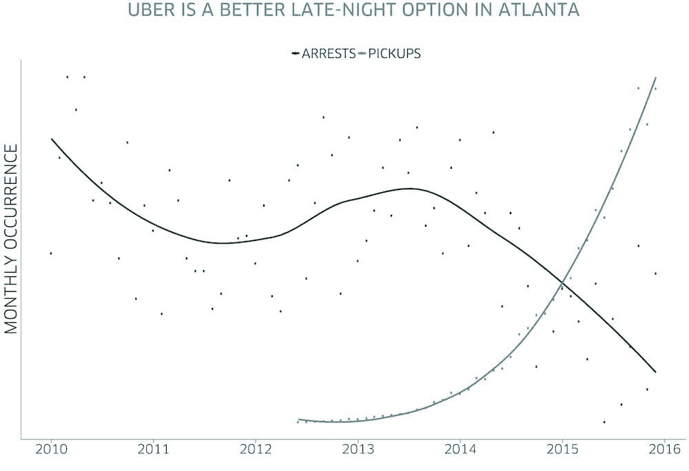

# 科技能把我们从糟糕的驾驶中拯救出来吗？

> 原文：<https://thenewstack.io/can-technology-save-us-bad-drivers/>

对于汽车新闻来说，这是重要的一周，引发了新的争论，即人工智能辅助技术是否可以弥补人类的易错性，或者我们的信仰是否被可怕地放错了地方。

上周，美国迎来了 7 月 4 日的重要周末，优步[发布了新数据](https://newsroom.uber.com/safety-on-the-road-july-2016/)表明他们的拼车应用程序正在减少醉酒司机的数量——据推测*挽救了*的生命——并宣布计划更新他们的应用程序，以便监控他们的司机的不安全行为。

上周也有报道称，一名特斯拉司机在使用自动驾驶仪时发生了第一起致命事故——这是一个悲哀的讽刺。五月，约书亚·布朗[在佛罗里达州失去了生命](http://www.nytimes.com/2016/07/01/business/self-driving-tesla-fatal-crash-investigation.html?_r=1)，当时他的车，一辆在自动巡航控制下行驶的特斯拉 Model S，撞上了停在他面前的一辆拖车。

就在车祸前一个月，布朗在 YouTube 上发布了一段视频，视频中这辆车“救”了他一命。特斯拉的 Elon Musk 甚至在 Twitter 上分享了这个视频。一位邻居记得布朗是如何滔滔不绝地说“为了吸引埃隆·马斯克的眼球，我现在可以去死，然后去天堂了”特斯拉后来称他为“特斯拉和更广泛的电动汽车社区的朋友，一生专注于创新和技术承诺的人，对特斯拉的使命坚信不疑的人。”

当然，特斯拉的自动驾驶功能从来不是为了取代司机。就在 9 周前，一名沃尔沃工程师称特斯拉的自动驾驶[是一个“无人监管的崇拜者”，](http://www.theverge.com/2016/4/27/11518826/volvo-tesla-autopilot-autonomous-self-driving-car)认为“它给你的印象是它做得比实际多。”特斯拉对此事件的回应分享了一些有趣的统计数据。“这是在 1.3 亿多英里的自动驾驶仪被激活的情况下，第一次已知的死亡事件。在美国的所有车辆中，每 9400 万英里就有一起死亡事故。在全球范围内，大约每 6000 万英里就有一起死亡事故。”

也许真正的问题是我们人类。事故发生后,《今日美国》在 YouTube 上发现了其他特斯拉车主在开车时玩叠人龙和跳棋的视频，甚至是打盹的视频。“尽管特斯拉告诉司机‘随时把手放在方向盘上，保持警惕’，但测试免提驾驶[的诱惑实在太大了](http://www.usatoday.com/story/tech/news/2016/07/01/drivers-play-jenga-sleep-using-tesla-autopilot-nerve-wracking-videos/86613484/)，”文章总结道。

与此同时，布朗的保险代理人告诉《泰晤士报》，“他可能会驾驶 F-18 进行试驾，”他们报道说，他在伊拉克战争期间为海军拆除过炸弹。他真正热爱前沿技术，甚至创办了一家公司，将互联网服务带到农村地区。"换句话说，他的特斯拉只是他技术驱动的生活的又一次延伸。"

具有讽刺意味的是，据报道，悲剧发生时，布朗正从迪斯尼乐园回来——还有一个更有趣的问题。据一名目击者称，当警察找到他被撞毁的汽车[时，正在播放一部电影](http://www.insideedition.com/headlines/17347-man-who-died-in-self-driving-tesla-crash-was-watching-harry-potter-film-during-wreck)。当罗伯特·万卡维拉(Robert VanKavelaar)在佛罗里达州盖恩斯维尔(Gainesville)家中的院子里发现被撞毁的特斯拉时，“我能听到它……”他告诉*内幕版*。"警官告诉我这是一部《哈利·波特》电影。"

虽然特斯拉坚称其仪表板上的显示器不能播放电影，但后来的报道表明这部电影是在便携式 DVD 播放器上播放的。虽然对坠机时发生的事情仍有疑问，但这可能是他使用的最后一项技术。据撞死他的卡车司机说，“他死的时候还在放音乐，T8 撞断了四分之一英里外的一根电线杆”。

早在 2001 年，道格拉斯·亚当斯就曾开玩笑说，手机用户为了找一条信号更好的高速公路而加快车速。因此，技术不是为用户服务，“实际上是在杀死他们。”对于高性能人工智能的到来，类似的怀疑似乎是自然的第一反应。当埃隆·马斯克在推特上发布布朗的险些相撞的视频时，几十条积极的推特受到了[几条更具批判性的](https://twitter.com/elonmusk/status/721829237741621248)的欢迎。

“人类很可能会主动放慢速度，对吗？这项技术仍然需要调整

*“你认为好斗的人类司机会利用这一特性，知道汽车会让路吗？”*

*“现在我们可以和特斯拉斯一起玩吃鸡了，还能得到一个病毒视频。”*

本周，第二起(非致命的)特斯拉撞车事故也被归咎于特斯拉的自动驾驶系统。但是优步上周的声明仍然显示了一个不可动摇的信念，那就是科技可以让我们更安全。

优步宣布他们的软件已经成为非营利性母亲反对酒后驾车的官方“指定驾驶应用程序”，并写道“像优步这样的技术提供了一个以新的创新方式改善道路安全的令人难以置信的机会——在每次乘车之前、期间和之后。该公司指出，去年酒后驾驶导致了周末死亡人数的 41 %,并在一段视频中引用了天普大学的一项研究，该研究发现，自从引入优步以来，西雅图与酒后驾驶相关的死亡人数下降了 10%。

优步还公布了亚特兰大警察局 2010 年至 2016 年六年间的新数据，显示在此期间酒后驾车被捕人数下降了 32%——大致相当于优步皮卡的增加。

更多数据显示，优步最繁忙的时段是周五和周六的午夜前后。一项对优步司机的调查发现，多达 80%的司机表示他们曾亲自使用优步来避免酒后驾车。

与 MADD 一起，优步现在已经与州长公路安全协会合作，通过在驾驶时监控他们的司机来改善司机安全的另一种基于数据的方法。或者至少，记录他们用手机在做什么——无论是安装在仪表板上还是在司机手中晃动——还提供关于司机安全驾驶的日常报告。甚至还有关于休息时间的实时提醒，该公司将很快在美国 11 个城市推出这些功能。

https://youtu.be/OjwHqTJ9cPo

如果我们最终没有使用人工智能来更好地驾驶我们的汽车，也许相反我们可以用它来使我们成为更好的司机。

专题图片:来自慢速新闻日的[特斯拉自动驾驶测试](https://www.youtube.com/watch?v=UgNhYGAgmZo&feature=youtu.be)的 YouTube 视频。

<svg xmlns:xlink="http://www.w3.org/1999/xlink" viewBox="0 0 68 31" version="1.1"><title>Group</title> <desc>Created with Sketch.</desc></svg>