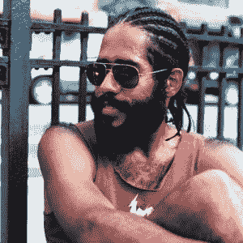

# 科技行业能遏制气候变化和不平等吗？

> 原文：<https://thenewstack.io/can-the-tech-industry-curb-climate-change-and-inequality/>

[科技行业能遏制气候变化和不平等吗？](https://thenewstack.simplecast.com/episodes/can-the-tech-industry-curb-climate-change-and-inequality)

不平等日益加剧。气候危机和全球变暖只会加剧这一巨大的人类鸿沟。与此同时，技术是这两个问题的巨大促成因素——从[巨大的碳足迹和数据中心浪费的电力](https://thenewstack.io/tech-ethics-can-developers-save-the-earth-one-container-at-a-time/)到[开采有限的资源](https://thenewstack.io/what-is-the-long-term-cost-of-code/)到剥削工厂工人，再到持续缺乏多样性和包容性，这对我们理应具有前瞻性的行业产生了许多后果。

作为从事技术工作的人，我们有什么责任来遏制这些趋势呢？

在这一集的《新栈制造者》中，我们采访了技术专家、教育家和研究计算和帝国主义之间历史联系的研究员纳比勒·哈塞恩，谈论他们所谓的“不平等的分形模式”，以及我们如何检查和改变技术中经常具有破坏性的关系。

2017 年秋天，[飓风玛丽亚](https://en.wikipedia.org/wiki/Hurricane_Maria)成为有记录以来袭击波多黎各、多米尼加和美属维尔京群岛的最严重自然灾害。生活在布鲁克林一个加勒比人占多数的社区，在技术领域工作，Hassein 开始抽象地思考他们与那次紧急事件的联系，以及全球北方对剥削者和被剥削者之间的永久区分的影响。

他们意识到技术专家——为科技行业工作的设计师和开发人员，而不是所有者——扮演着某种中介角色。Hassein 认为，作为技术人员，我们有责任改变我们自己与不平等和环境破坏的关系。虽然我们可以通过更环保的服务器托管做出更好的选择，但他们认为，继续依赖无处不在的“精英富豪”如谷歌、亚马逊和微软是无法实现的。毕竟，美国军方是迄今为止世界上最大的污染者——据估计，它可能会污染超过 140 个其他国家的总和——而且这些跨国公司都继续与它合作。

Hassein 认为这种变化必须从社区开始，并提供了[合作 Jackson](https://cooperationjackson.org/) 的例子，这是一个由合作社和工人所有、自我管理的企业组成的网络，专注于与黑人拥有的农场合作——美国只有 2.5%的农场是黑人拥有的——并利用 3D 打印等新技术成为一个自我维持的社区。这意味着更少的原材料开采，更少的偏远工厂的滥用劳动力，以及更少的碳足迹，以使其进入这个社区的手中。这也意味着更民主的决策。

Hassein 提供的另一个技巧是他们在大学学习了计算机科学和阿拉伯语之后才真正想到的——语言多样性。代码仅适用于英语。翻译代码是[对开源社区](https://thenewstack.io/inclusion-at-scale-in-the-mozilla-and-kubernetes-open-source-communities/)最重要的贡献之一，因为它极大地增加了包容性，但是大多数工具仍然假设代码是用英语编写的。即使翻译成多种语言，仍有人使用流行的从右到左的语言，如阿拉伯语、希伯来语、波斯语和乌尔都语。

这些只是我们在本期节目中谈到的一些小而重要的方式，在这些方式中，技术继续忽视世界上大部分人口，并助长了这种日益扩大的鸿沟。现在是我们这些处于技术及其后果之间的独特位置的人采取措施阻止这些危险趋势继续下去的时候了。

### 在这个版本中:

[4:59:](https://thenewstack.simplecast.com/episodes/can-the-tech-industry-curb-climate-change-and-inequality?t=4:59) 你是从哪里想出这条人生道路的？
[10:23:](https://thenewstack.simplecast.com/episodes/can-the-tech-industry-curb-climate-change-and-inequality?t=10:23) 如果我们身处全球北方，并承认我们对此负有责任，那么一名普通的技术人员能做些什么？我们能做些什么来做出改变，做出改变？
[14:40:](https://thenewstack.simplecast.com/episodes/can-the-tech-industry-curb-climate-change-and-inequality?t=14:40) 为什么比特币对环境有这么大的影响？
[21:12:](https://thenewstack.simplecast.com/episodes/can-the-tech-industry-curb-climate-change-and-inequality?t=21:12) 说说这个全球技术专家都要一起合作的策略？
[26:11:](https://thenewstack.simplecast.com/episodes/can-the-tech-industry-curb-climate-change-and-inequality?t=26:11) 技术在应对气候变化中的作用
[31:25:](https://thenewstack.simplecast.com/episodes/can-the-tech-industry-curb-climate-change-and-inequality?t=31:25) 解决权力下放的好处和固有的低效问题

通过 Pixabay 的特征图像。

<svg xmlns:xlink="http://www.w3.org/1999/xlink" viewBox="0 0 68 31" version="1.1"><title>Group</title> <desc>Created with Sketch.</desc></svg>