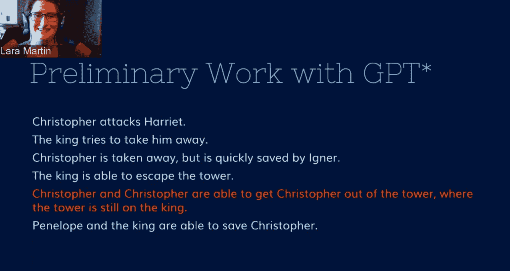
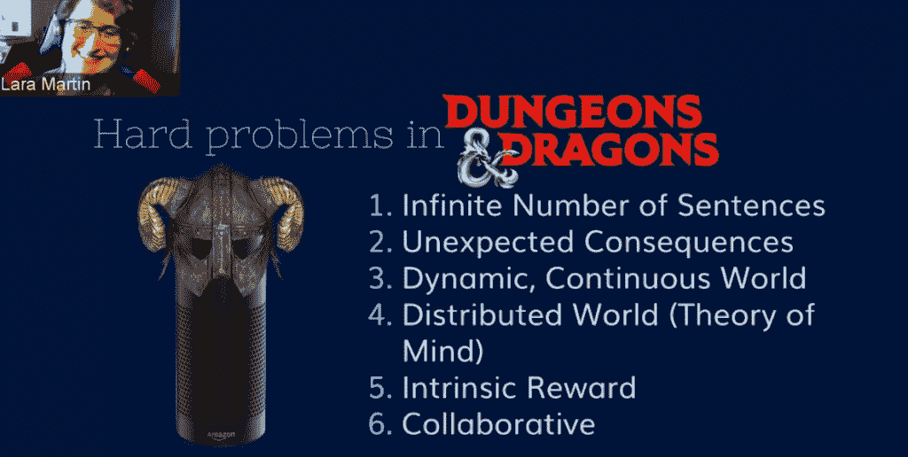

# 我们可以教一个 AI 玩龙与地下城吗？

> 原文：<https://thenewstack.io/can-we-teach-an-ai-to-play-dungeons-and-dragons/>

BBC《科学焦点》杂志团队最近发布的播客中有一个非凡的时刻，人工智能研究员[劳拉·马丁](https://laramartin.net)分享了一个人工智能产生的故事。

“我认为这个故事的好处是它显示了我为博士学位建立的系统的优点和缺点，”马丁向播客解释道。“这个故事有趣的是，它开始有因果关系和连贯的意义——直到它到达一个只会吐出垃圾的点。”

这是一个值得思考的有趣问题:如果电脑*能讲故事会怎么样？他们可以更好地招待我们——但也可以更好地给我们建议。马丁向播客解释说，因为讲故事是我们交流的一个基本部分，它可以极大地改善我们与设备的交互方式。“我们所做的所有类型的谈话实际上都是在讲述一个故事。”*

因此，马丁，宾夕法尼亚大学的计算创新研究员(最近是博士后研究员)，正在“试图教人工智能讲故事，”播客解释道。这些问题可以归结为一个问题:人工智能可以玩[龙与地下城](https://dnd.wizards.com/)吗？

## 独特的故事

艾最近在讲故事方面的尝试引人入胜，但并不完美。马丁引用了奥斯卡·夏普(Oscar Sharp)的故事，他与技术专家合作者罗斯·古德温(Ross Goodwin)在 2017 年就数百个科幻剧本训练了一个神经网络——然后拍摄了由此产生的剧本。(“在结尾，以防你感到好奇，剧本说‘他拿起一个光幕，对抗他脸上的透射粒子的安全力量。’")

[https://www.youtube.com/embed/LY7x2Ihqjmc?feature=oembed](https://www.youtube.com/embed/LY7x2Ihqjmc?feature=oembed)

视频

故事可能是独特的，“但连贯性是可怕的。”马丁在 2020 年 9 月的一次讲话中解释说，这是佐治亚理工学院 NLP 系列研讨会的一部分。

[https://www.youtube.com/embed/9SnsgglNHYA?feature=oembed](https://www.youtube.com/embed/9SnsgglNHYA?feature=oembed)

视频

最近，布拉格的研究人员使用开源的 GPT-2 人工智能生成了一部戏剧《T2》，这部戏剧后来在布拉格、伦敦、纽约和芝加哥上演。

但是马丁的演讲也解释了为什么讲故事是一个难题。除此之外，实际的现场对话，虽然是协作性的，但也会在过程中产生意想不到的后果。此外，“我们生活在一个不断变化的世界里。所以这是一个混乱的世界，不容易像计算机科学家那样变成离散的状态。

“这也是一个分布式的世界，所以人们依靠他们自己对世界的体验，我们不断创造我们自己对世界的想法。我们也知道我们认为其他人如何看待这个世界，这被称为心智理论……”

“我知道你在想什么。这些也是龙与地下城里的东西。”

这款流行的桌面游戏要求人们在一个故事上合作，甚至一起计划和行动，同时与指定的“地下城主”互动，后者传达他们的决定并提供故事的其余部分。《龙与地下城》将会是一个巨大的考验，马丁本月告诉《科学焦点》播客。“你不仅仅是在讲一个故事……你是在和另外三四个人讲一个故事。如果你是地下城主，这甚至可能是一项更艰巨的任务…因为你正在创造一个完整的世界，你必须将这些信息传递给其他人，让他们创造一个你试图分享的这个虚构世界的理论。所以有很多心理理论在进行。”

为了探索这一领域，马丁首先根据科幻故事重新训练了一个神经网络。“我从粉丝维基上刮来的，因为科幻电视节目的书呆子们对他们的情节总结非常透彻。”

问题？大多数故事都试图模拟我们生活的真实世界，因此都是从一些基本假设开始的。但不幸的是，神经网络对现实世界一无所知。举例来说，它必须知道哪些动作自然地优先于其他动作，马丁已经尝试手动处理这些动作。“我把它注入到这些系统中，引导这一代人，让它变得更有意义。”

她早期的一个系统真的让她大吃一惊，马丁告诉科学焦点播客。“我有一个关于一匹马成为草坪椅企业家的故事，我只是觉得这个概念真的非常非常有趣，我时不时会想到这个。”虽然她指定输出需要某种“代理”作为其叙述，“它只是碰巧产生了这个有趣的概念”——只是通过填充随机的东西。

在她 40 分钟的演讲中，马丁描述了她早期研究的技术细节——将一个故事的瞬间分解成更小的链接块，然后执行“知识工程”——这仍然会让你受到高度特定的系统的限制。最终结果？“这当然仍然很有趣，但即使是这些大型模型也仍然在失去连贯性。”马丁接着描述了创造事件表征的进一步实验——主语、动词、直接宾语、修饰语——以帮助引导故事。(这也包括为故事人物创建一个在整个故事中使用的变量。)

多个系统被结合在一起——使用科罗拉多大学的 [VerbNet](https://verbs.colorado.edu/verbnet/) 来缩小单词范围，他们将其吹捧为“最大的英语动词在线网络，将它们的句法和语义模式联系起来。”

在一个复杂的过程中，她描述为将语义与句法分离，马丁最终创造了“一个推理和维护状态的混合系统”，以“创造内部一致的生成系统。”在所有的“事件到事件循环”和策略梯度深度强化学习之后，仍然存在评估输出和测量“困惑”的问题——模型对它接收的新数据有多惊讶。

但最后还是没准备好玩龙与地下城。重新整合从其系统之外引入的东西仍在马丁的“未来工作”清单上。

即便如此，一个人工智能是否能够真正具有创造力(而不是仅仅对它接收到的输入进行变异)仍然是一个永恒的问题。)即使有了这个早期的原型，马丁告诉播客们，更多的时候输出只是简单的怪异——像“一种真正特定类型的花之类的东西……因为它只是从它拥有的数据库中提取这些。”也许这种模式——或者更确切地说，这种模式的随机缺失——随着产量的增长变得更加明显。“当你不能理解它时，这并不奇怪。”

但这让马丁想到了一个重要的问题。“我认为，让人们认识到计算机并不像他们认为的那样聪明非常重要……它们不是人，它们没有代理，它们只是其他人用来处理这些事情的工具。”因此，所谓的“创造性”人工智能的最佳用途可能是“作为增强人类创造力的工具……”马丁告诉播客。“计算机真的很擅长浏览大量的数据，所以它们可以得出你以前从未见过、也从未想过与此相关的东西。”然后，反过来，人类“真的很擅长建立这些联系，将计算机可能呈现给他们的想法联系起来。”

因此，即使当计算机聪明地暗示一匹马是草地躺椅企业家，“计算机也不知道那是什么意思，只是在吐出东西。但是让一个人带着它跑……那将是美妙的……人类有能力把这些东西联系起来，我认为这是一种非常好的共生关系，需要更多地利用。”

她的研究似乎让她敏锐地意识到了我们当前技术的局限性。当被问及我们是否会在有生之年看到真正的人工智能地下城主时，马丁认为需要高质量的表演，然后总结道，“在我们的有生之年看到一个好的人工智能地下城主，我想，嗯——我不知道，我有点怀疑这是否会发生。”

* * *

# WebReduce

<svg xmlns:xlink="http://www.w3.org/1999/xlink" viewBox="0 0 68 31" version="1.1"><title>Group</title> <desc>Created with Sketch.</desc></svg>