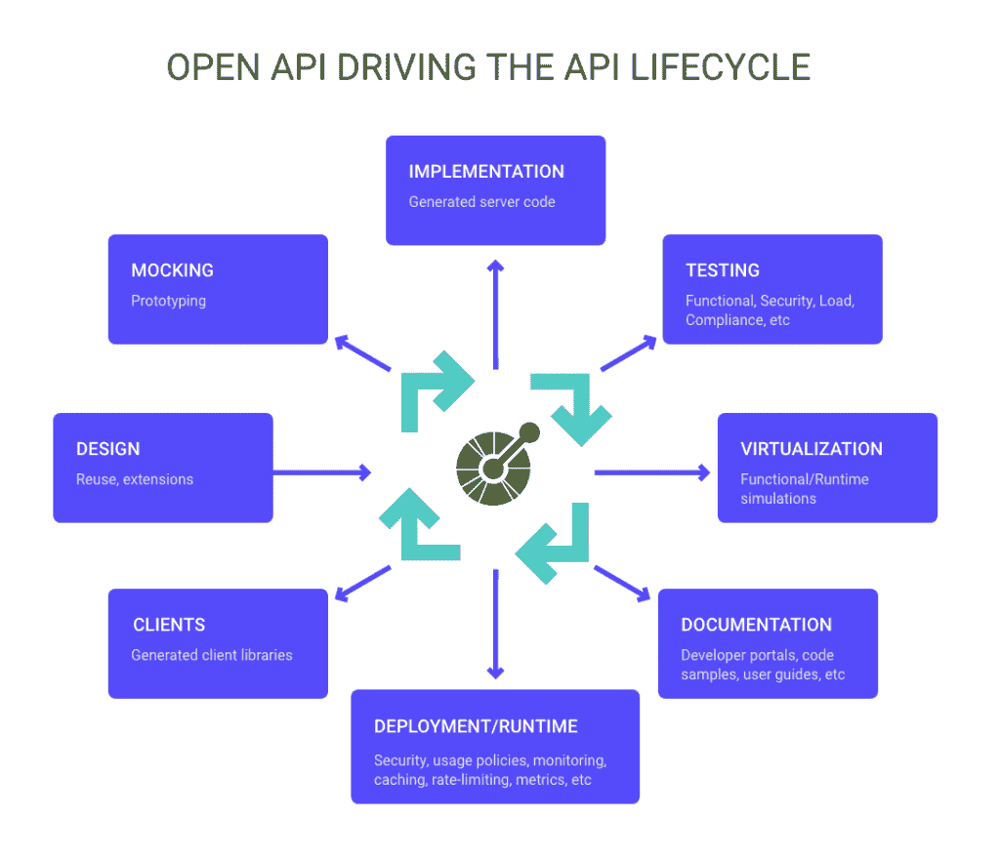
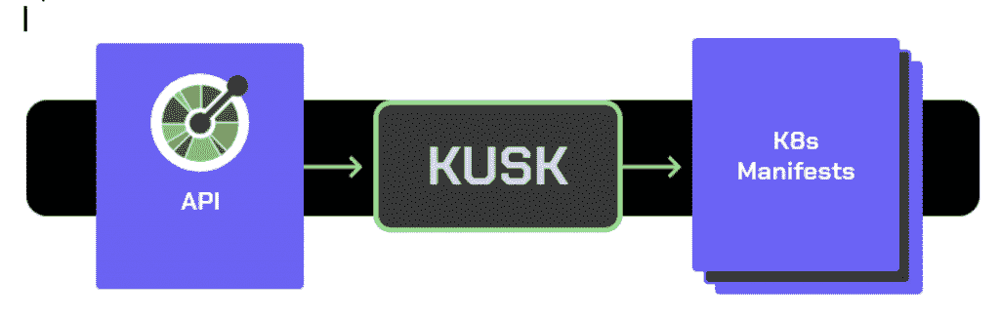
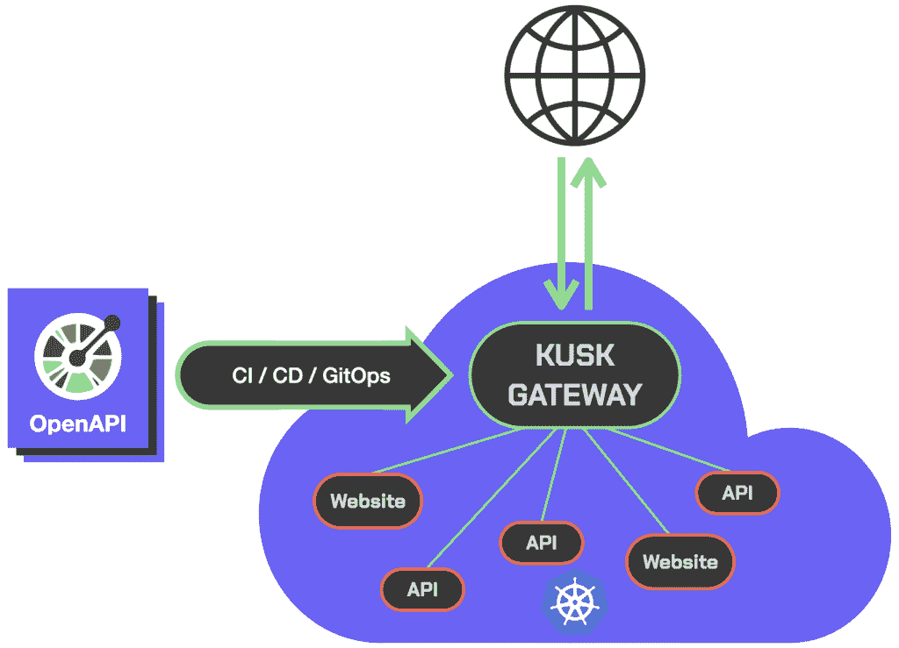

# 你能下载你的 API 吗？

> 原文：<https://thenewstack.io/can-you-gitops-your-apis/>

[Ole lens mar](https://www.linkedin.com/in/olensmar/)

[Ole 是 Kubeshop 的 CTO。Ole 在 20 世纪 90 年代末开始构建基于 HTTP/XML 的 API，并在包括 SmartBear 在内的几家初创公司和公司担任 CTO，还在 Ambassador Labs 担任产品架构师。他是 base8(一家面向 XML 的咨询公司)和 Eviware Software 的联合创始人，在那里他创建了 SoapUI，这是最常用的开源测试工具之一。他从 2016 年初开始担任 OpenAPI 倡议的主席，直到 2020 年底。](https://www.linkedin.com/in/olensmar/)

大规模基础设施的管理越来越转向 GitOps 和基础设施即代码。在经典的宠物与牛的类比中(对不起，素食主义者)，这些技术允许您在出现问题时轻松复制和替换基础架构，从而显著降低管理的成本和复杂性。

此外，它们成为了解您的基础架构的当前状态以及发生了哪些变化的唯一来源。

同时，就像“软件正在吞噬世界”一样，API 也在吞噬软件。好吧，也许不吃东西，但肯定有动力。

它们无处不在，并且已经成为公开功能的标准方式。然而，我们当前创建和构建 API 的方式并不总是符合我们运行基础设施的最佳实践。

## **代码优先与设计优先的 API**

API 的代码优先方法是一种更传统的方法。开发人员接收业务需求并编写 API，将正式文档留到以后，或者更常见的是，根本不写。平台团队将被封锁，直到初始发布，然后需要做大量的手动测试，以确保一切配置正确。

另一方面，在 API 开发的设计优先方法中，API 首先被定义，然后被编码。这个定义提供了清晰明确的文档，并作为团队从前端到后端到微服务开发的所有方面的“真理之源”，类似于 Git 在 GitOps 中成为你的真理之源的方式。设计优先的 API 创建了对软件行为的功能和非功能方面的共同理解。简而言之，它回答了这个问题:“我可以让这个 API 做什么？”

## **设计您的 API**

OpenAPI 规范在现代 API 开发领域已经变得无处不在，因为它是描述和记录 API 的一种简单而标准的方式。此外，OpenAPI 的一个主要好处是它是机器可读的。基于 OpenAPI 定义的内容，可以编写与 API 交互的软件。例如，Swagger UI 提供了一个很好的用户界面，开发者可以在这里测试并熟悉你的 API，而 [OpenAPIGenerator](https://github.com/OpenAPITools/openapi-generator) 可以根据你的 OpenAPI 定义生成客户端和服务器。

一旦被定义，这个定义可以驱动大量的下游活动，包括生成存根以确保开发人员遵守 API，创建模拟以支持测试，构建和集成文档，以及构建部署工件。这些任务通常可以以自动化的方式并行完成。

## **Kubernetes 中 API 的状态**

目前，要在 Kubernetes 中公开您的 API，需要编写入口资源，并且您将需要一个入口控制器，通常称为 API 网关，来更新集群的状态，以允许流量到达您的应用程序和服务。传统的入口控制器很难学习和管理，即使学习和管理，也是一个手动过程。对于您使用的每个入口控制器，您需要了解它们的功能集、资源格式和配置属性。一些入口控制器的配置分布在多个 Kubernetes 资源上，因此很难全面了解应用程序的配置。当您考虑服务质量配置时，这个问题会变得更糟，例如超时和重试，它们可能是自己的资源。

因此，为了成功地将他们的 API 部署到 Kubernetes，开发人员或他们的 DevOps 团队成员目前需要花时间学习新的 Kubernetes 资源格式，并随着他们的 API 的发展保持这些格式的更新，而不是实际设计和实现他们的 API。他们的 DevOps 工程师需要担心开发人员篡改精心制作的舵图，而不仅仅是编写他们的 API！

Kubernetes 需要一个“单一的玻璃”来源来了解应用程序的配置和 API 如何工作，以将其带入 GitOps 时代。

## **使用 OpenAPI 和 Kusk 为您的 Kubernetes APIs 带来 gitop**

OpenAPI 规范为我们提供了声明式定义 API 的能力。它也已经包含了我们进行入口配置所需的大部分信息，可以通过扩展注释进行扩展，并且考虑到 OpenAPI 的普遍性，许多 API 开发人员已经习惯了这种格式。使用 OpenAPI 作为事实的来源，通过将已经在 OpenAPI 规范中的信息引入入口资源，减少了重复。它还消除了学习如何编写入口资源的需要。

进入 Kusk 和 Kusk Gateway，这是一个试图填补 OpenAPI-Kubernetes 工具链空白开源工具。

(过于简化的 Kusk 工作流程)
这些是 Kusk Gateway 的基础。

Kusk(瑞典语为 coachman)通过将您的 OpenAPI 规范视为其配置的真实来源，自动为各种流行的入口控制器生成入口资源。Kusk 目前支持为 Ambassador、Traefik、Linkerd 和 Nginx-Ingress 生成配置。由于 x-kusk OpenAPI 扩展，API 开发人员可以将 Kubernetes 和 QoS 相关的元数据添加到他们的 OpenAPI 定义中，kusk 会自动将其转换为入口控制器特定的配置，包括以下内容:

*   CORS 构型
*   超时设定
*   映射转换
*   名称空间/服务配置
*   限速的
*   更多(安全等。)

平台团队可以向 Kusk 提供 API 规范，并准备好入口资源，随时更新对 API 的任何更改。就像 GitOps 一样，这可以作为 CI/CD 管道的一部分自动完成，这意味着无需手动编辑，错误也更少。

虽然 Kusk 帮助您采用 OpenAPI 优先的方法来开发具有现有入口控制器的 API，但它并不真正允许您挖掘 OpenAPI 定义的全部潜力，这就是为什么 Kusk 项目还包括一个使用 OpenAPI 作为其主要配置来源的专用入口控制器:Kusk Gateway。使用 Kusk Gateway 作为入口控制器，API 开发人员和 DevOps 工程师可以直接使用 OpenAPI 定义来配置其 API 的公开——无需中间配置生成！

Kusk Gateway 的 OpenAPI 优先开发方法提供了许多好处:

*   工程师不必学习新的配置格式，也不必为在 Kubernetes 上部署 API 创建相应的配置。
*   OpenAPI 定义成为 API 的功能和 QoS/部署方面的事实来源，而不是在单独的配置文件中管理这些信息。
*   开发人员可以快速迭代他们的 API，而不需要平台团队资源。随着 OpenAPI 定义的发展，Kusk Gateway 将自动(重新)配置自身。
*   开发人员不必编写 Kusk Gateway 基于 OpenAPI 定义提供的现成样板代码，例如:
    *   请求验证——Kusk Gateway 可以根据 OpenAPI 定义自动验证传入的请求，并为 API 消费者提供有用的错误消息，从而提供更好的用户体验，并消除开发人员自己编写此逻辑的需要。
    *   Mocking — Kusk Gateway 可以自动为公开的 API 提供 mocks 和沙箱，帮助 API 消费者在与 API 集成时模拟不同的场景，而不会给底层 API 带来这些请求。

实际上，Kusk Gateway 由 Envoy Proxy 提供支持，这是一个经过实战测试的生产就绪型代理，可以将流量路由到 OpenAPI 规范中定义的服务。

## **结束**

如果您正在为您的 API 采用设计优先的方法(您应该这样做！)并搬进 Kubernetes，Kusk 让您能够:

*   对 Kubernetes 下的 API 采用迭代的 OpenAPI-first 开发工作流。
*   在您的 API 部署中利用 OpenAPI 定义的所有优点。
*   将 OpenAPI-first 与传统和基于 GitOps 的部署工作流相集成。

试试 Kusk 或 Kusk Gateway，让我们知道它是否能帮助您的开发人员和/或平台工程师改进他们的日常 API 开发工作流程。

查看 [GitHub repo](https://github.com/kubeshop/kusk-gateway) 和[完整文档](https://kubeshop.github.io/kusk-gateway/)，了解更多关于 Kusk 和 Kusk Gateway 的信息，并下载它们的最新版本。在回购上留下一颗星，以了解新功能和改进的最新情况，并加入我们的 [Discord 社区](https://discord.gg/KhCcxq2Tsq)与他人联系，并就您可能有的任何问题或建议与 Kusk 团队联系。我们很期待！

<svg xmlns:xlink="http://www.w3.org/1999/xlink" viewBox="0 0 68 31" version="1.1"><title>Group</title> <desc>Created with Sketch.</desc></svg>