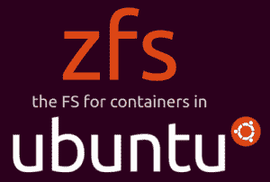

# Canonical 遇到棘手的法律问题，将 ZFS 带到了 Ubuntu

> 原文：<https://thenewstack.io/canonical-encounters-messy-legal-questions-bringing-zfs-ubuntu/>

GNU 通用公共许可证(GPL)是自由软件最受欢迎的许可证家族，大多数涉嫌违反 GPL 的行为通常涉及将 GPL 许可的代码与专有代码混合。

但是上个月，当 Canonical 的[宣布](http://blog.dustinkirkland.com/2016/02/zfs-is-fs-for-containers-in-ubuntu-1604.html)其 Ubuntu 16.04 Linux 发行版将于 4 月份发布，将包括 ZFS 文件系统的一个版本 [OpenZFS](http://open-zfs.org/wiki/Main_Page) 时，这个消息引发了关于将 GPL 与通用开发和发布许可证(CDDL)混合的合法性的问题——这两个都是免费许可证。

这种情况是如此的不寻常，以至于专家的意见出现了分歧，使得其他人的意见经常被偏见和忠诚所影响。

这个问题与技术无关。

由 Sun Microsystems 于 2004 年推出，开源，现在由 Oracle 注册， [ZFS](https://wiki.ubuntu.com/Kernel/Reference/ZFS) 是一个 128 位文件系统，具有保护数据的高级工具。它具有逻辑卷、持续的完整性检查和使用校验和的自动修复，以及存储备份快照和克隆文件系统的能力。

尽管 ZFS 有其局限性，例如与许多形式的 RAID 不兼容以及修复速度慢，但 Linux 下一代文件系统的主要候选产品 [btrfs](https://btrfs.wiki.kernel.org/index.php/Main_Page) 在许多 Linux 发行版中成为标准的速度很慢，这一事实导致许多人期待使用它。

与其说是技术，不如说问题集中在 CDDL 上，这是一个曾经被太阳微系统公司青睐并被甲骨文继承的许可证。由于该模块必须由 Linux 内核使用，因此它必须与第二版 GPL ( [GPLv2](https://www.gnu.org/licenses/old-licenses/gpl-2.0) )兼容，内核是在该版本下获得许可的。

CDDL 和 GPLv2 都是版权所有的许可证。也就是说，每个都允许用户复制、编辑和分发授权的代码，但是有一些限制。问题是，GPLv2 的第 2b 节规定，任何使用 GPL 许可代码的作品也必须在 GPL 的某个版本下获得许可，而 CDDL 的第 3.1 节有本质上相同的限制。

同样，GPLv2 的第 6 节规定“您不得对接受者行使此处授予的权利施加任何进一步的限制”，CDDL 的第 3.4 节规定“您不得对任何源代码形式的涵盖软件提供或施加任何条款，以改变或限制本许可证的适用版本。"

总的来说，这些部分表明这两个许可证需要相同的条款和冲突，以避免冲突。

然而，CDDL 的 3.6 节允许在不同的许可下发布二进制文件——这是 GPLv2 所不允许的，因此这似乎表明了基本的不兼容性。事实上，CDDL 的作者 Danese Cooper 公开表示 Sun 故意想要一个与 GPLv2 不兼容的许可证，大概是为了保护其知识产权。

无论 Sun 的动机是什么，自从 Debian 的人在 2006 年争论说它不能发布 cdrtools，因为这个软件包的构建系统是在 CDDL 下授权的，人们一致认为这两个许可证是不一样的，因此不兼容。

开源倡议将 CDDL 作为一个可能的许可证，但没有评论其兼容性，但自由软件基金会[将 CDDL 列为不兼容的许可证](http://www.gnu.org/licenses/license-list.html#GPLIncompatibleLicenses)，并声明“GPL 覆盖的模块和 CDDL 覆盖的模块不能合法地链接在一起”，这对许多人来说解决了这个问题。

然而，现在，Canonical 声称，通过混合 ZFS 和 Linux 内核，“我们是在授予的权利范围内行事，并遵守这两个许可证的条款，”正如 Canonical Ubuntu 产品和战略团队成员达斯汀·柯克兰[在博客文章](https://plus.google.com/u/0/+DustinKirkland/posts/ccaUAFZYL68)中所述，这个问题已经被重新提起。

## 赞成和反对的论点

双方强烈的情绪使兼容性问题变得复杂。例如，在 Google+上，CoreOS 安全开发人员马修·加勒特(Matthew Garrett)指出，他有批评 Canonical 的历史，表现得太过火了，甚至连自己不喜欢 CDDL 的西蒙·菲普斯(Simon phi PPS)、[都被感动得直截了当地问他](https://plus.google.com/u/0/+DustinKirkland/posts/ccaUAFZYL68)，“既然是 100%的自由软件，为什么在这种情况下许可证不兼容会引发通常只用于专有滥用的愤怒？”

另一方面，柯克兰[只是说](http://blog.dustinkirkland.com/2016/02/zfs-licensing-and-linux.html)，“因为我们已经得出结论，我们没有兴趣讨论许可兼容性”——这一声明似乎表明 Canonical 拒绝承认公司以外的任何人可能与此事有利害关系。

到目前为止，柯克兰认为，他的立场是“CDDL 适用于 CDDL 下的所有文件，而 GPLv2 适用于衍生作品，”这一论点被 CDDL 第 3.6 节讨论什么听起来像衍生作品的事实所削弱。同样，他认为 ZFS 是一个独立的模块，“不是 Linux 内核的衍生产品”，而是 OpenZFS 和 OpenSolaris 的衍生产品，这忽略了一个事实，即移植到 Linux 需要额外的代码来实现兼容性。

如果说有什么不同的话，那就是双方都没有争论不兼容的问题，而是争论其后果。例如，软件自由保护协会的 Bradley Kuhn 和 Karen Sandler[争论这个问题的传统观点](https://sfconservancy.org/blog/2016/feb/25/zfs-and-linux/),同时尽力表达对 Canonical 立场的同情，同时声称——有一些准确性——代表自由软件社区的观点。库恩和桑德勒的立场基于 GPLv2 和 CDDL 的措辞。

也许更值得注意的是软件自由法律中心的 Eben Moglen 和 Mishi Choudhary 的分析。这是 Kirkland 在他的博客中提到的观点，他将[软件自由法律中心](https://www.softwarefreedom.org/)描述为“行业领先的软件自由法律顾问”，这一描述很少有人会不同意。

事实上，Moglen 和 Choudhary 反驳了 Kirkland 的几个说法。例如，他们宣称“任何用 Linux 写的东西(不管它是否也能在其他操作系统上运行)很明显部分是衍生作品。”此外，他们写道，“任何了解并玩弄基本 Linux 行为的东西显然都是衍生作品。如果你需要更多的核心代码，毫无疑问，你是派生的。”Moglen 和 Choudhary 接着说，只有在 CDDL 下可用的文件“与 GPLv2 的字面意思不一致”他们的分析与库恩和桑德勒的分析没有任何矛盾。

然而，Moglen 和 Choudary 并没有停留在字面解释上。他们补充说，如果要提出任何正式的反对，必须由合并了 CDDL 代码的代码的版权所有者提出。投诉将是“他们复制和重新发布其源代码的专有权”被侵犯。

Moglen 和 Choudary 没有提到的是，数十名开发人员在 Linux 内核中拥有受版权保护的代码，其中许多人已经不再活跃，因此这样的投诉是不太可能的。然而，他们说的是，在提出这样的投诉之前，“应该客观合理地善意相信该行为属于许可的公平范围”，并且应该假设 Canonical 会合理地回应投诉。此外，由于投诉不涉及销售损失或版税，任何损失都是“象征性的”。

## 枝节问题

这些不同的意见解释了为什么自由软件基金会还没有给出官方声明。软件自由保护协会和软件自由法律中心都与该基金会有着长期的合作关系，然而他们提供了相互矛盾的观点。

同样清楚的是，Canonical 声称的许可兼容性与存在但不太可能被跟踪且不涉及伤害的违规之间存在差异。

最终，也许重要的是 Ubuntu 用户应该能够使用 ZFS 而不用担心后果。然而，在道德上，他们应该意识到，在许多专家看来，Ubuntu 中的 ZFS 是一种侵犯。

抛开 Canonical 的热情不谈，我们可能还需要一段时间才能在 Linux 上看到 ZFS。

通过 Pixabay 的特征图像。

<svg xmlns:xlink="http://www.w3.org/1999/xlink" viewBox="0 0 68 31" version="1.1"><title>Group</title> <desc>Created with Sketch.</desc></svg>