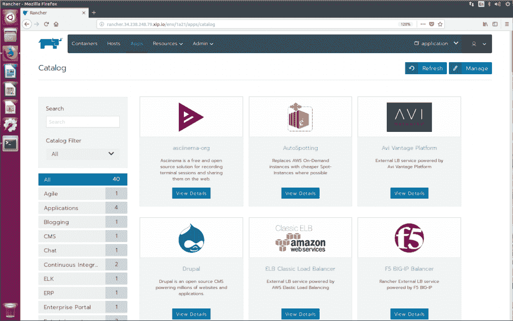
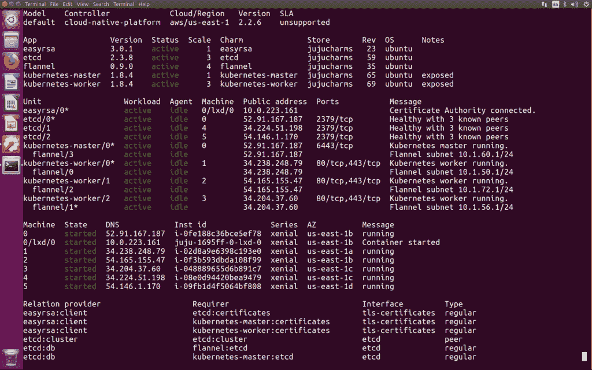

# Canonical，Rancher 获得了 Kubernetes 跨云功能

> 原文：<https://thenewstack.io/canonical-rancher-labs-launch-kubernetes-cloud-native-platform/>

 [Canonical](https://www.canonical.com/) 和 [Rancher Labs](http://rancher.com/) 合作发布了[云原生平台](https://www.ubuntu.com/kubernetes)，这是一个基于 Kubernetes、Ubuntu 和刚刚发布的 Rancher 2.0 的交钥匙应用交付产品。

根据两家公司的说法，Canonical 和 Rancher 之间的这种全新合作伙伴关系使完整的端到端 Kubernetes 自动化成为可能。Canonical 的 Ubuntu 开源 K8s 发行版与 Rancher 强大的容器管理平台相结合，旨在为软件开发周期的每一步创建一个新的、真正无缝的单一工作流管理门户。该公司在本周于奥斯汀举行的云计算基金会 Kubecon 上发布了这款软件。

根据这两个组织的说法，这是一种自然的伙伴关系。Canonical 的产品开发副总裁 Dustin Kirkland 说:“我们显然吸引了同样的人群——现代的云原生开发者。“支持 Kubernetes 到企业公司的 Canonical 销售和产品团队在许多客户中都遇到过 Rancher。与此同时，Rancher Labs 发现他们的大多数客户和下载都发生在 Ubuntu 上。

事实上，这种合作关系已经融入到 Canonical 的日常运营中，首先是公司自己的网络开发人员负责创建和更新 Ubuntu。“网站上发生的每一个内容变化都要经历一个 CI/CD 构建过程，网站在 Rancher 中进行测试，”Kirkland 解释道。“在合作之前，web 团队选择了 Rancher，因为它是这项工作的最佳技术。

Kirkland 继续说道，它们共同构成了真正完整的端到端 Kubernetes 管理软件集的基础，称为 Kubernetes 云原生平台。这很有意义:Ubuntu 是公共云和私有云运营的领先操作系统，Canonical 与 [AWS](https://aws.amazon.com/) 、 [Azure](https://azure.microsoft.com/en-us/) 、谷歌和[甲骨文](https://www.oracle.com/index.html)合作，为这些云上的容器优化 Ubuntu 访客。Canonical 还与谷歌 GKE Kubernetes 引擎合作，以实现 Kubernetes 和[谷歌 SAAS](https://cloud.google.com/) 的企业部署之间的混合操作。

与此同时，Rancher 提供集中管理，包括用户身份验证、健康检查和监控等功能，以实现最佳可见性和控制。

借助新平台，用户将能够使用 Canonical 的 Kubernetes 发行版——支持 AWS、 [GCE](https://cloud.google.com/compute/) 、Azure、 [Joyent](https://www.joyent.com/) 、 [OpenStack](https://www.openstack.org/) 、 [VMWare](https://www.vmware.com/) 、裸机和本地主机部署或云托管的 Kubernetes 服务，如用于 Kubernetes 的[亚马逊弹性容器服务](https://aws.amazon.com/eks/) (EKS)、 [Azure 容器服务](https://docs.microsoft.com/en-us/azure/aks/)

“Ubuntu 长期以来一直是开发人员利用容器推动创新的首选平台，”他说。“Canonical 带来了全面支持的 Kubernetes 集成服务，包括本地和云集成服务。Rancher 的容器管理系统使得在任何基础设施上的生产中跨多个集群采用、运行和管理容器变得容易。

“总之，在一个统一的、真正的云原生平台中，用户可以访问广泛的 [Docker](https://www.docker.com/) 容器和舵图库，以比以往任何时候都更快、更轻松地在 Kubernetes 上部署、管理和操作容器。”

[云本地计算基金会](https://www.cncf.io/)、[谷歌](https://cloud.google.com/kubernetes-engine)和[微软](https://azure.microsoft.com/en-us/?v=17.14)是新堆栈的赞助商。

通过 Pixabay 的特征图像。

<svg xmlns:xlink="http://www.w3.org/1999/xlink" viewBox="0 0 68 31" version="1.1"><title>Group</title> <desc>Created with Sketch.</desc></svg>